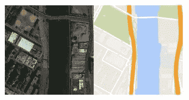
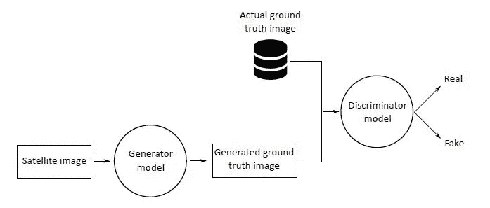
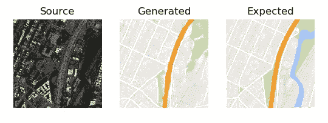
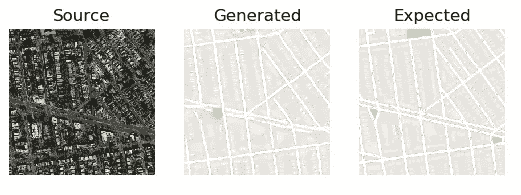

# 一种使用深度学习从卫星图像生成地面实况数据的图像处理工具

> 原文：<https://towardsdatascience.com/an-image-processing-tool-to-generate-ground-truth-data-from-satellite-images-using-deep-learning-f9fd21625f6c?source=collection_archive---------12----------------------->

卫星图像的地面实况意味着在特定位置收集信息。它使卫星图像数据与地面的真实特征和材料相关联。这一信息经常用于遥感数据的校准，并将结果与地面实况进行比较。地面实况数据通常通过访问一个地点并进行一些实验来收集，如对该特定地点进行勘测，通过在不同方面进行表面观察来测量该地点的不同属性和特征，如森林、农业、水、建筑物和其他土地类别所覆盖的区域。地面真实在图像的初始监督分类中是重要的。这些数据通常用于评估卫星图像分类的性能，将图像的每个像素与相应的地面实况数据进行比较，以找到匹配。目标是最小化分割的卫星图像和地面实况信息之间的误差。目前，有许多软件和图像处理工具可以用来对卫星图像进行分类和分割，取得了很好的效果。然而，当特定地理位置的地面实况信息不可用时，问题就出现了。

不可能收集地球上所有位置的地面实况数据。因为有些地方如丘陵地带、密林等，不容易到达。人工收集地面实况信息需要大量的人力和时间。因此，卫星图像的应用，如聚类/分割/分类，仅限于地面实况信息。因此，有必要开发一些能够从卫星图像生成地面实况数据应用程序。

在本文中，我们的目标是开发一个使用深度学习技术的自动化系统，该系统可以从卫星图像本身生成地面真实数据。它不仅减少了收集这些信息所需的时间和精力，而且还生成了手动数据收集不可能得到的地理位置数据。

**数据库:**由于没有与卫星图像相对应的地面实况图像，在本研究中，我们使用卫星图像和相应的谷歌地图图像来训练一个模型。这个[数据集](http://efrosgans.eecs.berkeley.edu/pix2pix/datasets/maps.tar.gz)包含纽约州的卫星图像和相应的谷歌地图图像，分为训练集和测试集，分别包含 1096 和 1098 个图像样本。因此，在本实验中，我们从给定的卫星图像中生成 google map 图像作为地面真实数据。图 1 显示了一个样本卫星，它的 google map 图像用于训练模型。

Figure 1: A sample satellite and it’s ground truth (google map) image.

**生成对抗网络**

按照这篇[文章](http://openaccess.thecvf.com/content_cvpr_2017/html/Isola_Image-To-Image_Translation_With_CVPR_2017_paper.html)中提出的 PixtoPix GAN 架构，我们用 1096 幅卫星图像训练我们的模型。每个图像样本都带有卫星数据和相应的谷歌地图，它们被分组到源和目标列表中。GAN 的结构由两个模块组成:鉴别器和发生器。鉴别器是执行分类的卷积神经网络模型。生成器是一个使用 [U-Net](https://lmb.informatik.uni-freiburg.de/people/ronneber/u-net/) 架构的编码器-解码器模型。它将源图像(卫星图像)作为输入，并生成目标图像(谷歌地图图像)作为输出。生成器模型通过将图像向下采样到某个级别来编码图像，并通过使用 U-Net 架构向上采样到图像的原始大小来解码图像。点击[此处](https://machinelearningmastery.com/what-are-generative-adversarial-networks-gans/)了解更多关于 GAN 的详细信息。

Figure 2: Block diagram of training of GAN

由发生器模型产生的目标图像被作为鉴别器模型的输入。鉴别器模型还获取原始地面真实图像(谷歌地图图像)，并预测目标图像是真实图像还是源图像的虚假翻译的可能性。发生器和鉴别器模型的框图如图 2 所示。使用 GAN 架构，我们用 30 个历元训练模型，得到训练好的模型需要大约 24 小时。

**结果**

结果，我们得到了卫星图像到谷歌地图图像的过渡。该系统产生给定卫星图像、相应的谷歌地图图像和预期/生成的谷歌地图图像的输出，这些图像可以被视觉分析相似性。在测试集上评估模型时的输出示例如图 3 和图 4 所示。

Figure 3: Generated ground truth image by model

Figure 4: Generated ground truth image by model

**结论和未来工作**

所提出的系统将卫星图像映射到其谷歌地图上，这可以被认为是地面事实。因此，它大大减少了手动收集地面实况信息所需的时间和精力。此外，开发的模型可以很容易地生成难以收集这些信息的地理位置。

所提出的模型可以扩展到从地面真实数据生成卫星图像，这可以帮助科学家更容易地研究环境变化。模型的性能可以通过用更多的历元数进一步训练来提高。

**挑战**挑战
1。GAN 需要大量时间和资源来训练模型。

运行“trainModel.py”从草图训练模型。若要测试生成的模型，请运行“testDBimage.py”。它将从数据库中读取测试图像，并生成预期的地面真相。你也可以从谷歌下载随机卫星图像，并使用“test_random_image.py”进行测试

感谢[杰森·布朗利](https://machinelearningmastery.com/)的精彩教程和文章，帮助我学到了很多。大部分代码都是为了他的教程。这个项目的完整代码在我的 [GitHub](https://github.com/gautamkumarjaiswal/Ground-Truth-Generation) 库中。可以随意下载修改。谢谢你的时间。祝你愉快。:)

**参考文献**

[1][https://machine learning mastery . com/how-to-develop-a-pix 2 pix-gan-for-image-to-image-translation/](https://machinelearningmastery.com/how-to-develop-a-pix2pix-gan-for-image-to-image-translation/)

[https://github.com/junyanz/pytorch-CycleGAN-and-pix2pix](https://github.com/junyanz/pytorch-CycleGAN-and-pix2pix)