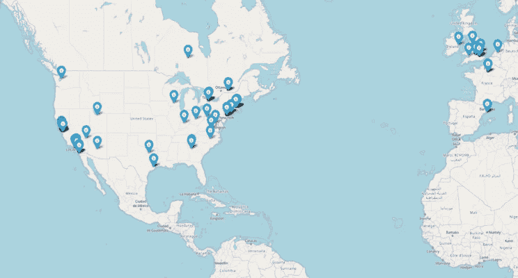
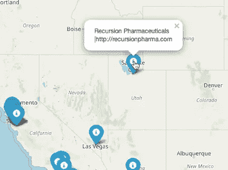

# 使用人工智能(AI)进行药物发现的初创公司的交互式视觉地图

> 原文：<https://towardsdatascience.com/an-interactive-visual-map-of-startups-that-use-artificial-intelligence-ai-for-drug-discovery-e27213298c21?source=collection_archive---------21----------------------->

find link in map section for interactive map

## 用于药物发现的人工智能

# 简介:

上次我制作了一个可视地图，显示了美国所有制药公司的位置。在地图中，它显示了一些使用人工智能(AI)的传统制药公司。有许多初创公司也在利用人工智能进行药物研发。因此，我想创建一个类似的地图，展示世界各地使用人工智能进行药物发现的初创公司是如何增长的。

# 数据:

我发现这篇文章的标题是“141 家创业公司在药物发现中使用人工智能”。我开始刮公司名字和网站链接。现在我有了所有的网站链接，我需要从网站上收集所有的地址。

下面是抓取姓名和地址的代码。

在调查了几个网站之后，在我看来，所有的网站都彼此大相径庭。所以我不能使用 selenium 或 beautifulsoup 从联系信息中删除完整地址。由于名单不太大，我不想放弃。我只需要 2-3 个小时来收集所有的物理地址。

我手动收集了所有的数据。我在 startup 网站上找到的大部分物理地址。对于其余的物理地址，我搜索了谷歌并收集了它们。在 141 个地址中，我设法收集了 138 个。但是很少有创业公司，我只找到了他们所在的城市，而不是完整的地址。

# 地图:

然后我用‘Google geocoder’python 库找到了经纬度。

最后，我使用叶库创建了地图。

这里是互动[地图链接](http://yousufali.net/blog_documents/startup_AI.html)

或者，您可以在浏览器中复制并粘贴以下链接

【https://bit.ly/2KExnXC 

如果你点击图标，它会显示创业公司的名称和网站。

这张地图清楚地显示，美国大多数初创企业位于东西海岸。美国以外也有创业公司。

所有的代码和数据都可以在我的 github 上找到

感谢阅读。请不要犹豫，在文章下面评论。

# 参考资料:

史密斯，S. (2017)。141 家创业公司在药物发现中使用人工智能。检索自[https://blog . bench sci . com/startups-using-artificial-intelligence-in-drug-discovery](https://blog.benchsci.com/startups-using-artificial-intelligence-in-drug-discovery)

我的 linkedin

 [## Yousuf Ali -研究生研究助理-德州理工大学健康科学中心| LinkedIn

### 孟加拉国达卡 Narayangonj ACI 有限公司产品开发官员。

www.linkedin.com](https://www.linkedin.com/in/yousuf--ali/)