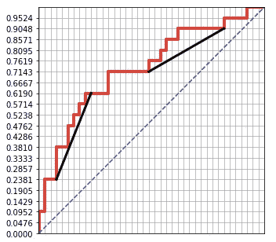

# 有趣且直观的 AUC 和 ROC 曲线视图

> 原文：<https://towardsdatascience.com/an-interesting-and-intuitive-view-of-auc-5f6498d87328?source=collection_archive---------15----------------------->

## 在学习 AUC 之前，你不需要学习 TPR，FPR 和一堆其他的东西。

AUC，或 ROC 曲线下面积，是一种广泛用于评估模型性能的指标。

网上有一堆关于 AUC 的资源。他们通常从向读者解释真阳性、敏感性、I 型、II 型错误和 FPR 等开始。他们中的许多人都很好，他们详细解释了概念，但一些概念可能会让一些没有分析背景的人感到困惑。我想在这里指出的是，**一个人实际上可以在不知道所有这些专业术语的情况下学好 AUC**。

让我用一个简单的例子来说明如何做。

假设一家信用卡公司建立了一个风险评分模型来评估客户是否能够按时支付账单。他们拥有的数据被标记，1 表示客户**不能**按时付款(有风险)，0 表示那些按时付款的客户。这是 20 条记录的样本的结果(假设没有重复的分数):

让我们看看如何从这 20 条记录中画出 ROC 曲线。我们先画一个正方形，左下角为(0，0)，右上角为(1，1):

然后，在这 20 个记录中，我们有 5 个 1 和 15 个 0，所以我们将 y 轴除以 5，x 轴除以 15:

然后，从高分到低分，对应的标签是 1，1，0，1，0，0，…，我们把 1 换成'上'，把 0 换成'右'，就会得到一个新的序列:上，上，右，上，右…然后从(0，0)开始，根据这些'上'和'右'画出你的曲线。一上(或右)，一招。这是 ROC 曲线。它下面的区域是 AUC。

让我们用一个完美的模型来比较一下。在一个完美的模型中，任何“1”都将比任何“0”有更高的分数。因此，从高分到低分，相应的标签将是 1，1，1，1，0，0，0，0，…并且 ROC 将是

AUC 是 1。一些观察结果:

*   为了提高 AUC，你需要在“正确”之前出现更多的“向上”。
*   这意味着，“1”需要在“0”之前。
*   这意味着，模型给予目标(标签为 1 的记录)更高的分数，因此模型更好。
*   AUC 介于 0 和 1 之间。
*   AUC 是一个排名指标(重要的是得分顺序，而不是得分值本身)。

在深入研究 ROC 的其他属性之前，我想展示几个特例。

# 更多示例

1.得分相等。让我们稍微改变一下前面的例子，得到相同的分数。在这一组(得分 70)，我们有三个 0 和一个 1。我们要做的修改是将三个“右”和一个“上”合并成一个动作。

新的 ROC 是

因此，如果所有分数相等，ROC 将正好是 x=y (AUC = 0.5)线。

2.随机猜测。当记录以随机顺序分配时，ROC 曲线将在 x=y 附近波动，AUC 在 0.5 左右。

3.逆转比分。如果我们颠倒分数顺序和最开始的例子，我们将得到一条关于点(0.5，0.5)对称于原始 ROC 曲线的新 ROC 曲线[关于线 x=y 不对称！].新的 AUC 是 1 减去原始 AUC。这就是为什么人们说当我们有一个 AUC <0.5 的模型时，我们可以执行这个分数反转技巧来获得一个更好的模型。

现在让我们看看我们还能从 ROC 曲线中提取什么信息。

# 性能

1.  割线斜率越高，标记率越高(1 的数量与一个组中记录的总数之比)。在下面的示例中，选择了两个分数组，分数高的组具有较高的标记率，因此割线斜率也较高。

2.凹度。通常，由好的 ML 算法生成的结果的 ROC 曲线在整个域中是向下凹的。但是，如果不幸的是，您有一条在子区间上向上凹的曲线，您可以在该特定区间反转分数以提高性能(并且建议您还检查建模数据)。

3.高分区域/低分区域。下面的绿色方框包含高分记录的信息，橙色方框包含低分记录的信息。在绿色区域，我们希望割线斜率较大；在橙色区域，斜率越小越好。

AUC 不是我们衡量排名模型表现的唯一方式。有时，我们只关注模型在高分区域是否表现良好。

AUC 低的模型仍然有价值。例如，下面 ROC 曲线的 AUC 只有~0.64，但是它在高分记录上有很好的表现。

4.模特合奏。当我们在同一个数据集上有多个模型，并且 roc 的形状不同(有些在高分区域很好，有些在低分区域很好)时，我们通常可以通过组合模型(打包或堆叠)来找到值。