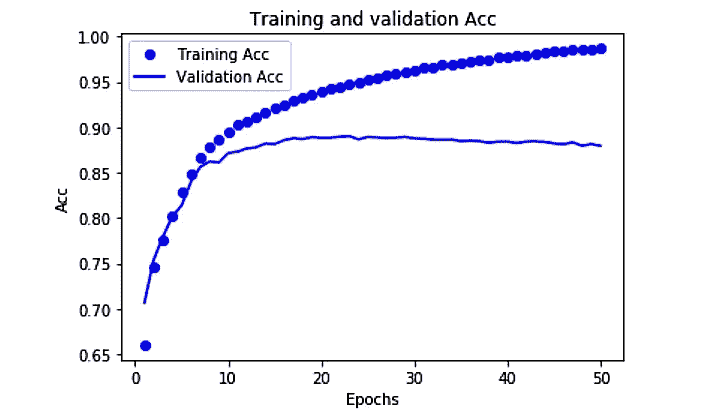

# Tensorflow 中的高级 Keras API 简介

> 原文：<https://towardsdatascience.com/an-intro-to-high-level-keras-api-in-tensorflow-c50f6f5272de?source=collection_archive---------15----------------------->

Tensorflow 是深度学习模型生产中使用的最著名的库。它有一个非常大的令人敬畏的社区，并且在操作上有很大的灵活性。然而，Tensorflow 并不是那么用户友好，并且具有更陡峭的学习曲线。为了解决这个问题，Tensorflow 的高级 Keras API 提供了构建模块，可以更轻松地创建和训练深度学习模型。此外，Keras 模型是通过将可配置的构建模块连接在一起而形成的，几乎没有限制。这使得它更加模块化和可组合。你可以在他们的官方网站上探索。

# 分类

要使用高级 Keras API 进行简单分类，需要遵循的一些步骤如下:

1.  导入所需的模块。
2.  为 API 准备合适的数据格式。
3.  使用 TF . Keras(tensor flow-Keras)API 构建神经网络模型并编译它。
4.  用准备好的数据训练模型，同时尝试解决欠拟合和过拟合情况。
5.  评估模型。
6.  保存和恢复模型，以便在生产中使用。

## 导入所需的模块。

首先，需要进口 numpy 和 pandas，因为数据处理和准备需要它们。必须导入 Tensorflow API 和高层 Keras API 进行底层操作和建模。必须导入 Matplotlib 进行性能和精度等的图形分析。

```
*# TensorFlow and tf.keras*
**import** **tensorflow** **as** **tf**
**from** **tensorflow** **import keras**
**import** **numpy** **as** **np
import pandas as pd
import** **matplotlib.pyplot** **as** **plt
%matplotlib inline** ''' 
%matplotlib inline means with this backend, the output of plotting commands is displayed inline within frontends like the Jupyter notebook, directly below the code cell that produced it. The resulting plots will then also be stored in the notebook document.
'''
```

## 数据准备

数据准备阶段获取原始数据，使其看起来结构化，从中去除噪声，并更改数据格式和形状以适合您正在设计的模型。数据可以是不同的格式，如图像数据不同于文本数据，两者都需要不同的处理和预处理。例如，如果我们使用 mnist_fashion 数据来制作一个分类器来对服装进行分类，数据准备可以如下进行:

MNIST 时尚数据集包含 10 个类别的 70，000 幅灰度图像。这些图像以低分辨率(28×28 像素)显示了单件衣服。链接:【https://github.com/zalandoresearch/fashion-mnist 

我们将使用 60，000 张图像来训练网络，并使用 10，000 张图像来评估网络学习分类图像的准确性。

加载这些数据的 Tensorflow API 显示了一些 gzip 错误。这里遵循的方法是，从 https://github.com/zalandoresearch/fashion-mnist 的[下载原始数据集，然后按照](https://github.com/zalandoresearch/fashion-mnist)[https://pjreddie.com/projects/mnist-in-csv/](https://pjreddie.com/projects/mnist-in-csv/)将数据集转换成 CSV 格式。

```
**class_names = ['T-shirt/top', 'Trouser', 'Pullover', 'Dress', 'Coat', 
               'Sandal', 'Shirt', 'Sneaker', 'Bag', 'Ankle boot']****import pandas as pd
train_df = pd.read_csv('data/fashion-mnist_train.csv',sep=',')
test_df = pd.read_csv('data/fashion-mnist_test.csv', sep = ',')
train_df.head()** ''' 
we need to convert the dataframes into numpy arrays of float32 type which is the acceptable form for tensorflow and keras. 
'''
**train_data = np.array(train_df, dtype = 'float32')
test_data = np.array(test_df, dtype = 'float32')** '''
We scale the pixel values to a range of 0 to 1 before feeding to the neural network model. (presently they are from 0-255)
'''
**x_train = train_data[:,1:]/255****y_train = train_data[:,0]****x_test= test_data[:,1:]/255****y_test=test_data[:,0]**
```

**建立神经网络模型**

神经网络的基本构造块是层。图层从提供给它们的数据中提取表示。例如:

```
**model = keras.Sequential([
    keras.layers.Flatten(input_shape=(784,)),
    keras.layers.Dense(128, activation=tf.nn.relu),
    keras.layers.Dense(10, activation=tf.nn.softmax)
])**
```

该网络由一系列两层致密层组成。这些是密集连接，或完全连接的神经层。

第一密集层有 128 个节点(或神经元)。

第二层(也是最后一层)是一个 10 节点的 softmax 层，它返回一个由 10 个概率得分组成的数组，这些得分的总和为 1。每个节点包含一个分数，该分数指示当前图像属于 10 个类别之一的概率。

在模型为训练做好准备之前，它还需要一些设置。这些是在模型的编译步骤中添加的:

[损失函数](https://www.tensorflow.org/api_docs/python/tf/keras/losses):衡量模型在训练过程中的精确程度。我们希望最小化这个函数，以便将模型“导向”正确的方向。

[优化器](https://www.tensorflow.org/api_docs/python/tf/keras/optimizers):这就是模型如何根据它看到的数据和它的损失函数进行更新。

[指标](https://www.tensorflow.org/api_docs/python/tf/keras/metrics):用于监控培训和测试步骤。下面的例子使用了准确度，即图像被正确分类的比例。

```
**'''** When doing multi-class classification, categorical cross entropy loss and sparse categorical cross entropy is used a lot**.** To compare them both read [https://jovianlin.io/cat-crossentropy-vs-sparse-cat-crossentropy/](https://jovianlin.io/cat-crossentropy-vs-sparse-cat-crossentropy/)
**'''
model.compile(optimizer=tf.train.AdamOptimizer(), 
              loss='sparse_categorical_crossentropy',
              metrics=['accuracy'])**
```

## 训练模型

训练神经网络模型需要以下步骤:

1.  将训练数据提供给模型，在本例中是 train_images 和 train_labels 数组。
2.  模型学习将图像和标签联系起来。
3.  我们要求模型对测试集进行预测。在本例中，是 test_images 数组。我们验证预测是否与 test_labels 数组中的标签相匹配。

```
**model.fit(x_train, y_train, epochs=10)
test_loss, test_acc = model.evaluate(x_test, y_test)****print('Test accuracy:', test_acc)
print('Test loss:', test_loss)****10000/10000 [==============================] - 1s 52us/step
Test accuracy: 0.8963
Test loss: 0.3374745888918638**
```

训练模型时的一个主要问题是过度拟合和欠拟合。通过充分的训练可以避免不合身。为了避免过度拟合，两种解决方案可以是"**添加权重正则化"**和**"添加丢弃"。**

## 添加权重调整

减轻过度拟合的一种常见方法是通过强制网络权重仅取小值来限制网络的复杂性，这使得权重值的分布更加“规则”。这被称为“权重正则化”，这是通过向网络的损失函数添加与具有大权重相关联的成本来实现的。这种成本有两种形式:

L1 正则化，其中增加的成本与权重系数的绝对值成比例(即，与所谓的权重的“L1 范数”成比例)。

L2 正则化，其中增加的成本与权重系数的值的平方成比例(即，与所谓的权重的“L2 范数”成比例)。在神经网络的上下文中，L2 正则化也称为权重衰减。不要让不同的名称迷惑你:权重衰减在数学上与 L2 正则化完全相同。

唯一需要改变的是模型架构:

```
**l2_model = keras.models.Sequential([
    keras.layers.Dense(16, kernel_regularizer=keras.regularizers.l2(0.001),
                       activation=tf.nn.relu, input_shape=(NUM_WORDS,)),
    keras.layers.Dense(16, kernel_regularizer=keras.regularizers.l2(0.001),
                       activation=tf.nn.relu),
    keras.layers.Dense(1, activation=tf.nn.sigmoid)
])**
```

## 添加辍学

Dropout 是神经网络最有效和最常用的正则化技术之一，由 Hinton 和他在多伦多大学的学生开发。

应用于一个层的丢弃包括在训练期间随机“丢弃”(即设置为零)该层的一些输出特征。假设在训练期间，给定的层通常会返回给定输入样本的向量[0.2，0.5，1.3，0.8，1.1]；在应用丢弃后，该向量将具有随机分布的几个零条目，例如[0，0.5，1.3，0，1.1]。

“丢失率”是被归零的特征的分数；通常设置在 0.2 到 0.5 之间。在测试时，没有单元被丢弃，相反，层的输出值会按与丢弃率相等的因子按比例缩小，以平衡比训练时更多的单元处于活动状态这一事实。

这里，唯一需要改变的是模型架构。

```
**dpt_model = keras.models.Sequential([
    keras.layers.Dense(16, activation=tf.nn.relu, input_shape=(NUM_WORDS,)),
    keras.layers.Dropout(0.5),
    keras.layers.Dense(16, activation=tf.nn.relu),
    keras.layers.Dropout(0.5),
    keras.layers.Dense(1, activation=tf.nn.sigmoid)
])**
```

**模型评估**

有许多度量来评估分类、回归、聚类等。这里我们将用准确度来衡量分类。(精度、召回率、F-measure 和准确度是分类器性能测量的主要使用指标)。

```
**test_loss, test_acc = model.evaluate(x_test, y_test)****print('Test accuracy:', test_acc)
print('Test loss:', test_loss)****10000/10000 [==============================] - 1s 52us/step
Test accuracy: 0.8963
Test loss: 0.3374745888918638**
```

我们还可以看到当模型被训练时，指标是如何变化的。为此，需要保存模型历史，并绘制图表来显示训练进行的趋势。

```
**history = model.fit(train_data, train_labels,
                    epochs=50,
                    batch_size=512,
                    validation_split=0.2)****acc = history.history['acc']
val_acc = history.history['val_acc']
loss = history.history['loss']
val_loss = history.history['val_loss']****epochs = range(1, len(acc) + 1)****plt.plot(epochs, acc, 'bo', label='Training Acc')
plt.plot(epochs, val_acc, 'b', label='Validation Acc')
plt.title('Training and validation Acc')
plt.xlabel('Epochs')
plt.ylabel('Acc')
plt.legend()****plt.show()**
```



**模型保存和恢复**

可以使用 **tf.keras.Model** API 在 Tensorflow 中保存和恢复模型。

```
**model.compile(optimizer=tf.train.AdamOptimizer(), 
              loss='sparse_categorical_crossentropy',
              metrics=['accuracy'])** # Save weights to a TensorFlow Checkpoint file
**model.save_weights('./weights/my_model')**
# Restore the model's state,
# this requires a model with the same architecture.
**model.load_weights('./weights/my_model')**'''It also can be saved in keras HDF5 format'''
# Save weights to a HDF5 file
**model.save_weights('my_model.h5', save_format='h5')**# Restore the model's state
**model.load_weights('my_model.h5')****#The model arch can also be saved to a json file**# Serialize a model to JSON format
**json_string = model.to_json()
json_string** #Then it can be restored like below
**latest_model = tf.keras.models.model_from_json(json_string)**
```

还可以为动态模型保存创建检查点，以便操作不会因训练时的一些中间错误而丢失。

您可以在我的 git hub repo 上了解更多信息。

[](https://github.com/sambit9238/Tensorflow_Guide) [## sambit9238/Tensorflow_Guide

### 通过在 GitHub 上创建帐户，为 sambit9238/Tensorflow_Guide 开发做出贡献。

github.com](https://github.com/sambit9238/Tensorflow_Guide)