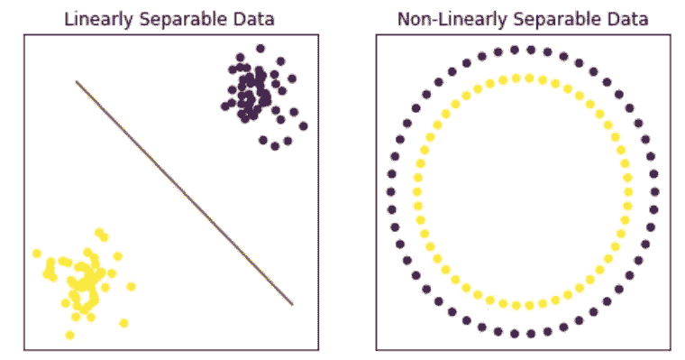
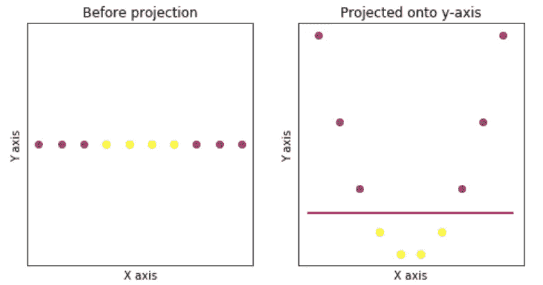
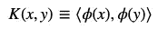
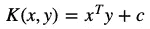
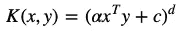
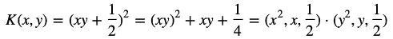
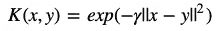
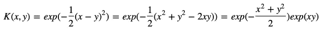
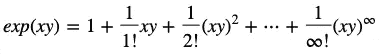
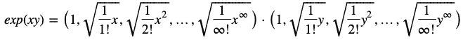

# 内核介绍

> 原文：<https://towardsdatascience.com/an-intro-to-kernels-9ff6c6a6a8dc?source=collection_archive---------9----------------------->

Mathematical tricks

内核是神奇的。

不完全是，但是他们看起来很喜欢。它们是一种数学“技巧”，允许我们不需要对数据进行技术转换就可以更快地进行某些计算。在机器学习中，它们在分类模型中用于将我们的数据分成组。对相似数据进行分组的最简单的方法是用直线，但这并不总是可行的。有时，我们的数据是以这样一种方式组织的，用一条直线将它们分开是不可能的。

那么当我们有不可线性分离的数据时，我们能做什么呢？一个解决方案是投影我们的数据。这可以通过为我们的数据创建一个新的维度(或特征)来实现，这样我们的数据可以变得更加独立。

将我们的数据映射到一个更高维的空间是通过一个我们称之为 phi (𝜙).)的函数来完成的

将数据映射到更高维度空间的问题在于，它在计算上可能是昂贵的。映射函数𝜙必须应用于每个数据点，然后我们仍然必须使用包含的新功能对数据进行计算。当处理大量数据和添加许多新功能时，计算成本会呈指数级增长。

对我们来说幸运的是，内核的出现扭转了局面。由于我们只需要数据点的内积来计算支持向量机的决策障碍，这是一种常见的分类模型，因此内核允许我们跳过将数据映射到更高维空间的过程，直接计算内积。数学上，核函数的定义是:

Definition of a kernel

其中 *x* 和 *y* 是独立的数据点，𝜙是将我们的数据映射到更高维空间的东西，两端的尖括号意味着你取整个语句的内积。

为了被认为是内核，函数必须满足一些要求。

*   函数需要是连续的，这意味着在其定义域中不能有任何缺失点
*   它必须是对称的，这意味着 *K(x，y) = K(y，x)*
*   它具有正半定性。这意味着核是具有非负特征值的对称矩阵。

有几十种核用于各种不同的问题，所以让我们来看看机器学习中最常见的三种核，线性核、多项式核和径向基函数核。

# 线性核

也称为“非内核”，线性内核是所有内核中最简单的。从技术上讲，当使用这个内核时，数据不会被投影到更高的维度上，所以它只是带有可选常数项 *c* 的 *x* 和 *y* 的内积。

Linear kernel equation

线性核的好处是它非常简单，只有常数项 *c* 作为参数。线性核通常用于具有大量特征的数据集，因为增加这些数据集的维度并不一定提高可分性。文本分类就是这类数据集的典型例子。

# 多项式核

与线性核不同，多项式核确实涉及到从更高维度空间取内积。多项式核可以表示为

Polynomial kernel equation

其中三个参数是𝛼、 *c* 和 *d* 。最常用的度数( *d* )是 2，因为更大的度数会导致过度拟合。多项式核通常用于自然语言处理问题。

让我们看一个例子。让我们设定𝛼=1， *c* =1/2， *d=2，*使这个例子成为二次型。

正如我们所见，这个内核相当于𝜙*(x)**【𝜙】*(y)*的内积，其中𝜙函数的每个元素都表示变量的不同幂。如果我们使用𝜙函数，我们将需要评估六个特征( *x，x，1/2，y，y，1/2* )。内核省去了我们创建四个新特性的麻烦，只留给我们评估 *x* 和 *y.**

# *径向基函数核*

*径向基函数(RBF)核是支持向量机中最常用的核。它被定义为*

**

*Radial basis function kernel equation*

*其中，𝛾是一个自由参数，用于衡量两点之间的相互影响程度。与着眼于额外维度的多项式核不同，RBF 扩展到无限多个维度。这是由于指数的膨胀。为了使人信服，让我们设定𝛾 = 1/2 并扩展指数。*

**

*从这里， *exp(x，y)* 可以使用泰勒级数近似展开成无限维。这看起来像*

**

*这意味着两个向量的点积可以表示为*

**

*所以我们可以看到，一个 RBF 核等价于两个数据点的内积，这两个数据点有无限多个维度。我们现在可以明白为什么 RBF 如此受欢迎了。*

*我希望这篇博客能帮助你更好地理解内核。如果你还有问题，我推荐[这篇论文](https://www.csie.ntu.edu.tw/~cjlin/papers/guide/guide.pdf)和以下来源:*

* [## 核方法

### 在机器学习中，核方法是一类用于模式分析的算法，其最著名的成员是核方法

en.wikipedia.org](https://en.wikipedia.org/wiki/Kernel_method)*