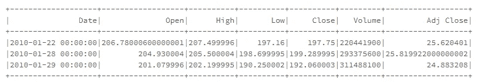

# Apache、PySpark 和 Dataframe 转换简介

> 原文：<https://towardsdatascience.com/an-introduction-to-apache-pyspark-and-dataframe-transformations-2a6d4229f0e3?source=collection_archive---------5----------------------->

## 掌握大数据分析的全面指南


Picture from [Unsplash](https://unsplash.com/photos/klWUhr-wPJ8)

# 简介:大数据问题

Apache 是作为数据分析的新引擎和编程模型出现的。它的起源可以追溯到 2009 年，它在最近几年变得如此重要的主要原因是由于经济因素的变化，这些因素强调了计算机应用程序和硬件。

从历史上看，计算机的能力只会随着时间的推移而增长。每年，新的处理器都能够更快地执行操作，运行在其上的应用程序也自动变得更快。

所有这一切在 2005 年发生了变化，当时散热的限制导致从提高单个处理器的速度转向探索 CPU 内核的并行化。这意味着应用程序和运行它们的代码也必须改变。所有这些都为 Apache Spark 等新模型奠定了基础。

此外，传感器和存储单元的成本仅在过去几年有所下降。如今收集和储存大量信息是完全不可能的。

有如此多的数据可用，处理和分析数据的方式也必须彻底改变，通过在计算机集群上进行大规模并行计算。这些集群能够同时协同组合这些计算机的能力，并使处理数据处理等昂贵的计算任务变得更加容易。

这就是 Apache Spark 发挥作用的地方。

# 什么是 Apache Spark

如伟大的著作《火花——权威指南》所述:

> “Apache Spark 是一个统一的计算引擎和一组用于在计算机集群上进行并行数据处理的库”

如今，Apache Spark 是最流行的大数据处理开源引擎。主要原因是:

*   它支持广泛使用的编程语言，如:Python、Scala、Java 和 r。
*   它支持 SQL 任务。
*   它支持数据流。
*   它有机器学习和深度学习的库。
*   它可以在单台机器上运行，也可以在一群计算机上运行。

下面是一个示意图，展示了 Spark 生态系统中可用的不同库。


Figure by the Author

# 如何设置和运行 Apache Spark

在这一系列文章中，我们将重点关注 Apache Spark Python 的库 PySpark。如前所述，Spark 既可以在本地运行，也可以在计算机集群中运行。有几种方法可以配置我们的机器在本地运行 Spark，但是不在本文的讨论范围之内。

使用 PsyPark 并释放其 inmense 处理能力的最简单、最快速的方法之一是使用免费网站 Databricks，具体来说就是使用它的社区版。

要开始，我们只需访问:

[](https://databricks.com/try-databricks) [## 尝试数据块

### 无限集群，可扩展至任何规模的作业调度程序，为生产管道执行作业完全交互式…

databricks.com](https://databricks.com/try-databricks) 

并选择其社区版:


然后，我们必须创造和说明。

## 运行临时集群

一旦我们创建了一个帐户，为了能够开始工作，我们应该创建一个临时集群。


由于是免费版本，这些集群的默认内存为 6 Gb，每个集群可以运行 6 个小时。为了开发工业项目或使用数据管道，建议使用 premiun 平台。

但是对于这些教程来说，社区版已经足够了。

## 添加数据

为了添加要使用的数据:

*   单击数据选项卡
*   然后添加数据

您可以使用其他用户上传的可用数据，也可以使用从您的计算机上传的数据。


完成后，我们可以在笔记本中创建一个表格，这样我们就都设置好了！

# Pyspark 应用和分区

为了理解 Apache Spark 如何工作，我们应该讨论 Spark 应用程序的核心组件:驱动程序、执行器和集群管理器。

下面是一个 Spark 应用程序架构的示意图:


Figure by the Author

## 驾驶员

该驱动程序位于计算机集群的一个节点中，并执行三个主要任务:

1.  保存关于 Spark 应用程序的信息
2.  响应输入，例如用户的程序
3.  分析、分配和安排执行者要完成的任务。

## 实施者

执行者是实际执行驱动程序分配的工作的人。他们做两件事:

1.  执行分配给他们的代码。
2.  向驱动程序报告计算的状态。

## 集群管理器

集群管理器负责:

1.  控制物理计算机
2.  将资源分配给 Spark 应用

可以有几个 Spark 应用程序同时在同一个集群上运行，所有这些应用程序都将由集群管理器管理。

# PySpark 数据帧

Apache Spark 使用几个数据抽象，每个抽象都有一个特定的接口。最常见的抽象是:

*   数据集
*   数据帧
*   SQL 表
*   弹性分布式数据集

在本系列中，我们将重点关注在 Apache Spark 中表示和存储数据的最常见的单元 Dataframes。

数据帧是具有行和列的数据表，理解它们最接近的类比是具有带标签的列的电子表格。

数据帧的一个重要特征是它们的模式。数据帧的模式是一个列表，其中包含列名和每列存储的数据类型。

数据帧的其他相关属性是它们不位于一台简单的计算机中，事实上它们可以被分割到数百台机器中。这是因为优化了信息处理，并且当数据太大而不适合单台机器时。

# Apache 分区

如前所述，执行器执行驱动程序分配的工作，并且它们以并行方式执行，为了能够做到这一点，将数据火花分割到不同的分区。

这些分区是位于群集内单台计算机中的行的集合。当我们谈论 Dataframe 的分区时，我们谈论的是数据如何分布在我们集群上的所有机器上。

大多数情况下，我们不会明确指定如何在集群中进行分区，但通过我们的代码，我们将传输数据的高级转换，Spark 将自行意识到哪种方式是执行这些分区的最佳方式。总是寻求获得最大的处理效率。

执行这些操作的低级 API 超出了本系列的范围。

# 数据框架转换

首先，我们必须明白，转换是我们指定对数据帧进行的修改。

这些转换是以一种高级的方式指定的，并且直到我们明确地调用一个动作时才会被执行。

这种工作方式叫懒评，目的是提高效率。当我们要求进行转换时，Spark 会设计一个计划来优化执行这些任务，直到最后一分钟我们要求一个动作(如。显示()或。收集())

# 苹果股价

现在，我们将探讨一些最常见的操作和转换。我们将从 2010 年到 2016 年研究苹果股价的数据。我们将执行一些探索性的数据分析、数据转换、处理缺失值并执行分组和聚合。

## 导入数据框架

要初始化和显示数据帧，代码如下:

```
**# File location and type**
file_location = "/FileStore/tables/appl_stock.csv"
file_type = "csv"# CSV options
infer_schema = "true"
first_row_is_header = "true"
delimiter = ","**# The applied options are for CSV files. For other file types, these will be ignored.**
df = spark.read.format(file_type) \
  .option("inferSchema", infer_schema) \
  .option("header", first_row_is_header) \
  .option("sep", delimiter) \
  .load(file_location)**# Display Dataframe**
display(df)
```


## 获取数据框架的模式

数据帧的模式是数据结构的描述，它是 StructField 对象的集合，并提供关于数据帧中数据类型的信息。

显示数据帧的模式非常简单:

```
**# Display Dataframe's Schema** df.printSchema()
```


## 执行过滤和转换

为了过滤我们的数据，只获取那些收盘价低于$500 的行，我们可以运行下面一行代码:

```
**# Filter data usign pyspark**
df.filter(" Close < 500").show())
```


我们还可以过滤以仅获取某些列:

```
**# Filter data by columns**
df.filter("Close < 500").select(['Open', 'Close']).show()
```


要按一列过滤并显示另一列，我们将使用。选择()方法。

```
**# Filter by one column and show other**
df.filter(df['Close'] < 500).select('Volume').show()
```


要按多个条件过滤:

```
**# Filter by multiple conditions: closing price < $200 and opening price > $200**
df.filter( (df['Close'] < 200) & (df['Open'] > 200) ).show()
```



**获取数据的统计汇总**

与 Pandas 等其他库类似，我们可以通过简单地运行。describe()方法。

```
**# Display Statistic Summary**
df.describe().show()
```


## 添加和重命名列

要向 dataframe 添加新列，我们将使用。withColumn()方法如下。

```
**# Display Dataframe with new column**
df.withColumn('Doubled Adj Close', df['Adj Close']*2).select('Adj Close', 'Doubled Adj Close').show()
```


要重命名现有的列，我们将使用。withColumnRenamed()方法。

```
**# Display Dataframe with renamed column**
df.withColumnRenamed('Adj Close', 'Adjusted Close Price').show()
```


# 分组和聚合数据

现在，我们将对我们的数据进行一些整理和汇总，以获得有意义的见解。但是首先，我们应该导入一些库

```
**# Import relevant libraries**
from pyspark.sql.functions import dayofmonth,hour,dayofyear,weekofyear,month,year,format_number,date_format,mean, date_format, datediff, to_date, lit
```

现在，让我们创建一个新列，每行包含年份:

```
**# To know th average closing price per year**
new_df = df.withColumn('Year', year(df['Date']))
new_df.show()
```


现在，让我们按最近创建的“年度”列进行分组，并按每年的最高、最低和平均价格进行聚合，以获得对价格状态和演变的有意义的见解。

```
**# Group and aggregate data**
new_df.groupBy('Year').agg(f.max('Close').alias('Max Close'), f.min('Close').alias('Min Close'), f.mean('Close').alias('Average Close')).orderBy('Year').show()
```


我们已经实现了我们的目标！然而，我们仍然有一些非常难读的数据。事实上，我们有比我们需要的更多的小数。

考虑到我们正在处理数百美元的价格，超过两位小数并不能为我们提供相关信息。

因此，让我们利用这一优势，学习如何格式化结果，以显示我们想要的小数位数。

## 格式化我们的数据

为了格式化我们的数据，我们将使用 format_number()函数，如下所示:

```
**# Import relevant functions**
from pyspark.sql.functions import forman_number, col**# Select the appropiate columns to format** cols **=** ['Max Close', 'Min Close', 'Average Close']**# Format the columns** formatted_df = new_df.select('Year', *[format_number(col(col_name), 2).name(col_name) for col_name in cols])
```


# 用户定义的函数

现在让我们学习如何将我们定义的函数应用到我们的数据帧中。我们将在本例中使用它来获取一个列，其中记录了每行的月份。

```
**# Import relevant functions**
from pyspark.sql.functions import date_format, datediff, to_date, lit, UserDefinedFunction, month
from pyspark.sql.types import StringType
from pyspark.sql import functions as F**# Create month list** month_lst = ['January', 'Feburary', 'March', 'April', 'May', 'June', 'July', 'August', 'September', 'October', 'November', 'December']**# Define the function** udf = UserDefinedFunction(lambda x: month_lst[int(x%12) - 1], StringType())**# Add column to df with the number of the month of the year** df = df.withColumn('moy_number', month(df.Date))**# Apply function and generate a column with the name of the month of the year** df = df.withColumn('moy_name', udf("moy_number"))
```


成功！

# 结论

在本文中，我们讨论了:

*   Apache Spark 的基础
*   我们对它的重要性和运作方式有了直觉
*   使用 PySpark 和 Dataframes 执行分析操作

在接下来的文章中，我们将学习如何在 PySpark 中应用机器学习，并将这些知识应用到一些项目中。敬请期待！

# 最后的话

*如果你喜欢这篇文章，那么你可以看看我关于数据科学和机器学习的其他文章* [*这里*](https://medium.com/@rromanss23) *。*

*如果你想了解更多关于机器学习、数据科学和人工智能的知识* ***请在 Medium*** *上关注我，敬请关注我的下一篇帖子！*