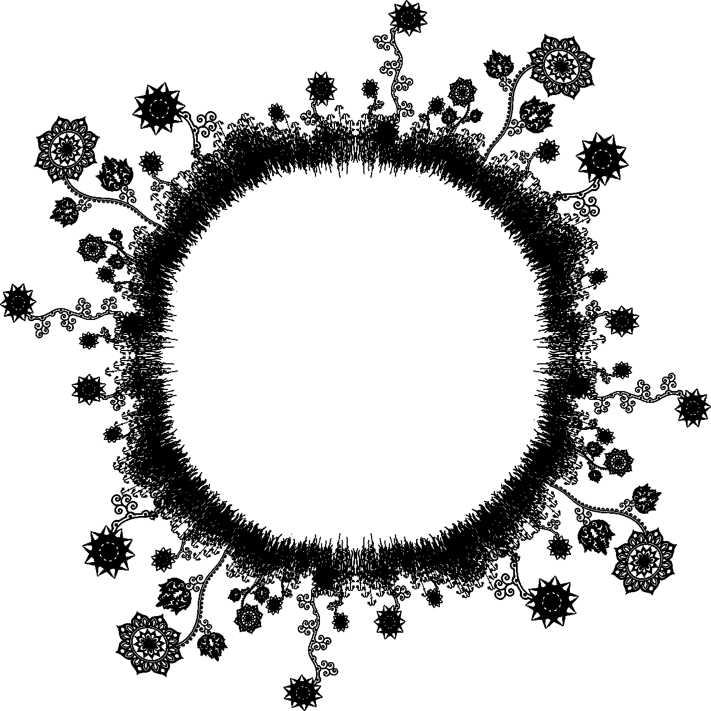
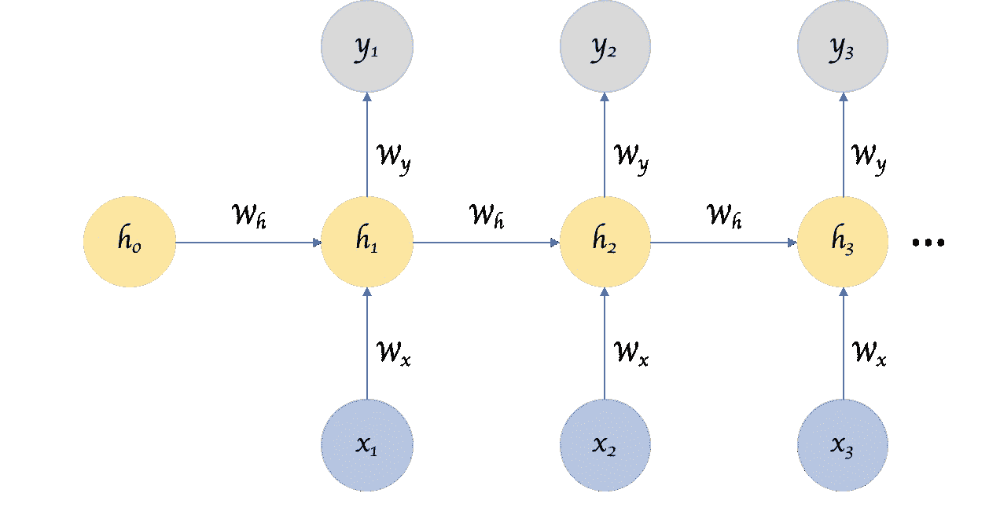
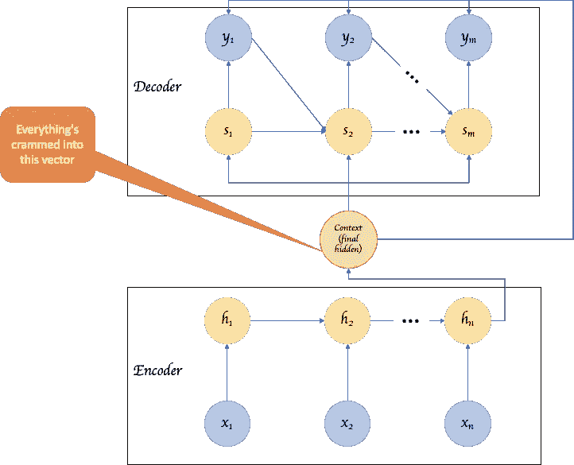
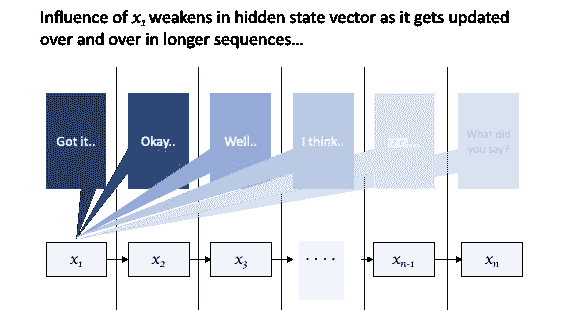
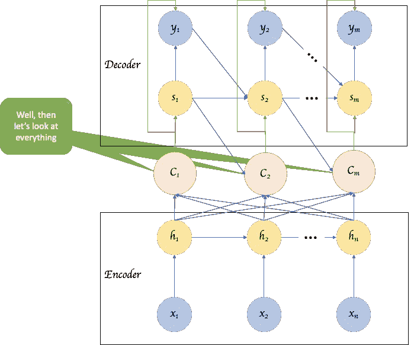
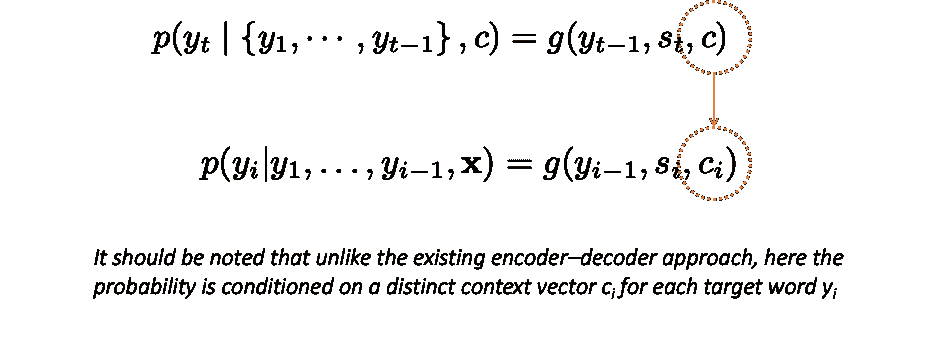
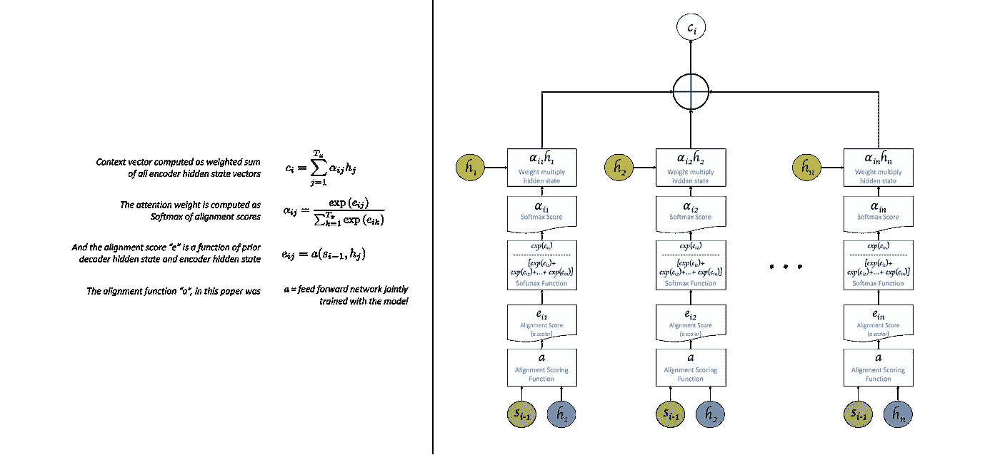

# 注意力入门

> 原文：<https://towardsdatascience.com/an-introduction-to-attention-transformers-and-bert-part-1-da0e838c7cda?source=collection_archive---------1----------------------->

## 为什么和什么

> 我们最大的困惑来源是七足动物的“书写”它看起来根本不像是在写作；它看起来更像是一堆复杂的图形设计。这些语标没有排成一排，或者一个螺旋，或者任何线性的样式。相反，Flapper 或 Raspberry 会根据需要将尽可能多的徽标粘在一起，形成一个巨大的聚合体，从而写出一个句子。

姜峯楠的中篇小说《你生命的故事》中的这几行*也许能很好地说明基于注意力的架构与普通 RNNs 的顺序性质有何不同。*

*让我们快速地看一下普通的 RNNs 和用于任务排序的编码器-解码器变体，了解这些设计有什么缺点，并看看注意力机制如何解决它们。*

**

***Fig 1**: Vanilla RNN example*

*一个普通 RNN 的基本前提是一个接一个地解析输入序列中的每一项，并在每一步中不断更新它的“隐藏状态”向量，如图 1**图 1** 所示。每一步末尾的这个隐藏向量被理解为表示所有先前输入的上下文。换句话说，最后一个隐藏状态表示整个序列的上下文。*

*在序列到序列的翻译任务中，这个代表上下文的产生隐藏状态的 RNN 被认为是一个编码器，最终的隐藏状态向量，在图 2 的**中被称为“上下文”,被馈入另一个称为解码器的序列产生 RNN。***

*但是，这种连续的处理本质是重要的还是让我们处于劣势？有些语言的词序并不重要，比如波兰语和匈牙利语。或者甚至在[英语](https://en.wikipedia.org/wiki/Word_order#Grammaticality_of_word_order)中，我们可以根据我们想要强调的内容改变词序。有时甚至在实际应用中，比如在诊断预测模型中处理患者的病史时，事件间的关系甚至比实际事件序列本身更重要。*

*直观地说，这种严格的处理顺序可能类似于平面二维图像，即从矩阵转换为矢量，并使用普通的前馈网络来处理它。与在矩阵表示中保持自然空间关系的 CNN 架构相比，它的效率要低得多(当然，与在图像中不同，我们不知道是否存在正确的顺序或者该顺序是什么。原来如此！).这种严格的顺序性处理也许是 ***的第一个缺点*** 。*

**

***Fig 2**: RNNs in Seq to Seq Encoder Decoder model*

*这就是 LSTMs 和 GRUs 通过各种细胞水平的创新(如遗忘门、重置门、更新门等)提供仅携带相关信息从一个步骤到下一个步骤的方法的巨大帮助。双向 RNNs 提供了一种机制，不仅可以查看先前的输入，还可以查看随后的输入，然后在某个时间步长生成输出。这样的发展解决了“严格顺序”的问题，但是并没有完全解决下一个挑战。*

*输入序列长度(即 NLP 中的句子长度)越长，隐藏向量捕获上下文就越困难(由 [Cho 等人在此](https://www.aclweb.org/anthology/W14-4012)提出的解释性假设，可以在 [Koehn 和 Knowles 在此](https://www.aclweb.org/anthology/W17-3204)的论文中找到性能下降的实验证明)。这个缺点直觉上是有道理的；对同一向量进行的更新越多，早期输入和更新丢失的可能性就越大(如图 3 所示)。*

**

***Fig 3**: Context becomes weak with longer sentences*

*我们如何解决这个问题？也许如果我们不再使用最后一个隐藏状态作为整个句子的代理，而是建立一个消耗所有隐藏状态的架构，那么我们就不必处理弱化的上下文。这就是“注意力”机制的作用。Bahdanau 等人在这篇[论文中介绍了这一点。](https://arxiv.org/pdf/1409.0473.pdf)*

**

***Fig 4**: Using all hidden states, not just the last one*

*在提出的模型中，每个生成的输出字不仅仅是最终隐藏状态的函数，而是所有隐藏状态的函数。而且，这不仅仅是一个简单的合并所有隐藏状态的操作——如果是的话，那么我们仍然给每个输出步骤相同的上下文，所以它必须是不同的！它不是简单的连接或点积，而是“注意”操作，对于每个解码器输出步骤，产生代表所有编码器隐藏状态的不同向量，但是对不同的编码器隐藏状态给予不同的权重。*

**

***Fig 5**: From [paper by Bahdanau et al](https://arxiv.org/pdf/1409.0473.pdf).*

*输出步骤的不同上下文向量是注意力权重和所有输入隐藏状态的和积。每个单一输出的注意力权重将是不同的，因此加权隐藏向量的总和对于每个输出步骤是不同的。*

**

***Fig 6**: Based on [paper by Bahdanau et al](https://arxiv.org/pdf/1409.0473.pdf).*

*请记住,“关注”的精神更多的是关注每个输出步骤的各种输入的能力，而不是关注其他方面，如使用的对齐函数、所涉及的 RNN 的性质等。因此，您可能会遇到上述内容的其他变体。*

*就这一点而言，虽然这种解决方案似乎解决了单个上下文向量的问题，但它使模型变得非常大。当您试图为每个输出步骤准备一个单独的上下文向量时，会涉及到大量的计算。*

*此外，还有另外一个问题*，这个问题的计算复杂度没有被这个解决方案引入，但是甚至在基本的 RNN 中也存在。给定操作的顺序性质，如果输入序列的长度为“n”，则需要“n”个顺序操作来达到最终的隐藏状态(即计算 h1、h2 等，直到 hn)。我们不能并行执行这些操作，因为 h1 是计算 h2 的先决条件。序列中并行性的缺乏也不能通过在训练批次中添加更多样本来弥补，因为加载和优化不同样本的权重会增加内存需求，这将限制批次中可以使用的样本数量。**

**解决其中一些问题需要我们看看注意力的一些其他变体，随后它将引导我们探索变压器模型。我打算在另一篇文章中写这些，希望很快。**