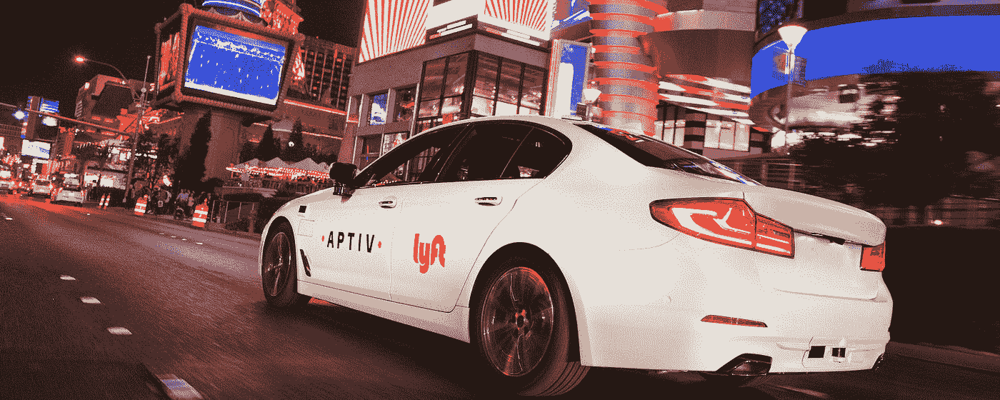
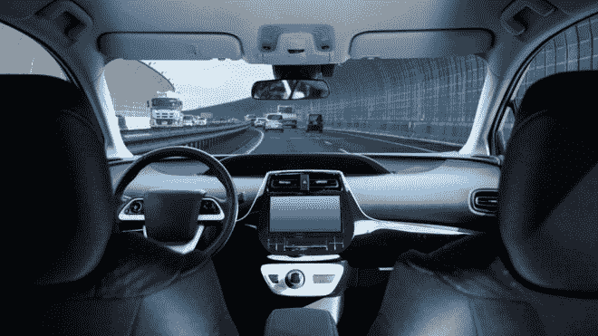
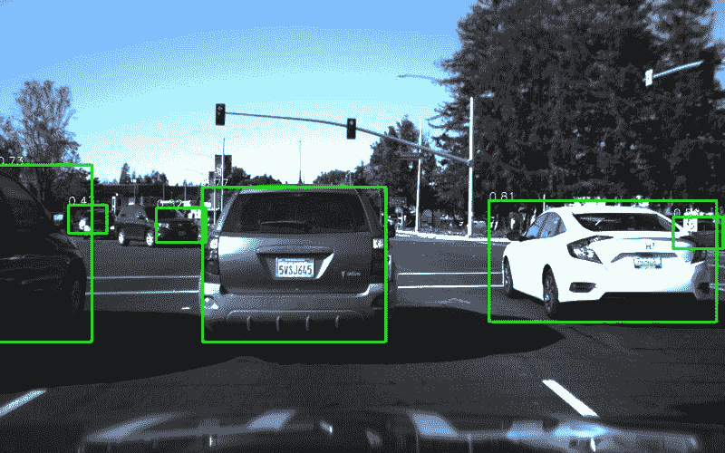
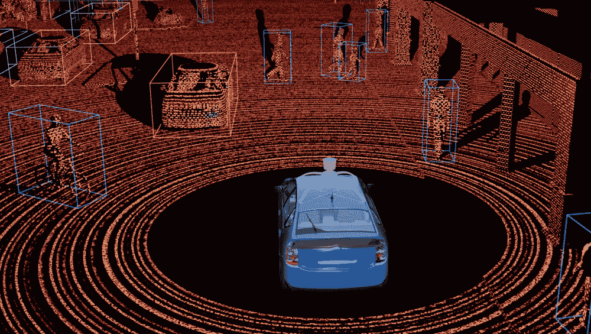
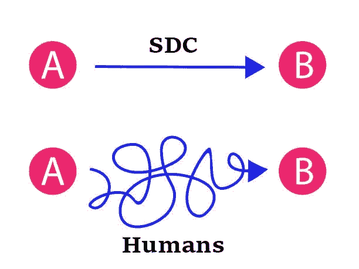
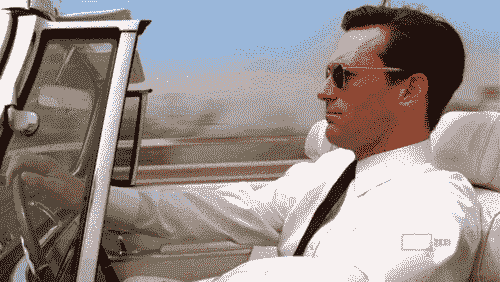
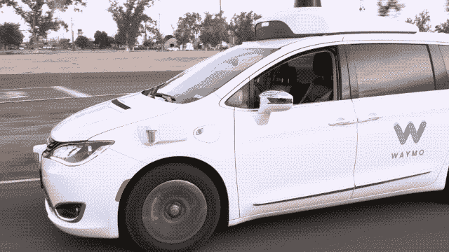

# 自动驾驶汽车介绍

> 原文：<https://towardsdatascience.com/an-introduction-to-autonomous-vehicles-91d61ff81a40?source=collection_archive---------9----------------------->

*对自动驾驶汽车的大致了解。*

Lyft’s self-driving car [[Source](https://blog.lyft.com/posts/2019/5/30/one-year-in-50000-self-driving-rides-later)]

每年，T2 大约有 125 万人死于交通事故。这相当于*每天 3287 人死亡*！作为一个刚刚学会开车的青少年，这是一个萦绕在我脑海深处的可怕事实。除此之外，我们还不得不忍受数量惊人的交通，这对大多数人来说只是制造了不必要的挫折。

这让我开始思考……有没有另一种方法可以复制人类的驾驶，但要比人类好 20 倍？

这是我发现自动驾驶汽车的地方。

# **自动驾驶汽车是如何工作的？**

对于自动驾驶汽车(SDC)，目标是能够像人类司机一样驾驶汽车。唯一的问题是座位后面没有司机。

*Caption this on a highway with no driver! [*[*Source*](https://www.bbc.com/news/technology-47144449)*]*

听起来很吓人，对吧？

你可能想知道，在做如此复杂的事情时，计算机(或者在这种情况下，汽车)是如何接近人类智能的？要回答这个问题，我们需要了解构成 SDC 的五个组成部分:

1.  计算机视觉
2.  传感器融合
3.  本地化
4.  路径规划
5.  控制

如果你不懂那些术语，不要担心！目前，解决这个问题的一个好方法是把 SDC 想象成人类。

# **计算机视觉**

像人类司机一样，我们需要能够*看到*我们周围的环境，无论是看前方的交通还是阅读路标，视觉都是🔑。

同样，**计算机视觉是汽车*如何看到*它的环境**。

在 SDC 的计算机视觉中，目标是能够识别汽车附近的物体。我们通过使用一种叫做([卷积神经网络)](https://medium.com/technologymadeeasy/the-best-explanation-of-convolutional-neural-networks-on-the-internet-fbb8b1ad5df8)的图像分类网络来做到这一点。

*SDC being able to identify cars in front of them. [*[*Source*](https://medium.com/udacity/perception-projects-from-the-self-driving-car-nanodegree-program-51fb88a38ff9)*]*

# **传感器融合**

让我们回过头来想想一个人类司机。

假设司机被困在拥挤的交通中。司机通过分析环境知道这一点。

这相当于传感器融合的思想:能够以详细的方式理解环境。因为一辆 SDC 上装备了一堆*传感器*，我们可以获取所有必要的数据并*融合*它们来为我们的汽车提供更丰富的图表，因此得名**传感器融合**。

*Generating a detailed environment using LiDAR [*[*Source*](https://news.voyage.auto/an-introduction-to-lidar-the-key-self-driving-car-sensor-a7e405590cff)*]*

# **本地化**

酷酷。这就是我们目前对 SDC 的了解:

*   它能看见
*   它知道它的环境

但是，难道你不认为确切知道你在哪里也很重要吗？就像如果你知道 Chick-fil-a 就在街区附近，那不是很有用吗？在 SDC，我们希望能够找出我们的车在现实世界中的位置，这样我们就可以更好地决定如何从 A 点到达 b 点

这就是事情变得复杂的地方，需要复杂的数学算法。现在，只要把定位想象成你手机上的 GPS。

# **路径规划**

很好，现在我们更新后的列表如下所示:

*   它能看见
*   它知道它的环境
*   它知道自己的位置

下一步是计划旅程。以我们的人类司机为例。在整个乘车过程中，司机可能在考虑要避开的特定街道和预计到达时间。这也正是 SDC 人所做的。

它不断地问，**“我怎样才能以可能的最佳方式从 A 点到达 B 点？”。**

# **控制**

一旦我们找到了路径，汽车所要做的就是能够**操控方向盘**。唯一的挑战是以类似人类的方式驾驶汽车(例如只是不是自动的)，这需要大量的练习。

*[*[*Source*](https://giphy.com/explore/driving)*]*

# **当前应用**

有很多公司像 Waymo(谷歌公司)、优步和 Lyft 都在 SDC 大肆宣传，但距离我们达到第五级自动驾驶(无人驾驶，接近 100%准确)还有很长的路要走。

目前，最接近的公司是 Waymo，它的 SDC 行驶了超过 1000 万英里。那大概是 10 辈子的驾驶！

*No driver! [*[*Source*](https://techcrunch.com/2018/07/20/waymos-autonomous-vehicles-are-driving-25000-miles-every-day/)*]*

然而，SDC 的未来仍然是一个讨论的话题，最终将取决于人们是否决定在 SDC 变得广泛可用时信任他。

# **TL；博士**

在谷歌和优步等公司的引领下，自动驾驶汽车为下一代交通工具带来了光明的未来。无人驾驶汽车背后的主要组件如下:

*   计算机视觉(汽车**如何看到**)
*   传感器融合(汽车如何理解其环境)
*   定位(汽车**如何知道**其位置)
*   路径规划(汽车**如何思考**关于**最优**路线)
*   控制(汽车**如何操纵**车轮)

# 资源

*   从[优步](https://eng.uber.com/research/?_sft_category=research-self-driving-vehicles)了解更多关于 SDC 的信息
*   了解更多关于[激光雷达](https://news.voyage.auto/an-introduction-to-lidar-the-key-self-driving-car-sensor-a7e405590cff)(在 SDCs 中非常重要)

如果你喜欢我的文章或者学到了新的东西，请务必:

*   通过 [LinkedIn](https://linkedin.com/in/william-law-9a39b9138/) 与我联系
*   发送一些反馈(我总是乐于接受建议！)