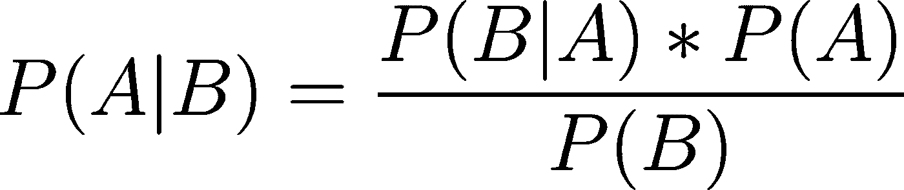
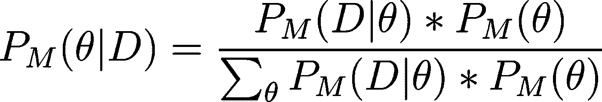

# 贝叶斯推理导论

> 原文：<https://towardsdatascience.com/an-introduction-to-bayesian-inference-e6186cfc87bc?source=collection_archive---------11----------------------->

## 和马尔可夫链蒙特卡罗

> 前言:下面的帖子旨在介绍一些数学知识。它假设您对统计学有一定的了解。虽然包括数学，但我绝不是专家。我努力学习概率编程的基础知识，希望这能帮助其他人理解这个世界。如果您发现任何错误，请留下评论并帮助我们学习。干杯！

在数据科学中，我们通常对理解数据是如何产生的感兴趣，主要是因为它允许我们回答关于新的和/或不完整的观察的问题。更具体地说，我们希望对观察数据中的输入影响输出数据的过程和程度进行建模。但是对于任何给定的数据集，有无限多种可能的模型结构可以合理地解释数据集是如何生成的。但是并不是所有的模型结构都是一样的——也就是说，基于我们对世界如何运作的假设，某些模型结构比其他模型结构更现实。由建模者选择最能描述他们所观察的世界的一个。

**目标:**找到最能解释数据集 *D* 如何生成的模型 *M*

即使我们已经选择了我们对世界的影响的假设(即模型结构)，模型结构本身到目前为止还是抽象的。例如，我们可能认为预测我吃冰淇淋概率的模型是合适的，如果我们设置它，使日期和我的位置影响温度，从而影响我狼吞虎咽黑巧克力冰淇淋(最好的一种)的机会。但这只是给出了模型结构。理想情况下，我们希望有一个函数，可以为给定日期和地点的任何可能的冰淇淋结果分配概率。为了做到这一点，我们还需要知道*每一个输入对模型的每一层有多大的*影响——这些是由模型参数 *θ捕获的。*

I love gelato.

**修改后的目标:**对于包含我们对世界结构的假设的给定模型结构 *M* (即我们认为数据是通过其产生的影响过程)，如果观察到的数据 *D* 是在这个选择的模型下产生的，那么模型的参数 *θ* 的值是多少？

换句话说，我们可能感兴趣的是找到 *θ* 的值，这些值最大化了在给定 *X* s 的情况下观察到 *y* s 的可能性(换句话说:最大化了观察到的数据 *D* 的可能性)。这被称为最大似然估计。

回到意式冰淇淋:想象你记录了我每天在哪里，我是否吃意式冰淇淋(奇怪，但也许我的医生担心我吃了太多的意式冰淇淋)。最大似然估计器将输出使似然函数最大化的*θ*s*。似然函数是我们观察到的 *y* s(我的冰淇淋消耗量)和 *X* s(日期和我的位置)的概率，如果这些 *y* s 确实是由那些 *θ* s 和那些 *X* s 生成的。最大化似然性给了我们看起来最能解释数据的 *θ* s 组合。*

通常，我们试图搜索模型参数值的每一个组合，并计算具有该组特定模型参数值的模型生成我们的观察数据的概率。当然，在大多数实际情况下，搜索 *θ* 的每个组合是不可能的，所以在传统的机器学习中，我们用梯度下降等算法来优化这种搜索，这些算法根据当前值的组合在解释观察到的数据方面的表现来选择接下来要测试的 *θ* 的哪些值。然后，我们选择并报告最大化数据可能性的 *θ* 组合。

这种方法的一个问题是，我们报告的是 *θ* s 的**单一组合作为我们的最佳估计值，但是看到这份报告的其他人不会知道我们对每个报告的参数值有多大的把握。这是一个问题，因为观察到的数据几乎总是真实总体的样本，并且本质上是有噪声的，不管我们收集了多少数据；我们永远不应该对模型参数的任何点估计有 100%的把握。考虑一下，如果我们观察到一个不同的或有限的人口样本(例如，如果我只记得记录我 75%的时间里的冰淇淋消费量，或者只有当我在纽约的时候，会怎么样？)，我们报告的 *θ* s 会发生剧烈变化还是最小变化？知道了每个 *θ* 值的可信区间，就嵌入了这样的信息，即基于我们看到的数据，我们认为我们对给定模型参数的估计有多有代表性，这通常可能代表真实物理现象的影响。我们也很少知道关于我吃冰淇淋的知识会如何影响某个温度或我在某个城市的概率(即反向推断)。**

## 贝叶斯推理

为了解决这些问题，我想介绍一下贝叶斯推理，贝叶斯法则是我们的口头禅:

Eqn 1: Bayes Rule

让我们看看如何将它应用到我们的目标中。回想一下，给定我们观察到的数据:P_M ( *θ | D)，在我们选择的模型结构下，知道参数值 *θ* 的概率分布是理想的。*将此代入贝叶斯法则:

Eqn 2

Eqn 3

我们现在可以将等式 2 改写为:

Eqn 4

如果我们选择 *θ* 的值来测试我们预先选择的模型，计算 P_M ( *D* | *θ)* 真的很容易，因为我们知道这个建模函数的所有输入/输出/参数(回想一下这被称为似然性)， 我们还知道先验 P( *θ)* ，因为它代表了我们对特定 *θ* 的信念(例如，对于看似公平的硬币， *θ* 很可能是以 0.5 为中心的法线，根据我们对硬币公平程度的信念，我们可能会增加或减少该法线的方差)。 对于选定的 *θ* ，计算 EQN 4 的分子非常简单。

问我们每一个可能的 *θ* 的数量，我们很快意识到我们在传统的机器学习中遇到了同样的问题:我们无法对每一个 *θ* 进行采样！换句话说，EQN 4 的分母几乎无法计算。

## MCMC

开发马尔可夫链蒙特卡罗(MCMC)技术是为了智能地采样 *θ* s，而不是直接对每个可能的 *θ* 的似然性和先验性求和。这些技术背后的主要思想类似于我们在传统机器学习中看到的 *θ* 更新技术:我们根据我们对当前一组 *θ* 值的可能性的评估，用一组新的 *θ* 值进行“更新”。这里最大的不同是，我们是取样而不是更新——换句话说，我们对我们探索过的价值观的历史感兴趣。这很重要，因为我们不再只是对知道每个参数的单个最佳估计感兴趣(这是我们在梯度下降中所做的)，而是对知道每个参数的“好”估计的集合以及它们的可能性有多大感兴趣。(即给定 *D* 时 *θ* 的概率分布)。

让我们深入研究 MCMC 算法的高级概述以及它们在这里工作的原因。MCMC 关心跟踪两件事:

> *θ_current:* 单个 *θ* 我们目前感兴趣的
> *trace_θ* :所有 *θ_current* 的列表

MCMC 首先选择一个随机初始值 *θ* :

> *θ_ current =θ_ 0
> trace _θ=[θ_ 0】*

并计算似然和先验(即等式 4 的分子)。创建 MCMC 的目的是，尽管分母在所有的 *θ* 选择中保持不变，但我们不能直接计算分母中的和，所以我们暂时把它放在一边。在这一点上，我们不知道我们选择的 *θ_0* 是否是一个好的选择。相反，我们选择一个提议 *θ_1* (在这一点上，认为它被神奇地选择了，但我们很快就会回到那个问题上)如果它在 EQN 4 中产生一个更大的分子，我们可以同意它是对 *θ* 的更好选择。这是因为在 EQN 4 中分母是不变的，不管我们选择*还是θ* 来代入 EQN 4。既然我们知道 *θ_1* 更好，让我们把它加到我们的迹中，更新我们当前的 *θ* ，并计算似然和先验(即 EQN 4 的分子):

> *θ_ current =θ_ 1
> trace _θ=[θ_ 0，θ_ 1】*

我们现在可以选择一个新的 *θ_2* 来提出(目前仍是一个神奇的过程),如果它不能很好地解释数据(即，它产生了等式 4 的一个较小的分子),那么我们这次不会立即接受它，而是将它接受到我们的 *θ_current* 和 *trace_θ* 的概率𝛼:中

Eqn 5

之所以这样，是因为我们可以推论出 *θ_2* 只有𝛼和 *θ_current* 一样好。这意味着在我们的采样历史中，我们应该期望我们采样的次数 *θ_2* 是我们采样的次数 *θ_current* 的𝛼的一个因子:

Eqn 6

在这种情况下，经过充分的采样后，您应该会有一种直觉，即我们将会探索大量的 *θ* 值，并将它们保存在跟踪变量中，其频率与 *θ* 值相对于其他*θ***值解释数据的程度成比例，这正是我们感兴趣的分布**！

最后，我们回到如何生成好的建议 *θ* s 的问题。如果我们没有方法并在 *θ* 的所有可能值中随机选择 *θ* s 来建议，我们将拒绝太多的样本(考虑到 *θ* 的真实密度可能是相对窄分布的)。相反，我们从建议分布*q(θ_ proposed |θ_ current)*中得出*θ*s。例如，我们可以选择使 *q* 成为具有固定方差和平均值 *θ_current 的正态分布。*

这是最流行的 MCMC 算法之一 Metropolis-Hastings (MH)的本质。我们通过以下方式将其纳入我们的𝛼接受率:

Eqn 7

如果我们选择对称建议分布(如正态分布)，则:

Eqn 8

由此可见，𝛼_ = 𝛼.这叫做随机漫步 MH 算法，你会得到这样的图:

Image 1

左图是“intercept_mu”参数的 KDE 图(本质上是一个平滑的直方图)，右图是每个采样链随时间变化的轨迹。我们可以推断，虽然参数(轨迹的模式，也称为地图)最可能的值是 0.16，但参数的可信区间可能在 0.1 和 0.21 之间。

# 附录:

*   为了更直观地解释这个过程，请看[这段视频](https://www.youtube.com/watch?v=OTO1DygELpY)。
*   大多数帮助你进行 MCMC 的软件包通常会运行 3 个或更多的轨迹(也称为“链”)，它们具有不同的随机初始化，以确保链是“收敛的”。这很重要，因为聚合链表明你的马尔可夫链已经稳定。
*   我通常会考虑老化期，它会丢弃最初的几千个样本，这些样本可能取决于θ的随机初始化
*   先验的选择对抽样结果有影响。不要选择太窄的先验(因为你的偏见会妨碍对参数空间的正确探索，你的链将无法收敛)或太宽的先验(称为无信息先验，你收敛的机会也会减少，因为你会花太多时间拒绝无用的样本)。
*   我通常使用曲线的模式或均值来报告最可能的值，并使用 HPD(最高后验密度)区间来建立可信区间。