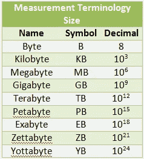
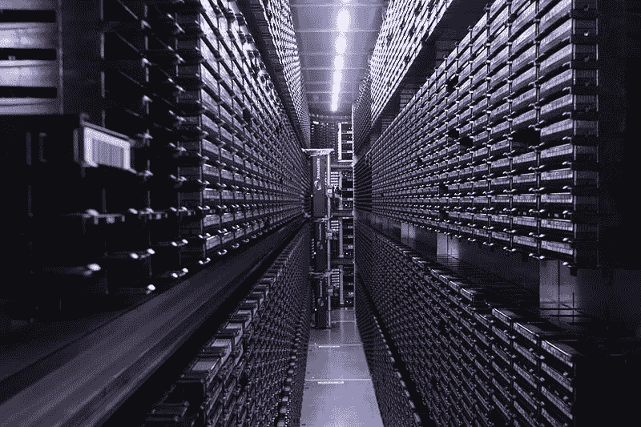
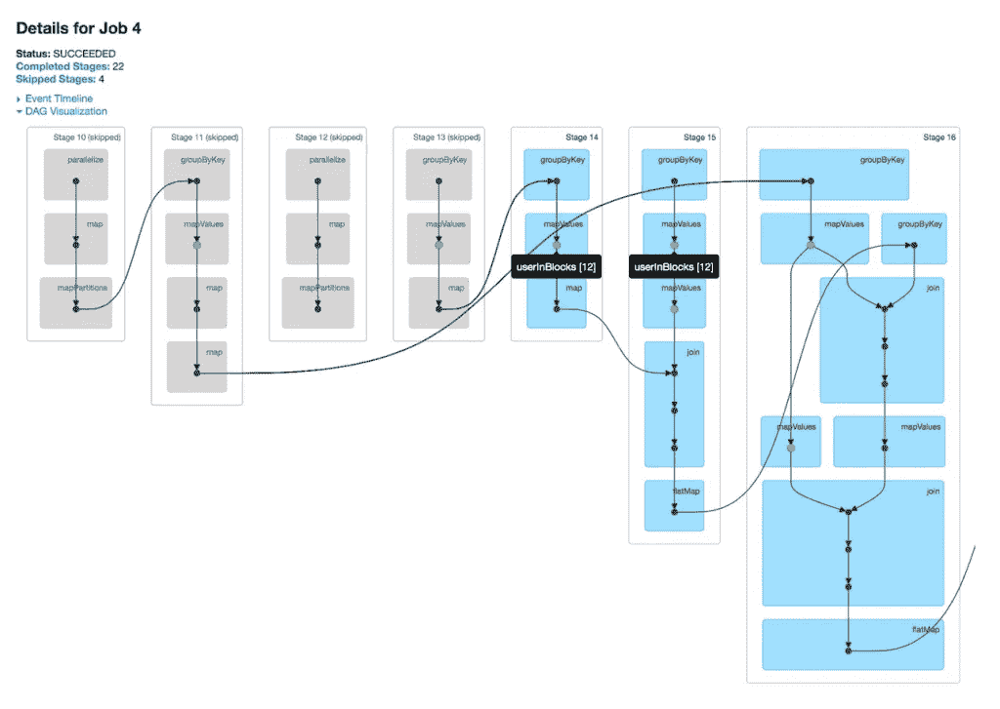

# 大数据、Apache Spark 和 RDDs 简介

> 原文：<https://towardsdatascience.com/an-introduction-to-big-data-apache-spark-and-rdds-975ef4d91be2?source=collection_archive---------8----------------------->

## Spark 架构如何优化以处理大型数据集的基本方法

Photo by [NASA](https://unsplash.com/@nasa?utm_source=medium&utm_medium=referral) on [Unsplash](https://unsplash.com?utm_source=medium&utm_medium=referral)

我们每天总共产生超过 2.5 万亿字节的数据。

yelp 评论、广告点击或地理坐标——只要你说得出，我们的数字足迹就可能在那里。从社交媒体平台上的数百万内容创作者到源源不断的交易行项目，我们的世界一直在以指数速度产生数据。它们的大小从 0.7 MB 的 twitter 帖子到 [100 多 PB 的优步地理交通洞察](https://eng.uber.com/uber-big-data-platform/)。

Current big data systems are processing datasets in the Petabytes range

随着这一趋势，重要的是，我们有能力捕捉它，解释它，并基于它做出“数据驱动的决策”。但为了让我们真正获得这些见解，数据科学家围绕大数据以及如何处理如此庞大的信息创建了一个完整的领域。

特别是，大数据需要更强大的计算工具，而不仅仅是标准的 excel 回归，甚至是你可能熟悉的 python 熊猫。特别是在处理企业级生产级数据集或考虑为任何具有数据播放功能的初创公司进行扩展时，大数据平台是管理和分析您所有大数据需求的核心。其中一个平台 Apache Spark 已经成为处理大数据的事实平台，并继续成为学术界和行业中数据专家使用最多的平台。本文旨在将 Spark 的核心概念分解成简单明了的描述。

# Spark 处理大数据

让我们从 Apache Spark 网站开始——Spark 是一个“用于大数据处理的统一分析引擎”从高层次来说，它是一个计算框架，允许我们:

1.  加载/接收大量实时数据(流)
2.  转换/清理大量数据(SQL 操作)
3.  对大量数据运行 ML 分析技术(机器学习)
4.  处理大量数据的图形网络(图形处理)

看到模式了吗？处理大数据的各种计算功能。我们用 Python、R、Scala 和 Java 为 Apache Spark 编写代码，脚本通常运行在支持这些大型计算的平台上。

A Big Number of Big Machines process Big Data

这些运行 Spark 的平台通常是基于云的(微软 Azure、AWS、谷歌云等。)并写在与云环境相连的笔记本上。这些笔记本电脑由联网的计算机集群支持，可以高效地处理大型数据集，这是您单独的笔记本电脑或 PC 无法处理的。(更多关于*如何*以后)

# RDD 作为火花的基本抽象

Apache Spark 通过一种称为弹性分布式数据集(RDD)的抽象来处理这些海量数据。你会经常听到这个词，因为它是 Spark 强大的数据处理引擎的基础。

从高层次上讲，RDD 是一种逻辑结构，它允许我们以我们熟悉的传统表格格式可视化数据，并在数据集上运行必要的 SQL 查询。它的核心是一个 java 对象，有内置的方法(如 *RDD_example.map()* 、 *RDD_example.filter()* 等)。)允许我们操作传入的原始数据。RDD 仅仅是一个抽象，负责处理(存储&转换)我们传入的数据。

然而，在幕后，RDD 通过对数据子集进行分区来有效地处理大数据，这些子集可以在各个节点上并行地在**上操作**，并且每个分区都有副本以防止数据丢失。下面是一个用 RDD 表示数据的具体例子:

## 示例:让我们给 Spark 100GB 的数据:

假设在这个设置中我们有 5 个工作节点可用。Spark 认识到将所有 100 GB 分配给一个工作节点而让其他四个空着是低效的。相反，它选择将这个原始数据集划分到工作节点上，以平均分配工作负载。Spark 决定将数据划分为 100 个分区(从技术上讲，分区数量是您首先设置的参数)，每个分区有不同的 GB。

现在，节点#1 获得第一个 20 GB，节点#2 获得 21–40gb，节点#3 获得 41–60gb，依此类推。

但是并不是所有的数据都是同等地创建的——有些数据可能比其他数据运行得更快，而有些数据可能过于繁重，以至于会导致节点崩溃。

Spark 决定为节点#1 提供 21–40gb 和 41–60gb 的副本，为节点#2 提供 41–60gb 和 61–80gb 的副本，依此类推。

因此，虽然每个工作节点主要负责其原始的 20 GB，但它也存储其他 GB 分区的副本。*因此，Spark 有效地将数据划分到节点上，这样工作节点可以并行计算数据，同时防止空闲节点。*也就是说，如果一个工作者节点提前完成了它的计算，它可以从另一个工作者节点(可能很慢或者已经崩溃)那里“拾起空闲”并支持另一个 GB 分区的计算。

从示例中，我们可以看到以下几点:

1.  数据具有**弹性** —通过存储数据的多个副本，每个副本存储在不同的节点中，我们可以避免在一个或多个节点发生故障的罕见情况下丢失数据。
2.  数据是**分布式的** —很明显，在最初的 100GB 数据中，我们已经跨多个节点对数据进行了分区或分片。这使得每个节点处理的数据更少，从而提高了整体运行速度。
3.  数据是一个**数据集** —它是一个保存数据的数据结构。在表功能中，它可以被格式化为具有索引的命名列，但是除了被分区之外，它也可以没有正式的结构组织。当它以 DataFrame 对象的形式使用内置方法时，可以为这种特殊的数据集提供更丰富的优化。

这就产生了弹性分布式数据集的名称。当然，这个过程还存在更多的细微差别，但是上面的例子试图说明 Spark 使用 rdd 的效率的一个简化的思考过程。

# PySpark 中 rdd 的 4 行代码

RDD_example = sc.parallelize([1，2，3])
o = RDD _ example . filter(lambda I:I % 2)。map(lambda I:I * 2)
result = o . collect()
print(结果)

##(输出:2，6)

注意，使用并行化方法的第一行，我们从传入的整数列表中创建 RDD。可以把并行化想象成这样——创建 RDD，这样我们就可以并行处理数据。

在我们创建的 RDD 上，我们对该对象应用了两个额外的方法，这两个方法仍然返回 RDD 对象。过滤器和映射都是 MapReduce 框架的一部分，接受各自的匿名函数。在这种情况下，我们过滤 RDD 以包含奇数的元素，然后将加倍函数映射到这些相应的元素。

## 惰性评估和 Dag

在这一点上，RDD 的方法似乎与我们在 CS 入门课程中看到的方法相同。那么，为什么我们要费这么大的劲来过滤一个函数并把它映射到一个列表上呢？来评价一下 Spark 如何懒懒地计算*。*

*上面的例子，在我们调用 collect 的最后一行，简洁地显示了 spark **转换**和**动作**之间的区别。在这里，我们可以深入了解——的转变。过滤器()和。先前的 map()没有被实际执行，而是被放入执行 map 中，以便稍后被动作激活。的。collect()操作方法实际上用于执行整个代码序列，并开始跨节点的计算。*

**

*The local environment execution plan as a Directed Acyclic Graph (DAG) [https://spark.apache.org/docs/latest/cluster-overview.html](https://spark.apache.org/docs/latest/cluster-overview.html)*

*转换在本地环境中创建的执行计划存储在一个有向无环图(DAG)中。与中一样，计算的步骤遵循一个连续的方向，永远不会循环回自身。*

*长话短说，转换方法是返回放入 DAG 的 RDD 的 RDD 方法。动作方法通常是启动 Spark 引擎进行计算的最终操作。转换在本地环境中添加 DAG，并且在动作调用时，DAG 被发送到主驱动程序上的主 Spark 解释器。*

# *大局*

*在 Spark 如何运行以及 RDD 如何融入框架的更大范围内，下图抓住了中央驱动程序如何在工作节点之间分布的核心。*

**

*[https://spark.apache.org/docs/latest/cluster-overview.html](https://spark.apache.org/docs/latest/cluster-overview.html)*

*我们称之为初始的 sc 对象或 SparkContext。parallelize()方法是 Apache Spark 的内置功能，我们可以将其视为主驱动程序的一部分。这个火花上下文对象是我们创建的，或者是给予我们的，这样我们就有能力创建 RDD。从那里，主驱动程序从您的 PySpark 脚本接收 DAG 执行计划，序列化代码(例如，转换成位和字节)，并将各自的分区发送到它们通过 API 调用接收的工作节点。然后，每个工人执行从 DAG 分配给他们的操作。这提升了 Spark 并行计算和高效处理大数据的能力。*