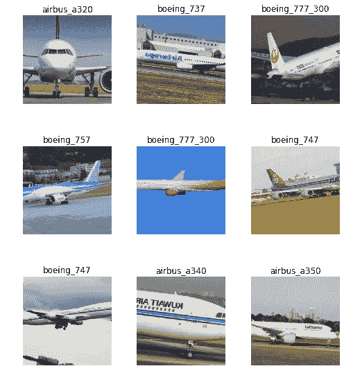

# fast.ai 中使用迁移学习的计算机视觉导论——飞机分类

> 原文：<https://towardsdatascience.com/an-introduction-to-computer-vision-using-transfer-learning-in-fast-ai-aircraft-classification-a2685d266ac?source=collection_archive---------5----------------------->

## 使用 fastai 和 pytorch 的图像分类简介

# 介绍

我来 fast.ai 派对有点晚了，不过有句名言是这么说的，

> 迟做比不做好

这不是最伟大的格言，但对我来说很管用。

2018 年 11 月，我开始探索用于深度学习的 fast.ai 库，这是通过杰瑞米·霍华德同名的奇妙 MOOC 实现的，我想在一些数据集上对该库进行实验，以获得良好的感受。我还从我的朋友 [Aayush Agrawal](https://medium.com/u/85dd669ac015?source=post_page-----a2685d266ac--------------------------------) 的[博客文章中获得了灵感，这篇文章是关于使用转移学习通过叶子图像检测植物疾病的](/transfer-learning-using-the-fastai-library-d686b238213e)。

[fast.ai](http://fast.ai) 是一个 Python 深度学习库，位于脸书深度学习 PyTorch 框架之上。在这篇文章中，我们看看如何使用迁移学习对 9 个飞机模型进行分类，数据集是我通过从互联网下载 9 个飞机模型的图像手动构建的，如下所示:


Airbus A320 — Airbus A340 — Airbus A350


Airbus A380 — Boeing 737 — Boeing 747


Boeing 757 — Boeing 777 — Boeing 787

从小我就一直对飞机很着迷。也有一段时间，我梦想成为一名飞行员——但我猜这些梦想从未实现过(看到我在那里做了什么吗？)——所以我决定把这种魅力带进我的深度学习探索中。现在让我们深入 Python 代码，看看所有这些是如何展开的:

# 导入必要的模块

让我们从导入计算机视觉问题所需的模块开始:

```
from fastai.vision import *
```

可能会有一群 Pythonistas 等着向我扔鸡蛋，因为我使用了上面的`import *`,但这几乎是这篇文章所需要的。这个库包含了很多功能，随着我们对数据探索的深入，您将会意识到它的易用性。

# 探索数据

我们的图像数据集作为`.jpg`文件存储在 9 个不同的文件夹中，每个文件夹都带有文件夹中包含的图像的飞机模型名称。我们使用`ImageDataBunch.from_folder()`函数来加载图像，并根据读取图像的文件夹的名称给图像分配标签。

我们首先声明文件夹所在的路径:

这就是我们加载这些图像所需要做的一切。显然这是一个对编码者友好的库。

上面的`.normalize(imagenet_stats)`方法用于根据 ImageNet 数据集的 RGB 通道的统计数据来标准化数据集。

现在我们已经加载了数据集，让我们看一看它是什么样子的:

```
data.show_batch(rows=3, figsize=(7,8))
```



我看没问题。让我们看看什么是图像类、类的数量以及训练集和测试集的大小:

`data.classes` —我们的数据集中有哪些类别的飞机？

```
['airbus_a320',
  'airbus_a340',
  'airbus_a350',
  'airbus_a380',
  'boeing_737',
  'boeing_747',
  'boeing_757',
  'boeing_777_300',
  'boeing_787']
```

`data.c` —我们的数据集中有多少个类？

`9`

`len(data.train_ds)` —我们的训练数据集有多大？

`2473`

`len(data.valid_ds)` —我们的验证数据集有多大？

`618`

因此，我们在训练集中有 2473 幅图像，在测试集中有 618 幅图像(约 20%)，如上面的`ImageDataBunch.from_folder()`函数所定义。

# 训练模型

我们现在使用预训练的 ResNet50 卷积神经网络模型，并使用迁移学习来仅学习网络的最后一层的权重。

为什么要转学？因为使用迁移学习，你从一个现有的(经过训练的)用于图像识别的神经网络开始，然后在这里或那里稍微调整一下，为你的特定用例训练一个模型。我们为什么要这么做？训练一个合理的神经网络将意味着需要大约 300，000 个图像样本，并且为了实现*真正*良好的性能，我们将需要*至少*一百万个图像。在我们的例子中，我们的训练集中有大约 2500 幅图像——如果我们从头开始训练神经网络，你有一个猜测来决定这是否足够。

我们使用`create_cnn()`函数来加载预训练的 ResNet50 网络，该网络是在来自 [ImageNet](http://www.image-net.org/) 数据库的大约一百万张图像上训练的。

现在，让我们拟合 4 个时期的一个周期，看看我们的模型在该数据集上的表现如何:

```
learn.fit_one_cycle(4)
```


为什么只有 4 个纪元？我想尝试和基准我的第一次尝试与调整，我会在一段时间内，使一个合理的比较。通过 4 个时期，并且没有对我们的模型进行调整，我们已经成功地实现了(？)大约 32%的错误率(这相当于 68%的准确度)。这有多好？当我们进一步阅读时，我们会找到这个问题的答案。

让我们看看我们的模型预测有什么问题:

```
interp = ClassificationInterpretation.from_learner(learn)interp.plot_top_losses(8)
```


上面图像中的热图描绘了图像中*激活*网络的区域——更简单地说，这些是图像中帮助网络识别类别的区域(在上面的案例中不是很有帮助，因为损失是最高的)。关于这方面的更多信息，本文给出了一个很好的演示。

一个突出的事实是，当它被输入到模型中时，大多数图像被裁剪成正方形( *n x n* 像素)。这是因为目前，GPU 输入只能是正方形图像。对于我们的用例来说，这是一个潜在的警告，因为帮助识别飞机的主要组件之一是它的鼻子，它在大多数图像中被裁剪掉，因此我们的模型没有足够的信息来学习。

为了克服这一点，现在让我们把我们的图像挤压成正方形，而不是裁剪它们。可以把它想象成从图像的两边施加压力，使它看起来有点扭曲，但保留了图像的组成部分，而没有裁剪它。为此，我们对我们的`ImageDataBunch.from_folder()`函数做了一点小小的改变。最初，我们将`size`参数设置为值 `450`，这意味着图像将被裁剪为`450 x 450`图像。让我们对该参数进行如下修改:

我们现在已经将`size` 的值从`450`改为`**(450,450)**`。这种变化虽然不明显，但会将图像压缩到上述相同的尺寸:

```
data_squished.show_batch(rows=3, figsize=(7,8))
```


Images loaded with size = (450,450), with images squished but the aircraft noses are retained

这里的区别是显而易见的，与我们最初加载的图像相比，图像较宽的一端(大多数情况下，鼻子)被剪掉了:


Images loaded at the beginning of the post (size = 450), thus cropping the noses

现在让我们通过用新图像重新训练模型来创建另一个学习者:

```
learn2 = cnn_learner(data_squished, 
                     models.resnet50,       
                     metrics=error_rate)
```

现在让我们用 4 个时期来拟合我们的模型(一个时期意味着我们的模型扫描我们的数据一次——时期的数量越多，它在每次扫描中学习的就越多)

```
learn2.fit_one_cycle(4)
```


这个结果是 21%的错误率，比我们之前 32%的错误率有了相当大的改善。现在，让我们尝试通过微调来改进我们的模型:

让我们暂时保存模型(权重):

```
learn2.save('aircraft_classification_stg1')
```

深度学习模型中最重要的参数之一是学习速率。选择正确的学习率很重要，我们可以使用一个漂亮的函数— `lr_finder()`来找到一个非常好的学习率，供我们的模型学习，而不是随机猜测或多次试错。这个函数是 Leslie Smith 的[论文](https://arxiv.org/abs/1803.09820?source=post_page---------------------------)中关于调整神经网络超参数的一个实现，所以读一下吧。

在我们运行`lr_find()`之前，我们可以*解冻*整个网络。我发现在运行`lr_find()`之前解冻网络能让我得到更好的结果。`unfreeze()`使我们能够更新整个网络的权重。理想情况下，我们希望*而不是*大幅度更新早期层的权重，但是小的变化(由低学习率定义)以及随着我们在各层之间移动而逐渐增加学习率可能会导致更好的结果。

```
learn2.unfreeze()
learn2.lr_find()
```

`lr_find()`本质上是用线性递增的学习率来训练模型，学习率通常在 10e-7 到 1 之间。运行后，我们绘制了损失与学习率的关系图，如下所示:

```
learn2.recorder.plot()
```


我们可以选择我们的学习速率，使它低于损失开始显著上升的速率。在上图中，1e-4 似乎是最后一层组的合理学习速率。

我们可以通过选择学习率的范围来将学习率分布在网络的各层，其中最大学习率将是 1e-4(来自上图)，最小学习率(将应用于第一学习组)可以是最大学习率的十分之一，在这种情况下将是 1e-5。

为了训练整个网络，我们首先需要 ***解冻*** 网络——这是我们在运行`lr_find()`之前做的事情，所以我们不必再做一遍。

现在让我们用 8 个时期来拟合我们的模型的一个周期——阅读更多关于`fit_one_cycle`、[的内容，这是一篇关于这个主题的很棒的文章。](https://sgugger.github.io/the-1cycle-policy.html)

```
learn2.fit_one_cycle(8, max_lr=slice(1e-5,1e-4))
```


通过以上步骤，我们已经将错误率降低到了约 4% —不错！我们最初的错误率是 32%，这是一个很大的进步！

现在让我们看看我们的混淆矩阵，看看我们的模型在哪里给出了错误的预测:

```
interp = ClassificationInterpretation.from_learner(learn2)
interp.plot_confusion_matrix()
```


从混淆矩阵来看，看起来模型预测飞机是波音 787，而实际上它是另一个模型。让我们看看损失最大的例子:

```
interp.plot_top_losses(10, figsize = (20,20))
```


我们可以让我们的模型通过一些预测——例如，第四张图片只是一个引擎，我不认为我给模型提供了足够的放大引擎图像来准确区分飞机引擎。第七张图片是飞机前部的放大图，公平地说，这很难区分不同的飞机，特别是对于一个我们没有调整太多的模型。上图中的热图显示了图像的激活层。

# 结论

在没有对我们的模型进行深入调整的情况下，我们能够获得接近 97%的准确率。我们可以做大量的实验来进一步了解是否可以提高精度，例如增加历元的数量、多次运行单个历元周期、更多的数据扩充技术等。这篇文章的目的是说明 fastai 库的易用性和速度，以及它只需很少的调整就可以实现的最先进的结果，以及迁移学习在开发最先进的图像识别模型方面令人难以置信的能力。fast.ai 的人们正在不断开发这个库，它将激励人们更多地了解人工智能及其在建设更美好世界中的非凡用例。

这个项目的代码可以在我的 [Github](https://github.com/suraggupta) 档案中找到