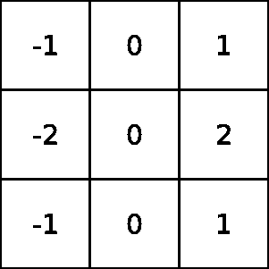
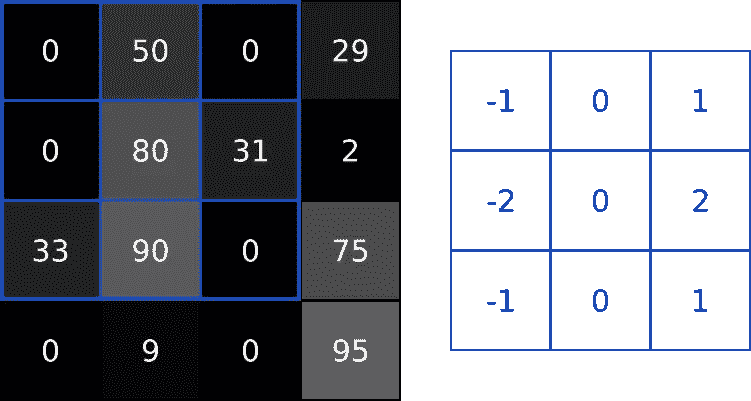
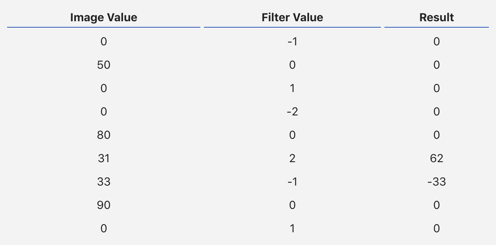
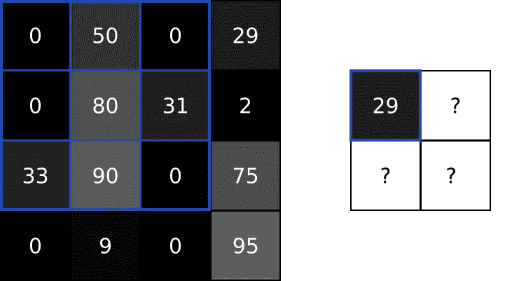
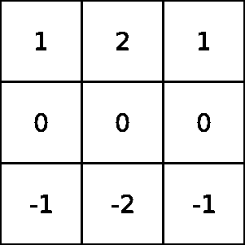
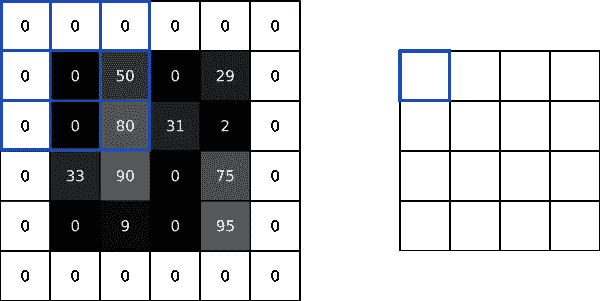
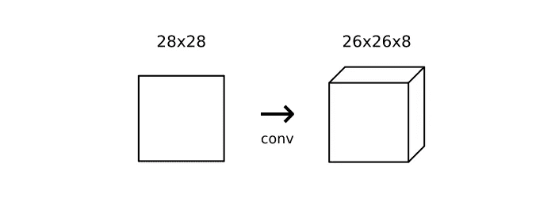
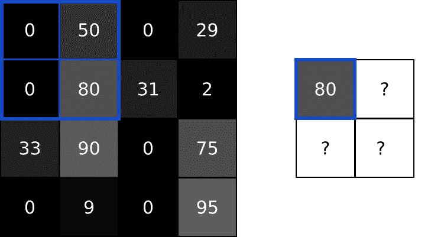
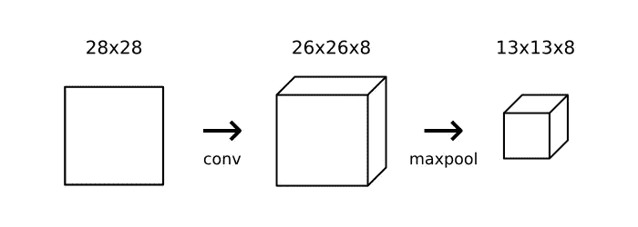
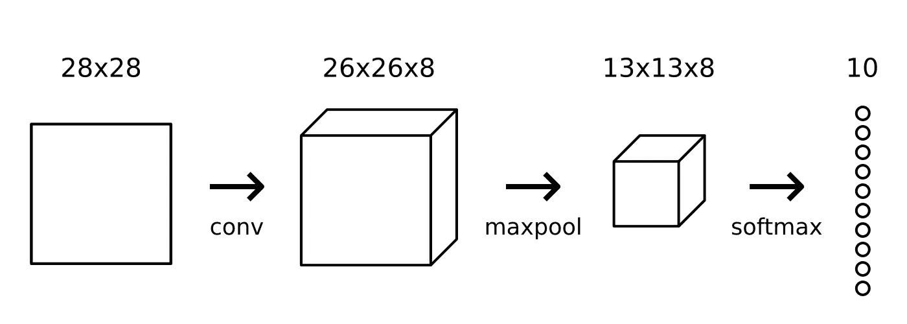

# 卷积神经网络导论

> 原文：<https://towardsdatascience.com/an-introduction-to-convolutional-neural-networks-bdf692352c7?source=collection_archive---------10----------------------->

## 一个简单的指南，介绍什么是 CNN，它们如何工作，以及如何用 Python 从头开始构建一个 CNN。

在过去的几年里，关于卷积神经网络(CNN)有很多讨论，特别是因为它们如何彻底改变了计算机视觉领域。在这篇文章中，我们将基于神经网络的基本背景知识和**探索什么是 CNN，了解它们如何工作，并从头开始用 Python 构建一个真实的 CNNs】(仅使用 [numpy](https://www.numpy.org/) )。**

**这篇文章假设只有神经网络的基础知识**。我的[神经网络介绍](https://victorzhou.com/blog/intro-to-neural-networks/)涵盖了你需要知道的一切，所以你可能想先读一下。

准备好了吗？让我们跳进来。

> 这篇文章的格式在 victorzhou.com 的原帖中看起来最好。

# 1.动机

CNN 的一个经典用例是执行图像分类，例如，查看宠物的图像并判断它是猫还是狗。这是一个看似简单的任务— **为什么不用普通的神经网络呢？**

好问题。

## 原因 1:图像很大

现在用于计算机视觉问题的图像通常是 224x224 或更大。想象一下，构建一个神经网络来处理 224x224 彩色图像:包括图像中的 3 个颜色通道(RGB ),得出 224 x 224 x 3 = **150，528** 输入特征！在这样的网络中，一个典型的隐藏层可能有 1024 个节点，因此我们必须为第一层训练 150，528 x 1024 =**1.5 亿个以上的权重**。我们的网络将会非常庞大，几乎无法训练。

我们也不需要那么多重量。图像的好处是我们知道**像素在它们的邻居**的上下文中最有用。图像中的物体由小的局部特征组成，比如眼睛的圆形虹膜或者一张纸的方形角。第一个隐藏层的*每一个*节点都要看*每一个*像素是不是显得很浪费？

## 原因 2:立场可以改变

如果你训练一个网络来检测狗，你会希望它能够检测一只狗*，不管它出现在图像*的什么地方。想象一下，训练一个对某个狗图像工作良好的网络，然后给它输入同一图像的稍微偏移的版本。狗不会激活同样的神经元，所以**网络会做出完全不同的反应！**

我们很快就会看到 CNN 如何帮助我们缓解这些问题。

# 2.资料组

在本帖中，我们将解决“你好，世界！”计算机视觉的: [MNIST](http://yann.lecun.com/exdb/mnist/) 手写数字分类问题。很简单:给定一个图像，将其归类为一个数字。


MNIST 数据集中的每幅图像都是 28x28，包含一个居中的灰度数字。

说实话，一个普通的神经网络实际上可以很好地解决这个问题。您可以将每个图像视为一个 28 x 28 = 784 维的向量，将其输入到一个 784 维的输入层，堆叠几个隐藏层，最后得到一个包含 10 个节点的输出层，每个节点对应一个数字。

这只会起作用，因为 MNIST 数据集包含以**为中心**的**小**图像，所以我们不会遇到前面提到的大小或移动的问题。然而，在这篇文章的整个过程中请记住，大多数现实世界的图像分类问题并不容易。

足够的积累。让我们进入 CNN！

# 3.回旋

什么是卷积神经网络？

它们基本上只是使用**卷积层**的神经网络，也称为 Conv 层，基于[卷积](https://en.wikipedia.org/wiki/Convolution)的数学运算。Conv 图层由一组**滤镜**组成，你可以把它们想象成 2d 数字矩阵。这是一个 3x3 滤波器的例子:



A 3x3 filter

我们可以使用输入图像和滤波器，通过**将滤波器与输入图像**卷积来产生输出图像。这包括

1.  将滤镜覆盖在图像顶部的某个位置。
2.  在滤波器中的值和它们在图像中的相应值之间执行**逐元素乘法**。
3.  对所有元素的乘积求和。该总和是输出图像中**目标像素**的输出值。
4.  对所有位置重复。

> *边注:我们(以及许多 CNN 实现)在技术上实际上使用* [*互相关*](https://en.wikipedia.org/wiki/Cross-correlation) *来代替这里的卷积，但它们做的几乎是同样的事情。我不会在这篇文章中深入讨论这种差异，因为它并不重要，但是如果你好奇的话，可以随意查看。*

这个 4 步描述有点抽象，所以让我们来做一个例子。考虑一下这个小小的 4x4 灰度图像和这个 3x3 滤镜:


A 4x4 image (left) and a 3x3 filter (right)

图像中的数字代表像素强度，其中 0 代表黑色，255 代表白色。我们将卷积输入图像和滤波器，以产生 2x2 输出图像:


A 2x2 output image

首先，让我们在图像的左上角覆盖我们的过滤器:



Step 1: Overlay the filter (right) on top of the image (left)

接下来，我们在重叠的图像值和滤波器值之间执行逐元素乘法。以下是结果，从左上角开始，向右，然后向下:



Step 2: Performing element-wise multiplication.

接下来，我们总结所有的结果。这很简单:62–33 =**29**。

最后，我们将结果放在输出图像的目标像素中。因为我们的过滤器覆盖在输入图像的左上角，所以我们的目标像素是输出图像的左上角像素:



我们做同样的事情来生成输出图像的其余部分:


## 3.1 这有什么用？

让我们缩小一下，从更高的层面来看这个问题。用滤波器卷积图像有什么作用？我们可以从我们一直使用的示例 3x3 滤波器开始，它通常被称为垂直 [Sobel 滤波器](https://en.wikipedia.org/wiki/Sobel_operator):

下面是垂直索贝尔滤波器的一个例子:


An image convolved with the vertical Sobel filter

类似地，还有一个水平 Sobel 滤波器:



An image convolved with the horizontal Sobel filter

看到发生了什么吗？**索贝尔滤波器是边缘检测器**。垂直 Sobel 滤波器检测垂直边缘，水平 Sobel 滤波器检测水平边缘。输出图像现在很容易解释:输出图像中的亮像素(具有高值的像素)表示原始图像中有很强的边缘。

你能看出为什么边缘检测图像可能比原始图像更有用吗？回想一下我们的 MNIST 手写数字分类问题。例如，在 MNIST 上训练的 CNN 可能通过使用边缘检测过滤器并检查图像中心附近的两个突出的垂直边缘来寻找数字 1。一般来说，**卷积帮助我们寻找特定的局部图像特征**(如边缘)，我们可以在网络中稍后使用。

## 3.2 填充

还记得之前用 3×3 滤波器卷积 4×4 输入图像以产生 2×2 输出图像吗？很多时候，我们更希望输出图像和输入图像大小相同。为此，我们在图像周围添加零，这样我们可以在更多的地方覆盖过滤器。3x3 滤镜需要 1 个像素的填充:



A 4x4 input convolved with a 3x3 filter to produce a 4x4 output using same padding

这被称为**“相同”填充**，因为输入和输出具有相同的尺寸。不使用任何填充，这是我们在这篇文章中一直在做并将继续做的，有时被称为**“有效”填充**。

## 3.3 Conv 层

现在我们知道了图像卷积的工作原理以及它为什么有用，让我们看看它在 CNN 中的实际应用。如前所述，CNN 包括 **conv 层**，它使用一组过滤器将输入图像转换为输出图像。conv 层的主要参数是它拥有的滤镜数量。

对于我们的 MNIST CNN，我们将使用一个带有 8 个过滤器的小 conv 层作为我们网络的初始层。这意味着它会将 28x28 的输入图像转换成 26x26x8 的输出**音量**:



> *提醒:输出是 26x26x8，而不是 28x28x8，因为我们使用了* ***有效填充*** *，将输入的宽度和高度减少了 2。*

conv 层中的 8 个过滤器中的每一个都产生 26x26 的输出，所以堆叠在一起它们构成了 26x26x8 的体积。这一切的发生都是因为 3 x 3(滤镜大小)x 8(滤镜数量)= **只有 72 个权重**！

## 3.4 实现卷积

是时候将我们所学的内容转化为代码了！我们将实现一个 conv 层的前馈部分，它负责将滤波器与输入图像进行卷积，以产生输出体积。为简单起见，我们假设滤波器始终为 3x3(这是不正确的，5x5 和 7x7 滤波器也很常见)。

让我们开始实现一个 conv 图层类:

`Conv3x3`类只有一个参数:过滤器的数量。在构造函数中，我们存储过滤器的数量，并使用 NumPy 的 [randn()](https://docs.scipy.org/doc/numpy/reference/generated/numpy.random.randn.html) 方法初始化一个随机过滤器数组。

> 注意:在初始化期间潜水 9 比你想象的更重要。如果初始值太大或太小，训练网络将无效。要了解更多信息，请阅读关于 [*Xavier 初始化*](https://www.quora.com/What-is-an-intuitive-explanation-of-the-Xavier-Initialization-for-Deep-Neural-Networks) *。*

接下来，实际卷积:

`iterate_regions()`是一个助手[生成器](https://wiki.python.org/moin/Generators)方法，为我们生成所有有效的 3x3 图像区域。这将有助于稍后实现该类的向后部分。

第 26 行实际上执行卷积。让我们来分解一下:

*   我们有`im_region`，一个包含相关图像区域的 3x3 数组。
*   我们有`self.filters`，一个三维阵列。
*   我们做到了，它使用 numpy 的[广播](https://docs.scipy.org/doc/numpy/user/basics.broadcasting.html)特性对两个数组进行元素相乘。结果是一个与`self.filters`维度相同的 3d 数组。
*   我们 [np.sum()](https://docs.scipy.org/doc/numpy/reference/generated/numpy.sum.html) 使用上一步的结果，产生一个长度为`num_filters`的 1d 数组，其中每个元素包含相应滤波器的卷积结果。

对输出中的每个像素执行上述序列，直到我们获得最终的输出量！让我们测试一下我们的代码:

目前看来不错。

> *注意:在我们的* `*Conv3x3*` *实现中，为了简单起见，我们假设输入是一个****2d****numpy 数组，因为我们的 MNIST 图像就是这样存储的。这对我们有用，因为我们把它作为网络的第一层，但是大多数 CNN 有更多的 Conv 层。如果我们要构建一个需要多次使用* `*Conv3x3*` *的更大的网络，我们必须让输入成为一个****3d****numpy 数组。*

# 4.联营

图像中的相邻像素往往具有相似的值，因此 conv 图层通常也会为输出中的相邻像素产生相似的值。因此，**conv 层输出中包含的大部分信息都是冗余的**。例如，如果我们使用边缘检测滤波器，并在某个位置找到一个强边缘，那么我们也有可能在与原始位置偏移 1 个像素的位置找到相对强的边缘。不过，**这些都是一样的边缘！我们没有发现任何新东西。**

池层解决了这个问题。它们所做的只是通过(你猜对了)*将*值汇集到输入中来减小输入的大小。池化通常通过简单的操作来完成，如`max`、`min`或`average`。这是一个最大池层的示例，池大小为 2:



Max Pooling (pool size 2) on a 4x4 image to produce a 2x2 output

为了执行 *max* 池，我们以 2x2 块遍历输入图像(因为池大小= 2)并将 *max* 值放入输出图像的相应像素。就是这样！

**池化将输入的宽度和高度除以池大小**。对于我们的 MNIST CNN，我们将在最初的 conv 图层后放置一个池大小为 2 的最大池图层。池层将 26x26x8 的输入转换为 13x13x8 的输出:



## 4.1 实施联营

我们将实现一个`MaxPool2`类，方法与上一节中的 conv 类相同:

这个类的工作方式类似于我们之前实现的`Conv3x3`类。关键的一行是第 30 行:为了从给定的图像区域中找到最大值，我们使用了 [np.amax()](https://docs.scipy.org/doc/numpy/reference/generated/numpy.amax.html) ，numpy 的 array max 方法。我们设置它是因为我们只想最大化前两个维度，高度和宽度，而不是第三个维度`num_filters`。

来测试一下吧！

我们的 MNIST CNN 开始团结起来了！

# 5.Softmax

为了完善我们的 CNN，我们需要赋予它实际预测的能力。我们将通过使用多类分类问题的标准最终层来做到这一点:Softmax 层，一个使用 Softmax 函数激活的全连接(密集)层。

> *提醒:全连接层的每个节点都连接到前一层的每个输出。如果你需要复习，我们在我的* [*神经网络介绍*](https://victorzhou.com/blog/intro-to-neural-networks/) *中使用了全连接层。*

如果你之前没有听说过 Softmax，那么在继续之前，请阅读我的[soft max](https://victorzhou.com/blog/softmax/)快速介绍。

## 5.1 用法

我们将使用一个有 **10 个节点的 softmax 层，每个节点代表一个数字，**作为 CNN 的最后一层。图层中的每个节点都将连接到每个输入。应用 softmax 变换后，**概率最高的节点代表的数字**将是 CNN 的输出！



## 5.2 交叉熵损失

你可能会对自己说，*为什么要费心将输出转换成概率呢？产值最高的不会一直概率最高吗？如果你做了，那你就完全正确。**我们实际上不需要使用 softmax 来预测一个数字**——我们可以从网络中选择输出最高的数字！*

softmax 真正做的是帮助我们**量化我们对自己预测的确信程度**，这在训练和评估我们的 CNN 时很有用。更具体地说，使用 softmax 让我们使用**交叉熵损失**，它考虑了我们对每个预测的确信程度。我们是这样计算交叉熵损失的:


其中 *c* 是正确的类别(在我们的例子中是正确的数字)， *pc* 是类别 c 的预测概率， *ln* 是[自然对数](https://en.wikipedia.org/wiki/Natural_logarithm)。一如既往，损失越低越好。例如，在最好的情况下，我们会


在更现实的情况下，我们可能会


在这篇文章的后面，我们将再次看到交叉熵损失，所以请记住这一点！

## 5.3 实施 Softmax

现在你已经知道该怎么做了——让我们实现一个`Softmax`层类:

这里没什么太复杂的。几个亮点:

*   我们 [flatten()](https://docs.scipy.org/doc/numpy/reference/generated/numpy.ndarray.flatten.html) 输入使其更容易处理，因为我们不再需要它的形状。
*   [np.dot()](https://docs.scipy.org/doc/numpy/reference/generated/numpy.dot.html) 将`input`和`self.weights`逐元素相乘，然后对结果求和。
*   [np.exp()](https://docs.scipy.org/doc/numpy/reference/generated/numpy.exp.html) 计算用于 Softmax 的指数。

我们现在已经完成了 CNN 的整个转发过程！综合起来看:

运行`cnn.py`会产生类似于下面的输出:

```
MNIST CNN initialized!
[Step 100] Past 100 steps: Average Loss 2.302 | Accuracy: 11%
[Step 200] Past 100 steps: Average Loss 2.302 | Accuracy: 8%
[Step 300] Past 100 steps: Average Loss 2.302 | Accuracy: 3%
[Step 400] Past 100 steps: Average Loss 2.302 | Accuracy: 12%
```

这是有道理的:通过随机权重初始化，你会认为 CNN 只是随机猜测。随机猜测将产生 10%的准确度(因为有 10 个类别)和交叉熵损失 ln(0.1)=2.302，这就是我们得到的结果！

想自己尝试或修改这段代码吗？ [**在浏览器中运行本 CNN**](https://repl.it/@vzhou842/A-CNN-from-scratch-Part-1)**。**在 [Github](https://github.com/vzhou842/cnn-from-scratch/tree/forward-only) 上也有。

# 6.结论

CNN 的介绍到此结束！在本帖中，我们

*   为什么 CNN 可能对某些问题更有用，比如图像分类。
*   介绍了 **MNIST** 手写数字数据集。
*   了解了 **Conv 图层**，它将滤镜与图像进行卷积，以产生更有用的输出。
*   谈到了**池层**，它可以帮助修剪一切，但最有用的功能。
*   实现了一个 **Softmax** 层，这样我们就可以使用**交叉熵损失**。

还有很多我们还没有涉及的，比如如何实际训练一个 CNN。我的下一篇文章将深入训练 CNN ，包括导出渐变和实现反向投影，敬请关注！

如果你渴望看到一个训练有素的 CNN 在工作:这个[例子 Keras CNN](https://keras.io/examples/mnist_cnn/) 在 MNIST 训练达到 **99.25%** 的准确率。CNN 很厉害！

*原载于*[*https://victorzhou.com*](https://victorzhou.com/blog/intro-to-cnns-part-1/)*。*