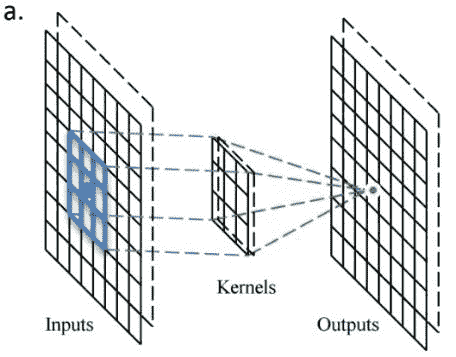
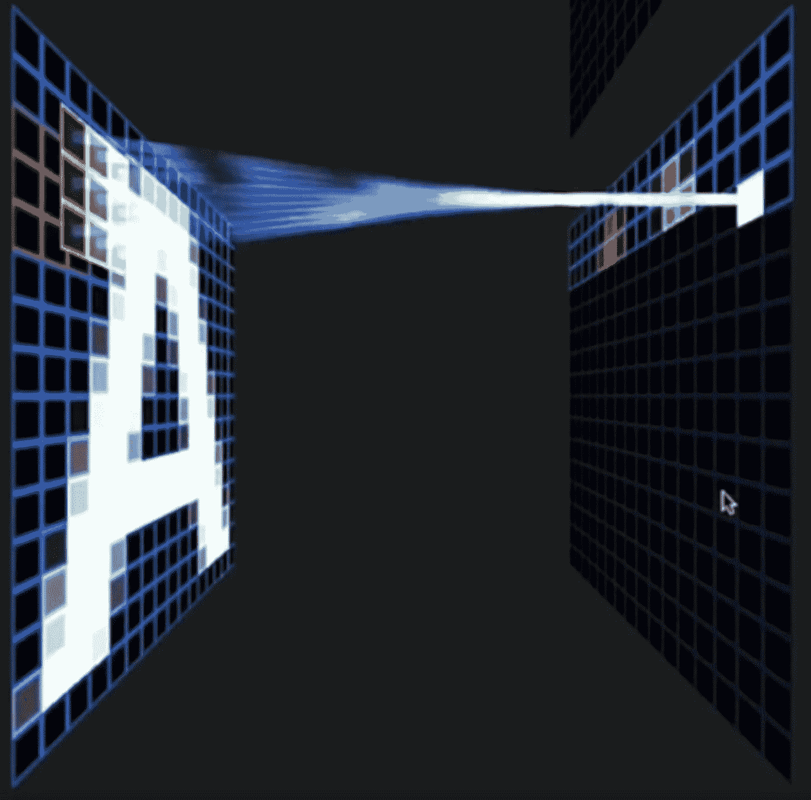
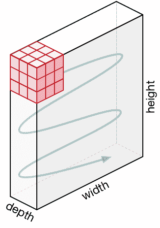

# 卷积神经网络导论

> 原文：<https://towardsdatascience.com/an-introduction-to-convolutional-neural-networks-eb0b60b58fd7?source=collection_archive---------0----------------------->

## 描述什么是卷积神经网络，它们如何工作，如何使用，以及为什么它们如此强大

卷积神经网络(CNN)是一种具有一个或多个卷积层的神经网络，主要用于图像处理、分类、分割以及其他自相关数据。

卷积本质上是在输入上滑动滤波器。考虑卷积的一个有用的方法是引用 Prasad Samarakoon 博士的话:“卷积可以被认为是“观察一个函数的周围环境，以更好/准确地预测其结果”。"

与其一次查看整个图像来寻找某些特征，不如查看图像的较小部分会更有效。

## CNN 的常见用途

CNN 最常见的用途是图像分类，例如识别包含道路的卫星图像或对手写字母和数字进行分类。还有其他相当主流的任务，如图像分割和信号处理，CNN 在这些方面表现良好。

CNN 已经被用于自然语言处理(NLP)和语音识别中的理解，尽管对于 NLP 经常使用递归神经网络(RNNs)。

CNN 也可以被实现为 U-Net 架构，其本质上是两个几乎镜像的 CNN，导致 CNN 的架构可以呈现为 U 形。u-net 用于输出需要与输入大小相似的场合，例如分割和图像改善。

## 除了图像处理，CNN 还有其他有趣的用途

CNN 架构越来越多不同且有趣的用途正在被发现。非图像应用的一个例子是 Lex Flagel 等人的[“卷积神经网络在群体遗传推断中的不合理有效性”](https://www.ncbi.nlm.nih.gov/pubmed/30517664)。这用于执行选择性扫描，寻找基因流，推断群体大小变化，推断重组率。

有一些研究人员，比如 T2 量子生物学实验室的 Gerald Quon 教授，使用 CNN 作为单细胞基因组学的生殖模型来识别疾病。

CNN 也在天体物理学中被用于解释射电望远镜数据，以预测代表数据的可能的视觉图像。

[Deepmind 的 WaveNet](https://deepmind.com/blog/wavenet-generative-model-raw-audio/) 是一个用于生成合成语音的 CNN 模型，用作谷歌助手的语音合成器的基础。

# 卷积核

每个卷积层包含一系列称为卷积核的滤波器。过滤器是一个整数矩阵，用于输入像素值的子集，大小与内核相同。每个像素乘以内核中的相应值，然后将结果相加得到单个值，为简单起见，在输出通道/特征图中表示网格单元，如像素。

这些是线性变换，每个卷积都是一种仿射函数。

在计算机视觉中，输入通常是 3 通道 RGB 图像。为简单起见，如果我们取一个具有一个通道(二维矩阵)和一个 3×3 卷积核(二维矩阵)的灰度图像。内核遍历输入的数字矩阵，逐列水平移动，滑动/扫描包含图像像素值的矩阵的第一行。然后内核垂直向下移动到后续行。注意，过滤器可以一次跨越一个或几个像素，这将在下面进一步详述。

在其他非视觉应用中，一维卷积可以在输入矩阵上垂直滑动。

# 从卷积核创建特征图

下图显示了卷积核的操作。

A stride one 3x3 convolutional kernel acting on a 8x8 input image, outputting an 8x8 filter/channel. Source: [https://www.researchgate.net/figure/a-Illustration-of-the-operation-principle-of-the-convolution-kernel-convolutional-layer_fig2_309487032](https://www.researchgate.net/figure/a-Illustration-of-the-operation-principle-of-the-convolution-kernel-convolutional-layer_fig2_309487032)

下面是一个精彩演示的可视化，展示了内核扫描输入矩阵中的值。

Kernel scanning over the values in the input matrix. Source: Otavio Good: excerpt [https://www.youtube.com/watch?v=f0t-OCG79-U](https://www.youtube.com/watch?v=f0t-OCG79-U) from [https://www.youtube.com/watch?v=Oqm9vsf_hvU](https://www.youtube.com/watch?v=Oqm9vsf_hvU)

# 填料

为了处理边缘像素，有几种方法:

*   丢失边缘像素
*   用零值像素填充
*   反射填充

反射填充是目前最好的方法，卷积核处理边缘像素所需的像素数被添加到外部，从图像边缘复制像素。对于 3x3 内核，需要在外部周围添加一个像素，对于 7x7 内核，则需要在外部周围反射三个像素。每条边周围添加的像素是尺寸，减半并向下取整。

传统上，在许多研究论文中，边缘像素被忽略，这丢失了一小部分数据，并且如果有许多深卷积层，这变得更糟。出于这个原因，我无法找到现有的图表来轻松传达这里的一些要点，而不会误导和混淆步幅 1 卷积和步幅 2 卷积。

使用填充时，宽度为 w、高度为 h 的输入的输出将为宽度为 w、高度为 h(与使用单个输入通道的输入相同)，假设内核一次跨越一个像素。

# 使用多个内核创建多个通道/特征图

当在一个卷积层中应用多个卷积核时，会创建许多通道/特征图，每个卷积核一个。下图显示了正在创建的通道/特征地图。

Visualisation of channels/feature maps created from a layer of convolutional kernels. Source: Otavio Good: excerpt [https://www.youtube.com/watch?v=f0t-OCG79-U](https://www.youtube.com/watch?v=f0t-OCG79-U) from [https://www.youtube.com/watch?v=Oqm9vsf_hvU](https://www.youtube.com/watch?v=Oqm9vsf_hvU)

# RGB 3 通道输入

大多数图像处理需要对具有三个通道的 RGB 图像进行操作。RGB 图像是数字的三维阵列，也称为秩三张量。

当处理三通道 RGB 图像时，通常会使用一个卷积核，它是一个三维数组/秩为 3 的数字张量。卷积核的大小通常为 3x3x 3——卷积核就像一个立方体。

通常至少有三个卷积核，以便每个卷积核可以充当不同的滤波器，以从每个颜色通道获得洞察力。

卷积核作为一个组构成一个四维阵列，也称为秩 4 张量。当维度高于三个维度时，即使不是不可能，也是很难想象的。在这种情况下，把它想象成一个三维立方体的列表。

过滤器以同样的方式在输入数据中移动，滑动或大步跨过行，然后向下移动列并大步跨过行，直到到达右下角:

3x3x3 convolutional kernel acting on a 3 channel input. Source: [https://machinethink.net/images/vggnet-convolutional-neural-network-iphone/ConvolutionKernel@2x.png](https://machinethink.net/images/vggnet-convolutional-neural-network-iphone/ConvolutionKernel@2x.png)

在填充和步长为 1 的情况下，来自宽度 x、高度 y 和深度 3 的输入的输出将是宽度 x、高度 y 和深度 1，因为立方体从每个步长产生单个求和输出值。例如，对于 3×64×64 的输入(例如 64×64 的 RGB 三通道图像)，则一个内核以 1 为步长填充边缘像素，将输出 64×64 的通道/特征图(一个通道)。

值得注意的是，输入通常是标准化的，这将在下面进一步详述。

# 大步

通常使用跨距 2 卷积而不是跨距 1 卷积，其中卷积核一次跨越 2 个像素，例如我们的 3×3 核将从位置(1，1)开始，然后跨距到(1，3)，然后到 1，5)等等，与跨距为 1 的卷积核相比，输出通道/特征图的大小减半。

使用填充，来自宽度为 w、高度为 h、深度为 3 的输入的输出将是宽度为 w/2、高度为 h/2、深度为 1 的上限，因为内核从每个步幅输出单个求和输出。

例如，对于 3×64×64 的输入(例如 64×64 的 RGB 三通道图像)，一个内核采取两个步长并填充边缘像素，将产生 32×32 的通道/特征图。

# 许多内核

在 CNN 模型中，通常有三个以上的卷积核，一个卷积层中有 16 个甚至 64 个核是常见的。

这些不同的卷积核各自充当不同的滤波器，创建代表不同事物的通道/特征图。例如，内核可以过滤顶部边缘、底部边缘、对角线等等。在更深层次的网络中，这些内核可以过滤动物的特征，如眼睛或鸟的翅膀。

卷积核的数量越多，通道/特征图的数量就越多，数据量也越大，这就需要更多的内存。根据上述示例，步长 2 卷积有助于减少内存使用，因为步长 2 卷积的输出通道的宽度和高度是输入通道的一半。这假设使用了反射填充，否则它可能会稍微小一些。

## stride 2 的几个卷积层的示例

对于具有三个通道和 16 个 3x3x3 内核的 64 像素方形输入，我们的卷积层将具有:

*输入*:64×64×3
*卷积核*:16×3×3×3(四维张量)
*卷积核的输出/激活*:16×32×32(16 个通道/32×32 的特征图)

网络然后可以应用批量标准化来减少学习时间和减少过度拟合，更多细节如下。此外，通常应用诸如 RELU 的非线性激活函数，以允许网络更好地逼近，下面有更多细节。

通常有几层 stride 2 卷积，创建越来越多的通道/特征图。以上一层的例子为例:

*输入* : 16x32x32
*卷积核* : 64x3x3x3
*卷积核的输出/激活* : 64x16x16 (64 通道 16x16 的特征图)

然后，在应用 ReLU 和批量标准化(见下文)之后，应用另一个跨距 2 卷积:

*输入*:64×16×16
*卷积核*:128×3×3×3
*卷积核的输出/激活*:128×8×8(8×8 的 128 通道/特征图)。

# 分类

例如，如果一幅图像属于 42 个类别中的一个，并且网络的目标是预测该图像属于哪个类别。

根据上述输出为 128×8×8 的例子，首先取秩 3 张量的平均池。平均池是每个通道的平均，在这个例子中，每个 8×8 矩阵被平均成一个数字，具有 128 个通道/特征图。这创建了 128 个数字，一个大小为 1x128 的向量。

下一层是 128×42 权重的矩阵或秩 2 张量。输入的 1×128 矩阵乘以 128×42 矩阵(点积),产生 1×42 向量。42 个网格单元/向量元素中的每一个的激活程度是预测与该向量元素所代表的分类的匹配程度。Softmax 作为激活函数应用，然后 argmax 选择元素最高值。

# 整流线性单元

整流线性单元被用作非线性激活函数。一个 ReLU 表示如果值小于零，就向上舍入到零。

# 标准化

标准化是减去平均值并除以标准差的过程。它将数据的范围转换为-1 和 1 之间，使数据使用相同的比例，有时称为最小-最大比例。

通常对输入特征进行归一化，通过移除平均值和缩放至单位方差来标准化数据。输入要素以零为中心并且具有相同数量级的方差通常很重要。

对于一些数据，如图像，数据被缩放，使其范围在 0 和 1 之间，最简单的是将像素值除以 255。

这也允许训练过程更快地找到最佳参数。

# 批量标准化

批量规格化的好处在于，有助于使网络输出更稳定的预测，通过规格化减少过度拟合，并将训练速度提高一个数量级。

批次标准化是在当前批次的范围激活层内进行标准化的过程，减去批次激活的平均值并除以批次激活的标准偏差。

这是必要的，因为即使在标准化输入之后，由于一些激活可能更高，这可能导致后续层行为异常并使网络更不稳定。

由于批量归一化已经缩放并移动了激活输出，下一层中的权重将不再是最优的。随机梯度下降(SGD)将取消标准化，因为它将最小化损失函数。

为了防止这种效应，可以向每层添加两个可训练参数，以允许 SGD 对输出进行反规格化。这些参数是平均参数“β”和标准偏差参数“γ”。批量归一化为每个激活输出设置这两个权重，以允许归一化被反转来获得原始输入，这通过避免必须更新其他权重来避免影响网络的稳定性。

# 为什么 CNN 如此强大

简单来说，一个足够大的 CNN 可以解决任何可以解决的问题。

在许多不同的图像处理任务中表现出色的著名 CNN 架构有 VGG 模型(K. Simonyan 和 A. Zisserman)、ResNet 模型(明凯何等人)和谷歌盗梦空间模型(克里斯蒂安塞格迪等人)。这些模型有数百万个可训练的参数。

VGG-16 Network Architecture. Source: [https://neurohive.io/wp-content/uploads/2018/11/vgg16-1-e1542731207177.png](https://neurohive.io/wp-content/uploads/2018/11/vgg16-1-e1542731207177.png)

## 通用逼近定理

通用逼近定理本质上陈述了如果一个问题可以被解决，那么它可以通过深度神经网络来解决，给定足够的仿射函数层与非线性函数层。本质上，一堆线性函数后跟非线性函数可以解决任何可以解决的问题。

实际上，在实施中，这可以是许多矩阵乘法，足够大的矩阵后接 RELU，堆叠在一起，这些具有数学属性，能够以任意高的精度求解任意复杂的数学函数，假设您有时间和资源来训练它。

这是否会给神经网络理解是一个有争议的话题，特别是由认知科学家。论点是，无论你对一个问题的语法和语义理解得多好，你永远也不会理解它。这基本上是塞尔的中国房间论点的基础。有些人会说，如果你能很好地逼近问题的解决方案，与理解问题没有区别，这有什么关系吗？

# Fastai 课程

我要感谢 Fastai 团队，他们的课程帮助巩固了我的深度学习和 CNN 知识，为进一步学习和理解提供了一个极好的起点。