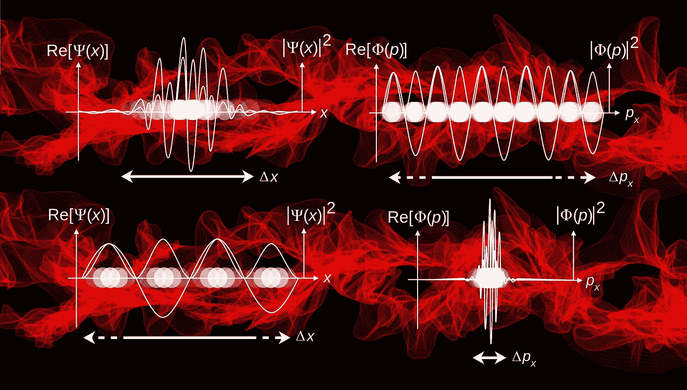
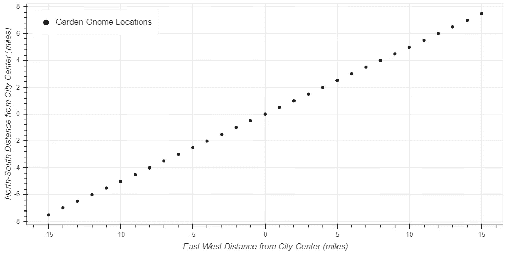
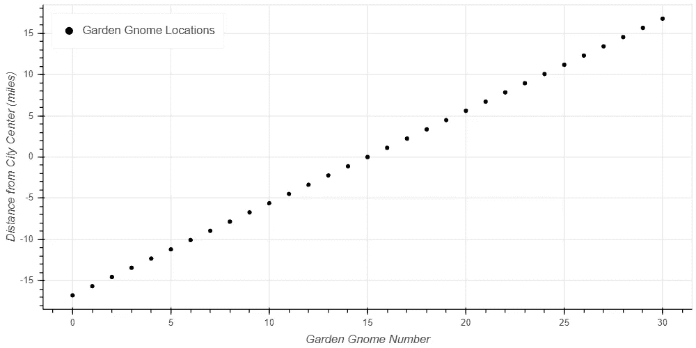

# 降维引论

> 原文：<https://towardsdatascience.com/an-introduction-to-dimenstionality-reduction-8c7d1c80737d?source=collection_archive---------10----------------------->

## 降维如何使您的数据集更易于管理



高维数据集是所有数据科学中最大的挑战之一。挑战很简单。机器学习算法要求数据集是密集的，以便做出准确的预测。随着维度越来越多，数据空间变得极其庞大。巨大的数据空间需要极大的数据集来维持密度。这一挑战可能会导致模型预测不准确(例如，我描述了 k-nearest neighbors 算法如何在 k [-Nearest Neighbors 和维数灾难](/k-nearest-neighbors-and-the-curse-of-dimensionality-e39d10a6105d)中的高维数据空间中变得无用)，或者数据集太大，计算机无法合理处理。

幸运的是，数据科学家已经找到了解决这个问题的方法。这叫降维。降维的本质很简单:你搜索数据集，寻找暗示数据集沿着不同于你最初假设的维度运行的趋势，然后你相应地转换你的数据。通过这种方式，您可以减少数据集中的维数。

## 降维是如何工作的？

降维的工作原理是识别数据集中真正重要的维度。一旦确定了真正重要的维度，您就可以转换数据集，以便沿着这些维度而不是最初显示的维度来表示这些点。

让我们用一个例子来讨论这个问题。在 k[-最近邻居和维度的诅咒](/k-nearest-neighbors-and-the-curse-of-dimensionality-e39d10a6105d)中，我给出了一个有点半开玩笑的花园侏儒分界线的例子。在这个例子中，假设你正在研究一个城市中花园侏儒的位置，并绘制它们。你首先确定城市中每个花园侏儒的纬度和经度，然后将它们绘制成二维图表。这两个维度是南北向和东西向，以距离城市中心的英里数表示。这是一种非常合理的呈现数据的方式，并且只有两个维度就足够了。

然而，假装你是一个完美主义者，希望用尽可能少的维度来呈现数据。你还会注意到，出于某种奇怪的原因，花园侏儒们从城市的东北角到城市的西南角形成了一条近乎完美的直线。数据集不是花园 gnome 位置的云，而是一条线。注意到这一点，你意识到你可以根据东北-西南方向离市中心的距离来绘制每个花园侏儒的位置。这种表示只需要一维。

下一步是执行转换。你需要沿着新的轴计算每个点离城市中心的距离，并声明你的新数据集。新的距离可以用代数方法计算。完成后，可以绘制出最终的剖面图，以一维方式显示您的数据集。

## 这个过程是什么样的？

我们将使用前面的花园 Gnome 分界线的例子来完成这个过程。我将使用 pandas 和 numpy 的功能，用 python 来完成所有这些工作。关于如何使用这些工具的详细说明，我强烈推荐阅读 Wes McKinney 的 [Python for Data Analysis(韦斯是熊猫的创造者，所以你可以打赌他知道他在说什么。我将使用 python 包 bokeh 生成图。关于这个包的有用介绍可以在](https://www.amazon.com/gp/product/1491957662/ref=as_li_tl?ie=UTF8&camp=1789&creative=9325&creativeASIN=1491957662&linkCode=as2&tag=petergrantpub-20&linkId=5618a11d4981bc89d1a94f420f60e7e7)[用散景进行数据可视化的实践](https://www.amazon.com/gp/product/B07DWG4T95/ref=as_li_tl?ie=UTF8&camp=1789&creative=9325&creativeASIN=B07DWG4T95&linkCode=as2&tag=petergrantpub-20&linkId=1730c8c31237e6d84168ea0bff730b8c)中找到。

我在一个名为 GardenGnomeLocations 的熊猫数据框架中构建了我的数据集。它有一个包含 31 个条目的索引，以及代表每个花园侏儒在南北轴和东西轴上的位置的列。这些列被命名为“南北(mi)”和“东西(mi)”。

图 1 展示了原始数据集，显示了城市中每个花园侏儒沿南北和东西轴的位置。每个圆圈代表一个花园侏儒相对于市中心的位置。请注意数据中呈现的上述趋势；出于某种神秘的原因，花园侏儒的位置是一条从城市东北角到城市西南角的直线。



Figure 1: Location of Each Garden Gnome in the City Using the North-South and East-West Axes

一旦注意到这种趋势，很明显花园侏儒的位置确实可以用一个单一的维度，一个单一的轴来呈现。我们可以利用这些知识创建一个新的轴，东北-西南轴(或者，我喜欢称之为花园侏儒分界线)。然后，数据可以在一个维度上显示，即沿该轴到市中心的距离。

为了执行这种转换，我们在每个数据点上使用勾股定理。为了计算每个花园侏儒沿新轴到市中心的距离，我们需要使用 for 循环、pandas.loc 函数、math.sqrt 函数和一些代数表达式。计算新距离并将其添加到数据框中的“距离(mi)”列的代码如下:

```
for i in GardenGnomeLocations.index: GardenGnomeLocations.loc[i, 'Distance (mi)'] =      math.sqrt(GardenGnomeLocations.loc[i, 'NorthSouth (mi)'] ** 2 + GardenGnomeLocations.loc[i, 'EastWest (mi)'] ** 2) if GardenGnomeLocations.loc[i, 'NorthSouth (mi)'] < 0: GardenGnomeLocations.loc[i, 'Distance (mi)'] = -1 * GardenGnomeLocations.loc[i, 'Distance (mi)']
```

代码块顶部的 for 循环告诉脚本对 GardenGnomeLocations 数据帧中的每一行执行此计算，并使用变量 I 跟踪它在数据帧中的位置。第二行执行实际的计算，并将数据存储在 dataframe 中的适当位置。您会注意到，这个等式归结为 c = sqrt(a + b)，这是勾股定理的常见形式。第一个术语 GardenGnomeLocations.loc[i，' Distance (mi)']告诉 python 我们将要计算的值应该放在 GardenGnomeLocations 数据帧中' Distance (mi)'列的第 I 行。等式的另一边使用“南北(mi)”和“东西(mi)”列中的相应数据来计算结果。请记住，勾股定理只会返回距离的绝对值。为了克服这一点，我们添加了最后两行代码。第一个确定原始数据点的值是正还是负。如果原始值为负，则第二个函数将距离乘以-1，使其为负。

绘制这些数据的结果如图 2 所示。数据看起来非常相似，因为这个图是二维的，但是注意这里的轴。图 2 显示了每个侏儒的位置，而不是用南北轴和东西轴来表示，而是用离市中心的距离来表示。在一维空间。



Figure 2: Location of Each Garden Gnome in the City Using the Distance

这种缩减到一个维度的做法使得数据集更容易使用。需要更少的点来确保数据集足够密集以返回准确的预测。更少的数据点意味着相同质量结果的计算时间减少。一些算法，如 k-最近邻算法，比使用更高的维度更有可能返回有用的结果。

然而，这种转变确实增加了解释数据的难度。最初，数据很容易理解；每个数据点都用我们常用的术语表示花园侏儒的位置。我们可以确定南北距离，东西距离，并简单的使用。现在，我们离市中心有一段距离，但数据并没有明确指出方向。为了理解这些数据，我们必须保留所有先前的数据集和算法。通过这种方式，我们可以在以后将新轴的数据转换回原始轴，这样就可以很容易地理解和使用它。

## 真的这么简单吗？

不幸的是，没有。事情没那么简单。这是一个过于简化、有些滑稽的例子，旨在演示基本概念。在现实中，没有一个数据集会像这个数据集那样沿着一条完美的直线运行，也不可能简单地使用勾股定理来转换数据。真实的数据集看起来更像隐藏着模糊趋势的数据云，您需要使用一种称为主成分分析的技术来转换数据。这项技术超出了这篇介绍性文章的范围，但是乔尔·格罗出色地演示了如何从零开始在[数据科学中实现它。](https://www.amazon.com/gp/product/1492041130/ref=as_li_tl?ie=UTF8&camp=1789&creative=9325&creativeASIN=1492041130&linkCode=as2&tag=petergrantpub-20&linkId=14af0a99fb1fa5304b60064bb3c1274f)

## 包装它

高维数据集给数据科学家带来了严峻的挑战。随着维度数量的增加，数据空间也在增加。随着越来越多维度的加入，空间变得异常巨大。这种巨大的空间使得大多数机器学习算法很难发挥作用，因为数据集中的差距呈现出模型无法匹配的区域。一些算法，如[k-最近邻算法](/introducing-k-nearest-neighbors-7bcd10f938c5)，特别敏感，因为它们要求数据点在每个维度的[T5 接近，这在有多个维度](/k-nearest-neighbors-and-the-curse-of-dimensionality-e39d10a6105d)时变得非常罕见。

维度问题的明显解决方案是更大的数据集。这可以用来保持数据密度；然而，非常大的数据空间需要非常大的数据集。这些数据集可能会变得太大，超过计算机执行必要计算的能力。在这种情况下，解决方案是应用降维。

降维是指注意到数据点与最初使用的数据点沿不同的轴对齐，并转换数据集以沿这些轴呈现它们。我们用遍布整个城市的花园侏儒的例子来证明这一点。最初，它们被绘制在直观的南北轴和东西轴上。然而，在检查了这些数据后，很明显它们是沿着一条从城市东北角到西南角的独立轴线排列的。翻译数据集相应地将数据集从一维减少到二维。虽然这是一个小例子，但原理可以应用于更大的数据集。