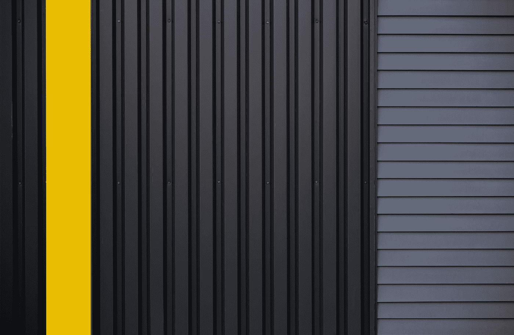
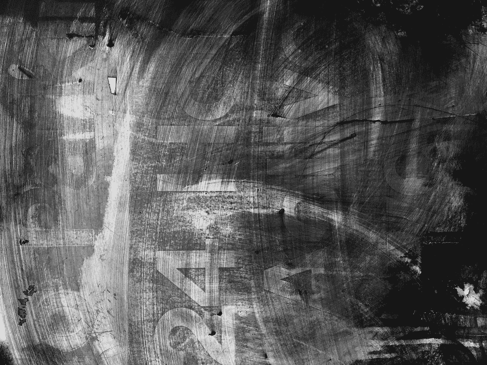

# 数据科学家的离散化技术介绍

> 原文：<https://towardsdatascience.com/an-introduction-to-discretization-in-data-science-55ef8c9775a2?source=collection_archive---------5----------------------->


Photo by [Kevin Ku](https://www.pexels.com/@kevin-ku-92347?utm_content=attributionCopyText&utm_medium=referral&utm_source=pexels) from [Pexels](https://www.pexels.com/photo/coding-computer-data-depth-of-field-577585/?utm_content=attributionCopyText&utm_medium=referral&utm_source=pexels)

## 特征工程:要学习的 4 种离散化技术。

离散化是我们将连续变量、模型或函数转换成离散形式的过程。我们通过创建一组连续的区间(或箱)来做到这一点，这些区间跨越了我们期望的变量/模型/函数的范围。

> ***连续数据*** *是*测得的，*是* ***离散数据*****是*算出的。*

# *|| I ||为什么离散化很重要*

*有连续数据的数学问题有无穷多个自由度。由于我们的计算不可能永远进行下去，所以这样的问题必然要求有限的自由度。出于多种原因，数据科学家需要使用离散化。Kaggle 上的许多顶级贡献使用离散化，原因如下:*

**

*Photo by [Ryoji Iwata](https://unsplash.com/@ryoji__iwata?utm_source=medium&utm_medium=referral) on [Unsplash](https://unsplash.com?utm_source=medium&utm_medium=referral)*

## *符合问题陈述*

*通常，将连续数据(如体重)划分并存储到有意义的类别或组中会更容易理解。比如我们可以把一个连续变量，体重，分成以下几组来存储:
***100 磅以下*** *(轻)，140–160 磅之间* *(中)，200 磅以上* *(重)**

*如果我们看不到属于同一权重类别的变量之间的客观差异，我们将认为该结构是有用的。
在我们的例子中，85 磅*和 56 磅*的重量传达了相同的信息(物体很轻)。因此，如果数据符合问题陈述，离散化有助于使我们的数据更容易理解。*

**

*Photo by [William Daigneault](https://unsplash.com/@williamdaigneault?utm_source=medium&utm_medium=referral) on [Unsplash](https://unsplash.com?utm_source=medium&utm_medium=referral)*

## *解释特征*

*由于具有无限的自由度，连续特征与目标变量关联的机会较小，并且可能具有复杂的非线性关系。因此，可能更难解释这样的函数。在离散化变量之后，可以解释对应于目标的组。*

**

*Photo by [Franck V.](https://unsplash.com/@franckinjapan?utm_source=medium&utm_medium=referral) on [Unsplash](https://unsplash.com?utm_source=medium&utm_medium=referral)*

## *与模型/方法不兼容*

*某些模型可能与连续数据不兼容，例如，替代决策树模型(如随机森林模型)不适合连续特征。*

*特征工程方法，例如任何基于熵的方法可能无法处理连续数据，因此我们将离散化变量以处理不同的模型和方法。*

**

*Photo by [Mariano Werneck](https://unsplash.com/@mwerneck?utm_source=medium&utm_medium=referral) on [Unsplash](https://unsplash.com?utm_source=medium&utm_medium=referral)*

## *信噪比*

*当我们离散化一个模型时，我们将它拟合到箱中，并减少数据中小波动的影响。通常，我们会将微小的波动视为噪声。我们可以通过离散化来减少这种噪声。这是“平滑”的过程，其中每个箱平滑波动，从而减少数据中的噪声。*

# *|| II ||离散化方法*

*   *无监督:
    —等宽
    —等频
    — K 均值*
*   *监督:
    —决策树*

# *|| III ||等宽离散化*

*将所有可能的值分成“ **N** 个仓，每个仓具有相同的宽度。间隔宽度的公式:*

***Width =(最大值-最小值)/ N** **其中 N 是仓或区间的数量。**

*在 python 上，您可能希望导入以下内容进行离散化:*

```
*from sklearn.preprocessing import KBinsDiscretizer
from feature_engine.discretisers import EqualWidthDiscretiser*
```

*按照以下方式设置等宽离散化器:*

```
*discretizer = EqualWidthDiscretiser(bins=10, variables = ['var1', 'var2'])#OR discretizer = KBinsDiscretizer(n_bins=10, encode='ordinal', strategy='uniform')*
```

*   *相等的宽度不会改善值的分布*
*   *它可以处理异常值*
*   *可以与分类编码结合使用*

# *|| IV ||等频离散化*

*将所有可能的值分成数量为“ **N** 的箱，每个箱具有相同数量的观察值。区间可以对应于分位数值。*

*在 python 上，您可能希望导入以下内容进行离散化:*

```
*from sklearn.preprocessing import KBinsDiscretizer
from feature_engine.discretisers import EqualFrequencyDiscretiser*
```

*按照以下方式设置等频离散化器:*

```
*discretizer = KBinsDiscretizer(n_bins=10, encode='ordinal', strategy='quantile')#OR discretizer = EqualFrequencyDiscretiser(q=10, variables = ['var1', 'var2'])*
```

*   *相等的频率确实提高了值的分布*
*   *它可以处理异常值*
*   *可以与分类编码结合使用*

# *| | V | | K-均值离散化*

*我们将 K 均值聚类应用于连续变量，从而将其划分为离散的组或聚类。*

*在 python 上，您可能希望导入以下内容以使用 K-means 进行离散化:*

```
*from sklearn.preprocessing import KBinsDiscretizer*
```

*按照以下方式设置 K 均值离散化器:*

```
*discretizer = KBinsDiscretizer(n_bins=5, encode='ordinal', strategy='kmeans')*
```

*   *K-Means 并不能提高价值传播*
*   *它可以处理异常值，但是可能存在质心偏差。*
*   *可以与分类编码结合使用*

# *|| VI ||决策树离散化*

*我们使用决策树来确定箱的最佳数量。当模型做出决定时，它为每个节点分配一个观察值。然后，这些观察结果被分类为变量的离散输出。*

*在 python 上，您可能希望导入以下内容以使用决策树进行离散化:*

```
*from sklearn.model_selection import train_test_split
from feature_engine.discretisers import DecisionTreeDiscretiser*
```

*您的离散化器应按以下方式设置:*

```
*# cross-validation number (cv)
# how to evaluate model performance (scoring)
# the variables we want to discretise (variables)
# whether it is a target for regression or classification
# and the grid with the parameters we want to testtreeDisc = DecisionTreeDiscretiser(cv=10, scoring='accuracy',
                                   variables=['var1', 'var2'],
                                   regression=False,
                                   param_grid={'max_depth': [1,2,3],
'min_samples_leaf':[10,4]})*
```

*   *决策树不能提高价值分布*
*   *它可以很好地处理异常值，因为树对于异常值是健壮的。*
*   *创建单调的关系*

# *|| VII ||下一步*

*离散化变量后，您可以执行以下任一操作:*

*   *构建决策树算法并直接使用离散化的输出作为箱的数量。决策树可以发现离散化变量和目标变量之间的非线性关系。*
*   *使用线性模型，而箱与目标变量没有线性关系。通过将箱子视为具有某种编码的类别来改进模型。*

> *感谢你的阅读！*
> 
> *关注我，了解更多关于数据科学的内容。*