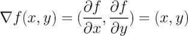
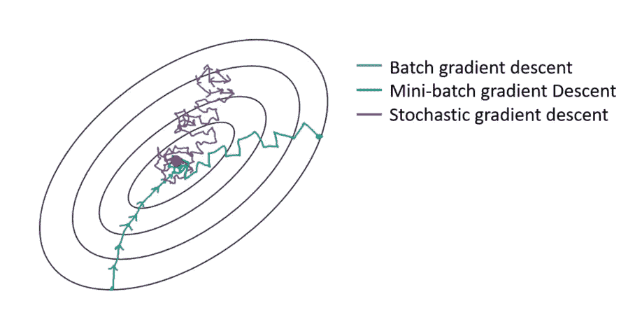

# 梯度下降导论

> 原文：<https://towardsdatascience.com/an-introduction-to-gradient-descent-c9cca5739307?source=collection_archive---------6----------------------->

## 机器学习和深度学习之旅

## 从理论到实践，在数据集上实现批量梯度下降、小批量梯度下降和随机梯度下降

本博客将涵盖以下问题和主题:

1.什么是渐变？

2.什么是梯度下降？

3.三种常见的梯度下降

4.用 Python 实现

**1。梯度**

梯度是一个向量，它与一个函数相切，并指向该函数最大增长的方向。梯度在局部最大值或最小值处为零，因为没有单一的增加方向。在数学中，梯度被定义为函数的每个输入变量的偏导数。例如，我们有一个函数:


函数的图形如下所示，我们可以看到函数的最小值是(0，0)。


在这种情况下，梯度的 x 分量是相对于 x 的偏导数，梯度的 y 分量是相对于 y 的偏导数。上述函数的梯度为:


如果我们想找到在点(1，2)处增加函数最多的方向，我们可以将(1，2)代入上面的公式，得到:


**2。梯度下降**

由于梯度是指向函数最大增量的向量，负梯度是指向函数最大减量的向量。因此，我们可以通过向负梯度方向迭代移动一点来最小化一个函数。这就是梯度下降的逻辑。

给定一个起点:


我们可以构建一个迭代过程:


…


上式中的参数α被称为学习率，它在大多数情况下是一个小常数，范围从 0 到 1。迭代过程不会停止，直到它收敛。以前面的例子为例，我们已经知道梯度是:



因此，梯度下降的迭代过程可以写成:


那么我们可以得到:


最后，假设α小于 1，那么我们可以得到:


结论与我们在上图中观察到的一样。

解释梯度下降的另一种直观方式是在函数的上下文中考虑下面的三维图形。我们的目标是从右上角的山移动到左下角的深蓝色的海。箭头代表从任何给定点开始的最陡下降方向(负梯度)——尽可能快地降低函数的方向。”[3]


Image Source: [https://ml-cheatsheet.readthedocs.io/en/latest/gradient_descent.html](https://ml-cheatsheet.readthedocs.io/en/latest/gradient_descent.html)

在机器学习中，我们更关注代价函数和参数之间的关系，而不是因变量和自变量。机器学习中梯度下降的一般思想是迭代地调整参数，以便最小化成本函数。


Image Source: [https://saugatbhattarai.com.np/what-is-gradient-descent-in-machine-learning/](https://saugatbhattarai.com.np/what-is-gradient-descent-in-machine-learning/)

在某些情况下，我们可以应用封闭形式的方程来直接计算最适合模型训练数据集的参数。例如，为了最小化线性回归的 MSE，参数可以写成:


然而，在其他情况下，我们没有封闭形式的方程，如逻辑回归。因此，应用类似梯度下降的迭代优化方法。

梯度下降中的一个重要参数是学习率，它决定了每一步的大小。当学习率太大时，梯度下降可能会跳过山谷，到达另一边。这将导致成本函数发散。另一方面，当学习率太小时，算法需要很长时间才能收敛。因此，在梯度下降开始之前，需要适当的学习速率。


Image Source: [https://towardsdatascience.com/gradient-descent-in-a-nutshell-eaf8c18212f0](/gradient-descent-in-a-nutshell-eaf8c18212f0)

归一化对梯度下降起着重要作用。如果特征没有被归一化，则具有大规模的特征将在更新中占主导地位，因此该算法将生成之字形学习路径。要达到最小值需要很多不必要的步骤和更长的时间。在所有特征被归一化之后，成本函数是更接近球形的形状。梯度下降算法直接走向最小值。执行标准化的一种方法是减去平均值并除以标准偏差。也可以直接在 Scikit-Learn 中应用 StandardScaler 函数。


Image Source: [https://www.jeremyjordan.me/batch-normalization/](https://www.jeremyjordan.me/batch-normalization/)

**3。三种典型的梯度下降**

我们将研究在机器学习中广泛使用的梯度下降的几种变体:批量梯度下降、小批量梯度下降和随机梯度下降。

**批量梯度下降**

批量梯度下降在每一步都使用整批训练数据。它计算每条记录的误差，并取平均值来确定梯度。分批梯度下降法的优点是计算效率更高，产生稳定的学习路径，更容易收敛。但是，当训练集很大时，批量梯度下降需要更长的时间。

**随机梯度下降**

在另一种极端情况下，随机梯度下降法在每一步只从训练集中选取一个实例，并只根据该单个记录更新梯度。随机梯度下降的优点是算法在每次迭代时都快得多，这弥补了批量梯度下降的局限性。然而，与批量梯度下降相比，该算法产生的学习路径不太规则和稳定。成本函数不是平滑递减，而是上下跳动。经过多轮迭代后，算法可能会找到一个好的参数，但最终结果不一定是全局最优的。

**小批量梯度下降**

小批量梯度下降结合了批量和随机梯度下降的概念。在每一步，该算法基于训练集的子集而不是完整数据集或仅一个记录来计算梯度。小批量梯度下降法的优点是算法在计算过程中可以利用矩阵运算，并且代价函数比随机梯度下降法下降得更平稳。



Image Source: [https://towardsdatascience.com/gradient-descent-algorithm-and-its-variants-10f652806a3](/gradient-descent-algorithm-and-its-variants-10f652806a3)

**4。用 Python 实现**

在这一部分中，我将使用著名的数据集 iris 来展示梯度体面如何在逻辑回归中工作。

首先，导入包。

```
*from sklearn import datasets
import numpy as np
import pandas as pd
import matplotlib.pyplot as plt
import matplotlib.lines as mlines*
```

接下来，加载数据。注意，为了简单起见，我只选择 2 种虹膜。

```
# Load data
iris = datasets.load_iris()
X=iris.data[0:99,:2]
y=iris.target[0:99]# Plot the training points
x_min, x_max = X[:, 0].min() - .5, X[:, 0].max() + .5
y_min, y_max = X[:, 1].min() - .5, X[:, 1].max() + .5plt.figure(2, figsize=(8, 6))
plt.clf()plt.scatter(X[:, 0], X[:, 1], c=y, cmap=plt.cm.Set1,edgecolor='k')
plt.xlabel('Sepal length')
plt.ylabel('Sepal width')
plt.xlim(x_min, x_max)
plt.ylim(y_min, y_max)
```


批量梯度下降

```
# Function for batch gradient decent    
def Batch_GD (Learning_Rate,num_iterations,X,y):
    #Step 1: Initial Parameter
    N=len(X)
    w=np.zeros((X.shape[1],1))
    b=0
    costs=[]
    # Starting Loop
    for i in range(num_iterations):
        #Step 2: Apply Sigmoid Function and get y prediction
        Z=np.dot(w.T,X.T)+b
        y_pred=1/(1+1/np.exp(Z))

        #Step 3: Calculate Loss Function
        cost=-(1/N)*np.sum(y*np.log(y_pred)+(1-y)*np.log(1-y_pred))

        #Step 4: Calculate Gradient
        dw=1/N*np.dot(X.T,(y_pred-y).T)
        db=1/N*np.sum(y_pred-y)

        #Step 5: Update w & b
        w = w - Learning_Rate * dw
        b = b - Learning_Rate * db

        # Records cost
        if i % 1000 == 0:
            costs.append(cost)
            #print(cost)
    return(w,b,costs)# Run a function
Result_BatchGD=Batch_GD(Learning_Rate=0.01,num_iterations=100000,X=X,y=y)
```

随机梯度下降

```
# Function for Stochastic Gradient Descent       
def Stochastic_GD (Learning_Rate,num_iterations,X,y):
    # Step 1: Initial Parameter
    N=len(X)
    w=np.zeros((X.shape[1],1))
    b=0
    costs=[]
    # Starting two layer of loops
    for i in range(num_iterations):
        for j in range(N):
            # Choose 1 record
            XX=X[j,:]
            yy=y[j]
            # Step 2: Apply Sigmoid Function and get y prediction
            Z=np.dot(w.T,XX.T)+b
            y_pred=1/(1+1/np.exp(Z))
            #Step 3: Calculate Loss Function
            cost=-(yy*np.log(y_pred)+(1-yy)*np.log(1-y_pred))
            #Step 4: Calculate Gradient
            dw=np.multiply(XX,(y_pred-yy)).reshape((2,1))
            db=y_pred-yy
            #Step 5: Update w & b
            w = w - Learning_Rate * dw
            b = b - Learning_Rate * db

        #Step 6: Calculate Loss Function       
        Z_full=np.dot(w.T,X.T)+b
        y_pred_full=1/(1+1/np.exp(Z_full))
        cost=-(1/N)*np.sum(y*np.log(y_pred_full)+(1-y)*np.log(1-y_pred_full))
        #Records cost
        if i % 100 == 0:
            costs.append(cost)
            #print(cost)

    return(w,b,costs)# Run a function
Result_Stoc_GD=Stochastic_GD(Learning_Rate=0.01,num_iterations=2000,X=X,y=y)
```

小批量梯度下降

```
# Function for mini batch Gradient Descent
def Minibatch_GD (Learning_Rate,num_iterations,X,y,Minibatch):
    # Part 1: Mini Batch 
    np.random.seed(1000)
    N=len(X)
    mini_batches=[]

    #Step 1: Shuffle (X,y)
    permutation=list(np.random.permutation(N))
    shuffled_X=X[permutation,:]
    shuffled_y=y[permutation]

    #Step 2: Partition
    num_complete_minibatches=int(np.floor(N/Minibatch))

    for i in range(num_complete_minibatches):
        mini_batch_X=shuffled_X[i*Minibatch:(i+1)*Minibatch,:]
        mini_batch_y=shuffled_y[i*Minibatch:(i+1)*Minibatch]

        mini_batch = (mini_batch_X, mini_batch_y)
        mini_batches.append(mini_batch)

    if N % Minibatch !=0:
        mini_batch_X=shuffled_X[N-Minibatch:N,:]
        mini_batch_y=shuffled_y[N-Minibatch:N]

        mini_batch = (mini_batch_X, mini_batch_y)
        mini_batches.append(mini_batch)

    # Part 2: Gradient Descent
    w=np.zeros((X.shape[1],1))
    b=0
    costs=[]

    for i in range(num_iterations):
        for j in range(num_complete_minibatches+1):
            #Select Minibatch
            XX=mini_batches[j][0]
            yy=mini_batches[j][1]
            #Step 2: Apply Sigmoid Function and get y prediction
            Z=np.dot(w.T,XX.T)+b
            y_pred=1/(1+1/np.exp(Z))

            #Step 3: Calculate Gradient
            dw=1/Minibatch*np.dot(XX.T,(y_pred-yy).T)
            db=1/Minibatch*np.sum(y_pred-yy)
            #Step 4: Update w & b
            w = w - Learning_Rate * dw
            b = b - Learning_Rate * db

        #Step 5: Calculate Loss Function       
        Z_full=np.dot(w.T,X.T)+b
        y_pred_full=1/(1+1/np.exp(Z_full))
        cost=-(1/N)*np.sum(y*np.log(y_pred_full)+(1-y)*np.log(1-y_pred_full))

        if i % 1000 ==0:
            costs.append(cost)
            #print(cost)

    return(w,b,costs)# Run a function
Result_MiniGD=Minibatch_GD(Learning_Rate=0.01,num_iterations=100000,X=X,y=y,Minibatch=50)
```

可视化结果

```
# Plot linear classification
fig, ax = plt.subplots()
ax.scatter(X[:, 0], X[:, 1], c=y, cmap=plt.cm.Set1,edgecolor='k')
line_B_GD=mlines.Line2D([0,7],[-0.5527,4.1577],color='red')
line_Mini_GD=mlines.Line2D([0,7],[-0.56185,4.1674],color='blue')
line_Sto_GD=mlines.Line2D([0,7],[-0.5488,4.1828],color='green')
ax.add_line(line_B_GD)
ax.add_line(line_Mini_GD)
ax.add_line(line_Sto_GD)
ax.set_xlabel('Sepal length')
plt.show()
```


从上图可以看出，三种梯度下降产生了相似的线性决策边界。

**总结**

在这篇文章中，你学到了很多关于梯度下降的知识。你现在知道了梯度背后的基本数学，并且理解了算法是如何在幕后工作的。第二，你了解了为什么学习速率和规范化对算法的成功如此重要。最后，您了解了最常见的梯度下降类型以及如何在 python 中实现这些算法。这些知识使你能够更好地理解机器学习和深度学习。你可以点击以下链接阅读更多博客:

[](https://medium.com/@songyangdetang_41589/table-of-contents-689c8af0c731) [## 机器学习和深度学习之旅

### 这一系列博客将从理论和实现两个方面对深度学习进行介绍。

medium.com](https://medium.com/@songyangdetang_41589/table-of-contents-689c8af0c731) 

参考

[1] Aurélien Géron，使用 Scikit-Learn & TensorFlow 进行机器学习，2018 年

[2]伊恩·古德费勒，约舒阿·本吉奥，亚伦·库维尔，(2017) *深度学习*

[3][https://ml-cheat sheet . readthedocs . io/en/latest/gradient _ descent . html](https://ml-cheatsheet.readthedocs.io/en/latest/gradient_descent.html)