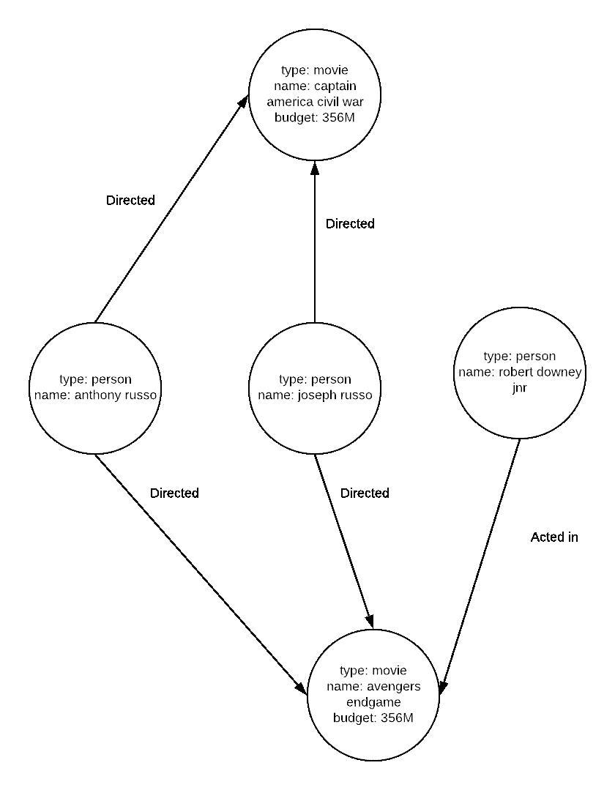
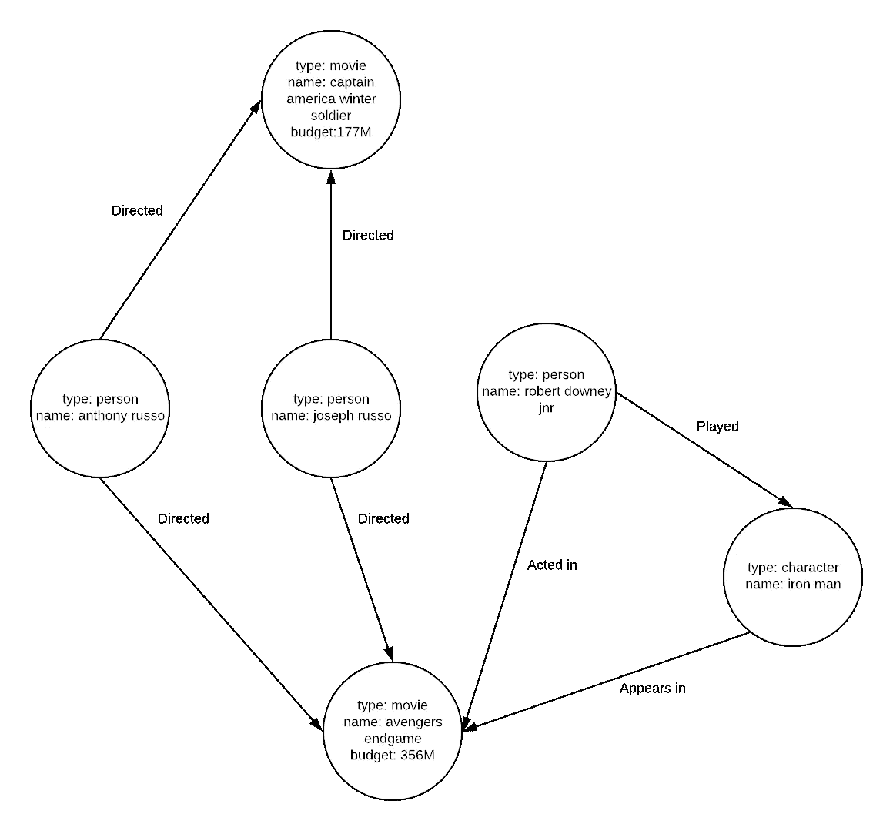
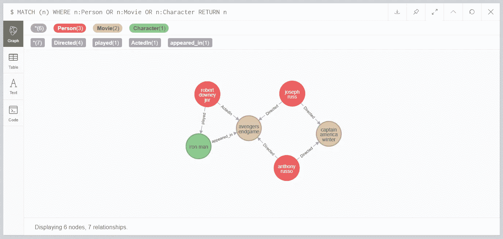
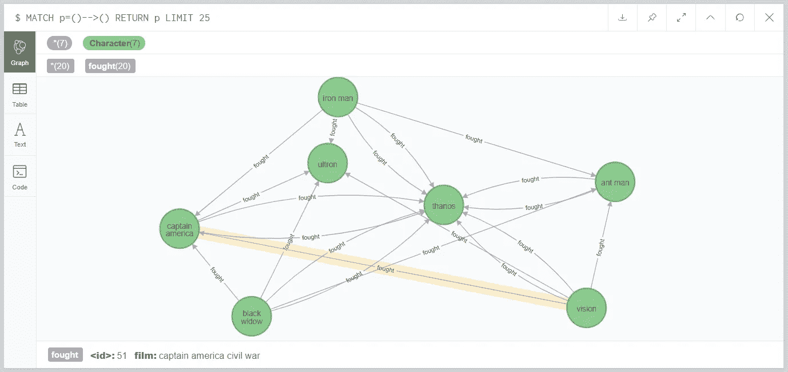

# 图形数据库简介

> 原文：<https://towardsdatascience.com/an-introduction-to-graph-databases-cd81a0d5aa12?source=collection_archive---------11----------------------->

## 用 Neo4j 建模高度相关的数据

在过去的几年里，我们看到了数据库中新范例的激增。以前，以微软的 SQLServer 或 Oracles MySQL 为代表的关系数据库管理系统(RDBMS)一直是那些寻找数据库的人的*事实上的*路线。我谈到了这样做的原因，并在我的[早期作品](https://medium.com/@johnclarke_82232/comparing-the-most-common-nosql-database-types-d6d54d538ba2)中看到了一些更新的或者重新发现的替代方案；在这篇文章中，我将深入探讨其中的一个，图形数据库，探索它们能做什么，并展示一些它们闪光的用例。

## 什么是图？

图形数据库，顾名思义，以图形的形式组织数据，基于[图论](https://en.wikipedia.org/wiki/Graph_theory)的数学原理。从根本上说，我们可以把一个图看作是节点和边的集合。节点通常表示实体，边用于表示这些实体之间的关系。就数据库而言，这一点对我们非常有用，因为节点可以保存描述实体的数据，但是边也可以保存描述关系的性质和细节的数据。这些数据可能和关系类型一样简单，也可能更详细。

让我们看一个示例图，看看它是什么样子的。

A simple ‘movie’ graph

在这个图表中，我们可以看到我们描述了许多不同类型的实体。我们有“人”，他们有典型的属性，如姓名和性别，还有“电影”，他们有一个标题，上映日期和预算。这些在图中用气泡表示。

连接气泡给出图形结构的是边。这些描述了链接节点之间的关系；例如，我们可以看到由安东尼和约瑟夫·鲁索执导的《复仇者联盟 4：终局之战》,他还执导了《美国队长:冬日战士》,而最后一部由小罗伯特·唐尼主演。

图的一个重要方面是它们天生是弱模式化的，或者说是无模式的。这意味着久而久之，我们希望扩展图形以容纳不同类型的实体和数据，我们可以简单地创建描述它们的节点，而不破坏我们已经拥有的或必须对数据库进行复杂的模式更改。

例如，下图显示了用“字符”类型扩展的上述 MCU 图，以及“出现在”和“播放”关系。

Extended example MCU graph

现在我们有了数据和建模的关系，我们可以开始查看可以用来从图表中提取信息的查询类型。除了简单和常见的“查找所有导演”或“查找小罗伯特·唐尼主演的所有电影的总预算”之外，我们还可以基于关系计算更复杂的数据集。例如，我们可以很快找到所有由约瑟夫和安东尼·罗素执导、小罗伯特·唐尼出演钢铁侠的电影。显然，我们可以构建一个模式，允许我们在其他形式的数据库中做同样的事情，包括传统的 RDBMS 然而，当我们看 Neo4j 时，我们会看到它在图形数据库中既简单又快速。这些是典型的使用案例，其中图形数据库是一个很好的选择。

# 输入 Neo4j

eo4j 是卓越的图形数据库引擎，提供 ACID 事务和本地图形数据存储和处理。它既有免费使用的开源版本，也有商业企业许可版本。开源版本仅支持单节点，而企业版同时支持集群和热备份支持。两个版本都支持 Cypher 查询语言，该语言旨在使用“ASCII-art”风格的语法，使图形数据的存储和查询尽可能简单和合理。

## 在 Neo4j 中构建我们的 MCU 示例

首先，假设你有运行的 [Neo4j，或者你正在使用他们提供的](https://neo4j.com/docs/operations-manual/current/installation/)[在线沙盒](https://neo4j.com/sandbox-v2/)，我们需要创建我们的图表。我们有几个选择，我们可以通过使用一系列离散的 Cypher 操作(反映应用程序如何在数据库中创建数据)来创建数据，我们可以使用 Cypher 从 CSV 或 JSON 等文件中加载数据，或者我们可以使用 Neo4j 的内置 ETL 功能从 JDBC 连接的 RDBMS 中加载数据。

让我们快速地看一下 couple，首先使用文件导入来创建我们看到的第一个例子中显示的数据。

首先，我们需要 CSV 文件中的图表数据，你可以在我的 [GitHub](https://github.com/TheMagoo73/neo4j-mcu/) 中找到一组数据。我们可以从 GitHub 直接使用这些，使用下面的密码导入它们并构建我们的初始图。请注意，您需要单独运行每个命令。

首先，我们根据每种类型的 CSV 文件为人物和电影创建节点。然后，我们加载定义关系的 CSV，并通过匹配节点来创建合适的关系。最后，因为`id`字段只需要从非关系文件中构建关系，所以我们将它从节点中移除。这对于图数据库来说是一件关键的事情——因为关系是一等公民，我们不再需要担心 id 来创建外键了(耶！).

现在我们已经有了初始数据，让我们运行一些 Cypher 操作，将它扩展到第二个例子中显示的完整图形。首先，我们可以运行下面的代码来创建我们的第一个角色

`CREATE (character:Character {name: "iron man"})`

然后我们可以把他和一些关系联系起来:

`MATCH (person:Person {name: "robert downey jnr"}), (character:Character {name: "iron man"}) CREATE (person)-[:played]->(character)`

`MATCH (character:Character {name: "iron man"}), (movie:Movie {name: "avengers endgame"}) CREATE (character)-[:appeared_in]->(movie)`

一旦我们做到了这一点，我们就可以使用 Neo4j 的内置浏览器来查询图表，并检查我们有什么

A small part of the MCU in Neo4j

## 运行一些查询

现在我们已经构建了我们的图表，让我们来看看我们可以使用 Cypher 创建的一些查询来探索它。您可以在 Neo4j 提供的浏览器中直接运行这些来查看结果。

首先，让我们看看我们能找到什么关于复仇者联盟的结局

`MATCH (m:Movie {name: "avengers endgame"}) RETURN m`

这将返回图形中所有类型为 Movie、名称为“avengers endgame”的节点。在传统的 RDBMS 中，这很可能是一个`SELECT * FROM t WHERE x = y`风格的查询。

现在让我们看看更复杂的东西，让我们找到约瑟夫·罗素执导的所有电影

`MATCH m=(p:Person {name: “joseph russo"})-[r:Directed]->() RETURN m`

该查询将返回美国队长冬季士兵和复仇者联盟 Engame。同样，我们可以在 RDBMS 中使用带有外键的三个表来建模，然后创建一个 Select 语句来连接它们。然而，就性能而言，这些类型的查询是 Neo4j 优于关系数据库的地方；由于 Neo4j 将关系有效地存储为指针，因此与 RDBMS 采用的连接算法相比，跟随它们是一个微不足道的操作。语法通常也比由多种类型的连接组成的 SQL 语句更明显，我们不必担心外键

让我们用这个理论来运行一个更复杂的查询，更深入地研究人和电影之间的关系。下面的代码返回了我们的图表摘录，显示了由 Joseph Russo 导演并由小罗伯特·唐尼主演的电影

`MATCH m=(director:Person {name: “joseph russo"})-[r.Directed]->(movie:Movie)<-[a:ActedIn]-(actor:Person {name: "robert downey jnr"}) RETURN director, movie, actor`

正如您所看到的，我们现在正在基于关系构建非常复杂的查询，同样没有复杂的连接或外键。

如果我们想要执行聚合，例如查找上面返回的电影的总预算，我们稍微修改一下查询，如下所示

`MATCH m=(director:Person {name: “joseph russo"})-[r.Directed]->(movie:Movie)<-[a:ActedIn]-(actor:Person {name: "robert downey jnr"}) RETURN SUM(movie.budget)`

更复杂的关系

到目前为止，我们已经看到了非常简单的关系，它们仅仅定义了关系的性质。Neo4j 允许我们更进一步，向关系中添加数据；我们将构建一个新的图形来映射 MCU 中的战斗，看看这是如何工作的。

A whole mess of characters fighting each other

我们上面的新图描绘了一些 MCU 英雄和恶棍，以及他们在三部电影中史诗般的电影大战。节点代表角色，并且有一种类型表示他们是“英雄”还是“恶棍”，关系显示这些角色在哪里互相争斗。在这个例子中，打架关系还包括附加数据来表示打架发生在哪部电影中。鉴于 MCU 中的 smack downs 数量，这已经是一个非常复杂的图形，但我们可以使用 Cypher 开始解码。

首先，让我们使用这些额外的数据来查找在《复仇者联盟:无限战争》中与灭霸战斗的每个人的名字

`MATCH (hero:Character)-[:fought {film: "avengers infinity war"}]->(villain:Character {name: "thanos"}) RETURN hero.name`

如果我们运行这个，我们会得到四个名字:钢铁侠，美国队长，视觉和黑寡妇。让我们现在找出谁在游戏中与灭霸战斗，而不是在无限战争中

`Match (hero:Character)-[:fought {film: "avengers infinity war"}]->(villain:Character {name: "thanos"}), (hero2:Character)-[:fought {film: "avengers endgame"]->(villain:Character {name:"thanos"}) WITH COLLECT (distinct hero.name) AS AIWheros, COLLECT (distinct hero2.name) as AEheros RETURN [x in AEheros WHERE NOT (x in AIWheros)]`

运行这个，我们会发现蚁人只在最后阶段与灭霸战斗过。我们通过使用与之前基本相同的查询在《无限战争》和《残局》电影中构建一个英雄集合，然后返回他们的交集来计算。

通过在我们的关系上添加元数据，我们可以使用 Chypher 开始理解高度复杂的图形。

# 结论

我们从看一点图论开始，以及它如何驱动一类我们可以在我们的解决方案中使用的 NoSQL 数据库。

然后我们看了一下 Neo4j，我们如何使用它来创建数据图表，然后构建查询来从数据中获取信息和意义，尤其是关系。

我们已经看到，对于某些类型的问题，图数据库是一个非常强大的工具，虽然我们可以用更传统的数据库引擎来解决它们，但图数据库提供了一个更加优化的解决方案。