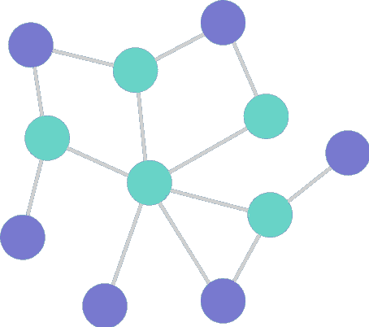
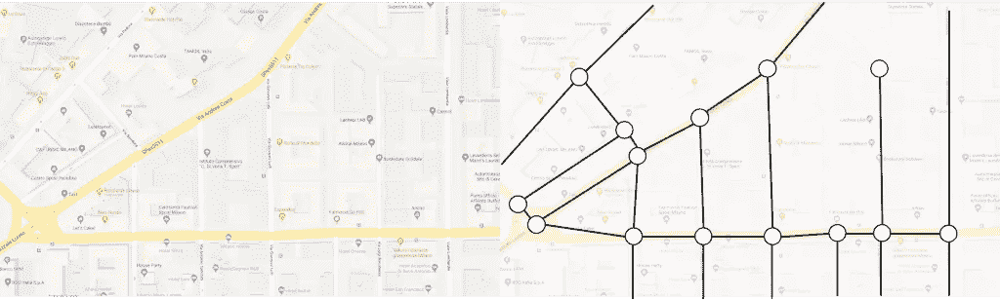

# 图论导论

> 原文：<https://towardsdatascience.com/an-introduction-to-graph-theory-24b41746fabe?source=collection_archive---------35----------------------->

在深入图论之前，我们需要理解机器学习中的数据结构和网络。网络是一种有用的数据结构，用于映射从驾驶方向到社交网络的一系列应用。

网络是另一种表示数据的方式，你还没有完全调查。简单地说，它们包含由边(线)连接的节点(圆)。

节点代表一个对象，这些对象之间的关系是它们之间的边。

## 分析

我们首先要分析网络路径搜索算法。寻找两个节点之间的最短路径是创建距离度量的基本概念，然后可以使用该距离度量进行更高级的分析。将欧几里得距离和 KNN 视为距离度量。绘制节点和边的示例可以是地图应用程序，如谷歌地图、苹果地图、Waze 或优步，它们也是路径搜索算法的自然应用程序。这些应用程序通常希望找到从 A 到 b 的最短距离。

找到路径后，我们要研究节点和边的属性。中心性是一个关键概念，它有助于确定哪些节点对网络最有影响力，或者在连接网络中占据关键位置。

集团和聚类是在你的个体中心性分析完成后，研究更大的结构。您将使用集团和集群的概念来将网络细分为更小的组。这种方法的自然应用包括将社交网络分组或对语言/书籍等项目进行分类。

## 结果

您不仅能够识别行业趋势或产品中的客户受欢迎程度，绘图还可以用于推动推荐系统！通过您的分析，您可以发现客户之间的趋势和购买相似性，然后您可以建立一个推荐器来提高购买力。我可以是人口统计学上的或者行为学上的。了解这一点，你就能有效地向客户推荐产品。

## 这里有一些例子

**1。映射**

**2。社会网络分析(SNA)是通过使用网络和图论来调查社会结构的过程**

**3。互联网网络**

## 更多图片图论有助于理解:

[https://towardsdatascience.com/graph-theory-132122ac38f2](/graph-theory-132122ac38f2)