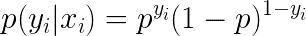
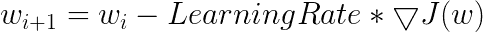

# 逻辑回归导论

> 原文：<https://towardsdatascience.com/an-introduction-to-logistic-regression-8136ad65da2e?source=collection_archive---------10----------------------->

## 机器学习和深度学习之旅

## 逻辑回归从理论到实践的深度探讨

本博客将涵盖五个主题和问题:

1.什么是逻辑回归？

2.为什么不用线性回归？

3.最大似然估计

4.逻辑回归的梯度下降

5.用 Python 实现逻辑回归

1.  **什么是逻辑回归？**

Logistic 回归是一种传统而经典的统计模型，在学术界和工业界得到了广泛的应用。与用于预测数值响应的线性回归不同，逻辑回归用于解决分类问题。例如，当一个人向银行申请贷款时，银行感兴趣的是这个申请人将来是否会违约？(默认或非默认)

一种解决方案是直接对申请人的未来状态进行预测，如感知器，这是 SVM 和神经网络的基础。请阅读我在感知器上的博客:

[](/an-introduction-to-perceptron-algorithm-40f2ab4e2099) [## 感知器算法简介

### 从理论到实践，学习感知机的基本原则，并在数据集上实现它与随机…

towardsdatascience.com](/an-introduction-to-perceptron-algorithm-40f2ab4e2099) 

另一种解决方案，如逻辑回归，是对申请人违约的概率进行预测。由于概率的性质，预测将落在[0，1]内。凭经验，如果预测概率大于或等于 0.5，那么我们可以给这个申请人贴上‘违约’的标签；如果预测概率小于 0.5，那么我们可以将该申请人标记为“不违约”。但是线性回归的范围是从负无穷大到正无穷大，而不是在[0，1]中。然后引入 sigmoid 函数来解决这个问题。sigmoid 函数的表达式为:


sigmoid 函数给出了一条 S 形曲线，当它的自变量非常正或非常负时，它会饱和。花点时间记下这个公式。我们将在最大可能估计中应用它。

sigmoid 函数的图形:


Sigmoid 函数有许多特性，包括:


在逻辑回归中，我们可以写成:


函数的导数如下所示，将用于计算成本函数的梯度。


**2。为什么不用线性回归？**

《统计学习导论》直接解释了为什么使用逻辑回归而不是线性回归来解决分类问题。首先，线性回归的范围是负无穷大到正无穷大，超出了[0，1]的边界。如果线性回归和逻辑回归都对概率进行预测，线性模型甚至会产生负面的预测，而逻辑回归不存在这样的问题。见下图。


Figures Source: Gareth James, Daniela Witten, Trevor Hastie, Robert Tibshirani, 2017, An Introduction to Statistical Learning

线性回归的另一个问题是线性模型的预测总是基数的而不是名义的。即使在某些情况下，响应的值确实采用了自然排序，例如坏、中性和好。看起来坏和中性的差距和中性和好的差距是一样的，所以把坏、中性和好相应地编码成 1、2、3 是合理的。然而，没有自然或直接的方法将名义响应转换成数字响应。

**3。最大似然估计(MLE)**

从全部人口中抽取一个样本。该记录遵循伯努利分布。



在这个公式中， *y* 是 1 或 0 的指标， *p* 是事件发生的概率。

如果总共有 *N* 条记录呢，概率是多少？简而言之，假设每条记录都是独立且同分布的( *I.I.D* )，我们可以一起计算 *N* 条记录的概率。


然后取两边的对数，我们就可以得到对数似然。


注意，在公式中， *p* 是需要估计的参数(概率)，等于:


在统计学中，最大似然估计(MLE)被广泛用于获得分布的参数。在这个范例中，最大化对数似然等于最小化成本函数 *J* 。它是凸优化中的一个对偶问题。成本函数 *J* 如下:


本节展示了 MLE 和成本函数之间的关系，以及 sigmoid 函数是如何嵌入 MLE 的。下一个问题是如何计算 *p* 并进一步计算 *w* 以最小化成本函数。

**4。逻辑回归的梯度下降**

与具有封闭形式解决方案的线性回归不同，梯度下降应用于逻辑回归。梯度下降的一般思想是反复调整参数 *w* 和 *b* 以最小化成本函数。有三种典型的梯度下降法，包括批量梯度下降法、小批量梯度下降法和随机梯度下降法。在这个博客中，批量渐变体面使用。


Figure Source: [https://saugatbhattarai.com.np/what-is-gradient-descent-in-machine-learning/](https://saugatbhattarai.com.np/what-is-gradient-descent-in-machine-learning/)

成本函数 ***J*** 的梯度为:


在第一部分中应用 sigmoid 函数的导数，然后我们可以得到:


初始值被分配给*w；*然后通过学习率*代价函数的梯度迭代更新 *w* 。该算法不会停止，直到它收敛。



梯度下降请看我的博客:

[](/an-introduction-to-gradient-descent-c9cca5739307) [## 梯度下降导论

### 本博客将涵盖以下问题和主题:

towardsdatascience.com](/an-introduction-to-gradient-descent-c9cca5739307) 

**5。用 Python 实现逻辑回归**

在这一部分中，我将使用众所周知的数据 iris 来展示梯度体面如何工作以及逻辑回归如何处理分类问题。

首先，导入包

```
from sklearn import datasets
import numpy as np
import pandas as pd
import matplotlib.pyplot as plt
import matplotlib.lines as mlines
```

接下来，加载数据。为简单起见，我只选择 2 种虹膜。

```
# Load data
iris = datasets.load_iris()
X=iris.data[0:99,:2]
y=iris.target[0:99]# Plot the training points
x_min, x_max = X[:, 0].min() - .5, X[:, 0].max() + .5
y_min, y_max = X[:, 1].min() - .5, X[:, 1].max() + .5
plt.figure(2, figsize=(8, 6))
```


梯度下降的伪代码

```
 1\. Initialize the parameters
Repeat {
   2\. Make a prediction on y
   3\. Calculate cost function
   4\. Get gradient for cost function
   5\. Update parameters
 }
```

梯度下降代码

```
#Step 1: Initial Model Parameter
Learning_Rate=0.01
num_iterations=100000
N=len(X)
w=np.zeros((2,1))
b=0
costs=[]for i in range(num_iterations):
  #Step 2: Apply sigmoid Function and get y prediction
    Z=np.dot(w.T,X.T)+b
    y_pred=1/(1+1/np.exp(Z)) #Step 3: Calculate Cost Function
    cost=-(1/N)*np.sum(y*np.log(y_pred)+(1-y)*np.log(1-y_pred)) #Step 4: Calculate Gradient
    dw=1/N*np.dot(X.T,(y_pred-y).T)
    db=1/N*np.sum(y_pred-y) #Step 5: Update w & b
    w = w - Learning_Rate*dw
    b = b - Learning_Rate*db
   #Records cost
    if i%100==0:
    costs.append(cost)
    print(cost)
```

可视化成本函数随时间的变化

```
# Plot cost function
Epoch=pd.DataFrame(list(range(100,100001,100)))
Cost=pd.DataFrame(costs)
Cost_data=pd.concat([Epoch, Cost], axis=1)
Cost_data.columns=['Epoch','Cost']
plt.scatter(Cost_data['Epoch'], Cost_data['Cost'])
plt.xlabel('Epoch')
plt.ylabel('Cost')
```


从上图中，我们可以看到，起初成本急剧下降；经过 40000 轮迭代，变得稳定。

可视化线性分类

```
# Plot linear classification
fig, ax = plt.subplots()
ax.scatter(X[:, 0], X[:, 1], c=y, cmap=plt.cm.Set1,edgecolor='k')
line=mlines.Line2D([3.701,7],[2,4.1034],color='red')
ax.add_line(line)
ax.set_xlabel('Sepal length')
ax.set_ylabel('Sepal width')
plt.show()
```


上图中的红线是 logistic 回归的决策边界。因为虹膜数据只包含二维，所以判定边界是一条线。在某些情况下，当存在 3 个或更多维时，决策边界将是超平面。

**总结**

在这篇博客中，我从理论到实践解释了逻辑回归。希望你看完这篇博客后对逻辑回归有更好的理解。如果您对其他博客感兴趣，请点击以下链接:

[](https://medium.com/@songyangdetang_41589/table-of-contents-689c8af0c731) [## 机器学习和深度学习之旅

### 这一系列博客将从理论和实现两个方面对深度学习进行介绍。

medium.com](https://medium.com/@songyangdetang_41589/table-of-contents-689c8af0c731) 

**参考**

[1]伊恩·古德菲勒，约舒阿·本吉奥，亚伦·库维尔，(2017) *深度学习*

[2] Gareth James，Daniela Witten，Trevor Hastie，Robert Tibshirani，(2017) *统计学习介绍*

[https://en.wikipedia.org/wiki/Gradient_descent](https://en.wikipedia.org/wiki/Gradient_descent)