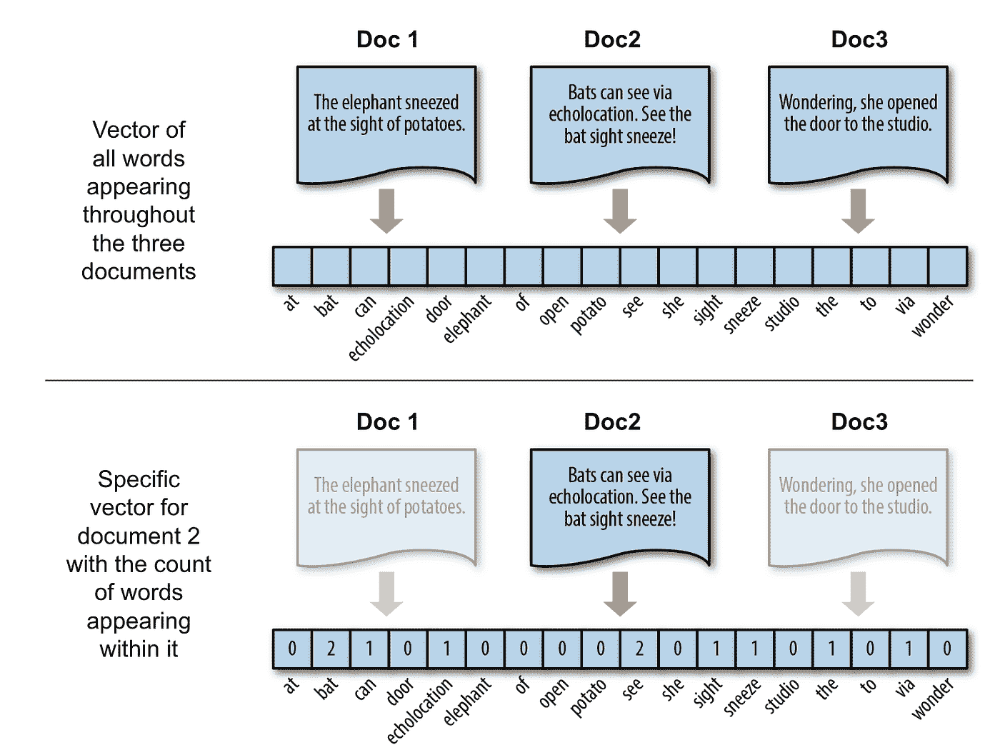
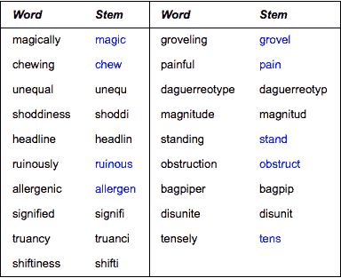
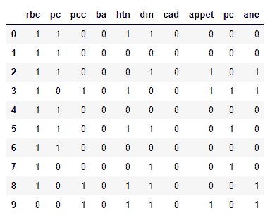

# NLP 介绍和提高游戏水平的 5 个技巧

> 原文：<https://towardsdatascience.com/an-introduction-to-nlp-and-5-tips-for-raising-your-game-639636188ddf?source=collection_archive---------21----------------------->


Source: pexels — free stock images

## 我开始时就想知道的事情😅

对于那些在数据科学、机器学习和/或人工智能领域工作的人来说，NLP 可能是最令人兴奋的工作领域之一。

> NLP 代表自然语言处理，是关于计算机和人类语言之间的互动。能够处理和分析大量自然语言数据的编程算法。

潜在的目标可能会有所不同，但总体目标是得出关于人类行为的结论……我们写作时的意图，我们写作时的想法或感觉，我们所写的项目的类别，以及一些其他东西，如聊天机器人，客户的市场细分，找到元素之间的重复和相似之处，虚拟助手(如 Siri 或 Alexa)以及更多东西。

尽管如此，NLP 作为一门学科出现的时间并不长，只是在 1960 年，艾伦·图灵发表了一篇名为“计算机器和智能”的文章，提出了现在所谓的“图灵测试”。这篇论文提出了“机器会思考吗？”这项测试证明了一台机器能够表现出与人类同等的智能行为。运行测试需要三个参与者，其中玩家 C(评估者)的任务是尝试确定哪个玩家(A 或 B)是计算机，哪个是人。


The Japanese robot Pepper, made by Aldebaran Robotics

然后，评估者将判断人类和机器之间的自然语言对话，这些对话旨在产生类似人类的反应，并知道对话中的两个伙伴之一是机器。对话将被限制在纯文本频道，结果不取决于机器对问题给出正确答案的能力，而只取决于它的答案与人类给出的答案有多相似。如果在测试结束时，评估者不能可靠地将机器与人区分开来，那么机器就被认为通过了测试。

从那里开始，在过去的几年里，这个领域已经有了指数级的发展，从使用一组规则的手工编码系统，到更复杂的统计 NLP。在这种背景下，一些公司正在这个领域做一些非常令人兴奋的事情。例如，如果你是安卓用户，你可能会熟悉**快捷键**，这是一个使用文本预测的初创公司，旨在提高用户写作的准确性、流畅性和速度。Swiftkey 从我们的书写中学习，预测最喜欢的单词、表情符号甚至表情。另一家初创公司**signal 1**，将手语转换成文本。帮助失聪的人与不懂手语的人交流。

事实是，现在使用 Python、Tensorflow、Keras 等开源库的扩展，使得 NLP 变得可访问，每天都有越来越多的企业在使用它。他们中的一些人雇佣了专门从事该主题的其他公司，但其他一些人雇佣了数据科学家和数据分析师，以便构建自己的解决方案。

如果你是这种情况，不管你是公司的人还是数据专家，在接下来的文章中，我将介绍一些我在 NLP 工作时学到的东西。幸运的是，所有这些都是基于错误的提示！所以希望你能提前避开它们，不要像我一样:)

# 1.找到适合您的矢量化类型

在 NLP 中，通常，在许多许多(可能更多)的数据清理之后，魔术开始于称为矢量化的东西。这种工具、技术，或者你想怎么称呼它，取一堆文本，通常称为文档，并根据每个文档中出现的单词将它们转换成向量。举以下例子:



作者使用来自[https://www.oreilly.com](https://www.oreilly.com/library/view/applied-text-analysis/9781491963036/ch04.html)的图片创建的示例

在上面的例子中，我们使用了一种叫做**计数矢量器或单词袋**的工具。这种矢量化通常会丢弃文本中的语法、顺序和结构。这是一个很好的选择，因为它可以跟踪文档中出现的所有单词，以及它们简单的处理方式，只需计数就可以理解，并让我们清楚地了解最重要的单词。然而，它提出了两个主要问题:

*   **数据稀疏**:当统计整个文档中的所有出现时，我们可以很容易地以一个由充满零的向量组成的矩阵结束，因为当然，每个文档将只包含少量的所有可能的单词。我们稍后会详细讨论这一点。
*   **未来本身**:计数矢量器输出一个固定大小的矩阵，其中包含当前文档中出现的所有单词(或某些频率的单词)。如果我们将来收到更多的文档，而我们不知道可能找到的单词，这可能会是一个问题。
*   **棘手的文档**:如果我们有一个文档，其中一个特定的单词出现了很多次，以至于它看起来是所有文档中最常见的单词，而不是一个单词在一个文档中出现了很多次，会发生什么？

为了解决第一个问题和第二个问题，我们可以使用一个**散列向量化**，它将一组文本文档转换成一个用[散列技巧](https://en.wikipedia.org/wiki/Feature_hashing)计算的出现矩阵。每个单词都被映射到一个特征，使用哈希函数将它转换成一个数字。如果我们在文本中再次遇到该单词，它将被转换为相同的哈希，这样我们就可以统计单词的出现次数，而无需在内存中保留字典。这个技巧的主要缺点是不可能计算逆变换，因此我们丢失了重要特征对应的单词的信息。

为了解决上面提到的第三个问题，我们可以使用**术语频率-逆文档频率(tf-idf)矢量器**。tf-idf 分数告诉我们哪些单词在文档之间最有区别。在一个文档中出现很多但在很多文档中没有出现的单词包含很大的辨别能力。逆文档频率是对单词提供多少信息的度量，即该术语在所有文档中是常见的还是罕见的。增强特定文档的高度专用术语，同时抑制大多数文档的通用术语。

Sklearn 实现了所有这三种类型的矢量化:

*   [计数矢量器](https://scikit-learn.org/stable/modules/generated/sklearn.feature_extraction.text.CountVectorizer.html)
*   [哈希矢量器](https://scikit-learn.org/stable/modules/generated/sklearn.feature_extraction.text.HashingVectorizer.html)
*   [tfidf 矢量器](https://scikit-learn.org/stable/modules/generated/sklearn.feature_extraction.text.TfidfVectorizer.html)

# 2.个性化停用词，并注意数据中的语言

在进行任何类型的矢量化时，使用停用词是获得可靠结果的关键步骤。向我们的算法传递一个停用词列表，我们告诉它:‘如果你发现任何停用词，请忽略所有这些词……我不想让它们出现在我的输出矩阵中’。Skelarn 包含了一个默认的停用词列表供我们使用，只需将单词“english”传递给“stop_words”超参数即可。但是，有几个限制:

*   它仅包括像“和”、“the”、“him”这样的基本词，这些词被假定为在表示文本内容时不提供信息，并且可以被移除以避免它们被解释为用于预测的信号。但是，例如，如果您正在处理从租赁代理网站上搜集的房屋描述，您可能会想要删除所有与房产描述本身无关的词语。像“机会”、“报价”、“惊人”、“太棒了”、“现在”之类的词
*   对我来说，作为一个说西班牙语的人和用那种语言处理机器学习问题的人，最大的缺点是:它只有英语版本

因此，无论您是想丰富英语的默认单词列表以改善您的输出矩阵，还是想在其他一些语言中使用列表，您都可以通过使用超参数' stop_words '向 Sklearn 的算法传递个性化的停用词列表。顺便说一句，[这里有一个 GitHub 库](https://github.com/Alir3z4/stop-words),里面有很多不同语言的列表。

在进入下一点之前，请记住，有时你根本不想使用任何停用词。例如，如果你在处理数字，甚至 Sklearn 中默认的英文停用词列表也包括从 0 到 9 的所有单个数字。所以对你来说，问问自己是否正在处理一个需要停用词的 NLP 问题是很重要的。

# 3.使用词干分析器对相似的单词进行“分组”

文本规范化是将含义基本相同但略有不同的单词版本转换为相同特征的过程。在某些情况下，考虑一个可能的单词的所有可能的变体可能是明智的，但是无论您是使用英语还是任何其他语言，有时您还会希望对文档进行某种预处理，以便以相同的方式表示具有相同含义的单词。例如，consultant、consulting、consult、consultant 和 consultants 都可以表示为“顾问”。有关更多示例，请参见下表:



Source: [https://www.wolfram.com](https://www.wolfram.com/language/11/text-and-language-processing/generate-and-verify-stemmed-words.html) — Generate and verify stemmed words

为此，我们可以使用词干。词干分析器从单词中去掉词缀，只留下单词词干。幸运的是，[Python 的 NLTK 库](https://www.nltk.org/api/nltk.stem.html)包含了几个健壮的词干分析器。如果您想将特定语言词干分析器或其他工具集成到矢量器算法中，可以使用以下代码:

```
spanish_stemmer = SpanishStemmer()classStemmedCountVectorizerSP(CountVectorizer):
def build_analyzer(self):
analyzer = super(StemmedCountVectorizerSP,self).build_analyzer()return lambda doc: ([spanish_stemmer.stem(w) for w in analyzer(doc)])
```

对于使用 HashingVectorizer 或 TfidfVectorizer，您可以很容易地更改这一点，只需更改赋予该类的算法。

# 4.避免使用熊猫数据框

这条建议简单明了:如果你在一个 NLP 项目中工作，有超过 5-10，000 行的数据，避免使用数据帧。仅仅使用 Pandas 对大量文档进行矢量化就会返回一个巨大的矩阵，这使得处理非常缓慢，而且很多时候，自然语言处理项目涉及到测量距离等内容，这往往非常缓慢，因为它需要将元素相互比较。尽管我本人是熊猫数据帧的忠实用户，但对于这类东西，我会推荐使用 Numpy 数组或稀疏矩阵。

还有。记住，你总是可以通过使用。toarray()'函数，反之亦然，从数组到稀疏矩阵使用:

```
from scipy import sparsemy_sparse_matrix = sparse.csr_matrix(my_array)
```

顺便说一下，如果你在处理时间问题，记住你可以使用下面的方法来为你的代码计时:

```
start = time.time()whatever_you_want_to_timeend = time.time()print(end — start)
```

# 5.数据稀疏:使你的输出矩阵可用



如前所述，使用 NLP 时最大的问题之一是数据稀疏问题…以成千上万列充满零的矩阵结束，这使得我们无法在以后应用某些东西。以下是我过去处理这个问题的一些技巧:

*   **使用超参数‘max _ features’**使用 TfidfVectorizer 或 CountVectorizer 时。例如，您可以打印出文档中的单词频率，然后为它们设置一个阈值。假设你设置了一个 50 的阈值，你的数据语料库由 100 个单词组成。在查看单词频率后，20 个单词出现的次数少于 50 次。因此，您设置 max_features=80，您就可以开始了。如果 max_features 设置为 None，则在转换过程中会考虑整个语料库。否则，如果你传递 5 个给 max_features，那就意味着用文本文档中最常用的 5 个单词创建一个特征矩阵。
*   **在哈希矢量器中设置多个‘n _ features’。**该超参数设置输出矩阵中特征/列的数量。特征数量少容易造成哈希碰撞，数量多会造成线性学习器系数维数较大。这个数字取决于你和你需要什么。
*   **使用降维**。像主成分分析这样的技术将具有成千上万列的输出矩阵分成一个更小的集合，捕捉原始矩阵的方差可能是一个好主意。只要分析一下这种维数减少对你最终结果的影响有多大，检查一下它是否真的有用，并且选择要使用的维数。

我真的真的希望我学到的这些知识能对你的 NLP 项目有所帮助。将来会有更多关于 NLP 的故事，但是如果你喜欢这个故事，不要忘记看看我最近的一些文章，比如[如何将你的数据分成训练集和测试集以确保代表性](https://medium.com/better-programming/how-to-divide-data-into-train-and-test-assuring-representativeness-c4c12c215d79?source=friends_link&sk=389e0ee2de25f5e76d31d8430e7ccc4b)、s [数据科学中的生存偏差](/survivorship-bias-in-data-science-and-machine-learning-4581419b3bca?source=friends_link&sk=fd531decb8e07af98c506c4038c53bf9)以及[在云中使用集群以 4 个简单步骤完成数据科学项目](https://medium.com/swlh/using-a-cluster-in-the-cloud-for-data-science-projects-in-4-simple-steps-9ee067238448?source=friends_link&sk=39832abc5b65eca87eb1089f934e87e1)。在[我的中型档案](https://medium.com/@g.ferreiro.volpi)中可以找到所有这些以及更多信息。

还有**如果你想直接在你的邮箱里收到我的最新文章，只需** [**订阅我的简讯**](https://gmail.us3.list-manage.com/subscribe?u=8190cded0d5e26657d9bc54d7&id=3e942158a2) **:)**

感谢阅读！

— — — — — — — — — — — —

特别提及我在整个故事中使用的以下资源:

[*https://blog . ventureradar . com/2015/09/22/top-5-companies-innovating-with-natural-language-processing/*](https://blog.ventureradar.com/2015/09/22/top-5-companies-innovating-with-natural-language-processing/)

[https://en.wikipedia.org/wiki/Natural_language_processingT21](https://en.wikipedia.org/wiki/Natural_language_processing)

[*https://en.wikipedia.org/wiki/Turing_test*](https://en.wikipedia.org/wiki/Turing_test)

[*https://www . Forbes . com/sites/bernardmarr/2019/06/03/5-amazing-examples-of-natural-language-processing-NLP-in-practice/# 365 b 59901 b30*](https://www.forbes.com/sites/bernardmarr/2019/06/03/5-amazing-examples-of-natural-language-processing-nlp-in-practice/#365b59901b30)

[*https://www . oreilly . com/library/view/applied-text-analysis/9781491963036/ch04 . html*](https://www.oreilly.com/library/view/applied-text-analysis/9781491963036/ch04.html)

[*https://stack overflow . com/questions/46118910/scikit-learn-vectorizer-max-features*](https://stackoverflow.com/questions/46118910/scikit-learn-vectorizer-max-features)