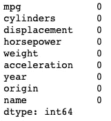

# Python 中的熊猫介绍

> 原文：<https://towardsdatascience.com/an-introduction-to-pandas-in-python-b06d2dd51aba?source=collection_archive---------15----------------------->


No, this blog post isn’t about the panda bear. Sorry to disappoint. [Source](https://codeburst.io/pandas-for-data-stuff-code-challenge-7972207a8294).

pandas github 官方知识库中的自述文件将 pandas 描述为“一个 Python 包，它提供了快速、灵活和富有表现力的数据结构，旨在使处理“关系”或“标签”数据变得既简单又直观。它旨在成为用 Python 进行实际的、真实世界的数据分析的基础高级构建块。此外，它还有一个更广泛的目标，那就是成为任何语言中最强大、最灵活的开源数据分析/操作工具。它已经在朝着这个目标前进。”


The pandas library is a powerful Python data analysis toolkit. [Source](https://github.com/pandas-dev/pandas).

# 熊猫的背景

根据维基百科，pandas 是“一个为 Python 编程语言编写的软件库，用于数据操作和分析。”听起来很棒，不是吗？但是它真正的含义是什么，熊猫对一个数据科学家来说有什么用途和用处呢？在这篇博文中，我将详细介绍熊猫的一些用途，并举例说明。这是对熊猫图书馆及其功能的简要介绍，而不是包罗万象的深入探讨。更多详细信息，请看熊猫 github 知识库[这里](https://github.com/pandas-dev/pandas)，或者熊猫官方文档[这里](https://pandas.pydata.org/pandas-docs/stable/)。


Wes McKinney — the godfather of pandas. [Source](https://wesmckinney.com/).

它最初是由韦斯·麦金尼于 2008 年在 AQR 资本管理公司工作时开发的。他能够说服 AQR 允许他开源该库，这不仅允许，而且鼓励全球的数据科学家免费使用它，为官方知识库做出贡献，提供错误报告和修复，文档改进，增强，并提供改进软件的想法。


# 熊猫入门

一旦你安装了熊猫，第一步就是导入它。你可以在这里找到更多关于安装熊猫[的信息。下面是熊猫常用的快捷方式。虽然您不需要**使用别名**来导入 pandas，但是使用别名会有所帮助，这样您就可以使用 pd.command，而不是每次需要调用方法或属性时都键入 pandas.command。](https://github.com/pandas-dev/pandas#installation-from-sources)

```
import pandas as pd
```

导入库后，让我们导入一个数据集，这样我们就可以开始研究 pandas 及其功能。我们将使用“R 中应用的统计学习介绍”在线版本中的数据集，该数据集可以在[这里](http://faculty.marshall.usc.edu/gareth-james/ISL/data.html)找到。

Pandas 能够读取几种不同类型的存储数据，包括 CSV(逗号分隔值)、tsv(制表符分隔值)、JSONs (JavaScript 对象符号、HTML(超文本标记语言)等。对于我们的示例，我们将使用 CSV 并以这种方式读入数据。

```
auto = pd.read_csv('[http://faculty.marshall.usc.edu/gareth-james/ISL/Auto.csv'](http://faculty.marshall.usc.edu/gareth-james/ISL/Auto.csv'))
```

在上面的代码块中，我们读入了 CSV 文件，并将其保存为变量“auto”。单引号中的链接是我们的绝对文件路径——或者文件实际存储的位置。如果我们的文件存储在本地，我们也可以传入一个相对文件路径，这给了我们相对于目录中当前位置的目标文件*。*

# 序列和数据帧的区别

在 pandas 中，我们有两个主要的数据结构可以探索。第一个是**数据帧**，第二个是**系列**。那么这两者有什么不同呢？

**DataFrame** 是一个包含行和列索引的二维数组。

**系列**是带有索引的一维数值数组。

如果基于这些一句话的解释还不清楚这两者之间的区别，希望下面的图片有所帮助。


A **Series**, on the left, and a **DataFrame** on the right. Image taken from General Assembly’s “Intro to Pandas” lesson.

如果看起来左边的图片也存在于右边的图片中，那你就对了！其中**数据帧**是整个数据集，包括所有行和列——**系列**实质上是该**数据帧**中的一列。在 pandas 中创建这两个数据结构是一个相当简单的过程，如下所示。

```
pd.DataFrame(data = [
['NJ', 'Towaco', 'Square'], 
['CA', 'San Francisco', 'Oval'], 
['TX', 'Austin', 'Triangle'], 
['MD', 'Baltimore', 'Square'], 
['OH', 'Columbus', 'Hexagon'], 
['IL', 'Chicago', 'Circle']
],
             columns = ['State', 'City', 'Shape'])pd.Series(data=['NJ', 'CA', 'TX', 'MD', 'OH', 'IL'])* Side Note: Python is able to make use of "white space" so the code is easier to read - hence the new lines and spacing.
```

上面的代码将创建我们在上面的图片中看到的**数据帧**和**系列**。传入数据对于创建**数据帧**和**系列**是必要的，以便它们不为空。有额外的参数可以传递到每个参数中，但是对于我们的目的来说，我们只需要传递的参数。有关这些附加参数作用的更多信息，请查看关于[数据帧](https://pandas.pydata.org/pandas-docs/stable/reference/api/pandas.DataFrame.html)和[系列](https://pandas.pydata.org/pandas-docs/stable/reference/api/pandas.Series.html)的文档。

# 探索性数据分析的一些有用的方法和性质

任何优秀的数据科学家在探索数据时应该做的第一件事就是探索数据。实现这一点的最好(也是最容易的)方法之一是查看前几行数据。默认情况下，调用`.head()`方法将显示数据帧的前五行，并包含列标题。您可以通过在括号中输入一个数字来修改显示的行数，这将改变显示的行数。

```
auto.head()
```


A look at the first five rows of our dataset.

同样，我们也可以看看数据集的最后几行。默认情况下，`.tail()`方法将显示数据帧的最后五行。类似于`.head()`，我们可以向我们的方法传递一个数字来修改显示多少行。让我们看一下我们的数据帧的最后三行，只是为了给你一个我们如何修改`.tail()`的感觉。

```
auto.tail(3)
```


A look at the last three rows of our dataset.

除了查看前几行或后几行之外，查看数据集中有多少行和列可能会有所帮助。让我们看看`.shape`的房产。

```
auto.shape
```


The shape of our dataset, in rows and columns.

这里，我们的数据集有 397 行和 9 列。根据我们对数据集的`.head()`和`.tail()`的观察，我们看到我们的数据集从索引 0 开始，一直运行到索引 396，确认我们总共有 397 行。但是，我们可能不想只看有多少行，而是想看看我们的数据集中有多少值丢失了。为此，我们可以调用`.isnull()`方法。


The first five rows of our dataframe when .isnull() is called.

在上图中，为了图片的缘故，我捕获了前 5 行，但是您可以通过调用`.isnull().head()`来获得同样有限的数据集。熊猫和 python 最酷的一点是它允许你堆叠方法和属性。`.isnull()`所做的是为每个值返回一个布尔项，并告诉我们它是否缺失(为 null，或 True)，或者它是否不缺失(非 null，或 False)。

查看空值的另一种方式是在我们的`.isnull()`方法上堆叠另一个方法。如果我们看一下`.isnull().sum()`，我们将会看到在我们的每一列中有多少空值。

```
auto.isnull().sum()
```



How many null values are in each column?

幸运的是，上面的列都没有空值——所以我们不必担心[删除空值](https://pandas.pydata.org/pandas-docs/stable/reference/api/pandas.DataFrame.dropna.html)，或者[填充空值](https://pandas.pydata.org/pandas-docs/stable/reference/api/pandas.DataFrame.fillna.html)。

另一个可能对我们有用的有用信息是查看我们的数据集中有什么类型的数据。为此，我们可以使用`.dtypes`属性。这将为我们提供每一列中包含的数据类型的快照。

```
auto.dtypes
```


A look at our datatypes within our DataFrame

在这里，我们可以看到我们有浮点数(带小数位的数字)、整数(整数)和对象(字符串)。

如果我们想快速总结一下到目前为止我们已经看过的所有信息，我们可以调用的一个特别有用的方法是`.info()`,它基本上汇总了我们到目前为止已经探索过的所有内容！

```
auto.info()
```


.info() shows us just about everything we’ve covered so far.

在这里，我们可以看到我们的`auto`变量的类型是什么(pandas . core . frame . data frame)——它是一个数据帧！RangeIndex 告诉我们总共有多少条目，从索引 0 到索引 396，Data columns 告诉我们总共有多少列——在本例中有 9 列。每个单独的列向我们显示有多少条目，多少是空的，以及特定列的类型。在底部，dtypes 显示了我们有哪些数据类型，以及每种类型有多少。最后，内存使用情况向我们显示了数据帧实际使用了多少内存。

希望您已经发现这是对 pandas 的快速介绍，它的一些方法和属性，它有助于向您展示为什么 pandas 在查看和分析数据集时如此有用。虽然这只是对熊猫及其方法和属性的一个非常基本的介绍，但希望我能有机会深入了解熊猫，帮助澄清一些被忽略的东西。如果你喜欢这篇博文，请记得查看所有关于熊猫[的文档](https://pandas.pydata.org/pandas-docs/stable/)，看看它对你有多有用！