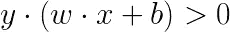
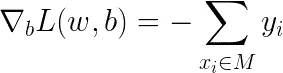

# 感知器算法简介

> 原文：<https://towardsdatascience.com/an-introduction-to-perceptron-algorithm-40f2ab4e2099?source=collection_archive---------9----------------------->

## 机器学习和深度学习之旅

## 从理论到实践，学习感知器的基本原理，并用随机梯度下降法实现算法

本博客将涵盖以下问题和主题

1.什么是感知器？

2.感知器的随机梯度下降

3.用 Python 实现

**1。什么是感知器？**

感知器在 20 世纪 80 年代为神经网络模型奠定了基础。该算法由弗兰克·罗森布拉特开发，并被封装在 1962 年发表的论文“神经动力学原理:感知机和大脑机制理论”中。当时，罗森布拉特的工作受到马文·明克斯和西蒙·派珀特的批评，认为神经网络有缺陷，只能解决线性分离问题。然而，这种限制只出现在单层神经网络中。

感知器可以用来解决两类分类问题。算法的一般形式可以写成:


非线性激活**的*标志*的**功能是:


而逻辑回归是针对事件发生或不发生的概率，所以目标值的范围是[0，1]。感知器对第一类使用更方便的目标值 t=+1，对第二类使用 t=-1。因此，该算法不提供概率输出，也不处理 K>2 分类问题。另一个限制来自于该算法只能处理固定基函数的线性组合的事实。

**2。感知器的随机梯度下降**

根据前面的两个公式，如果记录分类正确，则:



否则，


因此，为了最小化感知器的成本函数，我们可以写出:


m 表示错误分类记录的集合。

通过偏导数，我们可以得到成本函数的梯度:



与逻辑回归可以应用批量梯度下降、小批量梯度下降和随机梯度下降来计算参数不同，感知器只能使用随机梯度下降。我们需要初始化参数 ***w*** 和 ***b*** ，然后随机选择一条错误分类的记录，使用随机梯度下降迭代更新参数 ***w*** 和 ***b*** ，直到所有记录都被正确分类:


注意学习率 ***a*** 的范围是从 0 到 1。

例如，我们有 3 条记录， ***、Y1 = (3，3)、Y2 = (4，3)、Y3 = (1，1)* 、T3。 ***Y1*** 和 ***Y2*** 标注为+1***Y3***标注为-1。假设初始参数都是 0。因此，所有的点都将被归类为 1 类。**

随机梯度下降循环通过所有训练数据。在第一轮中，通过应用前两个公式， ***Y1*** 和 ***Y2*** 可以被正确分类。但是 ***Y3*** 会被误分类。假设学习率等于 1，通过应用上面所示的梯度下降，我们可以得到:


那么线性分类器可以写成:


即 1 轮梯度下降迭代。


上表显示了感知器的随机梯度下降的整个过程。如果一条记录被正确分类，那么权重向量 ***w*** 和 ***b*** 保持不变；否则，我们在 ***y=1*** 时将向量 ***x*** 加到当前权重向量上，并且在 ***y=-1*** 时从当前权重向量 ***w*** 中减去向量*。请注意，最后 3 列是预测值，错误分类的记录以红色突出显示。如果我们反复执行梯度下降，在第 7 轮中，所有 3 个记录都被正确标记。那么算法就会停止。线性分类器的最终公式为:*

**

*请注意，这种算法总是存在收敛问题。当数据可分时，有多种解，选择哪种解取决于起始值。当数据不可分时，算法不会收敛。有关详细信息，请参见下面参考资料中的相应段落。*

***3。用 Python 实现***

```
*from sklearn import datasets
import numpy as np
import pandas as pd
import matplotlib.pyplot as plt
import matplotlib.lines as mlinesnp.random.seed(10)# Load data
iris=datasets.load_iris()
X = iris.data[0:99,:2]
y = iris.target[0:99]*
```

*首先，加载虹膜数据。*

```
*# Plot figure
plt.plot(X[:50, 0], X[:50, 1], 'bo', color='blue', label='0')
plt.plot(X[50:99, 0], X[50:99, 1], 'bo', color='orange', label='1')
plt.xlabel('sepal length')
plt.ylabel('sepal width')
plt.legend()*
```

*然后可视化数据*

**

```
*# Update y into -1 and 1
y=np.array([1 if i==1 else -1 for i in y])*
```

*将 ***y=0*** 更新为 ***y=-1****

```
*#################################
# Gradient Descent
################################## Initialize parameters
w=np.ones((X.shape[1],1));
b=1;
learning_rate=0.1;
Round=0;
All_Correct=False;# Start Gradient Descent
while not All_Correct:
    misclassified_count=0
    for i in range(X.shape[0]):
        XX=X[i,]
        yy=y[i]
        if yy * (np.dot(w.T,XX.T)+b)<0:
            w+=learning_rate * np.dot(XX,yy).reshape(2,1)
            b+=learning_rate * yy misclassified_count +=1 if misclassified_count==0:
        All_Correct=True
    else:
        All_Correct=False
    Round += 1
    print(Round)print(w)
print(b)*
```

*应用随机梯度下降后，我们得到 ***w=(7.9，-10.07)*** 和 ***b=-12.39****

```
*x_points = np.linspace(4,7,10)
y_ = -(w[0]*x_points + b)/w[1]
plt.plot(x_points, y_)plt.plot(X[:50, 0], X[:50, 1], 'bo', color='blue', label='0')
plt.plot(X[50:99, 0], X[50:99, 1], 'bo', color='orange', label='1')
plt.xlabel('sepal length')
plt.ylabel('sepal width')
plt.legend()*
```

**

*上图显示了感知器的最终结果。我们可以看到，线性分类器(蓝线)可以正确地分类所有训练数据集。在这种情况下，虹膜数据集仅包含 2 维，因此决策边界是一条线。在数据集包含 3 个或更多维度的情况下，决策边界将是超平面。*

***结论***

*在这篇博客中，我解释了感知器背后的理论和数学，将该算法与逻辑回归进行了比较，并最终用 Python 实现了该算法。希望看完这篇博客，你能对这个算法有更好的理解。如果您对其他博客感兴趣，请点击以下链接:*

*[](https://medium.com/@songyangdetang_41589/table-of-contents-689c8af0c731) [## 机器学习和深度学习之旅

### 这一系列博客将从理论和实现两个方面对深度学习进行介绍。

medium.com](https://medium.com/@songyangdetang_41589/table-of-contents-689c8af0c731) 

**参考**

[1] Christopher M. Bishop，(2009)，*模式识别与机器学习*

[2]特雷弗·哈斯蒂，罗伯特·蒂布拉尼，杰罗姆·弗里德曼，(2008)，*《统计学习的要素》**