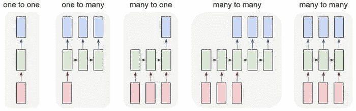
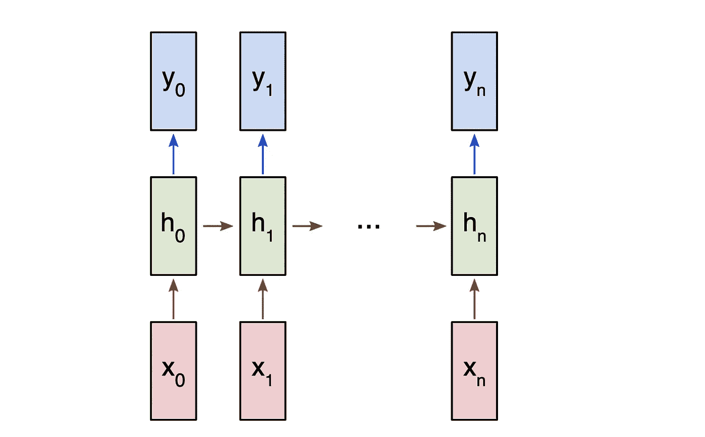
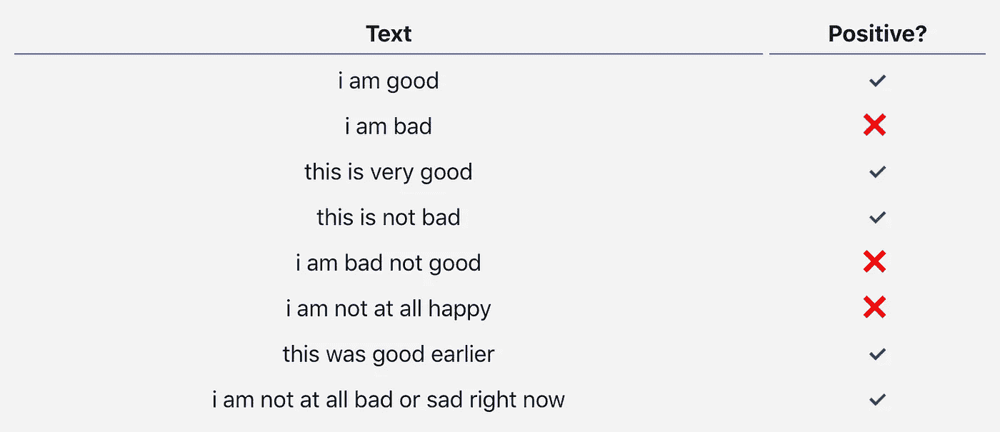
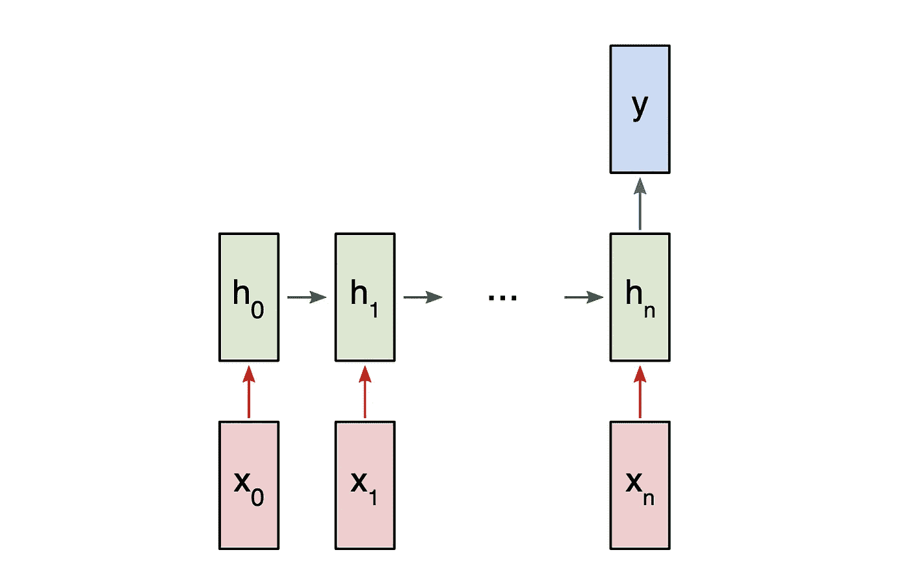
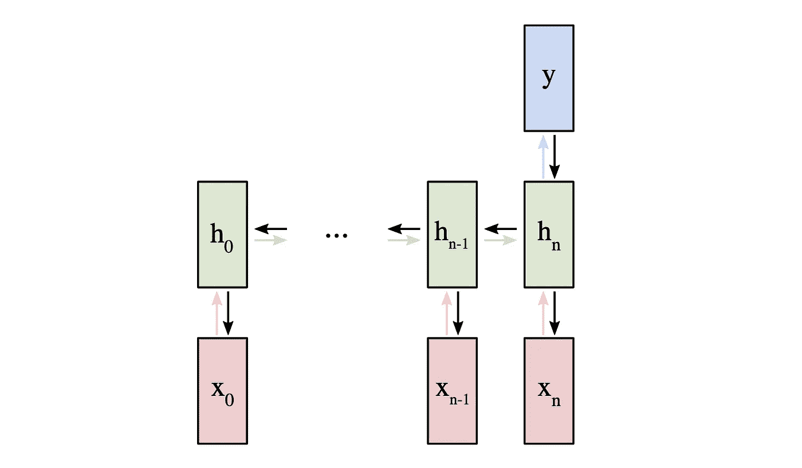

# 初学者递归神经网络入门

> 原文：<https://towardsdatascience.com/an-introduction-to-recurrent-neural-networks-for-beginners-664d717adbd?source=collection_archive---------8----------------------->

## 关于 rnn 是什么、它们如何工作以及如何用 Python 从头开始构建一个 rnn 的简单介绍。

递归神经网络(RNNs)是一种专门处理**序列**的神经网络。由于它们在处理文本方面的有效性，它们经常被用于[自然语言处理](https://victorzhou.com/tag/natural-language-processing) (NLP)任务。在这篇文章中，我们将**探索什么是 rnn，了解它们是如何工作的，并从头开始用 Python 构建一个真正的 RNNs】(仅使用 [numpy](https://www.numpy.org/) )。**

**本帖假设具备神经网络的基础知识**。我的[神经网络介绍](https://victorzhou.com/blog/intro-to-neural-networks/)涵盖了你需要知道的一切，所以我建议你先读一下。

让我们开始吧！

# 1.为什么

普通神经网络(以及[CNN](https://victorzhou.com/blog/intro-to-cnns-part-1/))的一个问题是，它们只能处理预先确定的大小:它们接受**固定大小的输入**并产生**固定大小的输出**。rnn 是有用的，因为它们让我们有**可变长度序列**作为输入和输出。下面是几个 rnn 的例子:



Inputs are red, the RNN itself is green, and outputs are blue. Source: [Andrej Karpathy](http://karpathy.github.io/2015/05/21/rnn-effectiveness/)

这种处理序列的能力使得 RNNs 非常有用。例如:

*   机器翻译(例如谷歌翻译)是通过“多对多”的 rnn 完成的。原始文本序列被输入到一个 RNN，然后产生翻译文本作为输出。
*   **情感分析**(例如*这是正面还是负面评论？*)通常是用“多对一”RNNs 完成的。待分析的文本被输入 RNN，然后产生一个单一的输出分类(例如*这是一个正面评价*)。

在这篇文章的后面，我们将从头开始构建一个“多对一”的 RNN 来执行基本的情感分析。

> 注意:我推荐在 victorzhou.com 阅读这篇文章的其余部分——许多数学格式在那里看起来更好。

# 2.怎么做

让我们考虑一个输入为 *x_0* 、 *x_* 1、… *x_n* 的“多对多”RNN，它想要产生输出 *y_* 0、 *y_* 1、… *y_n* 。这些 x_i 和 y_i 是**向量**，并且可以具有任意维数。

RNNs 通过迭代更新隐藏状态 h 来工作，隐藏状态 h 是也可以具有任意维度的向量。在任何给定的步骤 t，

1.  使用前一个隐藏状态 h_{t-1}和下一个输入 x_t 来计算下一个隐藏状态 h_t。
2.  使用 h_t 计算下一个输出 y_t。



A many to many RNN

下面是 RNN *循环* : **的原因，它对每一步**使用相同的权重。更具体地说，典型的普通 RNN 仅使用 3 组砝码进行计算:

*   *Wxh* ，用于所有 x_t → h_t 环节。
*   *Whh* ，用于所有 h_{t-1} → h_t 环节。
*   *Why* ，用于所有 h_t → y_t 环节。

对于我们的 RNN，我们还将使用两个偏差:

*   b_h，计算 h_t 时添加。
*   b_y，计算 y_t 时添加。

我们将权重表示为矩阵*和偏差表示为向量*和*。这三个重量和两个偏差组成了整个 RNN！*

**以下是将所有东西放在一起的方程式:**


Don’t skim over these equations. Stop and stare at this for a minute. Also, remember that the weights are *matrices* and the other variables are *vectors*.

使用矩阵乘法应用所有权重，并将偏差添加到结果乘积中。然后，我们使用 [tanh](https://en.wikipedia.org/wiki/Hyperbolic_function) 作为第一个方程的激活函数(但是也可以使用类似 [sigmoid](https://en.wikipedia.org/wiki/Sigmoid_function) 的其他激活)。

> 不知道什么是激活函数？看我的 [*神经网络导论*](https://victorzhou.com/blog/intro-to-neural-networks/) *像我提到的。说真的。*

# 3.问题是

让我们把手弄脏吧！我们将从头实现一个 RNN 来执行一个简单的情感分析任务:**确定给定的文本字符串是正面的还是负面的。**

以下是我为这篇文章收集的小型[数据集](https://github.com/vzhou842/rnn-from-scratch/blob/master/data.py)中的一些样本:



# 4.这个计划

由于这是一个分类问题，我们将使用“多对一”RNN。这类似于我们之前讨论的“多对多”RNN，但是它只使用最终隐藏状态来产生一个输出 *y* :



A many to one RNN

每个 x_i 将是一个向量，代表文本中的一个单词。输出 *y* 将是一个包含两个数字的向量，一个代表正，另一个代表负。我们将应用 [Softmax](https://victorzhou.com/blog/softmax/) 将这些值转化为概率，并最终在正/负之间做出决定。

让我们开始建设我们的 RNN 吧！

# 5.预处理

我前面提到的[数据集](https://github.com/vzhou842/rnn-from-scratch/blob/master/data.py)由两个 Python 字典组成:

True = Positive, False = Negative

我们必须做一些预处理，以便将数据转换成可用的格式。首先，我们将为数据中存在的所有单词构建一个**词汇表**:

`vocab`现在拥有在至少一个训练文本中出现的所有单词的列表。接下来，我们将**分配一个整数索引**来表示我们的 vocab 中的每个单词。

我们现在可以用相应的整数索引来表示任何给定的单词！这是必要的，因为 rnn 不能理解单词——我们必须给它们数字。

最后，回想一下，我们的 RNN 的每个输入 x_i 是一个*向量*。我们将使用 [**单热点**](https://en.wikipedia.org/wiki/One-hot) **向量**，它包含除了一个 1 之外的所有 0。每个独热向量中的“1”将在该字的相应整数索引处为**。**

由于我们的词汇表中有 18 个唯一的单词，每个 x_i 将是一个 18 维的一个热点向量。

稍后我们将使用`createInputs()`来创建向量输入，以传递给我们的 RNN。

# 6.前进阶段

是时候开始实施我们的 RNN 了！我们首先初始化 RNN 需要的 3 个权重和 2 个偏差:

Note: We’re dividing by 1000 to reduce the initial variance of our weights. This is not the best way to initialize weights, but it’s simple and works for this post.

我们使用 [np.random.randn()](https://docs.scipy.org/doc/numpy/reference/generated/numpy.random.randn.html) 从标准正态分布初始化我们的权重。

接下来，让我们实施我们的 RNN 的向前传球。还记得我们之前看到的这两个方程吗？


下面是这些相同的等式被写入代码:

很简单，对吧？注意，在第一步中，我们将 h 初始化为零向量，因为在这一点上没有先前的 h 可以使用。

让我们试一试:

*Need a refresher on Softmax? Read my* [*quick explanation of Softmax*](https://victorzhou.com/blog/softmax/)*.*

我们的 RNN 可以工作，但还不是很有用。让我们改变这一点…

> 喜欢这个介绍吗？订阅我的时事通讯以获得关于像这样的新机器学习帖子的通知。

# 7.倒退阶段

为了训练我们的 RNN，我们首先需要一个损失函数。我们将使用**交叉熵损失**，它通常与 Softmax 成对出现。我们是这样计算的:


哪里是我们 RNN 对*正确*类的预测概率(正或负)。例如，如果阳性文本被我们的 RNN 预测为 90%阳性，损失为:


> 想要更长的解释吗？阅读我的卷积神经网络(CNN)入门的 [*交叉熵损失*](https://victorzhou.com/blog/intro-to-cnns-part-1/#52-cross-entropy-loss) *章节。*

现在我们有一个损失，我们将使用梯度下降来训练我们的 RNN，以尽量减少损失。这意味着是时候导出一些梯度了！

⚠️ **以下章节假设了多变量微积分的基础知识**。如果你愿意，你可以跳过它，但我建议即使你不太明白，也要略读一下。**我们将在获得结果的同时逐步编写代码**，即使是表面的理解也会有所帮助。

> *如果你想要一些额外的背景知识，我推荐你先阅读我的神经网络介绍中的* [*训练神经网络*](https://victorzhou.com/blog/intro-to-neural-networks/#3-training-a-neural-network-part-1) *部分。另外，这篇文章的所有代码都在*[*Github*](https://github.com/vzhou842/rnn-from-scratch)*上，所以如果你愿意的话，你可以跟着一起看。*

准备好了吗？开始了。

## 7.1 定义

首先，一些定义:

*   让 y 代表 RNN 的原始输出。
*   设 *p* 代表最终概率: *p* =softmax( *y* )。
*   让 *c* 指代某个文本样本的真实标签，也称为“正确”类。
*   设 *L* 为交叉熵损失:*L*= ln(*p _ c*)。
*   设 *Wxh* 、 *Whh* 、 *Why* 为我们 RNN 中的 3 个重量矩阵。
*   设 b_h 和 b_y 是 RNN 中的两个偏置向量。

## 7.2 设置

接下来，我们需要编辑我们的前向阶段，以缓存一些数据供后向阶段使用。同时，我们也将为我们的逆向阶段设置框架。看起来是这样的:

> 对我们为什么要进行缓存感到好奇吗？阅读我的 CNN 入门 [*培训概述*](https://victorzhou.com/blog/intro-to-cnns-part-2/#2-training-overview) *中我的解释，其中我们做了同样的事情。*

## 7.3 渐变

数学时间到了！我们先从计算∂ *L* /∂ *y* 开始。我们知道:


我将把∂ *L* /∂ *y* 使用链式法则的实际推导过程留给你们作为练习😉但是结果很好:


例如，如果我们有 *p* =[0.2，0.2，0.6]并且正确的类是 *c* =0，那么我们将得到∂*l*/∂*y*=[0.8，0.2，0.6]。这也很容易转化成代码:

很好。接下来，让我们来看看*为什么*和*被*渐变，它们只是用来把最终的隐藏状态变成 RNN 的输出。我们有:


其中 h_n 是最终隐藏状态。因此，


同样的，


我们现在可以开始实现`backprop()`！

> *提醒:我们在* `forward()` *中更早的创造了* `self.last_hs` *。*

最后，我们需要 *Whh* 、 *Wxh* 和 b_h 的梯度，它们在 RNN 的每个步骤中都要用到。我们有:


因为改变 *Wxh* 每影响*一次* h_t，都影响 *y* 最终 *L* 。为了完全计算出 *Wxh* 的梯度，我们需要通过*反向传播所有*时间步长，这就是所谓的**通过时间** (BPTT)反向传播:



Backpropagation Through Time

*Wxh* 用于所有 x_t → h_t 前向链路，因此我们必须反向传播回那些链路中的每一个。

一旦我们到达给定的步骤 *t* ，我们需要计算∂ *h_t/* ∂ *Wxh* :


`tanh`的衍生产品众所周知:


我们像往常一样使用链式法则:


同样的，


我们最不需要的就是∂ *y/* ∂ *h_t* 我们可以递归计算:


我们将从最后一个隐藏状态开始实现 BPTT，并向后工作，所以当我们想要计算∂*y/*∂*h _ t*时，我们已经有了∂*y/*∂*h _ { t*+1 }!例外是最后一个隐藏状态 h_n:


我们现在拥有了最终实现 BPTT 和完成`backprop()`所需的一切:

需要注意一些事情:

*   为了方便起见，我们将∂*l/*∂*y**∂*y/*∂*h*合并为∂ *L/* ∂ *h* 。
*   我们一直在更新一个`d_h`变量，它保存了最近的∂*l*/∂*h _ { t*+1 }，我们需要它来计算∂ *L/* ∂ *ht* 。
*   完成 BPTT 后，我们 [np.clip()](https://docs.scipy.org/doc/numpy/reference/generated/numpy.clip.html) 梯度值低于-1 或高于 1。这有助于缓解**爆炸梯度**问题，即梯度由于有许多相乘项而变得非常大。[爆炸或消失的梯度](https://en.wikipedia.org/wiki/Vanishing_gradient_problem)对于普通的 rnn 来说是一个很大的问题——更复杂的 rnn，如[lstm](https://en.wikipedia.org/wiki/Long_short-term_memory)通常能够更好地处理它们。
*   一旦计算出所有梯度，我们使用**梯度下降**更新权重和偏差。

我们做到了！我们的 RNN 完成了。

# 8.高潮

我们期待已久的时刻终于到来了——让我们测试一下我们的 RNN 吧！

首先，我们将编写一个助手函数，用我们的 RNN 处理数据:

现在，我们可以编写训练循环:

运行`main.py`应该会输出如下内容:

```
--- Epoch 100
Train:  Loss 0.688 | Accuracy: 0.517
Test:   Loss 0.700 | Accuracy: 0.500
--- Epoch 200
Train:  Loss 0.680 | Accuracy: 0.552
Test:   Loss 0.717 | Accuracy: 0.450
--- Epoch 300
Train:  Loss 0.593 | Accuracy: 0.655
Test:   Loss 0.657 | Accuracy: 0.650
--- Epoch 400
Train:  Loss 0.401 | Accuracy: 0.810
Test:   Loss 0.689 | Accuracy: 0.650
--- Epoch 500
Train:  Loss 0.312 | Accuracy: 0.862
Test:   Loss 0.693 | Accuracy: 0.550
--- Epoch 600
Train:  Loss 0.148 | Accuracy: 0.914
Test:   Loss 0.404 | Accuracy: 0.800
--- Epoch 700
Train:  Loss 0.008 | Accuracy: 1.000
Test:   Loss 0.016 | Accuracy: 1.000
--- Epoch 800
Train:  Loss 0.004 | Accuracy: 1.000
Test:   Loss 0.007 | Accuracy: 1.000
--- Epoch 900
Train:  Loss 0.002 | Accuracy: 1.000
Test:   Loss 0.004 | Accuracy: 1.000
--- Epoch 1000
Train:  Loss 0.002 | Accuracy: 1.000
Test:   Loss 0.003 | Accuracy: 1.000
```

对我们自己造的 RNN 来说还不错。💯

**想自己尝试或修改这段代码吗？** [**在你的浏览器中运行这个 RNN**](https://repl.it/@vzhou842/A-RNN-from-scratch)**。**在 [Github](https://github.com/vzhou842/rnn-from-scratch) 上也有。

# 9.结束了

就是这样！在这篇文章中，我们完成了递归神经网络的演练，包括它们是什么，它们如何工作，它们为什么有用，如何训练它们，以及如何实现一个。但是，您还可以做更多的事情:

*   了解一下[长短期记忆](https://en.wikipedia.org/wiki/Long_short-term_memory) (LSTM)网络，一个更强大、更受欢迎的 RNN 架构，或者了解一下[门控循环单元](https://en.wikipedia.org/wiki/Gated_recurrent_unit) (GRUs)，一个众所周知的 LSTM 变种。
*   使用合适的 ML 库，如 [Tensorflow](https://www.tensorflow.org/) 、 [Keras](https://keras.io/) 或 [PyTorch](https://pytorch.org/) ，尝试更大/更好的 rnn。
*   阅读关于[双向 RNNs](https://en.wikipedia.org/wiki/Bidirectional_recurrent_neural_networks) 的内容，该过程向前和向后排序，以便输出层可以获得更多信息。
*   尝试像 [GloVe](https://nlp.stanford.edu/projects/glove/) 或 [Word2Vec](https://en.wikipedia.org/wiki/Word2vec) 这样的[单词嵌入](https://en.wikipedia.org/wiki/Word_embedding)，可以用来将单词转化为更有用的矢量表示。
*   查看[自然语言工具包](https://www.nltk.org/) (NLTK)，这是一个用于处理人类语言数据的流行 Python 库。

我写了很多关于[机器学习](https://victorzhou.com/tag/machine-learning/)的文章，所以[订阅我的时事通讯](https://victorzhou.com/subscribe/?src=intro-to-rnns-medium)如果你有兴趣从我这里获得未来的 ML 内容。

感谢阅读！

*原载于*[*https://victorzhou.com*](https://victorzhou.com/blog/intro-to-rnns/)*。*