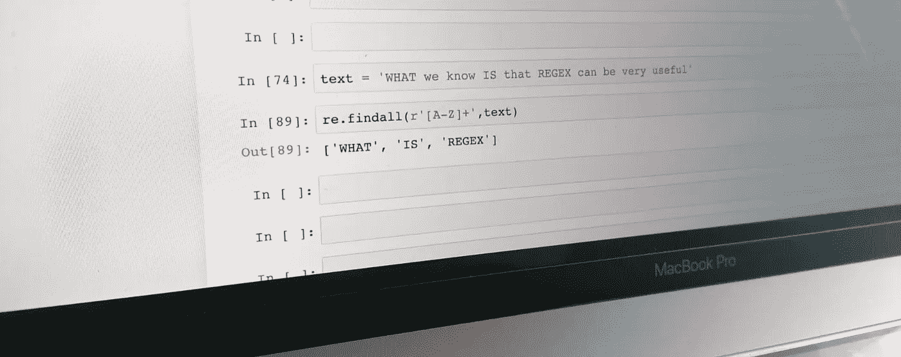

# 使用 Python 的正则表达式简介

> 原文：<https://towardsdatascience.com/an-introduction-to-regex-using-python-aac26fd9daf4?source=collection_archive---------15----------------------->



Photo by the author

## 你甚至需要学习正则表达式吗？

根据[维基百科](https://en.wikipedia.org/wiki/Regular_expression)，正则表达式是定义搜索模式的一系列字符。换句话说:是字母、数字和符号的组合，我们可以用来在更大的文本中搜索内容:)

在技术领域，关于程序员必须学习正则表达式的讨论在 Stackoverflow、Quora 和许多其他类似的网站上随处可见:

*   [2018 年学习正则表达式值得吗？【Quora】](https://www.quora.com/Is-it-worth-to-learn-regular-expressions-in-2018)
*   [正则表达式在编程界有多重要？【Quora】](https://www.quora.com/How-important-are-regex-in-programming-world)
*   正则表达式值得争论吗？【堆栈溢出】
*   [学习正则表达式是每个程序员的必修课吗？【stack overflow】](https://softwareengineering.stackexchange.com/questions/133968/is-it-a-must-for-every-programmer-to-learn-regular-expressions)

是的，其中一些问题是最近才出现的，主要是因为一些新的工具和编程语言使得间接处理 Regex 变得容易，而没有真正处理围绕它的所有混乱。但是，上面最后一个问题是七年前的了！在 Stackoverflow 还有其他更老的。所以你可以看到关于正则表达式及其强制性的讨论已经持续了一段时间😅。

事实上，大约 11 年前，Stack Overflow 的联合创始人杰夫·阿特伍德(Jeff Atwood)在他的博客“编码恐怖”中写了一篇文章，名为“T10 正则表达式:现在你有两个问题 T11”，这是他在三年后写的另一篇文章，名为“T12”。如果你这么喜欢正则表达式，为什么不与它们结婚呢？好吧…我会的！'

在这一点上，如果你在想这样的事情，那就太公平了:

*   这种正则表达式的东西显然太复杂了…可能不值得
*   好吧，那么杰夫·阿特伍德是个疯子……这肯定是雷杰克斯的错

但是等等，在你离开之前，让我告诉你，尽管这是真的，但是 regex 是复杂和令人困惑的，很可能它是值得争论的。效用和复杂性之间的二元性，或者说爱与恨之间的二元性，正是杰夫·阿特伍德在他的第二个故事中试图表达的。事实上，甚至在他最近出版的书的开头，阿特伍德就引用了杰米·扎温斯基在 1997 年说的话:

> 有些人，当遇到问题时，会想“我知道，我会用正则表达式。”现在他们有两个问题。

关于他自己对正则表达式的思考方式，他还声明如下:

> 正则表达式摇滚。它们绝对应该是每个现代编码者工具箱中的关键部分。(Jamie 想说的是:正则表达式本身并不是邪恶的，而是过度使用正则表达式是邪恶的。我完全同意。正则表达式就像一种特别辣的辣酱——只有在适当的时候才能适度使用。你应该尝试用正则表达式解决你遇到的每一个问题吗？哦，不


Hell Fire Detroid [[https://heatonist.com/](https://heatonist.com/)] image retouched

所以最后，很多问题和答案。同一个杰夫·阿特伍德显然学会了同时讨厌和喜欢正则表达式。是不是值得学的东西？我来快速总结一下我通过 Stackoverflow 和 Quora 看的所有回答:

*   这是必须学习的东西吗？不
*   我要每天甚至每周使用它吗？可能不会
*   对你来说，知道和理解它是一个重要的工具吗？是
*   对于某些任务来说，它是否非常高效和有用？肯定是的
*   我需要完全了解它的每一个细节吗？可能不会

当然，很多人会不同意上面的一些答案，但现实是，现在我们有谷歌，我们在编码时可能会遇到的每个问题都有很多答案。到目前为止，每次我不得不使用正则表达式时，没有一次我对如何写东西没有疑问。有时，我不得不承认，即使是最基本的东西，不用一会儿就从我的脑海中抹去了。

这就是为什么这个故事的想法是涵盖正则表达式的主要和基本的东西。因此，您可以从一些实际应用程序开始，检查正则表达式并不是那么可怕(当您有一个合适的指南并且 google 触手可及时😅).

**Python 和 Jupyter 笔记本中的 Regex**

我们的想法是实践下面的例子和工具，所以首先，我们需要知道如何在 Python 中使用 regex。但是，请注意，使用 regex 并不一定需要 Python 或 Jupyter 笔记本。它甚至可以通过终端和其他几种语言使用。不幸的是，并不是所有的程序、命令和编程语言都使用相同的正则表达式，但它们都非常相似。

让我们从导入库开始:

```
import re
```

一旦我们这样做了，从任何给定的字符串开始，有两种使用正则表达式的主要方法:

```
text = ‘those THAT tilt that That 8’
```

1.  仅使用 re.findall 函数

```
In: re.findall(r’[Tt]h[^i][st]’, text)Out: [‘thos’, ‘that’, ‘That’]
```

2.使用重新编译:

```
In: pattern = re.compile(r’[Tt]h[^i][st]’)In: re.findall(pattern, text)Out: [‘thos’, ‘that’, ‘That’]
```

为什么这个模式从我们的字符串中返回单词‘thos’、‘That’和‘That’？不要担心，我们将在下一节解释这一点🙂。

## **主要实用程序和语法**

在接下来的段落中，我们将学习正则表达式中一些最基本的东西。如果您已经熟悉 regex，那么您可能不会得到任何新的东西。但除此之外，它确实值得一读。

**包括常规字符串**:在 Python 中我们通常称为字符串的字符在 regex 世界中被称为‘文字’。然而，尽管如此，使用它们没有任何区别。诸如 a、g、t、r、m 或偶数之类的字符可以包括在任何特殊考虑之内。例如，如果我们想在前面的文本中搜索字母“t ”,我们可以这样做:

```
In: re.findall(r’[t]’,text)Out: [‘t’, ‘t’, ‘t’, ‘t’, ‘t’, ‘t’] #check by yourself if we had 6 lower case ‘t’s in our text
```

提示:注意仅仅通过指示文字，regex 是区分大小写的！

**使用字符类**:这个实用程序指示 regex 在一个组中搜索一个或另一个字符。该组将在方括号中指定。举以下例子:

```
In: re.findall(r’[tT]’,text)Out: [‘t’, ‘T’, ‘T’, ‘t’, ‘t’, ‘t’, ‘t’, ‘T’, ‘t’]
```

现在我们找到了文本中所有的 t，大写和小写都有。然而，这并不是更为正统的做法。在 Python 中有一种更好的方法:

```
In: In : pattern = re.compile(r’t’, flags=re.IGNORECASE)In: re.findall(pattern, text)Out: [‘t’, ‘T’, ‘T’, ‘t’, ‘t’, ‘t’, ‘t’, ‘T’, ‘t’]
```

请注意，字符类也可以使用范围。事实上，这就是它们如此受欢迎的原因！例如，这就是我们如何匹配“a”和“z”之间的任何小写字母:

```
In: re.findall(r’[a-z]’,text)Out: [‘t’, ‘h’, ‘o’, ‘s’, ‘e’, ‘t’, ‘i’, ‘l’, ‘t’, ‘t’, ‘h’, ‘a’, ‘t’, ‘h’, ‘a’, ‘t’]
```

**否定语法:**对于我们到目前为止看到的任何情况，以及对于 regex 中的任何其他表达式，您可以通过以下方式使用'^'字符来使用否定:

```
In: re.findall(r’[^a-zA-Z]’,text)Out: [‘ ‘, ‘ ‘, ‘ ‘, ‘ ‘, ‘ ‘, ‘8’]
```

在上面的例子中，我们只返回空格和字符串中的唯一数字，因为我们排除了' a '和' a '之间的任何字母，包括小写和大写。

在进入下一个实用程序之前，不知道您是否意识到了，但是我们已经看到了足够多的内容，可以理解我们最初的例子了！让我们重温一下:

```
text = ‘those THAT tilt that That 8’In: re.findall(r’[Tt]h[^i][st]’, text)Out: [‘thos’, ‘that’, ‘That’]
```

把它分成几部分，我们可以看到:

*   首先，我们对匹配“T”或“T”的任何内容使用一个类范围
*   之后，我们会指出任何后面有“h”的东西
*   后来，我们用否定来表示任何后面没有“我”的东西
*   最后，任何以 and 's 或 a 't 结尾的单词

注意单词“那些”是如何在“s”处被截断的，因为我们没有在那里进一步指定任何东西。

## 快捷键和特殊字符

如果您以前看过正则表达式，那么它可能会引起您对反斜线数量的注意。这样做有一个很好的理由:regex 包含了很多快捷方式，所以你不必用大量的字符编写永恒的表达式。一开始你可能不会记住所有的代码(或者可能只有我在不得不使用它们的时候才会努力记住一些小代码？😂)，但将它们放在触手可及的地方会很方便:

\w —匹配单词字符(包括数字和下划线)

\W —匹配\W 不匹配的内容—非单词字符

\d —匹配所有数字字符—数字为[0–9]

\D —匹配所有非数字字符

\s —匹配空白(包括制表符)

\S —匹配非空白

\n —匹配新行

\r —匹配回车

\t —匹配制表符

所有这些都可以在字符类中和/或与否定一起使用。让我们看一些例子:

```
# Get everything but blank spacesIn: re.findall(r’[\w]’,text)Out: [‘t’, ‘h’, ‘o’, ‘s’, ‘e’, ‘T’, ‘H’, ‘A’, ‘T’, ‘t’, ‘i’, ‘l’, ‘t’, ‘t’, ‘h’, ‘a’, ‘t’, ‘T’, ‘h’, ‘a’, ‘t’, ‘8’]
```

— —

```
# Get only blank spacesIn: re.findall(r’[\W]’,text)Out: [‘ ‘, ‘ ‘, ‘ ‘, ‘ ‘, ‘ ‘]
```

— —

```
# Match all that’s NOT a non-digit characters → all characters that are not lettersIn: re.findall(r’[^\D]’,text)Out: [‘8’]
```

— —

```
# Match word characters and white spaces → everything but the eightIn: re.findall(r’[\D\s]’,text)Out: [‘t’, ‘h’, ‘o’, ‘s’, ‘e’, ‘ ‘, ‘T’, ‘H’, ‘A’, ‘T’, ‘ ‘, ‘t’, ‘i’, ‘l’, ‘t’, ‘ ‘, ‘t’, ‘h’, ‘a’, ‘t’, ‘ ‘,‘T’, ‘h’, ‘a’, ‘t’, ‘ ‘]
```

嗯，我想这足以理解捷径是如何工作的了，对吗？在这篇文章中我们将看到的最后一件事是**为了包含特殊字符，我们必须再次用反斜杠**对它们进行转义。

特殊正则表达式字符包括:

. \ + * ? [ ^ ] $ ( ) { } = ! < > | : -

## 量词

这是一个简单的基本工具，但也是一个必要的工具。它帮助您匹配您想要返回多少个字符来匹配您的表达式:

* —零个或多个
+ —一个或多个
？—零个或一个
{n} —正好是‘n’个数字
{n，} —匹配‘n’个或更多个出现
{n，m} —在‘n’和‘m’之间

嗯，我认为这足以让你开始学习正则表达式，并让你对这个故事着迷。将来，我会再写关于正则表达式的文章，我们会看到更多的中级/高级工具和语法。然而，如果你有足够的兴趣继续阅读，我建议你继续阅读以下内容:

*   锚
*   分组和采集
*   间隔
*   向前看和向后看

最后，一个非常好的继续阅读的来源是:[https://www.regular-expressions.info/](https://www.regular-expressions.info/)

如果你喜欢这个故事，别忘了看看我最近的一些文章，比如:

*   [如何将数据分为训练集和测试集，以确保代表性](https://medium.com/dataseries/how-to-divide-data-into-train-and-test-assuring-representativeness-5c43702312b?source=friends_link&sk=b952e2d378e9474e3cebed024b80e3f9)
*   [数据科学中的生存偏差](/survivorship-bias-in-data-science-and-machine-learning-4581419b3bca?source=friends_link&sk=fd531decb8e07af98c506c4038c53bf9)
*   [提高 NLP 的 5 个技巧](https://medium.com/dataseries/5-tips-for-improving-your-nl-fc5940193654?source=friends_link&sk=426891b7808c94e010ee1b0e0bb686f3)

在[我的中等档案](https://medium.com/@g.ferreiro.volpi)中可以找到所有这些以及更多信息。还有**如果你想直接在你的邮箱里收到我的最新文章，只需** [**订阅我的简讯**](https://gmail.us3.list-manage.com/subscribe?u=8190cded0d5e26657d9bc54d7&id=3e942158a2) **:)**

中号见！

*注意*:对于这个故事，我使用了来自伦敦大会的[数据科学沉浸式课程](https://generalassemb.ly/education/data-science-immersive/london)的内容。