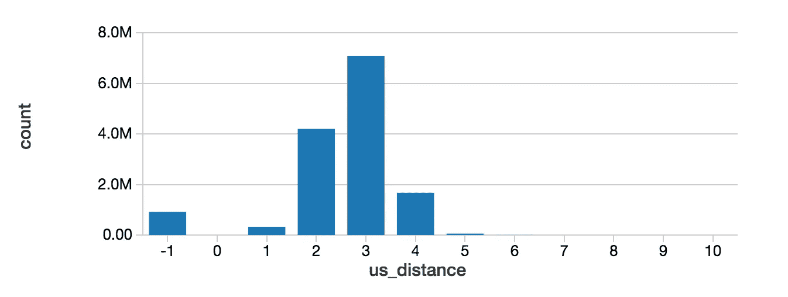

# 介绍 Spark GraphFrame，并举例分析维基百科链接图

> 原文：<https://towardsdatascience.com/an-introduction-to-spark-graphframe-with-examples-analyzing-the-wikipedia-link-graph-67e58c20a107?source=collection_archive---------7----------------------->

## Spark GraphFrame 是一个非常强大的工具，用于使用大型图形数据执行分布式计算。本文介绍了 GraphFrame 抽象，并展示了如何利用它来分析维基百科文章之间的链接所形成的图形。

Spark [GraphFrame](https://github.com/graphframes/graphframes) 是使用分布式计算处理大型图形的强大抽象。它提供了大量常见的图形算法，包括[标签传播](https://en.wikipedia.org/wiki/Label_Propagation_Algorithm)和 [PageRank](https://en.wikipedia.org/wiki/PageRank) 。此外，它为实现复杂的图形算法提供了基础，包括用于图形处理的 [Pregel](http://www.dcs.bbk.ac.uk/~dell/teaching/cc/paper/sigmod10/p135-malewicz.pdf) 范例的健壮实现。任何对处理大型图表感兴趣的人都应该学习如何应用这个强大的工具。

在本文中，我将向您介绍 GraphFrame 的基本知识，并通过几个例子演示如何使用这个工具。这些例子考虑了维基百科文章之间的链接图，我演示了如何利用 GraphFrame 抽象来分析这个图。

请注意，本文中的例子构建了一些更基本的 Spark 概念，如数据帧。此外，它使用基本的 Scala 代码来演示算法。这里只展示了小而简单的例子，因此人们不需要非常熟悉这些概念就可以了解 GraphFrame 抽象的强大功能。

让我们开始考虑如何创建一个 GraphFrame。我将首先在一个基本的 Spark RDD 中介绍维基百科链接数据。这个 RDD 的每个元素都是一个单独的维基百科文章页面，用下面的 Scala 类表示。

请注意，每个链接都是另一个页面的标题。即，每个页面都知道它通过标题链接到的所有其他页面。

我们从一个包含 19，093，693 个维基百科文章页面的 RDD `pages`开始。由此，我们生成两个 Spark 数据帧，一个由顶点(即页面节点)组成，另一个由有向边组成。

请注意，此图中有 206，181，091 条有向边。

接下来，我们使用这两个数据帧创建一个 GraphFrame。

这就是我们访问这个强大的抽象所要做的一切。我们现在可以开始使用一些内置的图形算法来分析维基百科的链接图。

让我们从计算一些简单的东西开始:拥有最多出站链接的维基百科页面。为此，我们可以使用 GraphFrame 方法`outDegrees`，这是一个计算的数据帧，对应于每个顶点的出站边的数量。由于这是一个数据框架，我们可以使用`orderBy`方法和`limit`来选择前 10 名。

这给出了以下结果。

有趣的是，我们可以看到许多特殊的“维基百科:”前缀页面的出站链接数最高。

接下来，让我们考虑每个页面的入站边的数量，并使用相应的 GraphFrame 方法`inDegrees`找到前 10 个链接到的页面。

我们可以看到，包括国家和城市在内的位置是与页面链接最多的位置。

现在让我们探索一些更复杂的图形计算。让我们考虑一下链接最多的文章“美国”，并在链接图中找到在到达“美国”时必须遵循的链接数量方面离这篇文章最远的其他文章。

为此，我们可以使用 GraphFrame 方法，`shortestPaths`,它获取一组地标顶点，并返回图中每个顶点到每个地标顶点的路径长度。

有趣的是，就最短路径长度而言，只有三篇文章距离“美国”文章整整 10 个链接。

让我们更进一步，计算每个路径长度的页数。即，从“美国”移除了多少维基百科文章的 1 个链接，移除了多少 2 个链接，等等。

(注意，我使用的是[数据块](https://databricks.com/)笔记本的内置`display`功能。我将在以后的文章中更多地谈论使用 Databricks 的乐趣。)

在这里，我们可以看到有数百万个页面从“美国”文章中删除了 2 到 4 个链接。也有极少数的文章删除了六个或更多的链接。此外，路径长度为-1 表示文章与“United States”的文章没有任何联系，大约有一百万个页面符合这个标准。

最后，如果不展示使用 GraphFrame 执行 PageRank 算法是多么容易，那么它的演示就是不完整的。

前 10 篇文章的页面排名是:

“美国”拥有最高的顶点排名并不奇怪，因为我们知道它是链接最多的文章。

我希望这些例子有助于让您相信 GraphFrame 是对大型图形执行分布式计算的强大抽象。我希望在未来的文章中分享更多更高级的概念，包括如何使用 GraphFrame 的 Pregel 计算范式实现自定义图形算法。

**更新**:如果你觉得本文中的 Scala 例子很有趣，并且想了解这种强大的编程语言的更多信息，你可以看看我的文章，[通过计算机程序例子的结构和解释快速学习 Scala 的基础知识(第 1 部分)](https://medium.com/@matthagy/quickly-learning-the-basics-of-scala-through-structure-and-interpretation-of-computer-programs-ed5bfa90e8dc)。