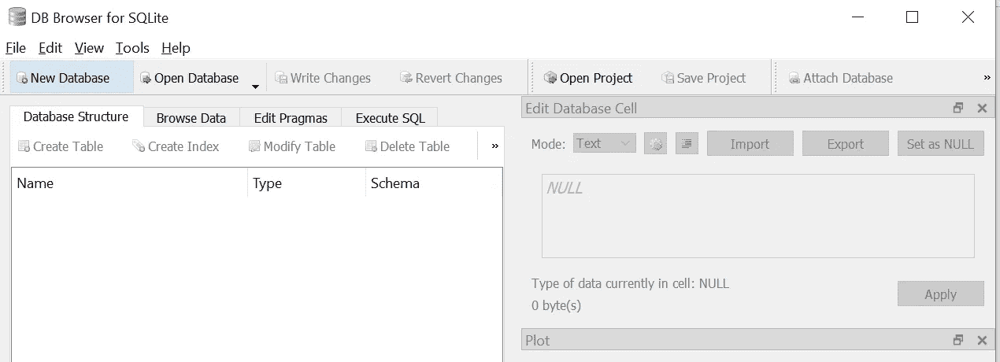
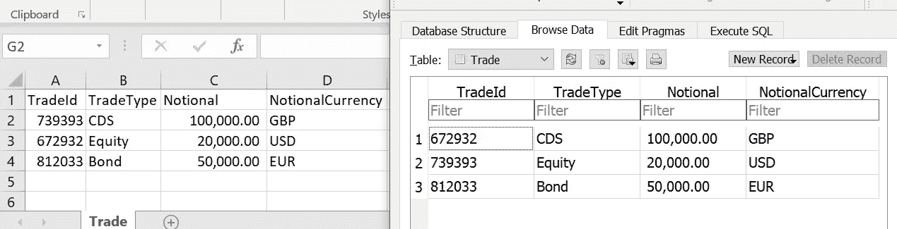
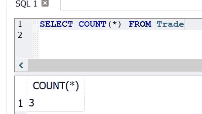
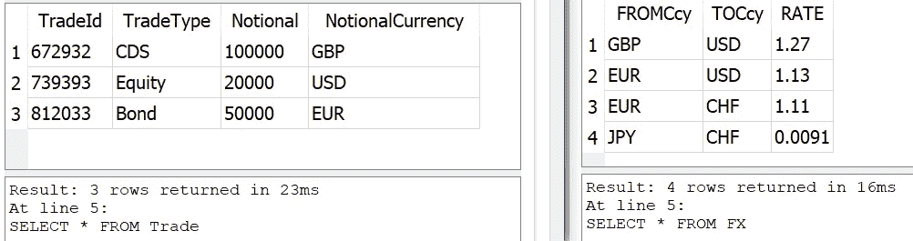
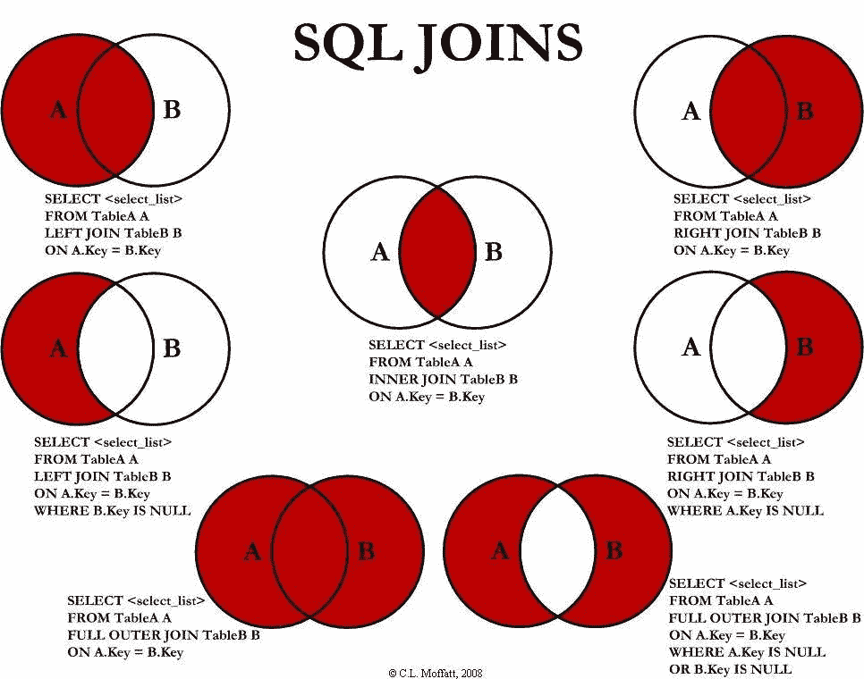
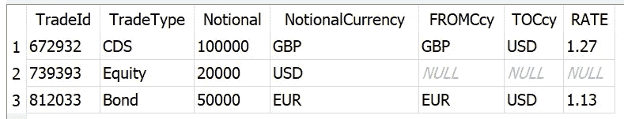
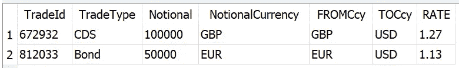
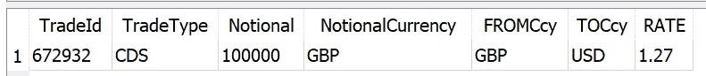
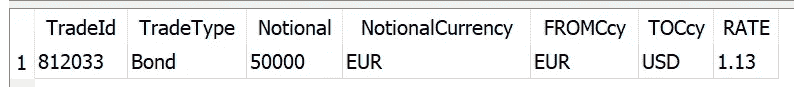
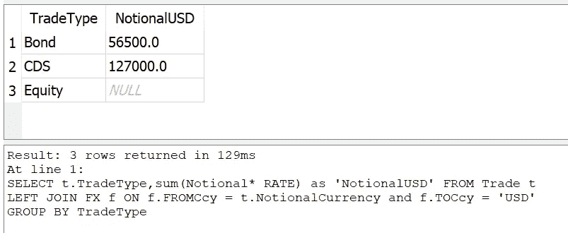

# SQL:简介

> 原文：<https://towardsdatascience.com/an-introduction-to-sql-4c9eb27995df?source=collection_archive---------12----------------------->

## 通过示例学习 SQL 的基础知识

SQL 代表*结构化查询语言*，它主要用于关系数据库。它是您可以用来与数据库通信和检索数据的语言。尽管已经有了标准化的尝试，但是你经常会发现不同关系数据库之间的差异。然而，大多数基本陈述在所有这些方面都是相同的。

一些最流行的付费关系数据库包括 Microsoft SQL Server、Oracle 和 Sybase。然而，也有许多免费的 SQL 数据库。MySQL、PostgreSQL 和 SQLite 就是这样的例子。在本文中，我们将使用 SQLite 来介绍 SQL。


Photo by [Shahadat Shemul](https://unsplash.com/@shemul?utm_source=medium&utm_medium=referral) on [Unsplash](https://unsplash.com?utm_source=medium&utm_medium=referral)

# 为什么要学习 SQL

学习 SQL 是一件非常有用的事情，可以帮助你与数据库进行交互。这样，您可以轻松快速地处理大型数据集。很多分析工作都在寻找具备 SQL 知识的候选人。如果你想离开 excel，它也非常适合数据分析。

# 建立

在我们继续学习 SQL 示例之前，我将解释如何建立自己的 SQLite 数据库，以便您可以了解我们所学的内容。你需要做的第一件事是安装一个 [SQLite 浏览器](https://sqlitebrowser.org/)。

安装并运行它之后，您应该能够看到以下内容:



SQLite Browser

要创建一个新的数据库，您只需点击“新建数据库”并选择一个保存位置。然后，您可以继续创建任何包含数据的表。

如果您想使用 Python 将数据传输到数据库，请查看我以前的文章:

[](https://medium.com/financeexplained/from-excel-to-databases-with-python-c6f70bdc509b) [## 用 Python 从 Excel 到数据库

### 了解如何使用 Python 进行快速数据分析

medium.com](https://medium.com/financeexplained/from-excel-to-databases-with-python-c6f70bdc509b) 

# 桌子

当谈到关系数据库时，你有一个表的概念。你可以把一个表想象成一个数据的集合；或者，如果您熟悉 excel，您可以将其视为 Excel 工作表。

每个表都有一个名称和一个已定义的结构。让我们看一个例子。下面的 Excel 工作表，可以变成 SQL 表。



Excel Worksheet on the left and a db table on the right

为了创建表，我们需要运行一个 SQL 命令:

```
CREATE TABLE "Trade" (
 "TradeId" INTEGER,
 "TradeType" TEXT,
 "Notional" NUMERIC,
 "NotionalCurrency" TEXT,
 PRIMARY KEY("TradeId")
);
```

正如您所看到的，SQL 倾向于以一个*动作词*开始，后面是您想要操作的表。一旦我们创建了表，我们需要插入数据。我们可以通过以下命令来实现:

```
INSERT INTO "Trade" (
 "TradeId",
 "TradeType",
 "Notional",
 "NotionalCurrency"
)
VALUES
 ("672932","CDS","100000","GBP"),
 ("739393","Equity", "20000", "USD"),
 ("812033", "Bond", "50000", "EUR");
```


Photo by [Mathew Schwartz](https://unsplash.com/@cadop?utm_source=medium&utm_medium=referral) on [Unsplash](https://unsplash.com/?utm_source=medium&utm_medium=referral)

# 从数据库中检索数据

大多数情况下，数据库会被建立起来，您需要做的就是从数据库中查询数据。假设您需要查看表交易下的所有数据，您需要做的就是:

```
SELECT * FROM Trade
```

语句中的*表示您希望看到所有列。但是，如果您只想查看其中的两列，则必须显式选择它们:

```
SELECT TradeId, TradeType FROM Trade
```

# 限制返回的数据

然而，有时您并不知道该表下有多少数据，您首先要做的就是确定数据看起来像什么。因此，您可能希望将返回的数据限制在前 5 个条目中。你可以通过跑步做到这一点

```
SELECT * FROM Trade
LIMIT 5
```

在其他 SQL 版本中，如 MS Server 和 Sybase，这可以通过运行以下命令来实现:

```
SELECT TOP 5 * from Trade
```

# 找出表格中有多少行

在运行 SELECT 语句之前，您可能想知道将返回多少条记录；因此，您想知道表中有多少行。您可以通过运行以下命令找到答案:

```
SELECT COUNT(*) FROM Trade
```

给予:



# 跨表工作

一旦在不同的表中有了数据，您可能会决定要查看来自两个不同表的信息。方法是通过一个叫做 *JOIN* 的操作。让我们探索一下这是如何工作的。

# 表格和数据设置

假设您有一个名为 Trades 的表和一个名为 FX 的表，如下所示:



它是由以下人员编写的:

```
CREATE TABLE "FX" (
 "FROMCcy" TEXT,
 "TOCcy" TEXT,
 "RATE" NUMERIC,
 PRIMARY KEY("FROMCcy","TOCcy")
);
INSERT INTO "FX" (
 "FROMCcy",
 "TOCcy",
 "RATE"
)
VALUES
 ("GBP","USD","1.27"),
 ("EUR","USD", "1.13"),
 ("EUR", "CHF", "1.1"),
 ("JPY", "CHF", "0.0091");
```

如何将这两个数据集结合在一起？

# SQL 联接的类型

有许多不同类型的连接；每一个都给你一种不同的方式将数据整合在一起。下图对此进行了最好的描述:



Compliments of reddit.com

# 左连接

左连接允许您查看出现在*左表*中的所有数据，或者您在连接中提到的第一个表，以及来自*右表的任何匹配数据。*

让我们看一个例子，我们想知道将我们的交易转换成美元所需的汇率。

```
SELECT * FROM Trade t
LEFT JOIN FX f ON f.FROMCcy = t.NotionalCurrency and f.TOCcy = 'USD'
```

请注意我是如何在特定属性(货币和名义货币)上定义贸易和外汇之间的左连接的，同时我将结果集限制为货币美元。



您可能已经注意到，第二行没有任何关于 FX 的信息；它回来时一片空白。这是因为，它在“右”表中找不到任何东西，而左连接允许显示来自交易的所有信息。

# 右连接

让我们看看当我们把左连接改为右连接时会发生什么。(注意:在大多数 SQL 客户机中，右连接就是简单的连接)。

```
SELECT * FROM Trade t
JOIN FX f ON f.FROMCcy = t.NotionalCurrency and f.TOCcy = 'USD'
```

导致:



如您所见，只返回了两行。其原因是因为从“右”表中只找到两个匹配。

其他类型的联接包括完全外部联接和交叉联接。

# 将两组结果放在一起

有时，您可能决定将两个不同的结果集放在一起。例如，假设你有两组结果，CDS:

```
SELECT * FROM Trade t
LEFT JOIN FX f ON f.FROMCcy = t.NotionalCurrency and f.TOCcy = 'USD'
WHERE TradeType = 'CDS'
```



然后是一组结果键:

```
SELECT * FROM Trade t
LEFT JOIN FX f ON f.FROMCcy = t.NotionalCurrency and f.TOCcy = 'USD'
WHERE TradeType = 'Bond'
```



显然，如果我们想把它们放在一起，我们可以把等号改成 In 语句

```
SELECT * FROM Trade t
LEFT JOIN FX f ON f.FROMCcy = t.NotionalCurrency and f.TOCcy = 'USD'
WHERE TradeType IN ('Bond', 'CDS')
```

但是，假设这两个查询完全不同，我们可以使用 UNION 操作:

```
SELECT * FROM Trade t
LEFT JOIN FX f ON f.FROMCcy = t.NotionalCurrency and f.TOCcy = 'USD'
WHERE TradeType = 'Bond'
UNION
SELECT * FROM Trade t
LEFT JOIN FX f ON f.FROMCcy = t.NotionalCurrency and f.TOCcy = 'USD'
WHERE TradeType = 'CDS'
```

只要两个结果查询返回相同的属性，您就可以联合它们。


Photo by [Vincent Botta](https://unsplash.com/@0asa?utm_source=medium&utm_medium=referral) on [Unsplash](https://unsplash.com?utm_source=medium&utm_medium=referral)

# 聚合函数

最后，在介绍 SQL 时，您需要知道的最后一件事是聚合函数，特别是 GROUP BY 语句。

让我们看一个简单的例子。假设您想知道我们的交易表中所有交易类型的总和:

```
SELECT t.TradeType,sum(Notional* RATE) as 'NotionalUSD' FROM Trade t
LEFT JOIN FX f ON f.FROMCcy = t.NotionalCurrency and f.TOCcy = 'USD'
GROUP BY TradeType
```



注意，我们在 SELECT 和 group GROUP BY 语句中都指定了 TradeType。股权再次回到空白，因为它乘以名义美元与'零'从左边加入外汇汇率。

至此，您应该可以开始使用 SQL 了。