# 奇异值分解及其广泛应用简介

> 原文：<https://towardsdatascience.com/an-introduction-to-svd-and-its-widely-used-applications-f5b8f19cb6cb?source=collection_archive---------14----------------------->

如果您在数据科学领域(或与之接近)，即使您没有使用过 SVD，您也可能已经听过一千遍了。无论是对于 PCA(主成分分析)还是推荐算法，SVD 都是一种强大的技术，目前广泛应用于许多模型中——我们将描述它是什么，并展示它如何在一些关键方法中使用。

注意:我们不讨论代码部分，只讨论理论。

# 什么是 SVD？

SVD 的意思是**奇异值分解**。维数为 *n×d* 的矩阵 *X* 的 SVD 由下式给出:

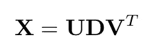

其中:

*   *U* 和 *V* 为直角正交；

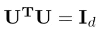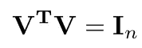

*   *D* 为尺寸 *d×n* 的对角线

一些附加说明:

*   **D 不一定是正方形**
*   矩阵的奇异值分解可以在**对任何矩阵进行**
*   奇异值分解**不同于矩阵的特征值分解**。

我们来定义一个矩阵的**特征值分解**。首先，对于一个矩阵 *X* 它存在当且仅当 *X* 是平方的并且特征向量在矩阵维数空间中形成一个基。如果是这种情况，那么可以写:

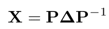

其中 *P* 是特征向量的矩阵，D *elta* 是 *X* 的特征值的对角矩阵——这里 D *elta* 是平方。

在某种意义上， **SVD 是特征值分解**的推广，因为它可以应用于任何矩阵。

# 主成分分析中使用的奇异值分解

PCA 表示**主成分分析**。给定一个输入矩阵 *X* ，它包括**寻找作为原始坐标的线性组合的分量** *p_i* :

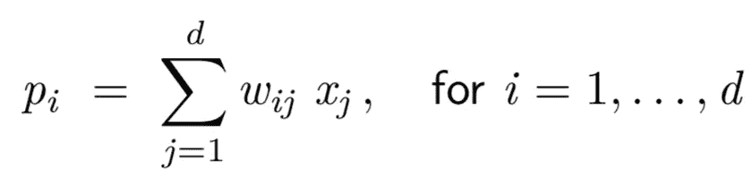

以这样的方式:

*   分量为**正交** ( *E[p_ip_j]=0* )
*   组件以这样的方式**排序**，即*P1*解释了最大的方差百分比，而*p2*解释了第二大的方差百分比(这一点没有被*P1*解释)等等。

我们这里假设 ***X* 归一化**(每个特征*E(X _ I)= 0**Var(X _ I)= 1*)。

可以看出，分量 p 由下式给出

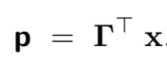

其中*γ*是对 *X* 的方差-协方差矩阵进行**特征值分解时找到的矩阵。注意，这是可能的，因为方差-协方差矩阵是对称的，并且**任何对称矩阵都有特征值分解**。还要注意的是， *Gamma* 的正交性意味着**

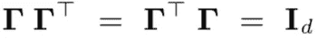

还要注意，因为 *E(x)=0* ， *E(p)=0* 。和

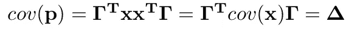

其中 **D *elta* 是按降序排列的 *X* 的方差-协方差矩阵**的特征值的矩阵。这里要记住的关键是**X 的主成分是通过使用方差-协方差矩阵**的特征向量的线性变换得到的。

一旦我们有了组件，我们可以通过只保留顶部的 *k* ( *k* 是任意的)组件来减少我们的数据。

> 但是我们真的需要计算这个特征值分解吗？

不要！这就是 SVD 的用武之地。实际上，使用上面的 SVD 公式，方差-协方差矩阵的**特征向量由 *X* 的 SVD 的矩阵 *U*** 给出。并且**特征值是来自 *X* 的 SVD 的奇异值**的平方。

因此我们可以**使用 SVD 来执行 PCA** ，并且保持 *X* 的顶部 *k* 奇异值近似给定的顶部 *k* 主分量。

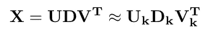

在一些常见情况下，通过 SVD 进行 **PCA 在数值上比通过方差-协方差矩阵的特征值分解更有效**(计算方差-协方差矩阵需要一些额外的时间)。

# 矩阵补全中使用的奇异值分解

对于大多数推荐算法，输入矩阵非常稀疏，矩阵分解方法是关键，因为空间需要“减少”到一个更小的潜在空间。奇异值分解在其中起着核心作用。

一般的矩阵分解问题表述为

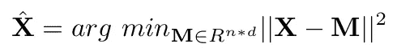

在约束条件**下，M** 的秩小于或等于任意整数 *r* 。人们可以证明这个问题的**解**是

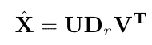

在哪里

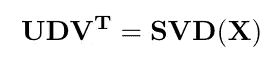

并且 *D_r* 是通过仅保留第一个 *r* 奇异值而从 *D* 构建的。

人们可以注意到，当矩阵 *X* 有缺失值时，我们不容易解决上述问题。有几种方法可以解决这个问题。其中之一是从一个初始解开始，通过做 SVDs 迭代，直到收敛。我们不会在这里讨论这些方法的细节，但是底线是 **SVD 也可以用于矩阵补全，**因为它涉及到矩阵分解。