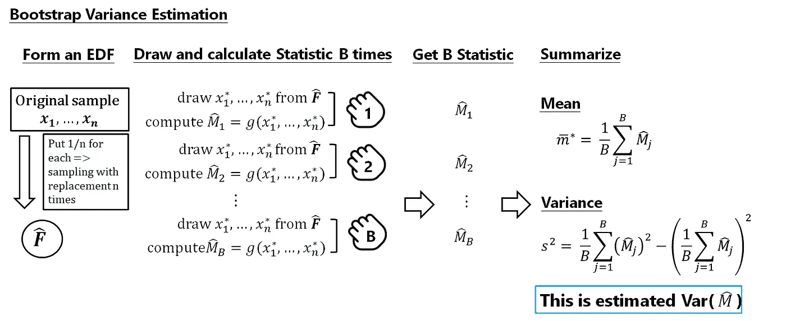

# 自助法简介

> 原文：<https://towardsdatascience.com/an-introduction-to-the-bootstrap-method-58bcb51b4d60?source=collection_archive---------0----------------------->

## 关于 bootstrap 方法、动机及其工作原理的探讨


Bootstrap 是一种强大的基于计算机的统计推断方法，它不依赖于太多的假设。我第一次应用自举方法是在一个 A/B 测试项目中。当时我就像是使用了一种强大的魔法，仅仅从一个样本数据就形成了一个抽样分布。我的统计推断不需要公式。不仅如此，事实上，它还广泛应用于其他统计推断如置信区间、回归模型，甚至机器学习领域。这使我通过一些关于 bootstrap 的研究，用比我的理论数理统计课更实际的知识来补充统计推断知识。

本文主要介绍 Bootstrap 的核心概念及其应用。但是一些嵌入代码将被用作说明的概念。我们将介绍 bootstrap 重采样方法，然后说明 Bradley Efron(1979)提出 Bootstrap 的动机，并说明 Bootstrap 的一般思想。

# 相关基础知识

事实上，bootstrap 背后的思想包含了太多需要关注的统计主题。然而，这是一个回顾一些统计推断概念的好机会！相关的统计概念包括:

*   基础微积分和函数的概念
*   均值、方差和标准差
*   分布函数和概率密度函数
*   抽样分布
*   中心极限理论、大数定律和依概率收敛
*   统计泛函、经验分布函数和插入原理

具备以上一些基础知识将有助于获得 bootstrap 背后的基本概念。有些想法可能会涉及到高级统计，但我会用一种简单的方式，而不是非常正式的数学表达式来说明基本的想法，尽可能简单。如果你想了解更多关于这些概念的知识，文章末尾会提供一些链接。

# 自助抽样方法

bootstrap 的基本思想是在样本数据上对总体参数 *θ* (如总体均值)的一个**估计**(如样本均值)进行推断。它是一种重采样方法，通过从具有相同样本大小 n 的现有样本数据中独立地进行替换采样，并在这些重采样数据之间执行推理。

通常，引导包括以下步骤:


1.  样本量为 n 的总体样本。
2.  从原始样本数据**中抽取一个样本，替换为大小为 n 的**，复制 B 次，每个重新抽样的样本称为一个 Bootstrap 样本，总共有 B 个 Bootstrap 样本。
3.  评估每个 Bootstrap 样本的 *θ* 的**统计量**，总共会有 *θ* 的 B 估计。
4.  用这些最佳 Bootstrap 统计数据构建一个**抽样分布**,并使用它进行进一步的统计推断，例如:

*   估计 *θ的统计标准误差。*
*   获得 *θ* 的置信区间。

我们可以看到，我们通过对现有样本进行重新采样来生成新的数据点，并根据这些新的数据点做出推断。

【bootstrap 如何工作以及为什么工作？

在本文中，我将这个大问题分成三个部分:

1.  Efron 推出 bootstrap 的**最初动机**是什么？
2.  为什么使用**模拟技术**？换句话说，如何通过重采样找到统计量的估计方差？
3.  我们需要从原始样品**中抽取一个样品并替换**的主要想法是什么？

# **一、初始动机——估计者的标准误差**

bootstrap 技术的核心思想是借助现代计算机能力进行某种统计推断。当 Efron 引入该方法时，它特别受到统计推断领域中评估者的**准确性的激励。通常，估计标准误差是批判性思考统计估计准确性的第一步。**

现在，为了说明 bootstrap 是如何工作的以及估计量的标准误差是如何起重要作用的，让我们从一个简单的例子开始。

## 情景案例

> 想象一下，你想总结 100 名学生每天在你的实验室拿起智能手机的次数。很难像人口普查那样统计整个实验室的皮卡数量。取而代之的是，你可以做一个在线调查，这个调查还提供了一个计数应用程序。在接下来的几天里，你会收到 30 名学生的回复，告知他们在某一天的接送次数。你计算了这 30 个拾音器的**平均值**，得到拾音器的**估计值为 228.06 倍。**

Codes for this case, just feel free to check out.

在统计学领域，上述过程称为**点估计**。我们想知道的是整个实验室中皮卡的真实数量。我们没有人口普查数据，我们能做的只是通过一个基于观察样本的**估计器**来评估**人口参数**，然后得到一个**估计值**作为对实验室中智能手机平均使用情况的评估。

*   **估计量/统计量**:计算估计量的规则**。**在这种情况下是样本平均值，通常表示为 *X̄* 。
*   **总体参数:**总体的数字汇总。在这种情况下，是我们实验室每天接听电话的平均时间，通常表示为 *μ* 。

一个关键问题是——**这个估算结果有多准确？**

由于*，实际上 ***X̄ = μ*** 发生 ***的情况几乎不会发生。*** 因此 ***，*** 除了报告点估计值外，还应给出一些关于精度的指示。衡量准确性的常用标准是估计值的标准误差。*

## *标准误差*

*估计量的*标准误差*是它的标准偏差。它告诉我们你的样本估计值偏离实际参数的程度。如果标准误差本身涉及未知参数，我们使用*估计标准误差* 通过用参数的估计值替换未知参数。*

*我们举个例子。在我们的例子中，我们的估计量是样本均值，对于样本均值(而且几乎只有一个！)，我们有一个简单的公式很容易获得它的标准误差。*

**

*然而，在现实世界中，总体的标准差 *σ* 总是**未知的**，因此最常见的度量是 ***估计标准差、*** 使用样本标准差 *S* 作为总体的估计标准差:*

**

*在我们的例子中，我们有 30 个样本，样本均值为 228.06，样本标准差为 166.97，因此我们的*估计样本均值的标准差为**166.97**//**√30 = 30.48。**

## **统计推断中的标准误差**

**现在我们已经得到了我们的估计标准误差。如何在统计推断中使用标准误差？我们用一个简单的例子来说明。**

**粗略地说，如果一个估计量具有**正态分布或近似正态分布**，那么我们期望我们的估计在大约 68%的时间里与其期望值相差不到一个标准误差，在大约 95%的时间里相差不到两个标准误差。**

**在我们的例子中，回想一下我们收集的样本是 30 个响应样本，这在经验法则中是足够大的，**中心极限定理**告诉我们 X̄的抽样分布是非常接近正态分布。结合估计的标准误差，我们可以得到:**

> **我们有理由相信，学生每天在我们实验室拿起智能手机的平均次数 *μ的真实值*，位于 X̄的大约 2 个标准误差之内，即(228.06-2×30.48，228.06+2×30.48) = (167.1，289.02)。**

## **统计世界中的理想与现实**

**我们已经做出了统计推断。然而，这一推论是如何顺利进行的是在一些严格的假设下。**

****

**让我们回忆一下到目前为止我们可能用过的假设或经典定理:**

*   **我们的样本均值的标准差**可以很容易地估计，**我们使用样本的标准差作为估计量，并通过一个简单的公式来获得估计的标准差。**
*   **我们假设我们知道或者能够估计估计者的总体。在我们的例子中是近似的正态分布。**

**然而，在我们的现实世界中，有时很难满足如上的假设或定理:**

*   **很难知道关于人口或人口分布的信息。**
*   **一般来说，估计值的标准误差很难估计。**很多时候，没有像样本均值的标准差**这样精确的公式。如果现在，我们要对智能手机拾音器的*中值*做一个推断，样本*中值*的标准误差是多少？**

**这就是 bootstrap 解决这类问题的原因。当这些假设被违反时，或者当不存在估计标准误差的公式时，bootstrap 是强有力的选择。**

# **二。**关于引导程序的说明****

**为了说明主要概念，下面的解释将发展一些数学定义和外延，这是一种非正式的，以提供更多的直觉和理解。**

## **1.初始场景**

**假设我们要估计我们的统计量的标准误差来作出一个关于总体参数的推断，如用于构造相应的置信区间(就像我们以前所做的一样！).并且:**

*   **我们对人口一无所知。**
*   **没有精确的公式来估计统计的标准误差**。****

**设X1，X2，…，Xn 是分布函数为 F ***的总体 P 中的随机样本。*** 和 ***M* = g(X1，X2，…，Xn)** ，是我们感兴趣的参数的**统计量，**意味着统计量是样本数据 X1，X2，…，Xn 的函数。我们想知道的是*M*的**方差**，记为 Var(M)。****

*   ***首先，由于我们对总体一无所知，我们无法确定 Var(M) 的值，这需要已知总体*、*的参数，所以我们需要估计 Var(M) *、*的估计标准差*、*表示为*、* EST_Var(M)。(还记得样本均值的估计标准差吗？)***
*   **第二，在现实世界中，除了样本均值之外，我们总是没有一个简单的公式来计算 EST_Var(M) 。**

**这就导致我们需要**近似**EST _ Var(M)*。* 如何？在回答这个问题之前，让我们先介绍一种常见的实用方法是**模拟，假设我们知道 P** 。**

## **2.模拟**

**先说模拟的思路。借助计算机获得有关统计抽样分布的信息是很有用的。但是它有一个重要的假设——假设我们知道人口**

***现在，假设 X1，X2，…，Xn 是来自总体的随机样本，并假设 M= g(X1，X2，…，Xn)是感兴趣的统计量**，**，我们可以通过如下模拟来近似统计量 ***M*** 的均值和方差:***

1.  **从 P **中抽取大小为 n 的随机样本。****
2.  **计算样本的统计数据。**
3.  **流程 1 重复 B 次。和 2，并得到 B 统计量。**
4.  **得到这些 B 统计量的**平均值**和**方差**。**

****

*****这个模拟为什么会起作用？*** 从一个经典定理开始， ***大数定律* :****

*   **当 B → ∞ *时，这些 B 统计值的平均值收敛到统计值的真实平均值 *M* 。***

*并通过大数定律和几个与**依概率收敛**有关的定理:*

*   *当 B → ∞ *时，这些 B 统计量的样本方差收敛于统计量 *M* 的真实方差。**

**

*借助计算机，我们可以使 B 尽可能大，以逼近统计量 M 的抽样分布。*

*下面是在前面的电话拾音案例中模拟的示例 Python 代码。我使用 B=100000，样本平均值的模拟平均值和标准误差非常接近最后两个单元格中的理论结果。请随意退房。*

*Example codes for simulation applied with the previous phone-picks case start from cell [10].*

## *3.经验分布函数和插入原理*

*我们已经学会了模拟的概念。现在，我们是否可以通过模拟的方式**近似***EST _ Var(M)**？不幸的是，要做上面的模拟，我们需要知道人口 P *的信息。*事实是，我们对 p 一无所知。为了解决这个问题，采用了 bootstrap 方法中最重要的组件之一:**

**用**经验分布函数**逼近总体**、**的**分布函数**，应用**插入原理得到** Var(M)的估计值——即**插入估计量**。**

## **(1)经验分布函数**

****经验分布函数(EDF)** 的思想是从现有数据集构建分布函数(CDF)。EDF 通常非常接近 CDF，特别是对于大样本量。事实上，在实际中，这是一种估计随机变量 CDF 的常用而有用的方法。**

**EDF 是一个离散分布，它给每个数据点赋予相等的权重(即，它给原始 n 个观测值中的每一个赋予 1/ n 的概率)，并形成一个累积分布函数，该函数是一个阶跃函数，在每个 *n* 数据点上跳跃 1/ *n* 。**

****

## **(2)统计功能**

**Bootstrap 使用 EDF 作为人口 CDF 的估计值*。*然而，我们知道 EDF 是一种累积分布函数(CDF)。**为了应用 EDF 作为我们统计 M** 、**的估计量，我们需要将 M 的形式作为 CDF 类型的函数，甚至感兴趣的参数**、**也要有一些基线。**要做到这一点，一个常见的方法是称为统计泛函的概念。粗略地说，统计泛函是分布函数的任何函数。让我们举个例子:**

**假设我们对人口的参数感兴趣。在统计领域，总有这样一种情况，感兴趣的**参数是分布函数**的函数，这些被称为统计泛函。下面列出了总体平均值 E(X)是一个统计函数:**

****

**从上面我们可以看出，总体 E(X)的均值也可以表示为总体的 CDF 的一个**形式 *F —*** 这是的一个统计泛函。当然，这个表达式可以应用于均值以外的任何函数，比如方差。**

****

**统计函数可以看作是描述总体特征的量。F 的均值、方差、中位数、分位数是总体的特征。因此，使用统计泛函，我们有一个更严格的方法来定义人口参数的概念。因此，我们可以说，我们的统计量 M 可以是:M=g(F)，用人口 CDF F。**

## ****(3)插件原理=** EDF +统计泛函**

**我们已经使我们的统计量 is *M* = g(X1，X2，…，Xn)=g(F)成为一个统计函数形式。但是，我们不知道 F。所以我们必须为 F“插入”一个估计量，“到”我们的 M=g(F)，以便使这个 M 可以被评估。**

**叫做**插件原理。**一般来说，插入原理是一种通过评估相同的泛函，从总体分布中**估计统计泛函**的方法，但是使用基于样本的经验分布。该估计被称为感兴趣的总体参数的**插件估计**。例如，总体分布的中值可以由样本的经验分布的中值来近似。这里的经验分布是由样本形成的，因为我们不知道人口。简单来说:**

*   **如果我们感兴趣的参数，比如θ，具有统计函数形式θ=g(F)，其中 F 是总体 CDF。**
*   **θ=g(F)的插入式估计量定义为θ_hat=g(F_hat):**

****

*   **从上式可以看出，我们将θ_hat 和 F_hat“代入”未知的θ和 F，这里的 F_hat 纯粹是由样本数据估计的。**
*   ****注意，θ和θ_hat 都是由同一个函数 g(.).****

**下面举个刻薄的例子，我们可以看到 g(。)表示平均值，即所有数据点的平均值，它也适用于样本平均值。这里的 F_hat 是作为 f 的估计量的样本形式。我们说样本均值是总体均值的插入估计量。(更明确的结果将很快提供。)**

****

**那么，F_hat 是什么？还记得 bootstrap 使用经验分布函数(EDF)作为人口 CDF 的估计值吗？事实上，EDF 也是一种常用的估计器，广泛应用于 F_hat 的插入式原理中。**

**让我们看看，如果我们将 EDF 插入其中，我们的估计器 *M* = g(X1，X2，…，Xn)=g(F)会是什么样子。**

*   **设感兴趣的统计量是 M=g(X1，X2，…，Xn)= g(F)来自一个总体 CDF F**
*   **我们不知道 F，所以我们为 M 建立一个插入式估计量，M 变成 M_hat= g(F_hat)。让我们重写 M_hat 如下:**

****

**我们知道 EDF 是一个离散分布，通过概率质量函数 **PMF** 将概率 1/ n 分配给 n 个观测值中的每一个，因此据此，M_hat 变为:**

****

**据此，对于我们的均值例子，我们可以发现均值的插入估计量 **μ** 就是样本均值:**

****

**因此，我们通过插入原理，对 M=g(F)作出估计，比如说 M_hat=g(F_hat)。记住，我们要找出的是 Var(M)，我们用 Var(M_hat)来逼近 Var(M)。但是一般情况下，除了样本均值，Var(M_hat)没有精确的公式！它引导我们应用一个模拟。**

## **(4)自助方差估计**

**快到最后一步了！让我们用插件原理概念来刷新整个过程。**

**我们的目标是估计我们的估计量 M 的 ***方差，也就是 Var(M)。*** 自举原理如下:**

1.  **我们不知道人口P 与 CDF 表示为 F，所以 bootstrap 使用**经验分布函数(EDF)作为 F 的估计值。****
2.  **使用我们现有的样本数据形成一个 EDF 作为估计人口。**
3.  **应用插入原理使 M=g(F)可以用 EDF 计算。因此，M=g(F)成为M_hat= g(F_hat) **，**它是带 EDF 的插入式估计器— F_hat。**
4.  **取**模拟**到**近似为** ***Var(M_hat)* 。****

**回想一下，要进行原始版本的模拟，我们需要从总体中抽取一个样本数据，从中获得一个统计量 M=g(F ),并将该过程重复 B 次，然后获得这些 B 统计量的方差，以逼近统计量的真实方差。**

**因此，要在步骤 4 中进行模拟，我们需要:**

1.  **从 **EDF 中提取样本数据。****
2.  **获得一个**插件**统计 M_hat= g(F_hat)。**
3.  **重复两个程序 B 次。**
4.  **得到这些 B 统计量的方差，**来逼近插件统计量**的真实方差。(这是一个容易混淆的部分。)**

**什么是**模拟？其实就是我们在本文开头提到的 bootstrap 抽样过程！****

**这里两个问题(我保证这是最后两个！):**

1.  ****在步骤 1 中，从 EDF 中提取看起来如何？****
2.  **这个模拟是如何工作的？**

## ****EDF 的图纸看起来怎么样？****

**我们知道 EDF 从现有样本数据 X1，…，Xn 构建 CDF，根据定义，它在每个样本数据点放置质量 1/n。因此，从 EDF 中抽取一个随机样本，可以看作是从我们现有的样本数据 X1，…，Xn 中抽取 n 个观察值，并进行替换。**这就是为什么如上所示，使用替换对引导样本进行采样。****

## **模拟是如何工作的？**

**插件估计量 M_hat=g(F_hat)的**方差**就是 bootstrap 模拟想要模拟的。在模拟的开始，我们从现有的样本数据 X1，…，Xn 中得出替换的观察值。让我们将这些重采样数据表示为 X1*，…，Xn*。现在，让我们再次将 bootstrap 模拟与我们的原始模拟版本进行比较。**

**Var(M=g(F))的原始模拟过程:**

```
****Original Simulation Version- Approximate EST_Var(M|F) with known F**Let X1, X2, … , Xn be a random sample from a population *P* and assume *M*= g(X1, X2, …, Xn) is the statistic of interest, we could approximate variance of statistic *M* by simulation as follows:1\. Draw random sample with size n from P.
2\. Compute statistic for the sample.
3\. Replicate B times for process 1\. and 2 and get B statistics.
4\. Get the variance for these B statistics.**
```

****

**Same with previous Simulation part for simulating Var(M).**

**Var(M_hat=g(F_hat))的自举模拟**

```
****Bootstrap Simulation Version- Approximate Var(M_hat|F_hat) with EDF**Now let X1, X2, … , Xn be a random sample from a population *P with CDF F,* and assume *M*= g(X1, X2, …, Xn ;F) is the statistic of interest. But we don't know F, so we:1.Form a EDF from the existing sample data by draw observations with replacement from our existing sample data X1, …, Xn. These are denote as X1*, X2*, …, Xn*. We call this is a bootstrap sample.2.Compute statistic *M_hat*= g(X1*, X2*, …, Xn* ;F_hat) for the bootstrap sample.3\. Replicate B times for steps 2 and 3, and get B statistics M_hat.4\. Get the variance for these B statistics to approximate the **Var(M_hat)**.**
```

****

**Simulating for Var(M_hat).**

**你对上述流程熟悉吗？其实和我们之前说的 bootstrap 抽样法的过程是一样的！**

# **三。引导程序的工作原理是什么？**

**最后，让我们看看我们的模拟将如何工作。**我们从这个 bootstrap 模拟中得到的近似值是针对 Var(M_hat)** 的，但我们真正关心的是 **Var(M_hat)能否逼近 Var(M)。**所以这里有两个问题:**

1.  ****将 bootstrap 方差模拟结果，即 S** ，**能很好地近似为 Var(M_hat)？****
2.  ******Var(M _ hat)能近似为 Var(M)吗？******

****为了回答这个问题，让我们用一个图表来说明这两种类型的模拟误差:****

********

1.  ****从 bootstrap 方差估计中，我们将得到 Var(M_hat)的估计—Var(M)的插入估计。而大数定律告诉我们，如果我们的模拟次数 B 足够大，bootstrap 方差估计 S，是 Var(M_hat)的一个很好的近似。幸运的是，借助计算机，我们可以随心所欲地得到一个更大的 B。所以这个模拟误差可以很小。****
2.  ****M_hat 的方差，是 M 相对于真实 f 的方差的插入式估计。**是 Var(M _ hat；f _ hat)Var(M；F)** ？换句话说，插入式估计量是否与感兴趣的估计量非常接近？这是我们真正关心的关键点。事实上，插入估计量的渐近性质这一主题属于高级数理统计范畴。但是让我们解释一下主要的问题和想法。****

*   ****首先，我们知道如果样本量很大，比如说 F_hat → F，经验分布将很好地收敛到真实分布函数。****
*   ****第二，如果 F_hat → F，并且如果是对应的统计函数 g(。)是一个**平滑度条件，那么** g(F_hat) → g(F)。在我们的例子中，统计函数 g(。)是*方差*，满足所需的连续性条件。因此，这解释了为什么 bootstrap 方差是估计量 m 的真实方差的良好估计。****

****一般来说，一些泛函上的**光滑条件**很难验证。幸运的是，大多数常见的统计函数，如均值、方差或矩，都满足所需的连续性条件。它规定自举是可行的。当然，尽可能使原始样本量不要太小。****

****以下是我的自举样本代码的皮卡情况下，觉得自由检查。****

# ****自举概述****

****让我们用下图回顾一下 bootstrap 的主要思想！****

********

****到目前为止，我知道有大量的统计概念并不容易。但是理解一个方法背后的基本概念可以让我们在应用它的时候有一个正确的方向。毕竟，Bootstrap 已经被应用到更广泛的实际案例中，从基础部分开始学习更有建设性。感谢阅读到目前为止，希望这篇文章有所帮助！如果我有任何错误，请留下您的评论:)！****

# ******参考******

****Efron 的最有帮助的书，有更一般的 Bootstrap 的概念和它如何连接到统计推断。****

*   ****[自举简介](https://www.amazon.com/gp/product/0412042312?ie=UTF8&linkCode=as2&camp=1634&creative=6738&tag=thstge-20&creativeASIN=0412042312)****

****也是一本有用的书，从 EDF 到 Bootstrap 方法****

*   ****[所有的统计:统计推断简明教程](https://www.amazon.com/All-Statistics-Statistical-Inference-Springer/dp/1441923225)****

****其他书籍:****

*   ****[Bootstrap 方法及其应用](https://www.amazon.com/gp/product/0521574714?ie=UTF8&linkCode=as2&camp=1634&creative=6738&tag=thstge-20&creativeASIN=0521574714)****
*   ****[介绍 Bootstrap 方法及其在 R 上的应用](https://www.amazon.com/Introduction-Bootstrap-Methods-Applications/dp/0470467045)****

****经验分布函数和插入原理****

*   ****[http://faculty . Washington . edu/yen chic/17Sp _ 403/le C9 _ theory . pdf](http://faculty.washington.edu/yenchic/17Sp_403/Lec9_theory.pdf)****
*   ****[https://www . stat lect . com/渐近理论/经验分布](https://www.statlect.com/asymptotic-theory/empirical-distribution)****
*   ****[http://bjlkeng . github . io/posts/the-experimental-distribution-function/](http://bjlkeng.github.io/posts/the-empirical-distribution-function/)****
*   ****[http://pub.math.leidenuniv.nl/~szabobt/STAN/STAN7.pdf](http://pub.math.leidenuniv.nl/~szabobt/STAN/STAN7.pdf)****

****其他材料****

*   ****[http://www.stat.cmu.edu/~larry/=stat705/Lecture13.pdf](http://www.stat.cmu.edu/~larry/=stat705/Lecture13.pdf)****
*   ****[http://faculty . Washington . edu/yen chic/17Sp _ 403/le C5-bootstrap . pdf](http://faculty.washington.edu/yenchic/17Sp_403/Lec5-bootstrap.pdf)****
*   ****[https://web . as . uky . edu/statistics/users/pbre heny/764-F11/notes/12-6 . pdf](https://web.as.uky.edu/statistics/users/pbreheny/764-F11/notes/12-6.pdf)****