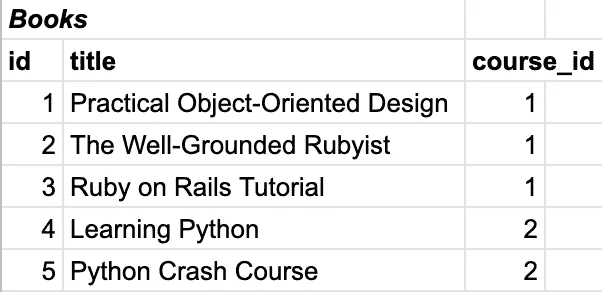

# 关系数据库简介

> 原文：<https://towardsdatascience.com/an-introduction-to-the-relational-database-820e0ab62123?source=collection_archive---------35----------------------->

作为一名数据科学家，您工作的很大一部分是获取您需要操作的数据。在许多公司中，这些数据将存储在一个或多个关系数据库中。本文的目标是介绍关系数据库——什么是关系数据库以及为什么它们在历史上如此受欢迎。

# 不同类型的数据

重要的是要理解有不同类型的数据，每种数据都适用于不同的存储机制。一个常见且重要的特征是区分 ***结构化*** 和 ***非结构化*** 数据。

结构化数据是非常适合电子表格的东西。想象大量带有一致标签的小块信息。例如，地址就是结构化数据。大多数美国地址由相同的五个字段组成——街道地址、第二个地址字段(例如，邮政信箱)、城市、州和邮政编码。

**非结构化数据**是一种你更可能存储在 Word 或 Google doc 中的信息。一篇论文，一份电话记录，一本书的内容。非结构化数据并没有真正分解成可以有效分离或查询的一致的小信息块(与地址相反，您可能希望检索给定城市、州或邮政编码内的所有地址)。

还有半结构化数据——结构化和非结构化数据的混合。如果你去看医生，他们可能会问你的名、姓、体重和身高。这些都是适合电子表格的结构化信息。但也可能有一个大的“注释”字段，其中包含描述医生对您症状的观察的非结构化文本。

在实践中，当您获得更多的非结构化数据时，您可以将它们转换成半结构化数据。如果我只写一篇论文，我可能会以非结构化格式存储，比如 Google doc。如果我负责审查和评分 100 篇论文，我可能会将它们视为半结构化数据，其中包含名、姓、系、提交日期和年级等结构化信息，然后是一个指向提交的 PDF 的链接，以保存论文本身的非结构化文本。

# 它从一个文本文件开始

在微型计算机的早期，如果你想把信息存储到磁盘上，你会把它写到一个文本文件中，或者如果你雄心勃勃，某种更有效的二进制存储格式。实际上，每当你编写一个软件时，你都是在从头开始设计你自己的存储机制。如果你只是想保存*非结构化的*数据，这是相当容易的。当它改变的时候把它写到一个文件中，当你想取回它的时候从文件中读取它。

当你想处理结构化的数据时，问题就出现了。您可以先写出列名，然后以逗号或制表符分隔的格式保存信息。但是，如果您想要检索数据的子集(比如生活在加利福尼亚的所有学生的地址)，这是低效的，因为您必须通读文件中的每一条记录才能找到您想要的记录。

例如，如果您有一个 20，000 名学生的列表，并且想要检索居住在加利福尼亚的 500 名学生，您必须获取所有 20，000 名学生，并且只丢弃不在加利福尼亚的学生。这使得检索操作非常缓慢，尤其是对于大型数据集。这就像有一个装满学生档案的文件柜，不得不取出并放回每一个，只是为了找到哪些人住在某个特定的州。

# 移动到表格

改善这种情况的一种方法是将信息存储在二维表格中——想象一个 Excel 电子表格——列名在顶部，数据在下面的行中。这本身并没有太大的改善，但它让我们能够添加索引，它们会带来很大的不同。

# 添加索引

在关系数据库中，你会得到表和索引。索引允许你说“我关心基于这个字段的值获取信息，让它更快”。它们通过在硬盘上保存附加信息(“指针”)来工作，根据给定字段的值指向记录，并根据索引字段的值快速检索信息。

例如，如果您按城市索引邮寄地址列表，数据库在保存每个新地址时会多花一点时间，因为它必须写入索引。但是，这将使“检索旧金山的所有地址”更快。实际上，我们是在用写性能的一点损失(保存一个东西需要多长时间)换取读性能的显著提高(返回一组记录需要多长时间)。

对于读的次数比写的次数多的数据来说，这是一个特别好的权衡。例如，优化《纽约时报》上一篇文章的读取性能要比优化写入性能重要得多，因为任何给定的故事都只更新几次(假设有一些编辑/更正)，但会被读取数十万次。

尽管索引在大多数关系数据库介绍中并不突出，但它实际上是使这种数据库如此强大和高性能的原因。

# 消除重复

“关系型”数据库的名称来源于拥有多个相关表的想法。这是 Ted Codd 1970 年在 IBM 工作时写的支持这种方法的理论论文。如果你有几分钟的时间，它值得一读。作为一名数据科学家，养成阅读研究论文的习惯将对你大有裨益，其中的数学非常简单！

假设我们想为一所当地社区大学创建一个课程及其相关教材的数据库，以方便学生查找和订购他们需要的书籍。它可能看起来像这样:

你注意到表中的重复了吗？最明显的是，每本书的教授姓名和课程名称都是重复的。首先，这浪费了硬盘空间。这在现在没什么大不了的，但在 1970 年你付钱的时候，这是一个真正的考虑因素！

更重要的是出错的风险。编程中有一个重要的原则叫做“干”——或者[不要重复自己](https://en.wikipedia.org/wiki/Don%27t_repeat_yourself)。这个想法是，如果你在多个地方写相同的代码，在某个时间点你很可能改变代码，并且可能忘记在其中一个地方改变它。数据也是如此。首先，您可能在最初输入数据时输入错误。更重要的是，如果数据在未来发生变化(也许您改变了教授课程的教授)，您可能会忘记更新其中的一行，这会使学生感到困惑，因为他们不知道哪个教授将成为他们的讲师！

关系数据库通过支持多个相关的表来解决这个问题。在这种情况下，我们可以为课程创建一个表，为书籍创建另一个表，并使用惟一的标识符来“连接”这些表。

您可以看到，在这种情况下，我们为索引使用了一个自动递增的整数。这只是一种奇特的说法，即给定列的 ID 从“1”开始，每增加一条新记录就增加 1。

ID 不需要自动递增或者是整数——它们只需要是唯一的。同一表中的任何两行都不能有相同的“主键”值，主键是数据库用来唯一标识该表中的行的字段。在这种情况下，它是我们调用的字段。

你会看到在这个表中，我们有一个与这个表相关联的字段，所以前三本书可以“加入”到 id 为 1 的课程中——“Ruby 简介”这样，如果我们必须更新与课程相关联的教授，我们只需更新课程表中的一行即可。

这就是关系数据库的核心——使用多个“相关”表来减少重复。

# 对数据库进行反规范化

只是为了涵盖您可能遇到的边缘情况，我们还需要理解如何考虑关系数据库的反规范化。

通过跨相关表分割信息来减少重复的一个挑战是，这会影响性能。一般来说，数据分割的表越多，检索的时间就越长。对于大多数应用程序来说，这是一个完全可以接受的折衷，在给定查询速度的基础上优化数据的质量和一致性，但有时这样的查询不够快。在这种情况下，您可能会有意决定对数据库进行一点非规范化处理。

例如，如果我需要显示用户在一个流行网站上发表的评论，我将有一个存储评论的表和一个存储评论人信息的表。但是我可能还会在 comments 表中存储一个用户名的副本，这样我就不必为每次检索注释时连接两个表而付出性能代价。

对于一个高流量的网站，这可能不是一个坏的交易。这将有意义地提高一个普通请求(显示文章评论)的性能，并且数据出错的风险相当有限，因为人们通常不会经常更改他们的名字！

# 包装它

因此，总而言之，关系数据库特别擅长存储和检索结构化数据。相关表允许您减少重复和不一致数据的风险，索引允许您有效地检索数据子集和/或基于一个或多个“字段”对数据进行排序

*最初发表于*[*【https://flatironschool.com】*](https://flatironschool.com/blog/an-introduction-to-the-relational-database)*。*