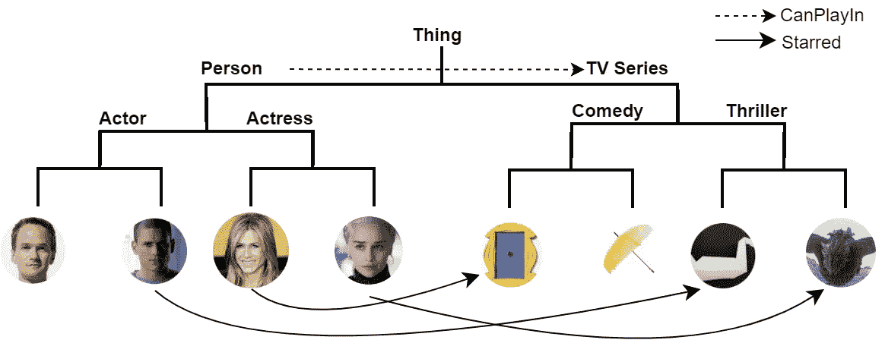
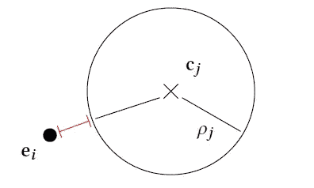

# 嵌入的直观解释

> 原文：<https://towardsdatascience.com/an-intuitive-explanation-of-embeds-558844e4798?source=collection_archive---------35----------------------->

## 大多数 GDL 技术忽略了网络的语义。嵌入也旨在表示语义关系。

# 介绍

在前面的故事中，我们讨论了几种从不同角度解决节点表示问题的 GDL 技术。我们从名为 DeepWalk 的直推式方法开始，接着是 GraphSAGE 归纳方法。在上一篇文章中，我们讨论了 NeoDTI 从异构图中学习特定于任务的节点嵌入。你可以在下面找到这个故事。

 [## NeoDTI 的直观解释

### NeoDTI 是一种用于异构网络上链路预测的特定任务节点嵌入学习算法。

towardsdatascience.com](/an-intuitive-explanation-of-neodti-e1859d178031) 

在这个故事中，我们将用嵌入[1]来结束 GDL 方法系列。嵌入目标是大多数 GDL 模型的常见缺陷。虽然现有方法可以有效地反映节点嵌入中基于邻域的相似性，但它们不足以嵌入更高级别的语义，如子类(人是人的子类)关系。这种语义在 DBPedia 和 FreeBase 等知识图(KG)中很常见，应该与节点嵌入一起表示。

KG 不同于我们到目前为止分析过的网络，它包含了语义上更丰富的信息。除了这些类的成员之外，kg 通常还包含类、层次结构及其交互。例如，一个包含人物和电视连续剧的 KG 将包括人物和电视连续剧的分类，而我们到目前为止看到的网络仅代表这些类的成员之间的交互。下面我们可以看到这样一个 KG。

A KG to represent interactions between people and TV Series

在显示的 KG 中，实线表示*主演的*一个人和电视剧之间的关系，而虚线表示*可以出演*一个阶层间的关系。我们总是可以添加更多的关系类型，比如 *canWatch，可以在这两个类之间创建*或者引入新的类，比如 *Movies。如果我们使用了 HN，我们将只有成员之间的链接，没有类层次，没有类间的交互。*

请注意，虽然 kg 看起来像 HNs，但我们不能在 HN 中表示职业等级。一个 KG 类就像一个*超节点*包含一组节点并与其他类交互，而不是一个简单的节点与不同类型的节点交互。以这种方式，kg 是具有丰富语义的非常强大和可扩展的表示方案。KGs 中丰富的语义不能用常规的 HN 嵌入技术(如 NeoDTI)有效地嵌入到空间中。嵌入目标就是这个问题。

# 使...嵌入

EmbedS 是作为一种*本体感知的*图嵌入方法提出的，旨在以几何方式表示高级语义。嵌入了 RDFS 格式的作品，这是一种在网络中表示语义的标记方案。为了这个研究的目的，他们定义了五个谓词(或关系)作为*类型、子类、子属性、域*和*范围。*目标是学习属性表示，以及类和节点表示。

为了表示节点，他们随机创建 N 维向量，并在优化过程中更新它们，与之前的工作类似。另一方面，它们定义*区域*来通过一个 *N* 维向量和一个半径 *r* 来表示类。属性也用区域表示，其中中心用两个 *N* 维向量和一个半径 *r* 表示。类似于节点向量，类和属性中心及其半径在优化期间被更新。因此，财产和阶级区域随着时间的推移而扩大和缩小。

现在我们将解释将用于更新模型参数的损失函数背后的直觉。EmbedS 使用一个两部分损失函数，将它们相加以获得总损失。第一部分被定义为反映节点之间的邻域信息。换句话说，当两个节点的嵌入可用于恢复这些节点之间的交互(或链路、边)时，第一部分被最小化，类似于 NeoDTI 方法。

在损失函数的第二部分，目标是保持由上面列出的五个谓词定义的关系。嵌入基于谓词本身、类和节点将成本与每个谓词类型相关联。因为节点是点，而类和属性是区域，所以我们有两种不同的丢失情况。我们可以计算一个点和一个区域之间或者两个区域之间的损耗。

为了计算点和区域之间的损失，我们计算节点和区域中心之间的 L2 距离，然后减去区域的半径。为了计算区域到区域的成本，我们计算中心之间的 L2 距离，然后减去半径之和。下面我们可以看到一个图，显示了节点和类之间的开销，其中开销用红线显示。

Cost computation from between an entity and a class. [1]

为了最小化这样的损失函数，必须调整参数以满足谓词，而不仅仅是邻域关系。在优化过程中，每个类和谓词的半径将被更新，以最小化损失和中心。例如，我们期望的结果是，如果类 *x* 是类 *y* 的*子类*，那么 *x* 的区域在*y*的区域内。因此，类的层次结构反映在几何空间中。这同样适用于其他谓词。

> 因此，高层语义反映在空间和嵌入是本体感知的。

# 结论

嵌入是在网络中表示更丰富的语义的一个步骤，这是大多数 GDL 技术所缺少的。用区域来表示类和谓词，而不是空间中的点，这是一种可以进一步研究的新方法。然而，定义的损失函数需要特定于谓词的工程，这对于大型网络来说可能难以实现。此外，EmbedS 目前还没有经过广泛的测试，其跨任务的性能也值得怀疑。

## 参考

[1] [嵌入纸张。](https://expolab.org/papers/embeds.pdf)