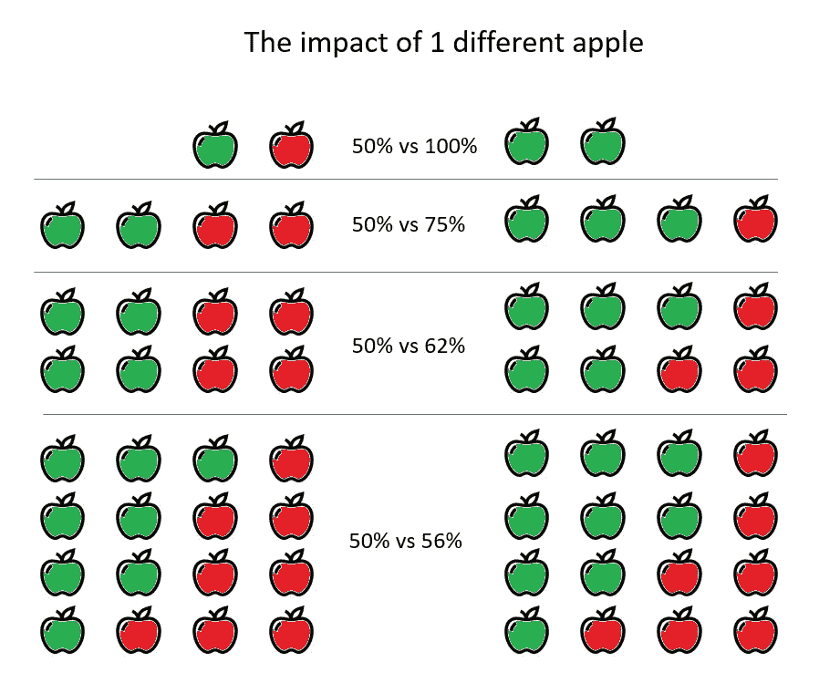
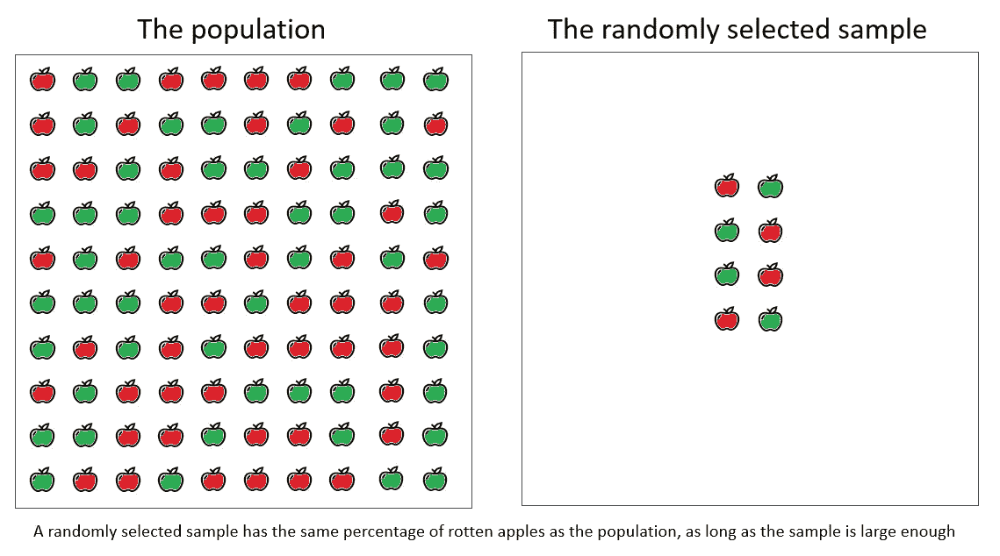
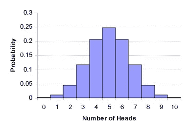
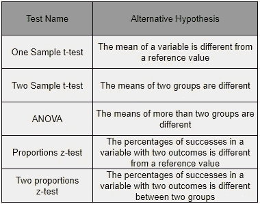

# 假设检验和 P 值的直观解释

> 原文：<https://towardsdatascience.com/an-intuitive-explanation-of-hypothesis-testing-and-p-values-8391db2c90f?source=collection_archive---------4----------------------->

几年前，我在一家水果和蔬菜供应链公司做了第一份统计方面的自由职业。根据质量控制人员的随机抽样，来自农民的产品在送往超市之前，每天 24 小时都要经过质量控制。

在一年比一年的质量报告比较中，他们注意到今年的质量比前一年差，在 1 到 10 的范围内大约是 0.5 分。

然后我进来了，我要回答的问题是:

> 0.5 的差异是真正的差异吗？

在没有任何统计学背景的情况下，这个问题可能显得有些怪异。但是不要担心:本文的目标是向您展示如何使用假设检验(也称为统计推断)来回答这个问题。

# 这是一个数字游戏:1 个不同苹果的影响

想象一下，你正在检查一个苹果是好是坏，从一个很大的苹果盒子里随机选择一些苹果。

在下图中，我们可以清楚地看到样本大小对测量的影响:对于小样本，一个不同苹果的影响非常大，而样本越大，一个苹果的影响就越小。

The impact of 1 different apple depends on the sample size

理解样本大小的影响是理解假设检验的第一个基础。我们可以开始争论，2 个苹果上的 0.5，将是 1 个苹果的差别:很可能发生。但是在 100 个苹果中，0.5 将代表 50 个苹果的差异:一个非常强的差异！

> 在小样本上，0.5 不是很大的差异，但在大样本上 0.5 就是很大的差异。

# 样本应该有多大:假设检验和作为答案的意义

有不同的方法来解决这个问题，但在这篇文章中，我将进入统计推断，或假设检验来解决这个问题。

假设检验是一组统计方法，用于确定观察数据样本是否可用于接受或拒绝预先定义的假设。假设检验应用于许多领域，主要是在研究领域，但也是在线营销的一个关键方法(AB 检验)。

数学家们发展了假设检验，这样就有了一个特定的程序来寻找真理。

> 假设检验只允许验证假设，不允许发展假设。

在一盒 100 个苹果(称之为**群体**)中，我们取 8 个苹果的**样本**。今年的 8 个苹果样本中有 5 个烂苹果(62%)，去年的 8 个苹果样本中有 4 个烂苹果(50%)。我们想用假设检验来确定今年 100 个苹果的盒子里烂苹果的百分比是否比去年大。

> 假设检验是人口测量的数学替代方法。多亏了它的计算，我们可以将小样本的测量结果推广到大样本人群。这样就避免了很多工作。

Mathematician found out how to generalize a conclusion on a sample into a conclusion of a population

这个数学解决方案从陈述一个明确的研究假设开始。不幸的是，只有当我们已经知道要测试什么的时候，数学才起作用。对于勘探，存在其他类型的方法。

> ***研究假设我们的例子:*** *今年烂苹果的人口百分比大于去年烂苹果的人口百分比*

# 实际假设检验

> 假设检验的数学方法使得**在样本测量结果和观察数量**之间达到一种有根据的平衡。输出是一个 P 值。

这些计算通过使用分布:对于几乎每一种可以想象的情况，一些数学家已经找到了描述预期结果的数学规律。

对于像我们的烂苹果(烂 vs 没烂)这样的是/否问题，抛硬币法则是适用的。这是数学定律最基本的例子*:正面 50%，反面 50%*

虽然非常简单，但这可以用一个一般的数学分布来表示，它告诉我们观察到的概率，例如，10 次抛硬币中有 7 次正面朝上。这被称为二项式分布，可以这样绘制:

Binomial distribution with 10 coin flips

对于这篇文章，我将远离沉重的数学，但重要的是要认识到，我们可以使用数学公式来估计某个百分比是接近还是远离预期的百分比。

在本文的最后，我会给出许多不同情况下最常用的假设检验公式的列表，以及如何实现它们的进一步阅读。但是首先，我解释一下假设检验的解释。这对于每个假设检验都是一样的。

# **假设检验的输出称为 P 值**

在假设检验之后，在观察值和样本量之间进行数学平衡。在计算结束时，存在的每一个假设检验将输出一个标准化的分数，该分数允许对结果进行比较，即使数学不完全相同。

P 值是制定假设检验结果的标准方法，对每一个可能的检验都以同样的方式解释。

> P 值是一个介于 0 和 1 之间的分数，它告诉我们样本观察值和假设值之间的差异是否显著不同。0.05 是它的参考值。

当 P 值**小于 0.05 时，差异**显著**。** 当 P 值**大于 0.05 时，差异**不显著**。**

**例 1:** 我们做 10 次抛硬币。
我们的假设:我们预计有 5 个头。
我们的结果:我们得到 6 个头。
我们的 P 值计算输出 0.518，比 0.05 大**。**
我们的结论:差异**不显著。** 我们的解释:结果是**符合**的假设。

**例 2:** 我们做 10 次抛硬币。我们的假设:我们期待 5 个头。我们的结果:我们得到 10 个头。
我们的 P 值计算输出 0.0，比 0.05 小**。**
我们的结论:差异是**显著的**。我们的解释是:结果与假设不符。

**例三:** 我们测试 10 个苹果。我们的假设:我们期待 1 个烂苹果。我们的结果:我们得到一个烂苹果。
我们的 P 值计算输出 1.0，比 0.05 大**。** 我们的结论:差异**不显著。** 我们的解读:结果是**符合**的假设。

**例 4:** 我们测试 10 个苹果。
我们的假设:我们预期 1 个烂苹果。我们的结果:我们得到了 5 个烂苹果。
我们的 P 值计算输出 0.0114，比 0.05 小**。**
我们的结论:差异是**显著的。**
我们的解释:结果是**不符合**假设。

# 结论和进一步阅读

在本文中，我对统计干扰或假设检验背后的一般框架给出了直观的解释。我希望您现在对何时使用假设检验以及它为什么有用有了更好的了解。

我没有进入任何数学解释，也没有进入不同测试的任何细节。在下表中，我列出了一些非常常见的假设检验，建议进一步阅读。

List with Alternative Hypotheses (= Research Hypotheses) for a number of common hypothesis tests.

我希望这篇文章对你有用，并祝你在假设检验的旅途中好运！