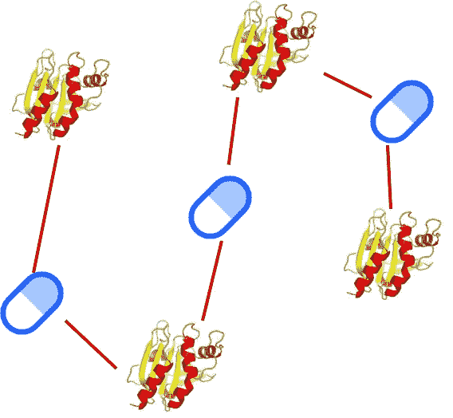
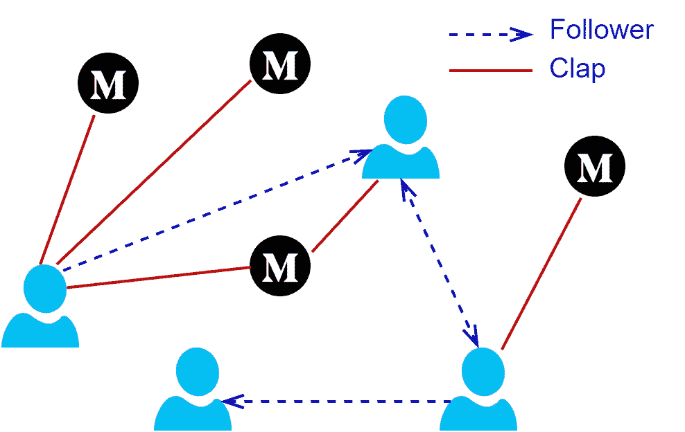
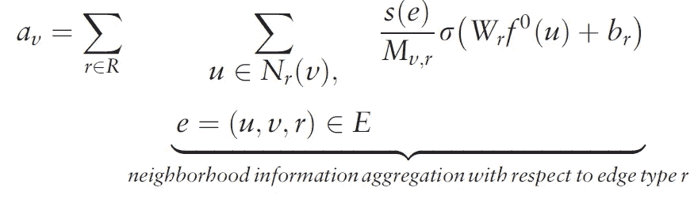
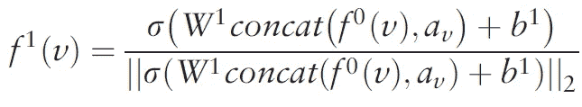
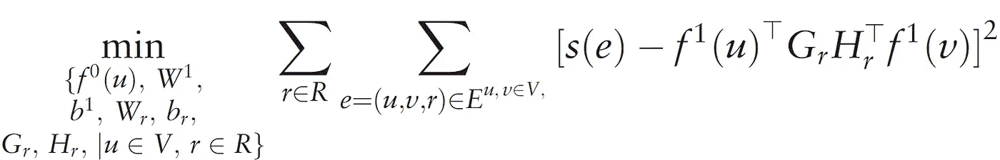
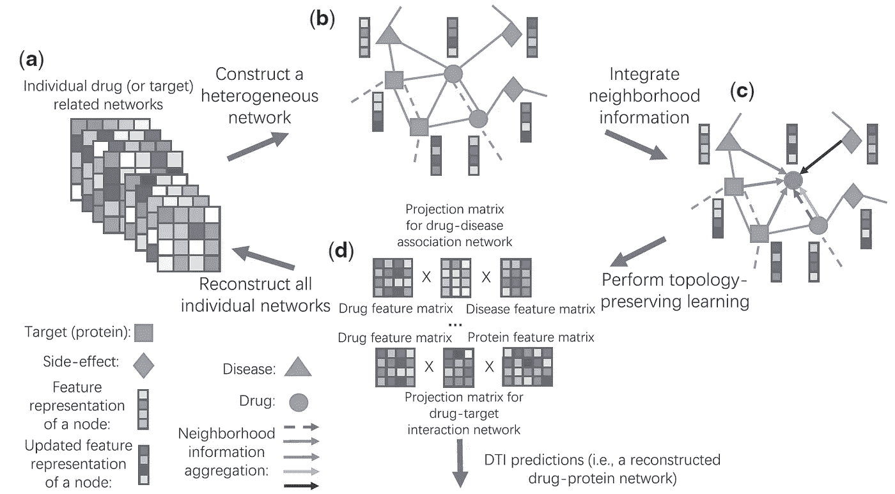

# NeoDTI 的直观解释

> 原文：<https://towardsdatascience.com/an-intuitive-explanation-of-neodti-e1859d178031?source=collection_archive---------25----------------------->

## NeoDTI 是一种用于异构网络上链路预测的特定任务节点嵌入学习算法。

# 介绍

在本系列之前的故事中，我们已经讨论了 DeepWalk 和 GraphSAGE。他们两个都被提出来学习具有单个实体和单个链路类型的网络中的节点表示，即同质网络。如果你不知道这些方法，你可以查看以前的故事。

 [## GraphSAGE 的直观解释

### 归纳学习在动态数据集中很有用。这里我们讨论一个关于图的归纳学习算法。

towardsdatascience.com](/an-intuitive-explanation-of-graphsage-6df9437ee64f) 

在这个故事中，我们将解释 NeoDTI [1]，它有一个不同的视角。NeoDTI 在两个方面不同于 DeepWalk 和 GraphSAGE。首先，NeoDTI 能够在异构网络上操作，即具有多个链路和实体类型的网络。其次，与 DeepWalk 和 GraphSAGE 不同，NeoDTI 学习特定于任务的节点嵌入，而不是通用的节点嵌入。以这种方式，NeoDTI 嵌入专用于一项任务，即链路预测。

NeoDTI 被提议利用异构数据进行药物-靶标相互作用(DTI)预测任务。在 DTI 任务中，每种药物和靶标用一个节点表示，如果已知两个节点相互作用，则这两个节点是相邻的。因此，关联预测对应于预测药物和蛋白质是否相互作用。下面我们可以看到一个玩具异构网络，由三种药物和四个目标组成。

A drug-target network with three drugs and four targets.

虽然 NeoDTI 是针对 DTI 提出的，但是异构网络上的链路预测是一个跨域问题。例如，考虑用户和故事被表示为节点的中型网络。在这个网络中，用户之间的边表示跟随者关系，而用户和故事之间的边表示鼓掌。在这种情况下，链接预测任务可以用于向用户推荐朋友或故事。

Medium network with users and stories.

媒体网络的例子突出强调了 NeoDTI 的可推广性。然而，在故事的其余部分，我们将坚持 DTI 预测任务，以符合原始论文。我们将分三步描述 NeoDTI，即邻域整合、节点嵌入更新和边重构学习。

# 邻里整合

NeoDTI 在一个有四个实体和十二个关系的网络上工作。实体是药物、目标、疾病和副作用，而关系包含这些实体的相互作用、关联和相似性。每个关系都用二元边来表示。邻域整合旨在整合节点邻域内的多方面信息，并将其反映在节点的嵌入中。

尽管这个想法与 DeepWalk 和 GraphSAGE 非常相似，但 NeoDTI 遵循了不同的策略。与以前的方法不同，NeoDTI 不通过图遍历来探索节点的邻域，而是将所有相邻节点视为邻域。对于邻域中的每个实体类型，NeoDTI 通过非线性神经网络层传递每个相邻节点，并对它们的和应用规格化器，以获得实体类型特定的邻域嵌入。为了组合来自不同实体类型的信息，NeoDTI 应用求和并获得结果邻域嵌入。下面我们可以看到节点*对*的邻域积分方程

Information aggregation from the neighborhood in NeoDTI [1].

在这个等式中， *u* 是具有边类型 *r* 的 *v* 的相邻节点，并且 *f ⁰(u)* 是检索 *u* 的初始嵌入向量的函数。 *Wᵣ* 和 *bᵣ* 是边缘类型特定的神经网络权重， *σ* 是非线性激活函数。神经网络前的系数是基于节点度的归一化器。最后， *aᵥ* 是得到的邻域嵌入。

# 节点嵌入更新

已经为节点 *v* 构造了邻域嵌入，是时候将它与*v’*s*自身嵌入结合起来了。为此，NeoDTI 将 *v* ( *f ⁰ (v)* )的初始嵌入与邻域嵌入( *aᵥ* )连接起来。与上一步类似，连接的向量通过另一个非线性神经网络层，然后归一化为单位长度，以获得更新的节点嵌入( *f (v)* )。在下面的等式中， *W* 和 *b* 表示该步骤中神经网络的权重。*

**

*Node embedding update rule in NeoDTI [1].*

*理论上，更新步骤可以重复几次，以创建更多的嵌入。然而，在实践中，使用单个更新步骤就足以获得相当好的预测。*

# *边缘重构学习*

*在前面的步骤中，我们定义了使用异构邻域信息创建节点嵌入的必要过程。现在是时候定义一个损失函数来实现学习了。NeoDTI 使用损失函数来促进边缘重建。换句话说，NeoDTI 旨在从节点嵌入中重建初始网络的边。*

*下面我们看到损失公式，其中 *Gᵣ* 和 *Hᵣ* 是边缘类型特定的投影矩阵和 *s(e)* 在 *u* 和 *v* 之间的边缘的权重。为了创建负样本，NeoDTI 对不相邻的节点进行采样，并在训练期间将它们作为输入提供。*

**

*The loss function used for edge reconstruction in NeoDTI [1].*

*现在让我们解释损失函数。为了将损耗降至最低，求和中的项应尽可能接近 0。因此， *s(e)* 必定等于 *f (u)ᵀ Gᵣ Hᵣᵀ f (v)* 。由于*f(u)ᵀgᵣhᵣᵀf(v)】*是基于节点嵌入和投影矩阵的重构项，因此嵌入被学习，使得边被重构。*

> *与旨在最大化相似节点之间的嵌入相似性的 DeepWalk 和 GraphSAGE 相反，NeoDTI 嵌入被学习用于边缘重建。这就是它们具有特定任务的原因。*

*有了这个公式，重建项可以用来对 NeoDTI 的预测进行采样。为了预测药物 *u* 和目标 *v* 是否相互作用，我们使用学习的药物和目标投影矩阵*f(u)*和 *f (v)来计算重建项。*结果是对 *u* 和 *v* 之间的边权重的 NeoDTI 预测。*

# *讨论*

*NeoDTI 是一种端到端的学习方法，用于学习特定于任务的节点嵌入。嵌入创建和损失函数步骤都是完全可微的，并且所有权重和嵌入都可以通过梯度下降来学习。这个端到端过程的结果嵌入被优化用于边缘重建，即链路预测。因此，面对链路预测精度的提高，学习嵌入的可推广性被牺牲了。下面我们可以在一张图中看到 NeoDTI 的工作流程。*

**

*The workflow of NeoDTI [1].*

*此外，尽管 NeoDTI 在二值边上运行，但它也适用于加权边。在这个问题中， *s(e)* 被当作一个二进制项，但可以用实值权重来代替。在这种情况下，权重应该表示节点之间的连接强度，并且训练目标将是恢复连接强度。*

# *结论*

*NeoDTI 是用于异构网络上的链路预测任务的有价值的方法。论文表明，集成异构信息提高了模型性能。因此，网络可以很容易地用新的实体和关系类型来扩展，以包含更多的信息。这就是使用异构网络的力量。*

*此外，与首先学习节点嵌入并将其用于链路预测的多步骤方法相比，使用端到端方法导致了准确性的提高。通过异构数据和端到端学习，NeoDTI 在 DTI 任务中产生了 SOTA 结果。然而，应该注意的是，NeoDTI 也可以应用于不同的领域。*

## *参考*

*[1] [NeoDTI 论文](https://www.biorxiv.org/content/10.1101/261396v1)*

*[2] [NeoDTI Github](https://github.com/FangpingWan/NeoDTI)*