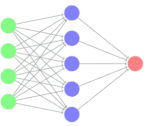
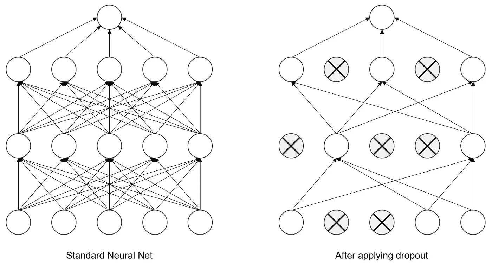

# 对辍学的直观解释

> 原文：<https://towardsdatascience.com/an-intuitive-explanation-to-dropout-749c7fb5395c?source=collection_archive---------13----------------------->

## 深度学习

## 以及如何用它来对抗过度拟合


Photo by [ray sangga kusuma](https://unsplash.com/@rekamdanmainkan?utm_source=medium&utm_medium=referral) on [Unsplash](https://unsplash.com?utm_source=medium&utm_medium=referral)

# 什么是过度拟合？

训练神经网络很棘手。人们应该注意，他的模型足够好，可以从现有数据中学习，也足够好，可以推广到看不见的数据。缺乏一个通用的模型主要是因为一个叫做**过度拟合**的问题。

简而言之，过度拟合意味着模型在初始训练数据上达到非常高的精度，而在新出现的数据上达到非常低的精度。这就像老师总是在考试中给出同样的问题。他们的学生很容易得到高分，因为他们只是简单地记住了答案。因此，高分在这里不是一个好的衡量标准。另一个危险的后果是，学生们甚至懒得再学习这门学科了。

针对过拟合有很多技巧， ***辍学*** 就是其中之一。在本文中，我们将发现辍学背后的直觉是什么，它是如何在神经网络中使用的，以及最终如何在 Keras 中实现它。

# 辍学背后的直觉

考虑一个由参与者、一组观众和节目主持人组成的电视节目。该节目的工作原理如下:

1.  在游戏开始时，主持人随机选择一部未看过的电影作为事件的主要目标。
2.  在每一个阶段，主持人展示所选电影的短片，
3.  然后问了一个关于电影到目前为止的事件的问题。
4.  每个观众都会给出一个答案，
5.  参与者必须从观众中选择一个答案。
6.  如果答案正确，参与者和从观众中选出的人将各获得 50 美元。
7.  如果答案是错的，他们都要付 100 美元。

假设参与者注意到一个观众总是给出正确的答案。随着时间的推移，参与者将与此人建立信任，并会忽略其他人给出的答案。

这种策略存在一些问题。受信任的人可能在游戏的早期阶段对问题分类很好，但在游戏的后期阶段对问题分类很差。如果只有一个人(或一小组人)总是被选中，其他观众会感到被冷落，不再关心播放的视频剪辑。这样——在以后的阶段——被信任的人将不再有帮助，而停止关注的其他观众将已经失去正确回答事件的顺序。所以，只靠一个人是不好的，肯定会损失很多钱。

你认为我们如何解决这个问题？一个聪明的策略是总是给别人机会。通过这种方式，参与者将了解每位听众的优势，并根据问题类别知道该问哪一位。另外，这样每个人都会一直觉得有责任，有义务去关注。

# 神经网络中的辍学

你可能会问这跟神经网络有什么关系？好吧，让我们考虑以下网络…



A Simple Neural Network Example

我们可以认为输入层(绿色)是主持人提出的问题，隐藏层(蓝色)中的每个神经元是观众中的一个人，输出层(红色)是一个选定观众的选择答案。如果输出层发现某个特定的神经元总是给出最佳答案，它可能会忽略其他的，而把所有的权重都给这个神经元。

基于我们之前的分析，我们选择禁止一些神经元回答，而给其他神经元机会。这样我们就会达到平衡，迫使所有神经元学习。这就是辍学的概念，从技术上讲，它的工作原理如下:

1.  我们指定一个退出率，它代表要退出的神经元的百分比(例如，20%的神经元)
2.  在每个阶段，我们根据预先定义的百分比移除随机神经元。
3.  我们根据剩余神经元的结果组合来计算最终输出。

使用这种技术，所有神经元都有机会投票，并且必须正确回答，以减少模型损失。

这是一个神经网络在辍学前后的例子。



Image source: [Deep Learning for Computer Vision](https://www.oreilly.com/library/view/deep-learning-for/9781788295628/)

# 喀拉斯辍学

在 Keras 申请退学比你想象的要简单。你所要做的就是导入并创建一个新的 Dropout layer 对象，然后将其添加到网络结构中的相关位置。

```
from keras import models, layersmodel = models.Sequential()
model.add(layers.Dense(32))
model.add(layers.Dropout(0.5))
model.add(layers.Dense(1))
```

通常，在全连接的密集层之后、输出之前添加漏失层，漏失率= 0.5 (50%)。一些最近的方法在卷积层或递归层的激活函数之后应用丢弃，丢弃率=0.2 (20%)。

# 最后的想法

在这篇文章中，我介绍了辍学，这是一种解决训练中过度适应问题的有趣方法。尽管如此，辍学背后的概念非常简单，当训练你的模型时，它会带来很大的改进。我试图让解释尽可能简单。所以，如果你有任何问题，请随时留下你的评论。

如果你喜欢这篇文章，请点击“鼓掌”按钮，我将不胜感激👏所以可能会传染给他人。也可以在 [*推特*](https://twitter.com/alimasri1991)*[*脸书*](https://www.facebook.com/alimasri91)*[*上关注我直接发邮件给我*](mailto:alimasri1991@gmail.com) *或者在*[*LinkedIn*](https://www.linkedin.com/in/alimasri/)*上找到我。***