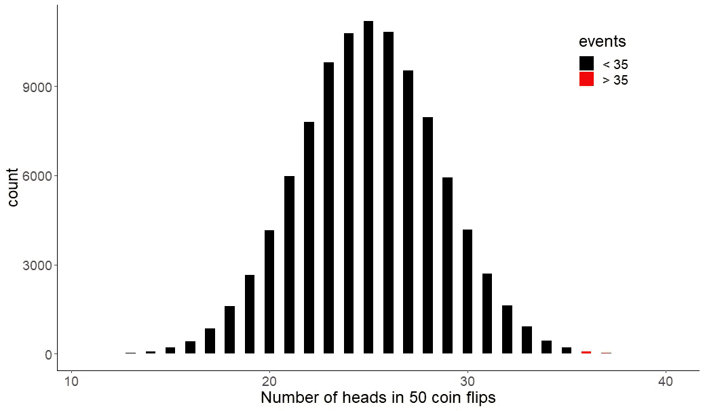
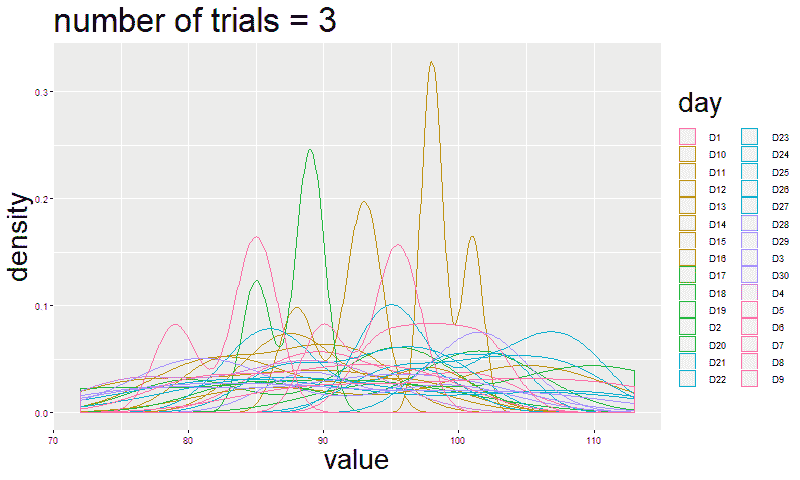
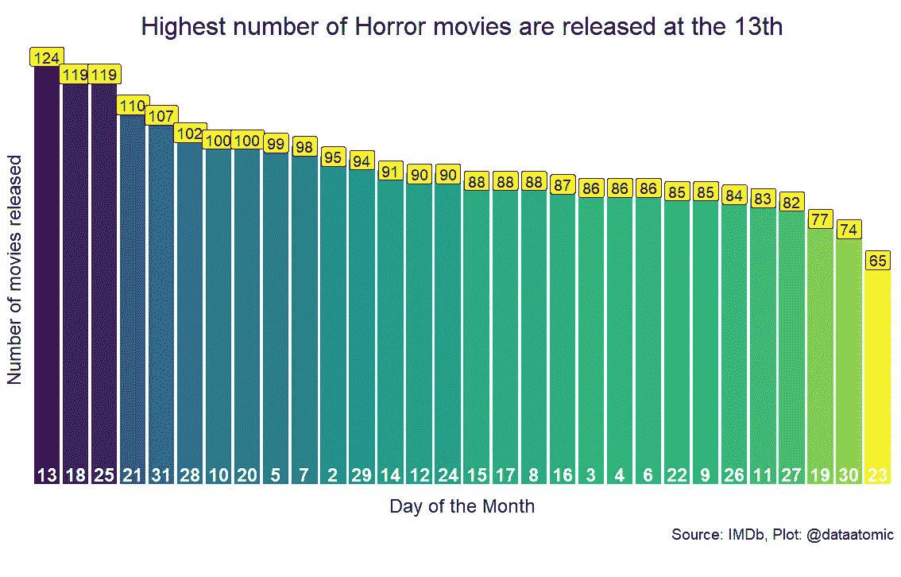
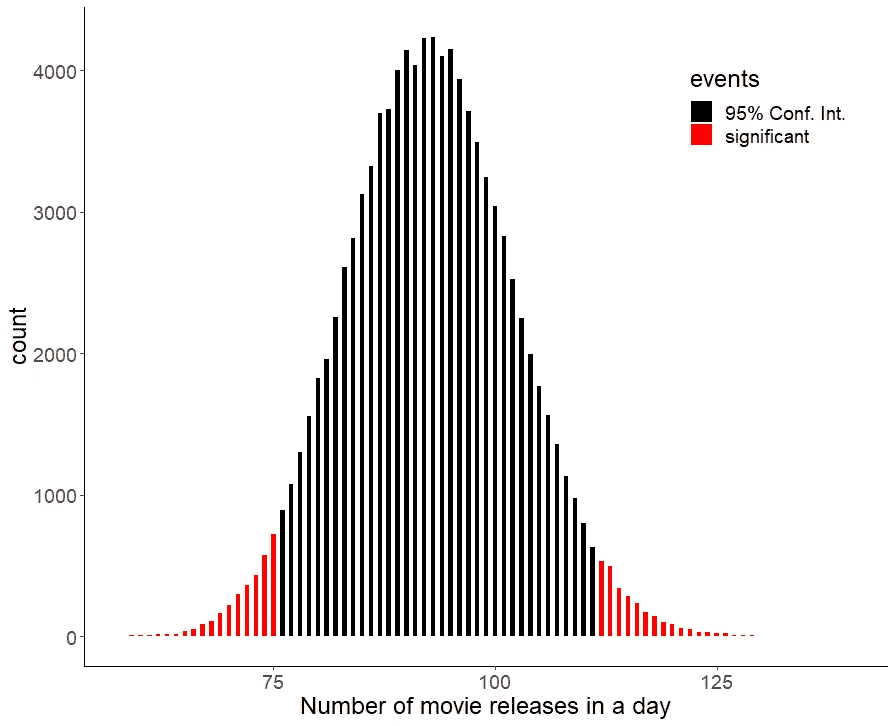
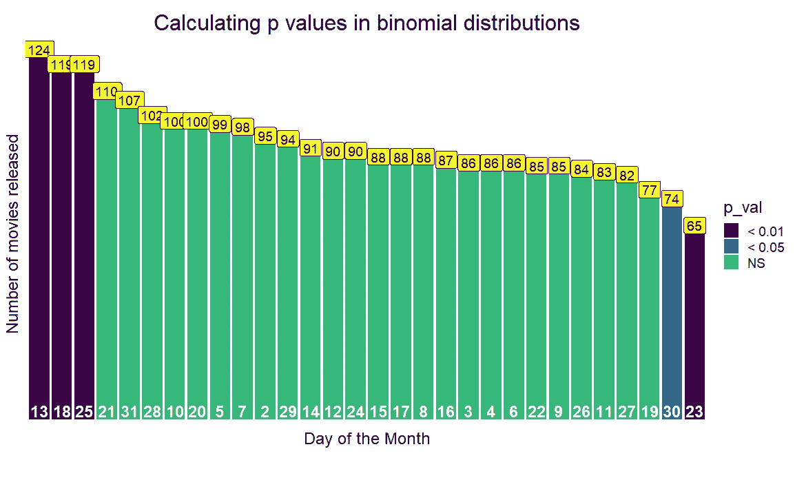

# 一个直观的二项分布的真实例子，以及如何在 R

> 原文：<https://towardsdatascience.com/an-intuitive-real-life-example-of-a-binomial-distribution-and-how-to-simulate-it-in-r-d72367fbc0fa?source=collection_archive---------1----------------------->


Photo by [Daria Nepriakhina](https://unsplash.com/@epicantus?utm_source=unsplash&utm_medium=referral&utm_content=creditCopyText) on [Unsplash](https://unsplash.com/s/photos/r-programing?utm_source=unsplash&utm_medium=referral&utm_content=creditCopyText)

## 学一次，天天用

## 从计算机器学习模型分类精度到测试新的癌症疗法，二项分布无处不在。

*学习。这是关于成功和失败的。*

**什么是二项式分布，为什么它们如此有用？**

当我们重复一组事件，比如 10 次抛硬币，并且一组事件中的每个事件都有两种可能的结果(正面或反面)时，想想**二项分布。**这里的每个事件都被称为伯努利试验。

双入二项分布是指通常被描述为**成功**或**不** **成功**的两种结果。一个“是”或者“不是”。

**概率分布通常用于预测未来事件**，并且通常基于看起来很糟糕的数学公式。但是，这里也有美好的东西。例如，特定的二项式分布数学函数可用于预测具有两种结果的任何现实生活事件的结果。


Photo by [Ibrahim Rifath](https://unsplash.com/@photoripey?utm_source=unsplash&utm_medium=referral&utm_content=creditCopyText) on [Unsplash](https://unsplash.com/s/photos/coin-pile?utm_source=unsplash&utm_medium=referral&utm_content=creditCopyText)

让我们从一个简单的例子开始。

## 这为什么有意思？

例如，玩硬币，两种可能性是正面(成功)或反面(不成功)。假设你有 50 次抛硬币的机会。我们可以尽可能多次重复这个集合，并记录每次重复中我们获得正面(成功)的次数。

如果把结果画出来，我们会得到一个概率分布图。如果你重复的次数足够多，你会接近一个二项式概率分布曲线。我们一会儿就做这个。但是，首先生成数据来绘制我们的图。

我们可以用 R 来生成数据。我们将从一组重复的 50 次硬币投掷 100000 次中产生随机数据，并记录每次重复的成功次数。

**rbinom()函数可以生成**给定数量的重复(这里是 100.000)组(50 次抛硬币)的实验。它需要 3 个参数。

```
**rbinom(n** = number of repetitions = 100.000,
       **size** = sample size = 50, 
       **p** = the probability of success (chance of throwing heads is       0.5)**)**
```

这个概率分布图怎么用？



*二项式概率分布帮助我们理解罕见事件的可能性，并设定可能的预期范围。*

上面的图说明了如果我们随机投掷硬币 50 次，我们将很可能获得 20 到 30 次成功(正面),而在 50 次尝试中获得超过 35 次成功(正面)的事件是非常不可能的。**红色**条表示有 35 个或更多机头的器械组。

r 代码可以用来找到准确的概率。我们来比较一下得到 25 个、35 个甚至 49 个以上人头的概率。您可以将 rbinom 与 mean function 结合起来，找出具有选定结果的事件的百分比。

```
# Probability of getting 25 or more heads
mean(rbinom(100000, 50, .5) >= 25)0.5555# Probability of getting 35 or more heads
mean(rbinom(100000, 50, .5) >= 35)0.00341# Probability of getting 49 or more heads
mean(rbinom(100000, 50, .5) >= 49)0
```

我们发现投掷 49 个或更多人头的概率为 0。但是从技术上来说，它是 375 万亿分之一乘以 1 ⁴⁹)+(1/ ⁵⁰))).

## 那么这些都有什么用呢？

你可以用你使用二项分布预测掷硬币结果的能力来打动你的朋友，但是让我们看看它们在现实生活中的其他应用。

**机器学习模型的表现。**

你建立了一个二进制输出的机器学习模型。比方说准确率 90%的肝癌病理图像识别算法。你测试了 100 个病人，你想知道你 95%的置信区间？或者你的新结果显示你的模型正确检测到的病人不到 70 个。可能吗？或者你应该重新开始优化你的参数？


Photo by [Sharon McCutcheon](https://unsplash.com/@sharonmccutcheon?utm_source=unsplash&utm_medium=referral&utm_content=creditCopyText) on [Unsplash](https://unsplash.com/s/photos/hospital?utm_source=unsplash&utm_medium=referral&utm_content=creditCopyText)

**对治疗有反应的患者人数**。

比方说，你有一种新的癌症疗法，有 10%的可能性治愈病人。有 500 名病人服用了这种药物。预计康复病人人数为 50 人。但是在你的试验中有 75 个病人有反应。这是出于偶然还是有重大影响？或者你应该开始寻找潜在的因素，如果治疗或患者群体有什么问题的话？

想象一下医院急救站。

你是一名医院经理，你想正确组织不同工作日的员工人数。你知道在给定的时间内，因为酒精中毒而被送进急救站的病人总数。您可以分析一周中每天的患者人数分布。很可能在周末你会遇到更多这样的情况，你需要更多的员工。

其他行业也是如此。他们可以使用二项式分布来计算需求的变化，并据此制定计划。

**如果你运行的是网络服务器。**

通过确定流量较高的时间，您可以更好地分配资源。

我们可以通过二项式分布回答的其他一些问题有:

**对调查问题回答“是”的人数。
一个赛季一支球队会赢多少场比赛？
选举中候选人的票数。
生产运行中的缺陷产品数量。**

> 二项分布是常见的，他们有许多现实生活中的应用。

当单个事件有两个以上的结果时，我们可以将二项式分布扩展为多项分布。

例如，当滚动骰子或分析人群中眼睛颜色类型(黑色、蓝色、绿色等)的分布时，有 6 种结果。当涉及多类别事件的分布时，考虑一下**多项式分布。**

如果观察值的数量(n)很大，我们可以将多项式绘制视为一系列二项式绘制 [(Gentle，2003 年，第 198-199 页)。](https://www.springer.com/us/book/9780387001784)例如，在掷骰子时，6 个类别可以被认为是 6 个不同二项式试验的组合(得到 1、2、3 等等)。

如果你仅仅通过阅读这些还不能被说服，我将通过增加试验次数来模拟多项式事件的形状是如何变化的。



Multinomial trial approaches a binomial distribution

让我们用一些真实的生活数据来应用我们迄今为止的知识。数据来自[tidy Tuesday](https://github.com/rfordatascience/tidytuesday)——由 [R for Data Science community](https://www.rfordatasci.com/) 组织的每周一次的 R 社会数据项目。

它包含了自 2012 年以来上映的恐怖电影的数据。我问的是恐怖电影是否更有可能在每月的 13 号上映？


Photo by [Allef Vinicius](https://unsplash.com/@seteales?utm_source=unsplash&utm_medium=referral&utm_content=creditCopyText) on [Unsplash](https://unsplash.com/s/photos/smile?utm_source=unsplash&utm_medium=referral&utm_content=creditCopyText)

如果你有正确的心态，任何事情都会感觉更好，如果你没有心情，任何事情都不会让我们开心。**我们在事件发生前的心态会影响我们对事件的感受。这至少是行为科学家罗伯特·恰尔迪尼的研究所说的。**

想象你是一个恐怖电影迷，你去了电影院。就在电影开始前，屏幕上播放了几则广告。你走近手机关掉声音，日期引起了你的注意，是 13 号。

通常我们会将数字 13 与诅咒事件联系在一起。你认为这会影响你对这部电影的印象吗？

我们不知道这是不是真的，但我想测试一下电影制作人是否有类似的想法，所以选择 13 日作为上映日期的次数比其他日子多。因此，我研究了恐怖电影的数据，并计算了这个月不同日子的上映数量。



## 这有意义吗？

在数据中，有 **2782** 部电影与上映日期相关联。因此，每天预计上映的电影是 **92** (2782 / 32)

**这是一个有 30 个类别的多项概率分布的好例子，由于样本数量很大，它将近似于二项分布。**

因此，我们可以应用二项式概率分布来计算我们的多项式数据中的概率。

我们在上面看到，在某些日子里，上映的电影比预期的要多。我们想知道的是，哪一天在随机机会的范围内，哪一天有明显的 T2 偏好或厌恶来发行一部电影。

我将定义一个区间，它包含我们模拟分布中 95%的概率。外面的值将不是随机的。为此，我需要分布的 2.5 和 97.5 分位数。

我们可以通过 r 中的 **qbinom()** 函数来实现。例如，qbinom(0.975，size，p)将返回一个值，该值将定义包含 0.975 概率的截止值。我们的置信区间将是以下区间:

**qbinom(0.025，size，p) <** 置信区间 **< qbinom(0.975，size，p)**

```
lower <- qbinom(0.975, 2782, 1/30)
75
upper <- qbinom(0.025, 2782, 1/30)
112**75 <** Confidence Interval **< 112**
```



95%的时候，一个月中的某一天会有 75 到 112 部电影上映。根据我们的概率分布，高于或低于此范围的值不会因随机机会而发生。

每月 13 号上映的 124 部电影。该值高于 97.5 分位数。所以意义重大。但是确切的 p 值是多少呢？我们先定义 p 值。

# **P 值是该事件发生的概率之和加上同等可能性或可能性较小的类似事件发生的概率之和。**

例如，在抛硬币游戏中，正面的概率是(0.5)。如果我们遵循我们的定义，p 值是该事件(0.5)和可能性相等或较小的类似事件(即尾部(0.5))的概率之和。所以我们的 p 值是 0.5 + 0.5 = 1。

类似地，在我们的恐怖电影数据中，这将是获得 124 部电影发行或事件的概率的总和，这些事件同样可能或更罕见。

在 R 中， **pbinom** 函数定义了累积概率。例如，pbinom(124，2782，1/30)将给出最多 124 部电影发行的累积概率。通过使用 1-pbinom(124，2782，1/30 ),我们可以找到概率之和，其概率等于或低于 124。

因此，获得至少 124 部电影发行的 p 值是；

```
p_val_binom <- 2 * (1 — pbinom(124, 2782, 1/30))
0.00133
```

我们乘以 2，因为同样罕见的事件也可能发生在我们置信区间的左侧。

让我们把这些 p 值放在我们的恐怖电影情节上，以突出重要的日子。



我们测试了关于电影制作者的假设，计算了 p 值，并使用了 pbinom()函数，找到了电影或多或少可能上映的其他几天。

**然而，另一种广泛使用的计算 p 值的方法是计算分布的平均值及其标准差，并验证观察值与平均值相差多少标准差(z 得分)。**

## 通过正态近似计算 p 值

当样本量很大时，二项式分布可以近似为正态分布。为了建立正态分布，我需要均值和标准差。这个我可以从恐怖片数据算出来。

```
 sample_mean is 92.7 
sample_sd is 89.64
```

我可以计算出我们对 13 号上映的 124 部电影的观察的 z 值。**简单来说，z-score 就是:一个观测值离均值有多少标准差。**由于 95%的观察值将落在正态分布平均值的 1.96 个标准偏差内，较高的 z 得分将表明我们的 p 值确实显著。

```
z_score <- (observation — sample_mean) / sample_sd
3.302
```

我可以通过使用一个正态分布函数 **pnorm()和我们找到的 z 值来计算精确的 p 值。**

```
p_val_nor <- 2 * pnorm(3.302, lower.tail = FALSE)
p_val_nor
0.00095
```

正如所料，通过使用正态分布的近似值和二项式分布，我发现了相似的值(**正态:0.00095，二项式:0.00133)** 。两种方法都证明恐怖片更有可能在 13 号上映。

# 结论

现实生活中的许多事件都可以用二项式概率分布来解释，它们允许我们计算这些事件的发生是否是随机的，并检验我们的假设。

它可以是有趣的数据分析，如恐怖电影中的数据分析，也可以是更严肃的主题，如新药测试或预测机器学习算法检测疾病的准确性。

下次见！

塞尔达尔