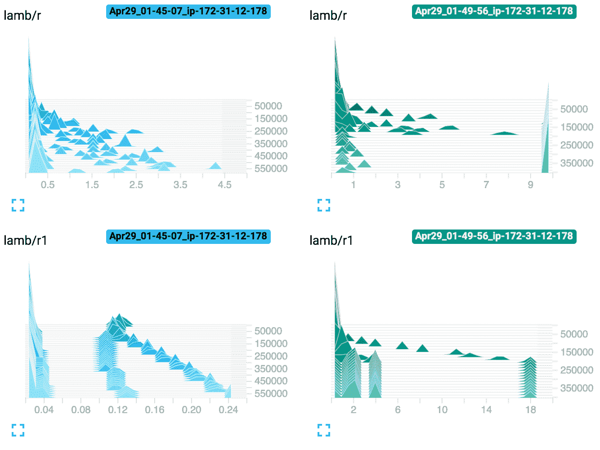

# 对 LAMB 优化器的直观理解

> 原文：<https://towardsdatascience.com/an-intuitive-understanding-of-the-lamb-optimizer-46f8c0ae4866?source=collection_archive---------1----------------------->

## 大型深度学习模型分布式训练的最新技术

在软件工程中，减少周期时间对进度有超线性的影响。在现代深度学习中，周期时间通常在几小时或几天的量级。加速训练的最简单方法，数据并行，是在 GPU 和机器之间分发模型的副本，并让每个副本计算训练数据碎片上的损失。然后，可以使用单个参数服务器或 ring all-reduce(py torch 中的默认设置)等更好的工具来累计这些损耗的梯度。反向传播梯度后，用更新的模型重复。但是随着批量的增长，梯度会变得不稳定，导致训练出现偏差。

最近的一篇论文通过以一种更加细致入微的方式计算梯度，将最大和最受欢迎的语言模型之一 BERT 的训练时间从 3 天减少到 76 分钟，允许作者将批量规模扩大约 100 倍至 65K。虽然这篇文章描述了它对上一次迭代 LARS 的贡献，但在这篇文章中，我将从随机梯度下降(SGD)开始解释必要的背景，LARS 就是建立在这个基础上的。

首先，回顾一下基础知识。回想一下，对于 SGD，标准更新规则是

打破这一点，它说新的模型权重是现有的减去学习率乘以现有权重的梯度给定一个例子或一批的平均值。问题:

1.  我们不知道真实的梯度，我们只有嘈杂的估计。噪声可能会导致虚假更新
2.  渐变比例没有标准化，所以我们的更新很可能会随着时间的推移而消失或爆炸

# 圣经》和《古兰经》传统中）亚当（人类第一人的名字

在 Adam 中，我们保留了梯度及其方差的移动平均值:

其中，𝓂是移动平均值，𝓋是移动无中心方差，β₁是平均值的插值常数，β₂是无中心方差的插值常数，∇L 是损失的梯度。指数中的括号表示它实际上不是指数，而是时间步长。这看起来有点可怕，但重要的是要注意，𝓂和𝓋都只是梯度及其方差的线性插值(β**x*₀+(1-β)**x*₁)，这给了我们一个移动平均值。β值越高，我们对每个新样本的移动平均值的更新就越少，从而使我们对各批次梯度的平均值和方差的估计更加平滑。这是我们对不同 betas 的嘈杂数据集进行平滑处理的可视化效果。

Linear interpolation for various strengths of beta (from [fast.ai](https://github.com/fastai/fastai_docs/blob/master/dev_course/dl2/09_optimizers.ipynb))

如果我们有一个小批量，我们对每一步梯度的估计可能会更嘈杂，所以我们需要一个更高的β。如果我们使用大批量的一致数据，我们可能需要更少的 beta。

上面的移动平均线的问题是，当算法第一次初始化时，移动平均线是 0。如果β接近 1，这将导致汇总统计数据比前两个时间步长更接近 0，因为我们从上一步中获取了大部分质量。这种影响在上面的 beta=0.99 的图表中尤其明显。

我们通过去偏置来解决这个问题

这导致:

Linear interpolation with debiasing (from [fast.ai](https://github.com/fastai/fastai_docs/blob/master/dev_course/dl2/09_optimizers.ipynb))

问题没有消失，但是好多了。

为了插入一些数字，如果β = 0.9，在第一次迭代中，debias 会将该值乘以 1/1–0.9 = 10。那么当我们线性插值时，β𝓍₀ + (1 — β)𝓍₁，第一项β𝓍₀ = 0。德拜斯因子 10 将在第二项中抵消(1 — β) = 0.1，因此我们完全使用新值𝓍₁.仅仅几步之后，debias 因子将收敛到 1。下图显示了 debias 项消失需要多少步(注意 y 轴上的差异):

Visualizing debias factor over time

现在，最后的参数更新是

分子表示“对于每个参数，在该参数的梯度方向上前进一步。”分母表示“根据标准偏差对步长进行归一化”

直观的解释是，当我们第一次开始更新参数时，我们可能会偏离很远。如果梯度都指向不同的方向(高方差)，我们将谨慎地迈出一小步。相反，如果所有的梯度都告诉我们向同一个方向移动，方差会很小，所以我们会在那个方向上迈出更大的一步。无论哪种方式，如果所有梯度的比例很大，常数因子将在我们除法时抵消，因为我们使用的是无中心方差。随着训练稳定，损失越来越接近 0，平均值将接近 0，因此更新将自动变得更精细。

分母中的ε表示“好吧，我们可能认为我们根本没有噪声，但我们不要太疯狂，一次走一步。”当噪声方差接近零时，这有效地设置了步长的上限。

这个比率 m/sqrt(v)可能看起来像μ/σ，它是[信噪比](https://en.wikipedia.org/wiki/Signal-to-noise_ratio#Alternative_definition)，但是这种解释只适用于标量。

# （同 LocalAreaRadioSystem） 局域无线电系统

随着批量的增长，每个时期的迭代次数减少。为了收敛到相同的数据集迭代次数，我们可以通过提高学习速率来进行补偿。然而，随着学习率的增加，训练变得更加不稳定。SOTA 将使用学习率预热，但这只在一定程度上有帮助，在一定程度上学习将开始发散。热身是对真正问题的修补:梯度必须是嘈杂的。

分层自适应速率缩放( [LARS](https://arxiv.org/pdf/1708.03888.pdf) )的作者解释了他们解决这个问题的技巧:

> 为了分析具有大 LRs 的训练稳定性，我们测量了层权重的范数和梯度更新的范数之间的比率。我们观察到，如果这个比例太高，训练可能会变得不稳定。另一方面，如果这个比例太小，那么权重的变化就不够快。

他们把这个比率叫做“信任比率”。当它更高时，梯度变化更快，反之亦然。由于我们现在对每一步都更有信心，学习速率计划中经常使用的谨慎预热不再必要，我们可以扩展到更大的批量，而不会出现偏差。

在英语中:逐层学习速率λ是全局学习速率η乘以层权重的范数与层梯度的范数之比。如果我们用重量衰减，我们可以把它加在分母上。当我们将其插入 SGD 时，分母最终会将梯度归一化为单位范数，这有助于避免发散。

分子是权重的范数，因为随着网络的加深，具有零均值、单位方差(ZMUV)权重变得很重要。这是因为在每一层，这些权重相乘，所以如果它偏离 ZMUV，这些值可能会爆炸或消失。当重量很小时，我们迈出一小步。当重量很大时，我们迈出更大的一步。结合重量衰减，这有助于我们稳步迈向 ZMUV 重量。

让我们了解一下这里发生了什么。在训练开始时，假设层输出 ZMUV，因此上面的分子将是 0 或接近它。我们采取的任何步骤都可能很小。相比之下，分母可能会很大，因为当一切都是错的时候，梯度就很大。这样，随着体重的增加，我们自然会暖和起来。当我们接近 0 损失时，梯度将变小，因此信任比将保持学习速率比没有信任比高 10 倍(由于削波),防止我们过早放弃达到最优。

# 小绵羊

LAMB 代表“用于批量训练的分层自适应矩优化器”它对 LARS 做了一些小改动

1.  如果信任比率的分子(下面的 r₁)或分母(下面的 r₂)是 0，那么就用 1 来代替。这一部分很难阅读，所以我基于[一些代码](https://github.com/titu1994/keras-LAMB-Optimizer/blob/master/keras_lamb.py)。
2.  固定权重衰减:在 LARS 中，信任比率的分母是|∇L| + β |w|，而在 LAMB 中是|∇L + β w|。这保留了更多的信息。
3.  他们不使用 SGD 更新规则，而是使用 Adam 更新规则。
4.  将信任比率削减为 10。

所以完全信任 LAMB 的比率是

最后一行是逐层 LAMB 更新规则。𝓇₂是具有权重衰减的亚当更新规则的规范，ηᴸ是由信任比率调整的逐层学习速率。因此，总的来说，这种方法可以概括为 LARS 应用于 Adam，因为它只是将旧的更新步骤乘以信任率。

作者没有报告 LAMB 是否提高了 LARS 的 ImageNet 训练性能，他们也没有比较 LARS 和 LAMB 对 BERT 的影响，所以很难说这些变化带来了多大的不同，但实现非常简单。

# 实验

为了更好地理解正在发生的事情，我在 Pytorch 中实现了 LAMB。我在 MNIST 身上做了一系列实验，发现在亚当偏离的地方，兰姆一直在突突前进。我选择 MNIST 是因为它很小，足以在 CPU 上尝试，但这意味着我们看不到任何收敛的改进。我将很快发表另一篇探索 LAMB 应用于大型变形金刚的帖子！

我想象了一些实验。

下面，我比较了亚当(下面蓝色)和兰姆(下面红色)的学习率 0.01 和 betas .9，. 99。它们非常相似，但是 LAMB 更能概括测试的准确性。

MNIST training loss and test accuracy over time for Adam (blue) vs LAMB (red)

为了弄清楚到底发生了什么，我想了解信任比率的分层组成，所以每隔几批后，我就将 r、r₁和 r₂的每个值记录为直方图。对于亚当，我计算值，但不要在任何地方使用它们。

如何解读下面的图表:Y 轴显示的是什么时间步长，第一个在顶部，X 轴是直方图桶，Z 轴是直方图频率。

LAMB parameter histograms on Adam (blue) vs LAMB (red) on MNIST

你可以看到在两边，r 都从 1 以下开始。在羊肉方面，这为所有层面创造了一个自然的热身期。然后，随着一些层开始获得更大的权重和更稳定的梯度，r 鼓励它们迈出更大的步伐。这夸大了相对于亚当基线的规范。

在接下来的实验中，我在 0.1 和 0.01 的学习率上比较了 LAMB 和它自己。Adam 在学习率. 01 时收敛正常，在 0.1 时完全不学习，这里就不做比较了。左边(蓝色)的学习率= 0.01，右边(绿色)的学习率= 0.1。在右侧，它在预热期间几乎立即收敛，但随后一些层权重开始爆炸(参见 X 轴比例的差异)并发散。

为了解决重量流失的问题，我在右下方添加了重量衰减 0.01。训练没有跑偏！一般来说，信任比率在小于 1 时保持缓慢学习，而在更舒适的状态下，它高达 4.5。

# 摘要

随着学习率的增加，普通 SGD 变得不稳定。

LARS 通过标准化梯度和权重的逐层信任比来调整 SGD 学习率。

Adam 使用由去偏方差归一化的去偏均值来调制更新。

LAMB 通过更精确的逐层剪切信任率来调整 Adam 的学习率。

结合所有这些技术使我们能够以高学习率进行大批量训练，将 BERT 的墙壁时间减少 100 倍！

*感谢* [*雅罗斯拉夫*](https://medium.com/u/5511064b4364?source=post_page-----46f8c0ae4866--------------------------------) *和* [*莎拉简·洪*](https://medium.com/u/c9d4f242a2cb?source=post_page-----46f8c0ae4866--------------------------------) *的编辑和***/fast . ai part 2 的灵感**