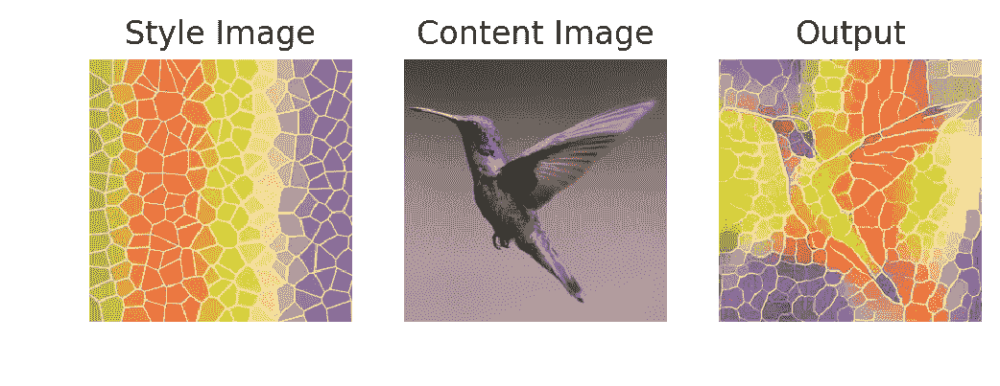
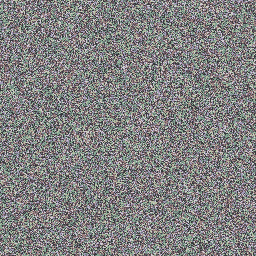
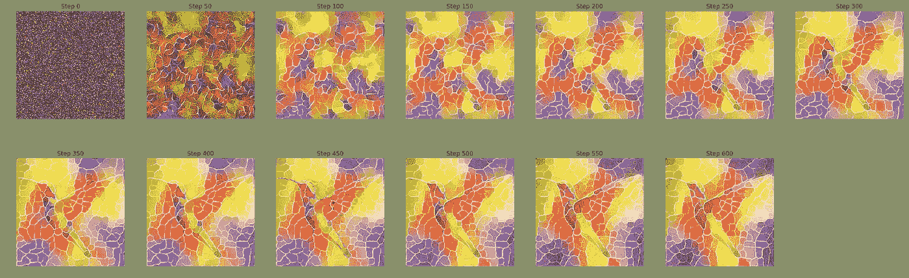
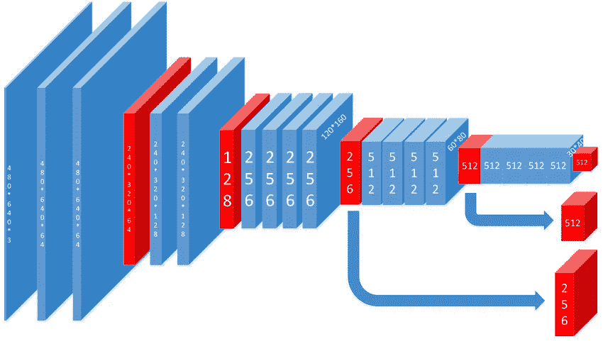
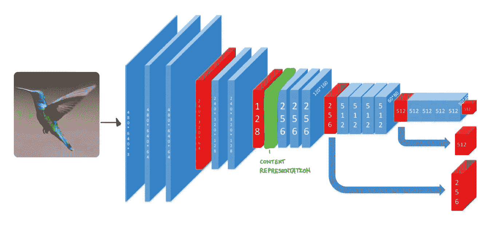
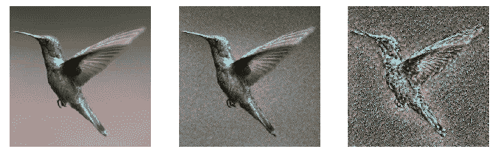
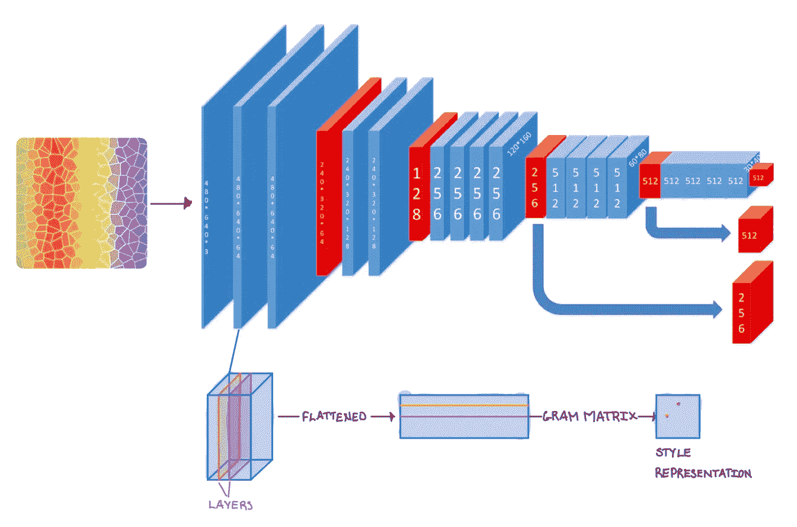
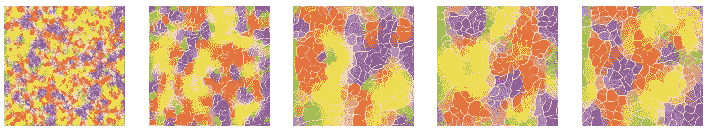
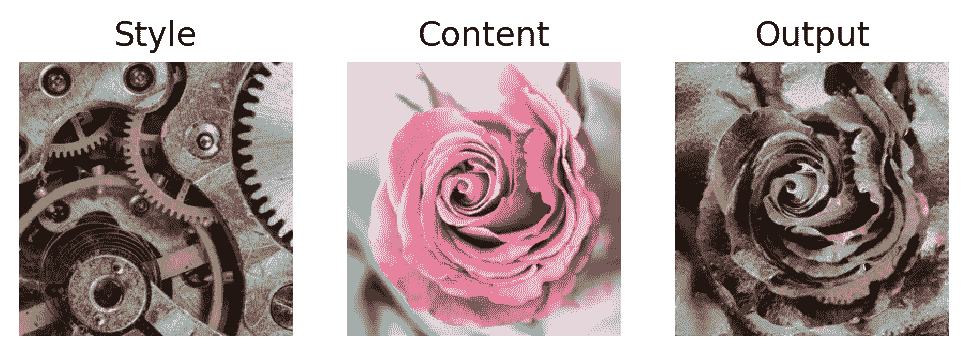
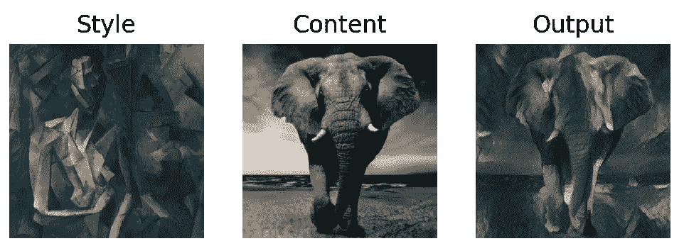

# 对神经类型转移的直观理解

> 原文：<https://towardsdatascience.com/an-intuitive-understanding-to-neural-style-transfer-e85fd80394be?source=collection_archive---------15----------------------->

神经风格转移是一种机器学习技术，它将一幅图像的“内容”与另一幅图像的“风格”融合在一起

 [## 艺术风格的神经算法

### 在美术中，尤其是绘画，人类已经掌握了通过构图创造独特视觉体验的技巧

arxiv.org](https://arxiv.org/abs/1508.06576) 

Creating a rainbow, mosaic hummingbird with neural style transfer

*   **内容:**描述图像中物体及其排列的高级特征。*内容的例子是人、动物和形状*
*   **风格:**图像的质感。*风格的例子有粗糙度、颜色和锐度*

Start by guessing with a white noise image

给定你的内容图像和风格图像，我们想要创建第三个图像，它是前两个图像的混合。让我们从一个简单的白噪声图像开始。为了优化效率，我们可以从内容图像或样式图像开始，但现在先不要担心这个。

现在假设我们有两个损失函数，**内容损失**和**风格损失**。这些函数都接受我们生成的图像，并返回一个损失值，该值表示我们生成的图像的内容和样式分别与给定的内容图像和样式图像的内容和样式有多么不同。

> 目标是最小化我们生成的图像的内容和风格损失的加权和

就像任何其他神经网络模型一样，我们使用优化算法，如随机梯度下降法*，但不是优化神经网络模型的参数，而是优化我们图像的像素值*。

Minimizing a weighted sum of style loss and content loss over the generated image. This is a progression of optimization across 600 steps

> 虽然风格和内容并不是完全相互独立的，但神经风格转移表明，在大多数情况下，我们可以很好地区分这两者。为了解决样式和内容之间的任何冲突，可以调整样式和内容损失的权重，以在生成的图像中显示更多的样式或内容。

这就结束了我们对神经类型转移的高级解释。

# 获取内容和风格损失函数

> 本节假设机器学习和卷积神经网络的基础知识。

我们使用经过训练的卷积神经网络(CNN)模型，例如 VGG19，来获取内容和风格损失函数。

## 内容

回想一下，内容是描述对象及其在图像中的排列的高级特征。图像分类模型需要在内容上训练有素，以便准确地将图像标记为“狗”或“汽车”。卷积神经网络(CNN)被设计成过滤掉图像的高级特征。CNN 本质上是从一个图像到另一个图像的顺序映射。每个连续的映射过滤掉更多的高级特征。因此，我们对 CNN 中的图像映射更感兴趣，因为它们捕捉了更多的内容。

关于 CNN 如何捕捉高级特征的更多详细信息，我推荐谷歌的这篇[文章。它有很多很棒的视觉效果](https://distill.pub/2017/feature-visualization/)

VGG19 is a traditional CNN model, which sequentially maps images to images via convolutional filters (blue). The red blocks are pooling functions that simply shrink the images to reduce the number of parameters in training. Licensed under CC BY 4.0 — [https://www.researchgate.net/figure/The-figure-maps-of-VGG19-in-our-approach-Blue-ones-are-got-from-convolutional-layer-and_fig4_321232691](https://www.researchgate.net/figure/The-figure-maps-of-VGG19-in-our-approach-Blue-ones-are-got-from-convolutional-layer-and_fig4_321232691)

我们将图像的**内容表示**定义为相对更深入 CNN 模型的图像映射。

We chose the fifth image mapping as our content representation. In more technical terms, we would say that our content representation is the feature response of the fifth convolutional layer.

我们可以通过仅使用内容表示来重建图像来可视化内容表示。我们首先天真地猜测一个白噪声图像，并迭代优化它，直到图像的内容表示收敛到原始图像的内容表示。这种技术被称为*内容重建*

Content reconstructions: The first image uses the content representation from the first image mapping, the second image uses the fifth image mapping and the third image uses the ninth mapping. With each successive image, there is more noise, but the high level structure of the bird is still retained. This indicates that the higher level features are being filtered out

## 风格

对于风格损失，我们希望捕捉图像的纹理信息，而不是结构信息。回想一下，一个图像包含多个通道，在 CNN 模型中，我们通常将图像映射到具有更多通道的图像，以便我们可以捕捉更多的特征。

让我们用单词 *layer* 来描述一个特定通道的图像切片。我们将**样式表示**定义为图像映射中各层之间的*相关性*。

更具体地说，它是图像映射中所有层对的逐元素矩阵乘法的总和。格拉米矩阵经常被用来表达风格。对于给定的图像映射，格拉米矩阵的第 I 行和第 j 列的元素将包含展平的第 I 层和第 j 层之间的点积。

We chose the first image mapping as our style representation. Style representation is the correlation between all layers in an image. While we only used one image mapping here, we usually use multiple image mappings for style representation (e.g. the first 5 image mappings)

就像在内容重建中一样，我们可以通过仅使用样式表示来重建图像，从而可视化样式表示。我们开始天真地猜测一个白噪声图像，并迭代优化它，直到图像的风格表示收敛到原始图像。这种技术被称为*风格重建*

Style reconstructions: The first image uses the the style representation from the first image mapping, the second image uses the style representations from the first two image mappings… etc. With each successive image mapping, the textures we obtain become more high level.

现在我们可以定义内容损失和样式损失函数。

> 内容损失是输出图像和内容图像的内容表示之间的平方误差
> 
> 样式损失是输出图像和样式图像的样式表示之间的平方误差

# 神经类型转移的高级过程

1.  决定 CNN 模型的哪些图像映射用于内容表示和样式表示，然后从内容图像计算内容表示，从样式图像计算样式表示。*对于所有这些图像，我将第五个图像映射用于内容表示，将前五个图像映射用于样式表示*
2.  初始化您的输出图像(可以是白噪音图像、样式图像或内容图像的副本，并不重要)
3.  根据相同 CNN 模型的*相同图像映射*计算输出图像的内容表示和样式表示
4.  计算内容损失和风格损失
5.  在内容损失和样式损失的加权和上优化您的输出图像。*这通常通过随机梯度下降来实现*
6.  重复步骤 2–5，直到您对结果满意为止

# 更多神经类型转移的例子

神经风格转移是一种惊人的机器学习技术，可以被艺术家广泛使用。这里还有一些神经类型转移的例子。所有图片都在 [Pixabay](https://pixabay.com) 下授权

# 履行

有大量的神经类型转换的代码基础。我推荐看看 PyTorch 的教程系列中的[。](https://pytorch.org/tutorials/advanced/neural_style_tutorial.html)