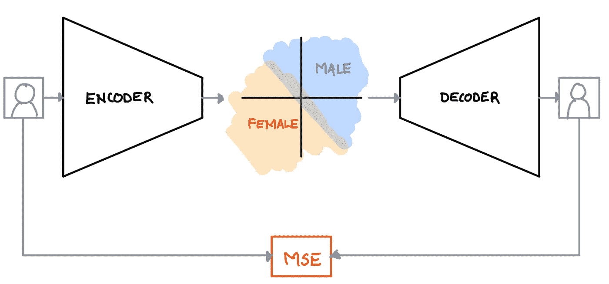

# 对衰减器网络的虚拟理解

> 原文：<https://towardsdatascience.com/an-inutitive-understanding-to-fader-networks-a8fb7c7901a4?source=collection_archive---------15----------------------->

## 推子网络是一种神经网络，可以让您控制数据项的一组属性

在这篇博客中，我们将讨论控制图像属性的推子网络，因为它们是最容易理解的。

 [## 推子网络:通过滑动属性操纵图像

### 本文介绍了一种新的编码器-解码器结构，它通过对图像进行解纠缠来重建图像

arxiv.org](https://arxiv.org/abs/1706.00409) 

The left images are the originals. Here we are controlling for the binary attributes of “age (young/old)” and “gender (male/female)”. Image from the [fader network paper](https://arxiv.org/abs/1706.00409).

> 我们假设你对神经网络有基本的了解

## 衰减器网络是自动编码器的变体

为了理解推子网络，我们将简要介绍一下自动编码器。

> 自动编码器(AE)是一种神经网络，用于在更小的维度空间中表示数据

An autoencoder is a neural network that learns how to compress data into a smaller space. Source: [Wikipedia](https://en.wikipedia.org/wiki/Autoencoder)

自动编码器由两个主要部分组成，**编码器**和**解码器**。

*   *编码器*是一个神经网络，它学习将图像映射到一个更小的维度空间，称为**潜在空间**(在上图中，他们称之为代码)。一个图像在潜在空间中的点被称为它的潜在表示。
*   *解码器*通过仅从潜在空间获取对应点来学习重建原始图像。
*   自动编码器的*损失函数*就是重建误差(即像素值的均方误差)

关于自动编码器的更详细的解释，请看这个[博客](/applied-deep-learning-part-3-autoencoders-1c083af4d798)。

## 推子网络是如何修改自动编码器的

为了理解推子网络，让我们使用在人脸数据集上训练的自动编码器， [CelebA](http://mmlab.ie.cuhk.edu.hk/projects/CelebA.html) ，其潜在空间维度为 2。我们想要控制性别属性。假设 0 表示男性，1 表示女性。训练之后，我们可以期望编码器像这样映射人脸。

An autoencoder with a 2-dimensional latent space on faces. We can expect the encoder to map the males and females to disjoint regions of the latent space so that the decoder can correctly reconstruct their genders

在高层次上，每个性别占据了潜在空间的一个不相交的区域，使得解码器可以容易地学习用正确的性别重建面部。

这是推子网络的不同之处。

A fader network is jut like an autoencoder except that the decoder takes in some attributes and the discriminator penalizes for any encodings of those attributes in the latent space

> 我们强制衰减器网络的解码器使用图像的给定属性，以及潜在表示来重建图像

推子网络是一个自动编码器，除了我们馈入解码器，不仅是潜在的表现，还有我们想要控制的图像属性。

> 为了迫使解码器使用给定的属性进行重构，我们必须破坏潜在空间中关于属性的所有信息。

在我们的例子中，给定了潜在空间中的一个点，我不应该能够说出这张脸的性别。通过破坏潜在空间中关于性别的任何信息，解码器被迫使用我们提供给它的给定属性来重建具有正确性别的图像。

为了破坏潜在空间中的属性，衰减器网络在其潜在空间上引入了鉴别器。这种鉴别器试图仅从图像的潜在表示中学习图像的属性。在我们的例子中，鉴别者试图从 2-D 潜在空间中学习图像的性别。在它被训练之后，通过惩罚潜在空间中属性的任何编码，它充当自动编码器的损失函数。

经过大量的训练后，我们希望看到鉴别器的表现不比随机猜测好，因为这表明我们已经成功地销毁了潜在空间中关于属性的所有信息。

通过完全训练的衰减器网络，我们可以通过改变属性值来控制重建图像的属性。在我们的例子中，我们可以在 0 和 1(男性和女性)之间滑动我们的性别属性，我们将看到男性和女性之间的人脸插值。

我们可以训练推子网络来控制多个属性，但随着我们想要控制的属性数量的增加，我们得到的重建和真实感质量会降低。

The left images are the originals. Here we are simultaneously controlling for the binary attributes of “opened eyes”, “glasses”, and “gender”. Image from the [fader network paper](https://arxiv.org/abs/1706.00409)

## 高级训练算法

回想一下，自动编码器的损失函数就是重建损失。在衰减器网络中，**总损失函数**是重构损失*和*鉴别器损失的加权和(鉴别器损失的较高值表明鉴别器可以容易地从潜在空间辨别属性)。

正如在大多数 ML 培训课程中一样，可以使用随机梯度下降来优化推子网络。

*开始时，将鉴别器损失的权重设置为 0，这样自动编码器可以首先获得良好的重建效果*

对于给定的一批图像…

We alternatively train the discriminator and autoencoder within a batch of data. When we train the autoencoder, we are optimizing over a weighted sum of the discriminator loss (cross entopy) and the reconstruction loss (MSE). Overtime, we increase the weight of the discriminator loss to encourage disentaglement of the attributes from the latent space.

1.  通过编码器输入批次，并在此潜在表示上优化鉴别器
2.  将批次通过自动编码器和新优化的鉴别器，并计算总损耗(鉴别器损耗和重建损耗的加权和)。针对这一总损失优化自动编码器(编码器和解码器)
3.  重复第 1 步和第 2 步，同时缓慢增加总损失函数中鉴频器损失的权重。

随着我们增加鉴别器损失的权重，性别属性开始越来越多地从潜在空间中消失，这逐渐迫使鉴别器在重建期间使用给定的性别属性。

## 履行

> [MNIST 推子网络笔记本](https://colab.research.google.com/drive/1o6iHyHisEwD-rV1UXaWx7FR1KjxKv0L-)

我在手写数字数据集 MNIST 上使用 Google Colab 实现了一个推子网络。我们控制的属性是图像的数字值。编码器和解码器分别是卷积和反卷积神经网络。鉴别器是一个简单的多层感知器，它为数字值输出一个 10 维概率向量。我们将鉴频器损耗计算为鉴频器输出和数字值的一键编码之间的交叉熵。重建损失是像素值之间的均方误差。回想一下，总损耗是重建损耗和鉴别器损耗的加权和。重建损失的权重总是 1。鉴别器损耗的权重从 0 开始，在每个时期后增加 3，在 15 结束。训练 50 个纪元大概需要 10 分钟。训练后，我们演示了一个渐变到另一个随机选择的数字。