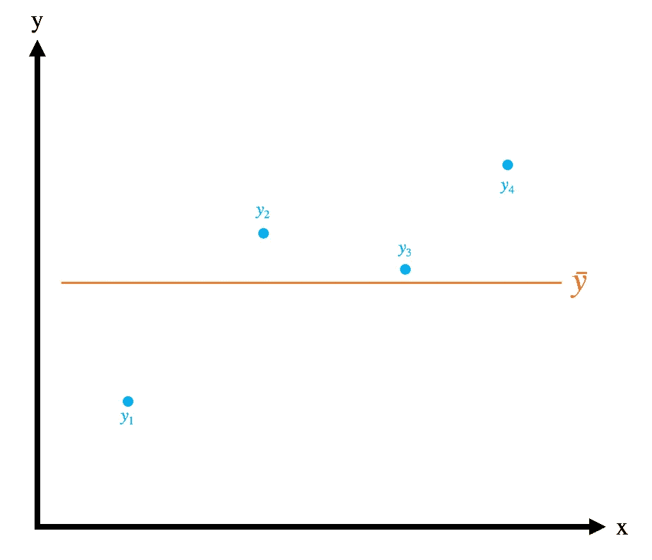
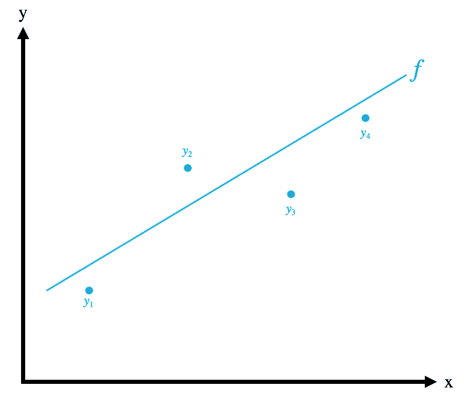
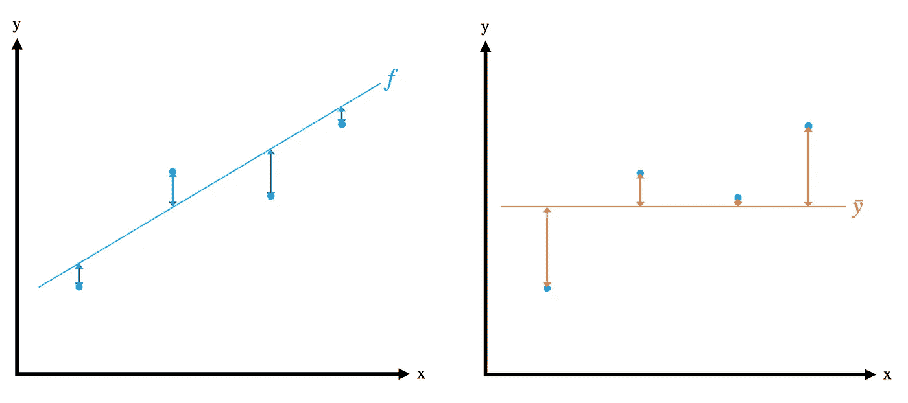
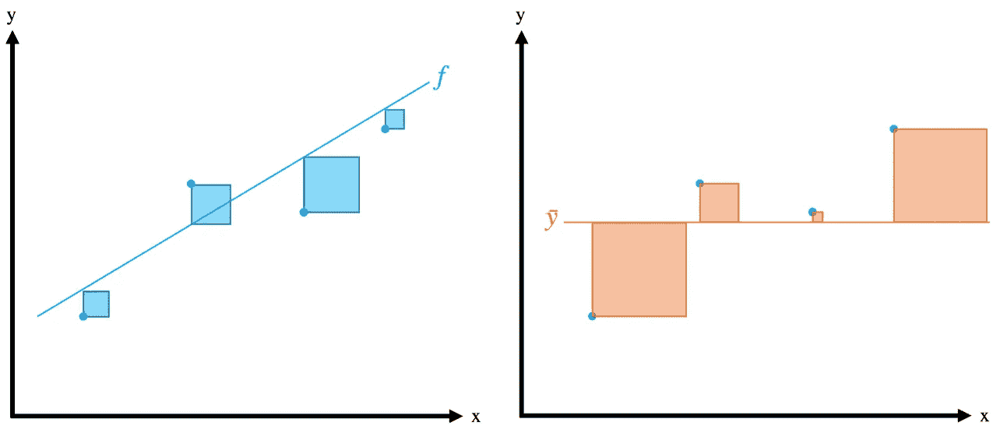
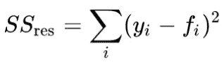
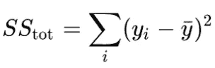
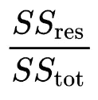
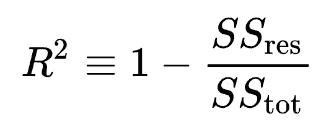

# R 平方的颂歌

> 原文：<https://towardsdatascience.com/an-ode-to-r-squared-804d8d0ed22c?source=collection_archive---------11----------------------->

## 或者说， ***统计学家的十字军东征:一场责任与决心的舞蹈***

据说能够向另一个人解释某事是掌握它的第一步。作为一名有抱负的数据科学家，R 平方感觉像是我应该掌握的东西之王…

因此，本博客涵盖以下问题:

*   什么是 R 平方，它告诉我们什么？
*   怎样才能直观的推导出 R 平方的公式？
*   为什么 R 的平方总是在 0–1 之间？

Portrait of Student Trying to Understand R-Squared, With Cat (c.2019)

# 什么是 R 平方，它告诉我们什么？

假设我们有一个输出度量 y，带有观察到的数据点， *y* ᵢ.那么预测未来观测值的最简单方法就是取现有观测值的平均值。

The baseline mean model, ȳ

注意这个基线模型如何总是为未来的观察预测相同的值。还要注意，这个预测不依赖于 *x* 的值。不用说，这不是一个很好的模型。

为了改善这种情况，假设我们改为创建一个线性回归模型， *f* ，根据观察到的数据点， *y* ᵢ，**及其相关的 *x* 值来预测 y 的值。**

Our model ‘*f*’

那么我们可能需要一些统计数据(姑且称之为 R 平方)来告诉我们我们的模型有多好。特别是，我们的模型 *f* 比“基线均值模型”有多大的改进？

> R 平方告诉我们:“我们的模型占了均值方差的多少？”

如果模型解释了 100%的方差(即 R 平方= 1)，那么我们可以说它完美地解释了观察到的数据点。

如果模型解释了 0%的方差(即 R 平方= 0)，那么我们可以说它对观察到的数据点没有任何精确的解释。

在现实世界中，R-Squared 善于促进模型之间的比较。然而，确定一个“好”的 R 平方值本身有点困难。一般来说，R 平方大于 0.6 的模型值得您关注，尽管还有其他因素需要考虑:

*   任何试图预测人类行为的领域，如心理学，其 R 平方值通常低于 0.5。人类本来就很难预测！
*   具有高 R 平方值的模型可能遭受其他问题，例如[过度拟合](https://en.wikipedia.org/wiki/Overfitting)。r 平方只是数据科学家评估其模型有效性的众多方法之一。

# 怎样才能直观的推导出 R 平方的公式？

与其一头扎进代数的海洋，我想形象地考虑一下 R 平方。

我们已经知道，回归将创建一个最小化残差的模型(即模型预测值 *y* 和实际观察值 *y* 之间的差异)。因此，查看我们模型的残差似乎是一个明智的起点。

Our model, f, (L) and the baseline case ȳ (R)

我们的模型 *f* (左边图表中的蓝色箭头)的残差可以被认为是我们的模型无法解释的观察值的比特。

一旦我们开始将这些残差作为公式的一部分进行求和，那么对它们的平方和进行求和是很有用的。这将确保我们不必处理任何负面价值。它还会放大较大个体误差的影响，这在模型预测不佳时会变得格外明显。

The squared residuals for our model, f, (L) and the baseline case ȳ (R)

同样，我们可以为我们的模型和基线情况可视化这些平方残差。在这里，蓝色的方块是另一种方式来显示我们的模型无法解释的那部分误差。蓝色方块的总面积可以用数学方法表示为:

*The Residual sum of squared errors of our regression model also known as SSE (Sum of Squared Errors)*

此外，橙色方块的总和可由下式给出:

The **Total** sum of squared error — the squared difference between *y* and ȳ

我们希望 R 平方是我们的模型与基线情况的比较。我们可以通过将蓝色方块的面积作为橙色方块面积的一部分来进行比较:

因此，这个表达式告诉我们，模型解释的是*而不是*偏离平均值ȳ的份额。因此，由模型解释的*是*的方差份额，或传说中的 R 平方，可以给定为:

# 为什么 R 的平方总是在 0–1 之间？

R 平方最有用的性质之一是它的范围在 0 和 1 之间。这意味着我们可以很容易地比较不同的模型，并决定哪一个更好地解释了均值方差。

当然，从上面我们知道 R 平方可以这样表示:

所以要让 R 的平方有界在 0 和 1 之间，我们要求***(ss RES/ss stot)***本身在 0 和 1 之间。如果出现以下情况，就会发生这种情况:

1.  ***SSres≤SStot****(对于 R 平方大于等于 0)*
2.  ***SSres*** *和****SStot****都为正，或者都为负(对于 R 平方小于或等于 1)。*

让我们依次来看这些。回想一下:

The sum of all the squared resisuals from the model.

The sum of all the squared residuals from the mean of observed values.

对于(1)，我们可以做一个直观的论证。记住， ***SStot*** 代表观察到的 y 值之间的差距，以及它们的平均值，ȳ.

假定 **y = ȳ** 表示一条直线(特别是，一条穿过 x-y 平面的水平线)， **y = ȳ** 本身就是我们数据集的线性模型。当然，这不是一个好模型，但它仍然是一个模型。

现在让我们考虑一下计算 R 平方的模型——这个模型产生了 *f* 项，因此产生了 ***SSres*** 。该模型是通过回归创建的，根据定义，我们知道回归过程会生成最小化数据集残差的模型。

我们有两种可能的情况:

*   回归产生 **y = ȳ** 作为最小化残差的模型。这样，我们就有了***ssres***=***sstot***，因为 *f* ᵢ = ȳ跨越了数据集。
*   回归产生了不同的模型。由于回归产生了一个最小化残差的模型，这个模型的残差必须小于 **y = ȳ** 的情况。所以我们要有***SSres******<SStot****。*

于是，我们有了***SSres≤SStot****。*

因此，R 的平方将总是大于或等于 0。

对于(2)，我们知道 ***SSres*** 和 ***SStot*** 都是作为平方和给出的(见上图)。由于平方数总是正的，我们知道 ***SSres*** 和 ***SStot*** 都将总是正的。

因此，R 的平方将总是小于或等于 1。