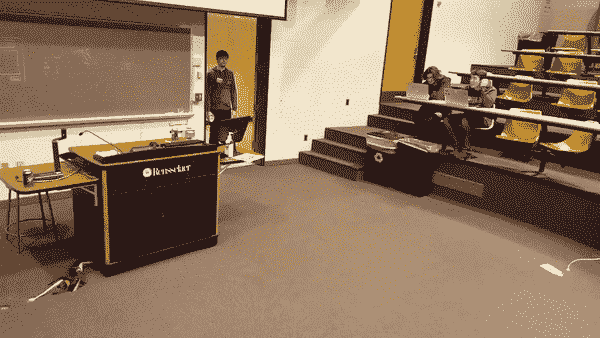
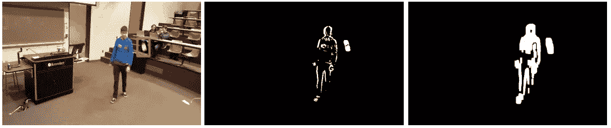
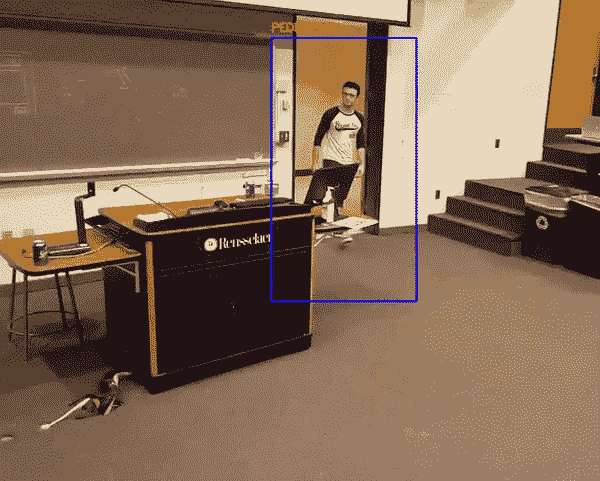
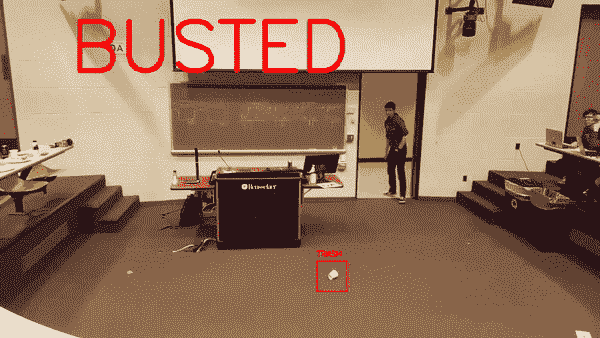
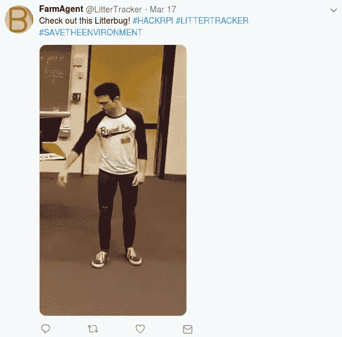

# 解决垃圾问题的奥威尔式方法

> 原文：<https://towardsdatascience.com/an-orwellian-approach-to-the-litter-problem-1396ddb15701?source=collection_archive---------6----------------------->

Photo by [Paweł Czerwiński](https://unsplash.com/@pawel_czerwinski?utm_source=medium&utm_medium=referral) on [Unsplash](https://unsplash.com?utm_source=medium&utm_medium=referral)

## 使用计算机视觉来检测有人遗漏了垃圾

任何生活在城市环境中的人都知道它有多肮脏。无论市政当局如何努力，垃圾总会像杂草一样在城市中蔓延。简单的解决方案包括派人带着垃圾清道夫去清理城市街道。不幸的是，人们并不总是知道垃圾在哪里。街道清洁工可以在低密度垃圾区漫步，而垃圾堆在更繁华的区域。

在我以前的大学最近举办的一次黑客马拉松中，我和我的团队试图解决垃圾问题，以改善我们的社区并安抚黑客马拉松的环境意识主题。结合我们在计算机视觉和机器学习原则方面的经验，我们希望创建一个切入源头的解决方案。我们的项目没有等待专门的垃圾清除服务，而是利用了城市中大量的安全摄像头和基本的人类自尊。

What a vile litterbug

## 人体跟踪

为了检测被扔的垃圾，我们想把一个人隔离成一团像素。如果整个人可以被转换成像素的二进制斑点，我们可以检测另一个像素斑点是否开始远离人。我们可以有把握地假设第二个斑点是一个被乱丢的物体。这个思考过程激发了使用衍生视频来跟踪场景变化的想法。这不是一个健壮的解决方案，因为即使在尝试了膨胀方案之后，图像中的人也经常是支离破碎的。

A derivative approach to motion detection in a scene. Red box shows trash and is not generated by program

在很快厌倦了这种幼稚方法的不一致性后，我们的团队转而使用梯度方向直方图来确定一个人的位置。猪探测器通常用于探测行人。该方法使用 Sobel 算子找到图像的梯度。然后，梯度图像被分割成 8×8 像素块。在每个小块中，计算梯度向量，并基于其方向将其添加到九仓直方图中。利用这些梯度，我们可以预测一个人可能在哪里。

[实施](https://www.pyimagesearch.com/2015/11/09/pedestrian-detection-opencv/)猪检测器给出了令人惊讶的原始结果。可以跟踪一个人在场景中移动。该方法还可以在一幅图像中区分多个人。一旦检测到人，就创建一个边界框。人们发现，如果边界框太小，宽广而富于表情的动作有时会被混淆。结果，我们用一个常数值扩展了边界框。

The result of the HOG detector, with an enlarged bounding box

## 垃圾检测

检测真正的垃圾是这个项目中最棘手的部分。尝试了两种方法。第一种方法依靠机器学习原理来识别图像中的垃圾。垃圾文字图像的数据集被用来训练一个复杂的神经网络。这些图像的尺寸被调整为 60×60 像素的图像，并在 0 到 1 的尺度上进行归一化。神经网络本身包含三个卷积层和两个隐藏层。不幸的是，这种方法非常笨拙，成功率也不高。在最好的情况下，该团队在区分纸板和玻璃时能够达到 80%的成功率。

我们发现一种更成功的方法依赖于简单的图像处理方法。我们拍摄了前面提到的衍生图像，并监控由 HOG 检测器创建的边界框内的像素。如果检测到一组像素穿过边界框的边界，则标记该像素。该组像素由它们自己的盒子界定，并且存储相关联的彩色图像。

捕捉到潜在垃圾的图像后，使用跟踪算法来跟踪垃圾。OpenCV 提供了几种方便的跟踪算法。对于这个项目，使用了具有信道和空间可靠性(CSRT)跟踪器的判别相关滤波器。这种滤波器以其鲁棒性而闻名。这对于我们的目的来说很方便，因为它可以处理对象的遮挡。这种方法的缺点是计算复杂。但是，谁会在黑客马拉松上寻求优化呢？

如果 CSRT 跟踪到图像超出了垃圾者的范围，这个物体就被标记为垃圾。跟踪器继续跟踪垃圾，并保存其最终的图像坐标和尺寸。

Example of CSRT tracker resolving occlusion

除了抓住一个乱扔垃圾的人，该团队还想检测是否有人捡了垃圾。这样的乐善好施者可以避免派人去清理垃圾。更具侵略性的市政当局可以不遗余力地奖励整洁的个人。

由于垃圾的位置是已知的并被跟踪，清理垃圾的算法很简单。程序继续追踪这个垃圾。如果垃圾从其丢弃位置移动了一个阈值，并且包含在 HOG 生成的帧中特定数量的帧，则认为垃圾已被清除。

Being a good samaritan

## 推特垃圾

如前所述，该项目旨在通过针对问题的根源来遏制乱丢垃圾。完全缺乏共同的体面混合匿名的保护，让人们犯下这一令人发指的罪行。由于我们的方法能够检测出乱扔垃圾的个体，因此可以很容易地保存罪犯的图像。

使用 Twitter 令人难以置信的实用 API，通过将罪犯的图像上传到 Twitter，这个项目增加了一点魔力。这个信息让邻居看到是谁造成了他们社区的垃圾堆积。相机可能会报告其地理坐标以及图像。这将允许有礼貌的居民清理垃圾。在未来，我们希望增加一种奖励好心人的方法，无论是通过积极的 Twitter 帖子还是其他方式。

An example twitter post by the litter tracker

## 结果

这个黑客马拉松项目成功地展示了一个基本监控系统的原型。该方法能够监控个人是否不能将他们的垃圾放入垃圾容器中。

考虑这种方法的局限性很重要。我们的方法依赖于一个人从他们身边扔一片垃圾。我想象这是最常见的乱扔垃圾的方法(我个人经验不多)。然而，如果一个人决定蹲下，轻轻地把垃圾放在他们旁边，我们的算法将无法检测到垃圾。该程序也不能确定垃圾的类型。个人可能会丢失钱包，算法会将该物品视为垃圾。该团队最初希望用前面提到的神经网络来解决这个问题。不幸的是，由于数据集有限，这变成了一项艰巨的任务。

虽然这个项目没有让我们在黑客马拉松上获得胜利，但这是一次令人难以置信的激动人心的经历。过去，我在静态图像方面做了大量的工作，但在视频镜头方面做得很少。这个项目采用了许多计算机视觉技术，并将它们应用到一个愚蠢而有趣的应用程序中。

## 最终视频

我应该强调，这篇文章是一篇工程讽刺文章。实际上，我并不建议市政当局实施这样的制度，也不赞同将侵犯隐私和公开羞辱作为解决乱扔垃圾问题的一种手段。