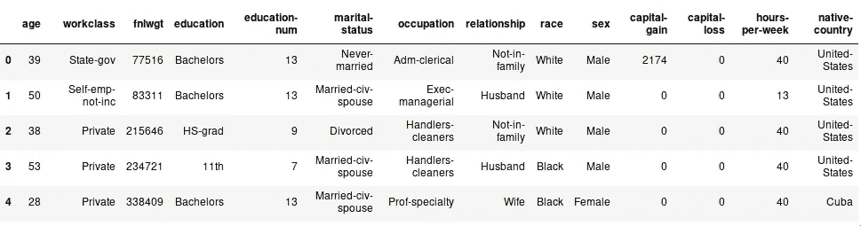
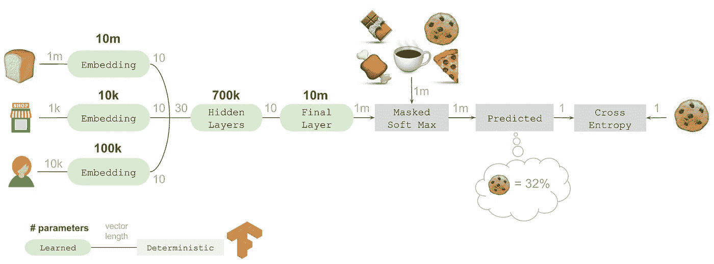

# 神经网络分类输入处理综述

> 原文：<https://towardsdatascience.com/an-overview-of-categorical-input-handling-for-neural-networks-c172ba552dee?source=collection_archive---------4----------------------->


image by [sanwaldeen](https://unsplash.com/@sanwaldeen)

## 为基于神经网络的预测器预处理数据时，总结处理分类数据(低基数和高基数)的多种方法的快速指南

在 2018 年的一次编码练习中，我被要求为描述员工及其工资的[数据集](https://www.kaggle.com/uciml/adult-census-income)编写一个 sklearn 管道和一个 tensorflow 估计器。目标是:创建一个预测器来预测某人的年收入是高于还是低于 5 万英镑。



我遇到的一个问题是**对分类值**的处理。虽然决策树或森林对这种数据没有问题(它们实际上处理得很好)，但用神经网络处理起来有点棘手。当然，我们都知道 One-Hot-Encoding 是一种将这种数据映射成 NN 可通过格式的方法。但是我被要求开发一个处理分类列的多种方法的详尽列表。类别数量最多的列是具有 41 个唯一出现值的`native-country`。

让我们假设数据集有一个名为“电子邮件域”的附加列，其中包含“@ Gmail . com”“@ hotmail . com”等域和“@pascalbrokmeier.de”等私有域。该列表可能包含数千个唯一值，这些值很难由神经网络处理。一个好的工具应该以某种有意义的方式对类别的含义进行编码，同时保持相对较低的维数。

事实证明有很多方法可以解决这个问题。因此，在接下来的文章中，我将**概述用神经网络处理分类数据的许多方法。我将把列表分成两类:可以将任意符号列映射成适当表示的通用方法和特定领域的方法。对于领域特定的例子，我将描述以某种有意义的方式表示国家列的方法。**

## 什么是分类数据？

在深入研究处理分类数据并将其传递给神经网络的方法之前，我想用几个词来描述它是什么。用我自己的话来说，分类数据是一组符号，用于描述感兴趣的某个对象、系统或实体的某个更高级别的属性。例如，概念“红”、“蓝”和“绿”描述了这样的事实，即一些物理对象辐射特定分布的电磁波谱，该电磁波谱转变为有意识的人的观察，该人仍然可以通过视觉来观察世界。这比简单的“1，2，3”要复杂得多。你如何订购颜色？你会如何看待它们之间的关系？什么是属于什么的？你认为以下四个词中的哪一个会缩短彼此之间的距离？“绿色、蓝色、天空、树叶”。

分类数据*可以，但不是必须*，遵循某种排序。然而，分类数据通常可能是不同的，甚至是重叠的。有时一个范畴集的可能值可以彼此有关系，有时它们彼此毫无关系。将分类输入转换到数值向量空间时，需要记住所有这些概念。

用维基百科的话说:

> 分类变量是一个变量，它可以呈现有限的中的**之一，并且通常是固定数量的可能值，根据某个**定性属性**将每个个体或其他观察单位**分配到特定的组或名义类别**。**

够了，把别人的工作归功于自己。让我们开始吧:

# 与领域无关的解决方案

以下编码分类数据的方式与我们正在交互的类别类型无关。

## 顺序编码

让我们从最简单的形式开始:给每个可能的类别分配一个整数并传递它。这是一种非常幼稚的处理数据的方式，除了*让它工作之外，它通常没有什么好处，*意味着程序不会再崩溃了。当查看国家/地区列时，您可能会看到这样的内容:

这种方法有几个缺点:`Canada != 1/2 * China`和`Vietnam != 40/39*United-States`。任何关于这些国家的高层信息都会在翻译过程中丢失。使用我的[基准预测器网络](https://github.com/pascalwhoop/categorical-demo)时，结果显示性能下降:

```
>>>> ordinal_pp = helpers.to_pipeline(("ordinalencoder", preprocessing.OrdinalEncoder()))>>>> ordinal_pipeline = pipeline.get_pipeline(ordinal_pp, input_dim=14)>>>> helpers.execute_on_pipeline(ordinal_pipeline, X_train, y_train, X_test, y_test)Epoch 1/3
 - 1s - loss: 0.9855 - mean_absolute_error: 0.3605 - acc: 0.7362
Epoch 2/3
 - 1s - loss: 0.4939 - mean_absolute_error: 0.3108 - acc: 0.7741
Epoch 3/3
 - 1s - loss: 0.4665 - mean_absolute_error: 0.2840 - acc: 0.7970**0.8492152641473572**
```

## 一个热编码

我发现最常被“推荐”的方法是 OHE，也称为“虚拟编码”。当搜索“分类数据神经网络”时，弹出的几乎每一页上都有解释。它也是 sklearn 的一部分，因此可以很快应用于数据集。原理很简单，最好用一点代码来说明:

```
>>>> import helpers
>>>> from sklearn import preprocessing
>>>> import numpy as np
>>>> X_test, y_test = helpers.get_data(subset="test")>>>> ohe = preprocessing.OneHotEncoder()
>>>> categories = np.array(list(set(X_test['workclass'].astype(str).values))).reshape(-1,1)
>>>> ohe.fit(categories)OneHotEncoder(categorical_features=None, categories=None,
       dtype=<class 'numpy.float64'>, handle_unknown='error',
       n_values=None, sparse=True)>>>> categoriesarray([['Self-emp-inc'],
       ['Local-gov'],
       ['Private'],
       ['State-gov'],
       ['Never-worked'],
       ['Without-pay'],
       ['Federal-gov'],
       ['Self-emp-not-inc'],
       ['nan']], dtype='<U16')>>>> ohe.transform(categories).todense()matrix([[0., 0., 0., 0., 1., 0., 0., 0., 0.],
        [0., 1., 0., 0., 0., 0., 0., 0., 0.],
        [0., 0., 0., 1., 0., 0., 0., 0., 0.],
        [0., 0., 0., 0., 0., 0., 1., 0., 0.],
        [0., 0., 1., 0., 0., 0., 0., 0., 0.],
        [0., 0., 0., 0., 0., 0., 0., 1., 0.],
        [1., 0., 0., 0., 0., 0., 0., 0., 0.],
        [0., 0., 0., 0., 0., 1., 0., 0., 0.],
        [0., 0., 0., 0., 0., 0., 0., 0., 1.]])
```

*原谅我没有把它作为主旨分享出来。出于某种原因，medium 把我粘贴的要点链接变成了要点的截图。很没用*

结果是对先前变体的改进:

```
>>> ohe_encoder_pp = helpers.to_pipeline(("ohe", preprocessing.OneHotEncoder(handle_unknown='ignore', categories=categories.get_categories())))>>> ohe_pipeline = pipeline.get_pipeline(ohe_encoder_pp, input_dim=112)>>> helpers.execute_on_pipeline(ohe_pipeline, X_train, y_train, X_test, y_test)Epoch 1/3
 - 2s - loss: 0.3824 - mean_absolute_error: 0.2332 - acc: 0.8358
Epoch 2/3
 - 1s - loss: 0.3601 - mean_absolute_error: 0.2117 - acc: 0.8530
Epoch 3/3
 - 1s - loss: 0.3547 - mean_absolute_error: 0.2125 - acc: 0.8526**0.9069985244122271**
```

## 嵌入分类数据

[这篇论文](https://arxiv.org/pdf/1604.06737v1.pdf)和[这篇关于它的帖子](https://www.fast.ai/2018/04/29/categorical-embeddings/)都描述了如何将表格数据转化为神经网络可以管理的东西。



Source: [https://tech.instacart.com/deep-learning-with-emojis-not-math-660ba1ad6cdc](https://tech.instacart.com/deep-learning-with-emojis-not-math-660ba1ad6cdc)

这可以让你*预先训练*一个嵌入层，用于你打算转换成神经网络可以消费的每一个类别。在上图中，instacart 团队使用了一个[嵌入层](https://keras.io/layers/embeddings/)将他们 1000 万件产品中的任何一件转化为 10 维嵌入。然后，下面的隐藏层只需要处理小得多的输入大小。此外，这些较低的维度具有*固定大小*，这对于构建模型很重要，因为第一层的输入大小需要在训练期间设置，并且后面的预测值也必须符合该大小。这个概念非常类似于[自然语言处理方法](https://github.com/tensorflow/tensorflow/blob/master/tensorflow/examples/tutorials/word2vec/word2vec_basic.py)，我们甚至可以利用预先训练的嵌入。稍后会详细介绍

这对我们的分类价值观意味着什么？对于数据集中的每个分类列，我们必须创建一个嵌入网络来学习该分类的嵌入。如果分类列包含来自预训练嵌入词汇表(例如颜色嵌入或另一个子域)的单词，那么[采用这种预训练嵌入](https://www.tensorflow.org/guide/embedding)可能是有益的。如果类别中的词汇与众不同，那么训练(或改编)一个[特定领域嵌入](http://ruder.io/word-embeddings-2017/index.html#taskanddomainspecificembeddings)可能会更好。这带来了更低维度的额外好处。只需要描述彼此相关的颜色的向量空间可能比试图嵌入英语中所有单词的向量空间小得多。

# 特定领域解决方案

## 差异编码

[差异编码](https://stats.idre.ucla.edu/spss/faq/coding-systems-for-categorical-variables-in-regression-analysis-2/)可能有助于描述有序属性的分类值。让我们假设只有三种教育形式:没有，学校，大学。在本例中，结果将是具有以下值的三个新变量:

*   无:0，0，0
*   学校:-0.5，0.5，0
*   大学:-0.25，-0.25，0.5

基本上，顺序越高，值越有表现力，因为越多的列远离 0 值。

## 字符串元数据

类别字符串中有多少单词，字符串有多长，哪些字母出现的频率有多高？虽然这可能是非常嘈杂的信息，但具有足够大数据集的神经网络可能能够从这些信息中提取一些小的预测能力。我记得《线性离题》[中的凯蒂](https://lineardigressions.com/)提到过她的一个直觉，大意是“*如果你能想象一个人从数据中获得一些价值，机器学习算法也可能做得很好”。这对我们的数据集意味着什么？嗯，一个长的职位头衔可能意味着在一个(可以说是太深的)层级链中有更高的级别，因此增加了获得更高薪水的可能性。快速迂回:[这一页把它发挥到了极致](http://www.bullshitjob.com/title/)(并从我的坏例子中转移注意力)。*

## 子信息(编辑:或 N-grams)

让我们跳回假设的电子邮件专栏。一个域有一个 [TLD](https://en.wikipedia.org/wiki/Top-level_domain) ，它可以保存关于个体起源的信息。这也可以给我们一个关于他们与非营利组织关系的指标。org)或者如果他们在教育机构工作(。edu)。这些信息对于神经网络的训练可能是有价值的。因此，将类别分成子列可能是有价值的。

**编辑**:也许最强大的技术是使用 n 元语法，特别是字符级 n 元语法。上面的段落已经回避了这一点，但是 n-grams 肯定是更通用的方法。假设你把每封电子邮件都做成一套 2-10 克的。现在，这些 n-grams 可以被编码并传递给 ML 算法。它们将包含几个字母，如“web.de”、“gmail.c”或“@apple.com”。当然，人们可以从这样的子串中获得大量的信息。此外，你现在有了一种向 ML 算法传递信息的方法，它包含了所有人*没有`gmail`或`hotmail`账户的情况。拥有个人域名的人当然属于不同的类别，如`jonny95@gmail.com`(抱歉，乔尼)。*

## 数据丰富

如上所述，虽然许多电子邮件域，如来自 Google Mail 或 Hotmail 的电子邮件域在人群中非常普遍(因此不包含大量信息)，但自定义域可能是一个人工资的有力指标，特别是如果这些自定义域不是个人域，而是属于某个组织。还有大量基于域名的数据可以从网上提取。可以将爬行器添加到管道中，对于每个遇到的域名，该爬行器执行对该域的 HTTP 调用，提取一些关键字并在训练期间使用它们。

# 概述

将类别转换成神经网络可以处理的东西是一个常见的问题，但找到多种方法来解决这个问题似乎很难。[这个，](https://stats.stackexchange.com/questions/36303/regression-model-with-categorical-values) [这个，](https://stats.stackexchange.com/questions/298479/how-to-handle-large-categorical-values-in-data-frame) [这个](https://stats.stackexchange.com/questions/313715/one-hot-encoding-alternatives-for-large-categorical-values)的问题表明，确实没有太多的选择。最终，任何需要神经网络或回归来将类别转换成某种向量表示的方法都需要从数字输入开始。除了简单地编号(`OrdinalEncoder`)或者将每个可能的值转换成它自己的二进制维度(`OneHotEncoder`)之外，没有多少其他方法来映射一组可选值。甚至在将固定大小的向量传递到预测层之前，嵌入也会绕过 OneHotEncoder。

如果你知道其他编码这些值的方法，请与我分享！我会相应地更新文章，当然也要感谢任何作者。

## 进一步阅读

*   众多编码系统汇总:[https://stats . idre . UCLA . edu/SPSS/FAQ/coding-systems-for-categorical-variables-in-regression-analysis-2/](https://stats.idre.ucla.edu/spss/faq/coding-systems-for-categorical-variables-in-regression-analysis-2/)
*   自动编码器，也可以提供一种编码输入的方法[https://en.wikipedia.org/wiki/Autoencoder](https://en.wikipedia.org/wiki/Autoencoder)
*   分类值维基百科:[https://en . Wikipedia . org/wiki/categorial _ variable # categorial _ variables _ and _ regression](https://en.wikipedia.org/wiki/Categorical_variable#Categorical_variables_and_regression)

 [## 分类数据分析列表-维基百科

### 这是一个统计程序的列表，可用于分类数据的分析，也称为分类数据

en.wikipedia.org](https://en.wikipedia.org/wiki/List_of_analyses_of_categorical_data)  [## 教程-什么是变分自动编码器？-贾恩·阿尔托萨尔

### 从两个角度理解变分自动编码器:深度学习和图形模型。

jaan.io](https://jaan.io/what-is-variational-autoencoder-vae-tutorial/) [](https://medium.com/@satnalikamayank12/on-learning-embeddings-for-categorical-data-using-keras-165ff2773fc9) [## 基于 Keras 的分类数据嵌入学习研究

### (这是乔·艾迪(Joe Eddy)解决方案对 Kaggle 的安全驾驶员预测的实施的分解和理解…

medium.com](https://medium.com/@satnalikamayank12/on-learning-embeddings-for-categorical-data-using-keras-165ff2773fc9) [](https://datascience.stackexchange.com/questions/43397/how-to-handle-different-input-sizes-of-an-nn-when-one-hot-encoding-a-categorical/43399#43399) [## 当对分类输入进行一次热编码时，如何处理神经网络的不同输入大小？

### 感谢您为 Data Science Stack Exchange 贡献答案！你过去的一些回答并没有…

datascience.stackexchange.com](https://datascience.stackexchange.com/questions/43397/how-to-handle-different-input-sizes-of-an-nn-when-one-hot-encoding-a-categorical/43399#43399) [](https://machinelearningmastery.com/why-one-hot-encode-data-in-machine-learning/) [## 机器学习中为什么要一次性编码数据？

### 应用机器学习的入门可能很难，尤其是在处理真实世界的数据时。经常…

machinelearningmastery.com](https://machinelearningmastery.com/why-one-hot-encode-data-in-machine-learning/)