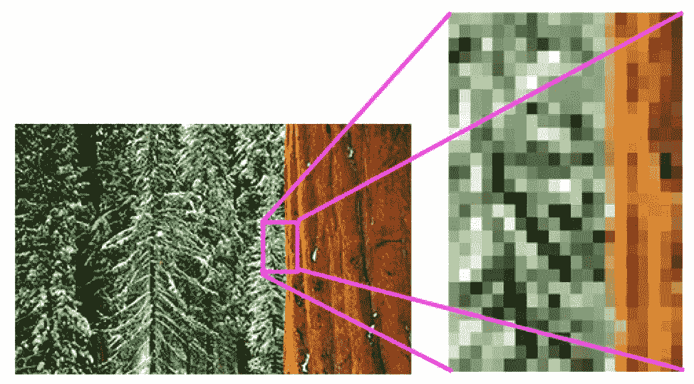
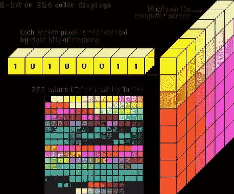
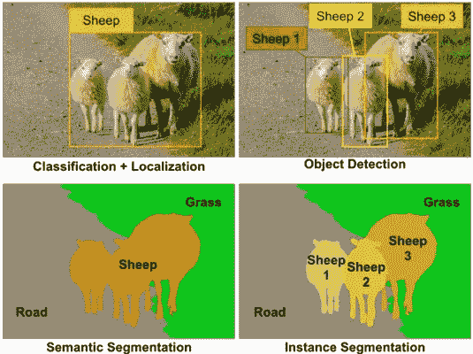
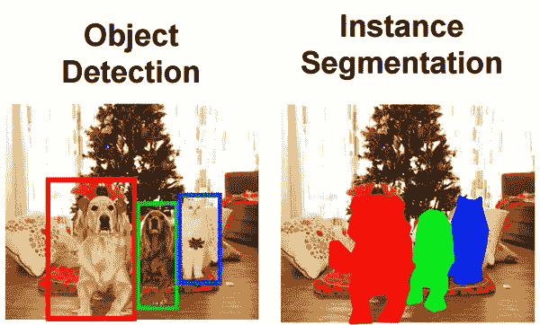
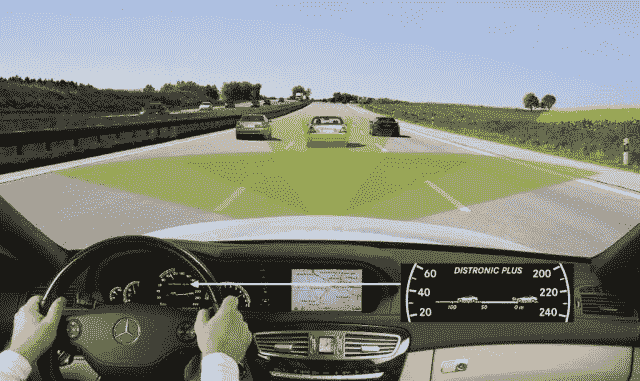

# 计算机视觉概述

> 原文：<https://towardsdatascience.com/an-overview-of-computer-vision-1f75c2ab1b66?source=collection_archive---------8----------------------->

*“If we want machines to think, we need to teach them to see.”
-Fei Fei Li, Director of Stanford AI Lab and Stanford Vision Lab*

计算机视觉是[人工智能](https://www.sas.com/en_us/insights/analytics/what-is-artificial-intelligence.html)的一个领域，训练计算机解释和理解视觉世界。机器可以准确地识别和定位物体，然后使用来自相机、视频和深度学习模型的数字图像对它们**【看到】**的东西做出反应。

从 20 世纪 50 年代末和 60 年代初开始，图像分析的目标是模仿人类视觉系统，并询问计算机它们看到了什么。在此之前，图像分析一直是使用 x 射线、MPIs 或高分辨率空间摄影人工完成的。美国宇航局的月球地图率先采用了**数字图像处理技术**，但直到 1969 年才被完全接受。

随着计算机视觉的发展，编程算法被创造出来解决个人挑战。机器变得更擅长重复进行视觉识别。多年来，深度学习技术和技术有了巨大的进步。我们现在有能力对超级计算机进行编程，让它们自我训练，随着时间的推移自我改进，并以在线应用的形式向企业提供功能。

我喜欢把计算机视觉想象成处理数百万次计算，以便识别模式，并具有与人眼相同的准确性。模式可以在物理上看到，也可以通过应用算法在数学上观察到。

**计算机视觉的崩溃**

图像被分解成像素，像素被认为是图片的元素或组成图片的最小信息单元。

计算机视觉不仅仅是将图片转换成像素，然后试图通过这些像素理解图片中的内容。你必须了解如何从这些像素中提取信息并解释它们代表什么。

[Each pixel is represented by 8 numbers (bits of memory). In computer science, each color is represented by a value.](http://akhileshkumar.me/blogs/computer%20vision/ComputerVision101/)

**神经网络和深度学习使计算机视觉更有能力复制人类视觉**

> “神经网络是一套算法，大致模仿人脑，旨在识别模式。他们通过一种机器感知、标记或聚类原始输入来解释感官数据。它们识别的模式是数字的，包含在向量中，所有现实世界的数据，无论是图像、声音、文本还是时间序列，都必须转换成向量。”

**图像分类和分割**

一张图片的**分类**简单解释就是当计算机将一张图片分类到某个类别的时候。在下图中，第一个分类对象是羊。**定位**或位置由图片中物体周围的方框标识。

**对象检测**检测某类语义对象的实例。下图图中有 3 只羊。将它们(盒子)分类为 sheep1、sheep2 和 sheep3

每个像素属于一个特定的类。在下面的图片中，类别是绵羊、草地或道路。类中的像素用相同的颜色表示。(羊是橙色，路是灰色，草是绿色)。这描述了**的语义切分**。

用**实例分割**同一类的不同对象有不同的颜色。(羊 1 =亮黄色，羊 2 =暗黄色，羊 3 =橙色)

谁使用计算机视觉？

亚马逊推出了 18 家亚马逊商店，顾客可以绕过排队，立即付款。有了计算机视觉，摄像头被用来让员工知道什么时候有东西被下架了。它还可以识别退回的商品或从购物车中移除的商品。当你填完“虚拟篮子”后，你的亚马逊 prime 账户就会被扣款。

零售店中的计算机视觉它还可以提高安全性。随时跟踪店内的每个人可以确保每个购物者为商品付款。

**脸书**在自动标记发布到您个人资料的照片时使用面部识别(“DeepFace”)。由于隐私问题，在许多观众的负面反馈后，脸书只允许承认是选择进入。

**军事|太空—** 全球各国正在将人工智能嵌入武器、运输、目标识别、战地医疗保健、模拟训练以及其他用于陆地、空中、海上和太空的系统。基于这些平台的人工智能系统更少依赖于人类的输入，因为它们提高了性能，同时需要更少的维护。

利用当前的系统，人工智能减少了网络攻击，并可以保护网络、计算机、程序和数据免受任何未经授权的访问。

**汽车** —计算机视觉是**汽车行业**的热门话题。特斯拉和谷歌等公司正在制造自动驾驶汽车。如今的汽车拥有自适应/动态巡航控制系统，能够与前方车辆保持安全距离。

根据世界卫生组织的统计，每年有一百多万人死于车祸，很大程度上是由于司机的疏忽。一旦计算机视觉完全安装到我们的车辆上，注意到汽车死亡数据的变化将是有趣的。