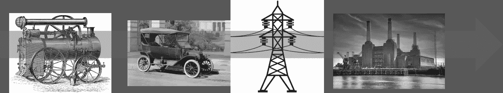
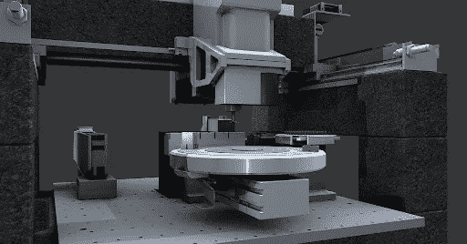
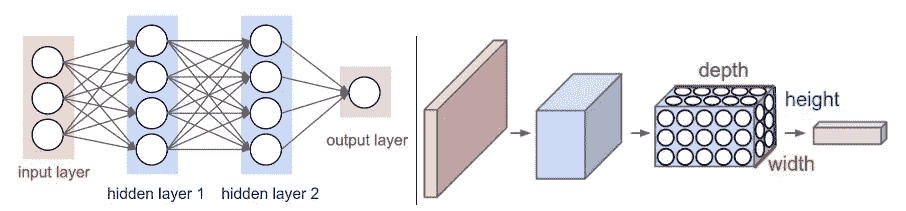
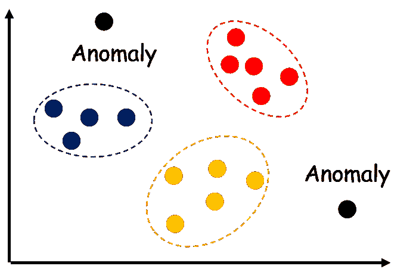
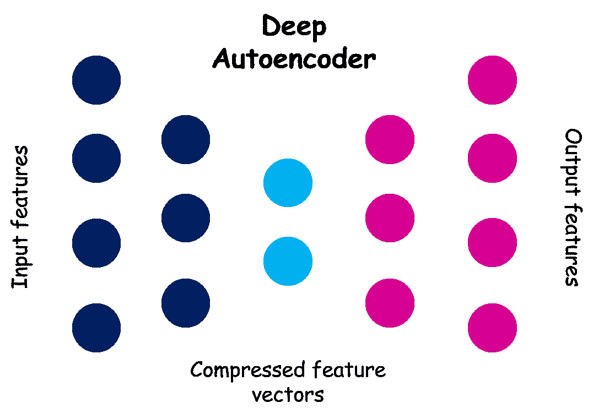
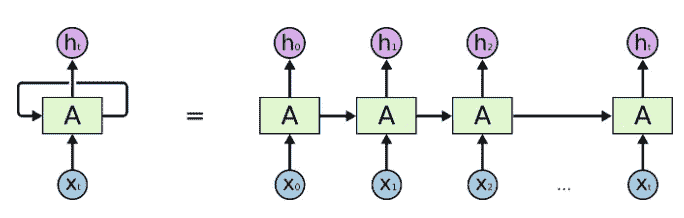

# 深度学习在制造业中的应用概述

> 原文：<https://towardsdatascience.com/an-overview-of-deep-learning-applications-in-manufacturing-exxact-64018629ca?source=collection_archive---------40----------------------->

# 制造业深度学习简介

在进入制造业深度学习的细节之前，最好后退一步，查看一段简短的历史。自近代(即 18 世纪初)以来，概念、原始思维和物理发明一直在塑造着世界经济和制造业。

亚当·斯密(Adam Smith)和约翰·斯图亚特·穆勒(John Stuart Mill)等人提出的*经济概念，第一次工业革命和蒸汽动力机器，工厂电气化和第二次工业革命，以及亨利·福特(Henry Ford)引入的装配线方法，只是寻求高效率和提高生产率一直是制造业核心的一些主要例子。*

然而，几乎所有这些发明都是围绕着通过小心操纵*力学*和*热力学*的法则，从人和机器身上提取最大效率。然而，在过去的几十年里，制造业最大的新收获来自于将信息或数据的概念加入到现有的组合中。

# 将深度学习信息融入其中

**原材料、货物和零件的移动**是任何制造系统的核心。在计算和信息技术革命之后，人们意识到，只有在信息处理引擎的监督下，以精确的方式控制这种运动，并结合数百种其他类似的运动，这种物理运动才能达到最佳效率。因此，硬件和软件的创新结合将“老工业”带入了智能制造时代。

但是，今天全世界的制造业正面临着一个源自这些信息处理系统的新问题。就是数据 ***泛滥******信息爆炸*** 的双重(及相关)问题。

随着计算和存储的成本和操作复杂性以**指数速度(摩尔定律)**下降，由工人、机器、控制器、工厂、仓库和物流机械产生的信息内容在规模和复杂性上爆炸式增长，这让传统制造组织措手不及。

然而，他们并不孤单。在过去十年左右的时间里，即使是精通信息的软件和 IT 组织也不得不面对同样的问题。谷歌的博客和出版物已经承认他们软件项目的复杂性变得难以控制。

**解决办法？**

人工智能和机器学习领域的创新思想已经拯救了许多软件组织，使其免于淹没在数据的洪流中，并帮助他们理解他们每天需要处理的海量数据。

虽然还没有达到相同的规模，但世界各地的制造组织也开始接受利用这些领域的前沿进展来帮助和增强他们的运营，并继续为他们的客户和股东提供最高价值的想法。我们来看几个有趣的例子和实际案例。

# 深度学习在制造业中的潜在应用

值得注意的是，数字化转换和建模技术的应用已经在制造业领域进行了相当长的时间。60 年代和 70 年代，效率低下困扰着全球制造业，几乎每个大型组织都精简并采用了良好的实践，比如丰田的制造技术。这种技术依赖于对大量过程变量和产品特性的连续测量和统计建模。

随着这些信息的测量和存储变得数字化，计算机被用于建立这些预测模型。这是今天现代**数字分析**的前身。

然而，随着数据爆炸的继续，**传统的统计建模无法跟上这种高维、非结构化的数据馈送**。正是在这里，深度学习大放异彩，因为它天生能够处理高度非线性的数据模式，并允许您发现统计学家或数据建模师手动极难发现的特征。

# 机器学习和深度学习中的质量控制

一般来说，机器学习，特别是[深度学习](https://blog.exxactcorp.com/category/deep-learning/)，可以显著提高大型装配线中的质量控制任务。事实上，**根据福布斯的数据，分析和 ML 驱动的流程和质量优化预计将增长 35%，流程可视化和自动化预计将增长 34%。**

传统上，机器只能通过产品的重量或长度等高级指标有效地发现质量问题。如果不花一大笔钱购买非常复杂的计算机视觉系统，当零件在装配线上高速运转时，就不可能检测出质量问题的细微视觉线索。

图片来源:Pixabay

即便如此，那些计算机视觉系统还是有些不可靠，无法有效地跨越问题领域。大型制造工厂的特定分支机构可能有这样的系统，但如果需要的话，它不能被“训练”来与工厂的其他部门一起工作。

[深度学习](https://blog.exxactcorp.com/category/deep-learning/)架构，如**卷积神经网络**特别适合接替人类操作员**在大型装配过程中发现和检测指示制成品和零件质量问题的视觉线索**。它们比依赖手工制作的特征工程的老产品更具可扩展性，并且可以在制造工厂需要它们的任何部门进行培训和重新部署。再训练所需要做的就是用相关的图像数据训练系统。

图片来源:[http://cs231n.github.io/convolutional-networks/](http://cs231n.github.io/convolutional-networks/)(斯坦福 CS 231 级 Github repo)

# 过程监控和异常检测

过程监控和异常检测对于任何持续的质量改进工作都是必要的。所有主要的制造组织都广泛使用它。像 **SPC(统计过程控制)图表**这样的传统方法源于对过程变量统计分布性质的简单(有时是错误的)假设。

然而，随着相互影响的变量数量的增加，以及不断增加的传感器阵列获取关于这些变量的静态和时变数据，传统方法无法以高精度或高可靠性进行扩展。

这就是深度学习模型可以以一种意想不到的方式提供帮助的地方。为了检测异常或偏离规范，通常使用传统统计信号处理领域的降维技术，如 **PCA(主成分分析)**。然而，人们可以使用**静态或可变自动编码器**，这是深度神经网络，其层由渐进**递减和递增卷积滤波器**(和池)组成。

这些类型的**编码器网络**忽略了噪声和通常的方差，并将信号或数据流的基本特征编码在少量的高维比特中**。当人们在连续运行的高容量过程中寻找异常时，如果高度编码的位发生意外变化，则跟踪高度编码的位要容易得多。**

简而言之，过程监控的中心问题是可以由被称为**无监督机器学习的机器学习分支来处理的事情。**在这方面，[深度学习](https://blog.exxactcorp.com/category/deep-learning/)自动编码器是你可以使用的一套强大的工具。

随着流程复杂性和相关的**大数据**无限制增长，毫无疑问，传统的统计建模(基于小规模数据采样)将让位于这种先进的 ML 技术和模型。

**这些文章提供了一个很好的概述:**

# 深度学习中的预测维护

[深度学习](https://blog.exxactcorp.com/category/deep-learning/)模型已经被证明在经济学和金融建模领域非常有效，处理**时间序列数据**。类似地，在预测性维护中，随着时间的推移收集数据以监控资产的**健康状况**，目的是找到预测故障的模式。因此，[深度学习](https://blog.exxactcorp.com/category/deep-learning/)可以为复杂机械和连接系统的预测性维护提供重要帮助。

确定何时对设备进行维护是一项异常困难的任务，涉及很高的财务和管理风险。每次机器离线维修，都会导致产量下降，甚至工厂停工。频繁的维修会导致明显的损失，但是不频繁的维护会导致代价更高的故障和灾难性的工业事故。

这就是为什么神经网络的**自动化特征工程至关重要。用于预测性维护的传统 ML 算法依赖于狭窄的、特定领域的专业知识来手工制作特征以检测机器健康问题。而神经网络可以用足够高质量的训练数据自动推断这些特征。因此，它是**跨域和可扩展的**。**

特别地，具有长短期记忆(**【LSTM】**)细胞或门控循环单元(**【GRU】**)的**循环神经网络** (RNN)可以基于过去的训练时间以时间序列的形式预测短期到中期的时间行为。

斯坦福 CS 231 级 Github Repo

幸运的是，有大量关于 RNN 的研究活动，目的是将它们应用到自然语言处理和文本分析领域。这一研究领域的所有知识都可以用于工业应用。例如，**计算优化的 RNNs** 可用于制造作业，在不牺牲太多预测能力的情况下，将计算负荷降至最低。它可能不是 NLP 任务的最佳表现，但对于预测机器健康参数的潜在问题来说，它已经足够强大了。

当然，人类专家将审查[深度学习](https://blog.exxactcorp.com/category/deep-learning/)系统的预测，以最终决定维护工作。但是在一个**智能、互联的工厂**中，与工程师和技术人员一起使用这样的预测机器，可以节省制造组织的资金和人力，最终**改善停工时间和机器利用率**。

事实上，在制造业中采用机器学习和分析只会提高预测性维护。根据普华永道的数据，预测性维护预计将在未来五年内增加 38%。微软的这篇文章提供了关于这个主题的更多信息:
[利用长短期记忆网络进行预测性维护的深度学习](https://azure.microsoft.com/en-us/blog/deep-learning-for-predictive-maintenance/)

## 工厂投入优化

制造组织的盈利能力关键取决于优化进入生产流程的物理资源以及支持这些流程。例如，电力和供水是两个关键的工厂投入，可以从优化中受益。

通常采用复杂的优化过程和策略来最大化这些基本资源的利用率。随着**工厂规模和机器对机器交互**的增长，这些资源的流动变得难以用简单的预测算法来管理。这是像神经网络这样强大的学习机器需要被带入游戏的时候。

[深度学习](https://blog.exxactcorp.com/category/deep-learning/)系统可以跟踪作为数百个工厂过程参数和产品设计变量的函数的用电模式，并可以动态推荐最佳利用的最佳实践。如果组织正在**向采用可再生能源**转变，那么来自[深度学习](https://blog.exxactcorp.com/category/deep-learning/)算法的预测可以用来绘制出从化石燃料依赖到可持续能源足迹的**最佳过渡轨迹。使用经典预测分析很难处理这种范式变化。**

# 摘要

**几十年来，基于信息系统的智能制造提高了大大小小的工业组织的生产率和质量。在这种智能制造环境下，随着机器生成和人类生成的数据的质量和倾向随着时间的推移而提高，数据分析、统计建模和预测算法的使用已经突飞猛进。工业革命始于上个世纪之交亨利·福特的装配线，在整个 20 世纪，自动化、控制系统、电子、传感器、数字计算和互联网的创新推动了工业革命。21 世纪的大数据革命有望通过释放指数级增长机会，最终将其提升到一个全新的水平。**

为了充分利用这种数据爆炸，[、](https://blog.exxactcorp.com/category/deep-learning/)深度学习和相关的人工智能辅助技术必须集成到现代制造系统的工具包中，因为它们比经典的统计学习和预测系统强大得多。

[深度学习](https://blog.exxactcorp.com/category/deep-learning/)能够与工业 4.0 的宏伟目标无缝集成——**极端自动化和数字化工厂。**工业 4.0 是围绕信息的持续连接而设计的——传感器、驱动器、阀门，所有这些都为了一个共同的目标而协同工作:最大限度地减少停机时间，提高效率。像深度神经网络这样的算法框架是处理特定类型任务的正确选择，它足够灵活，可以在各种数据类型连续流入时处理它们。

由此带来的生产率和质量的提高预计将远远超出满足企业盈利能力的狭隘目标。未来的智能制造将通过以可承受的成本提供高质量的商品和服务来丰富数十亿消费者的生活。整个社会都应该从这种范式转换中受益。

*未来是光明的，我们期待着它。*

*原载于 2019 年 9 月 24 日*[*https://blog.exxactcorp.com*](https://blog.exxactcorp.com/deep-learning-applications-in-manufacturing/)*。*