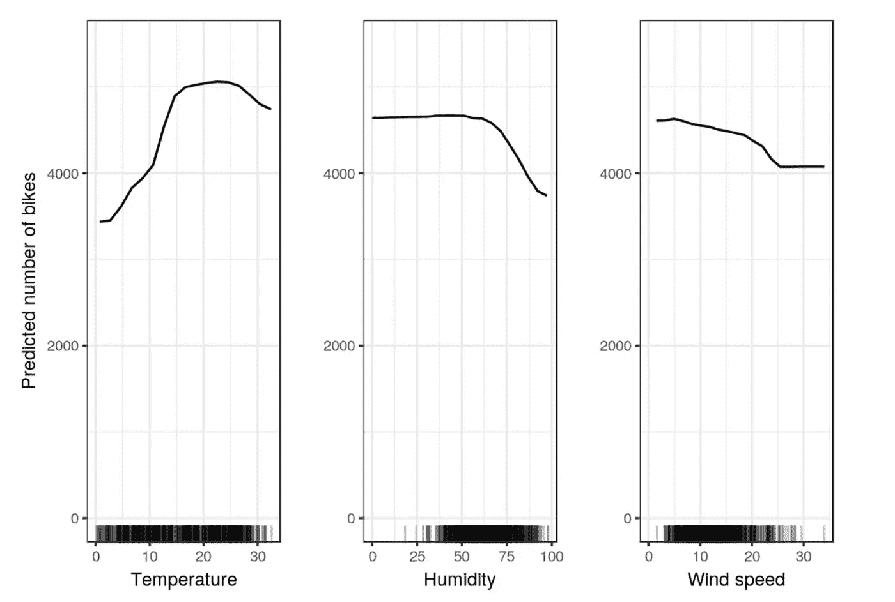
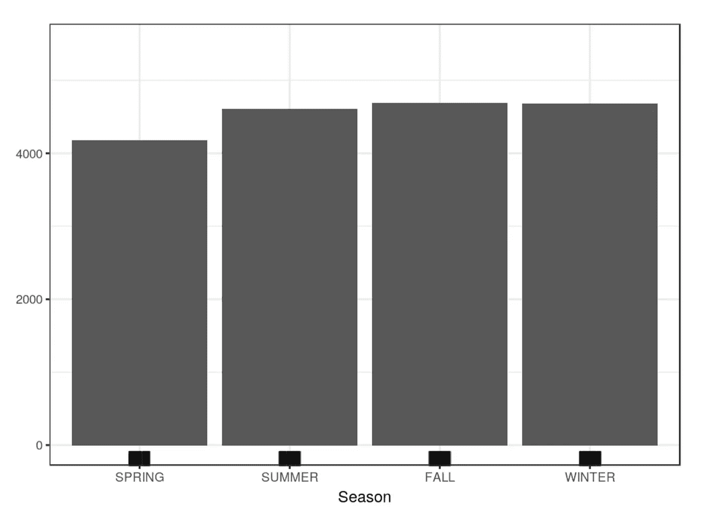
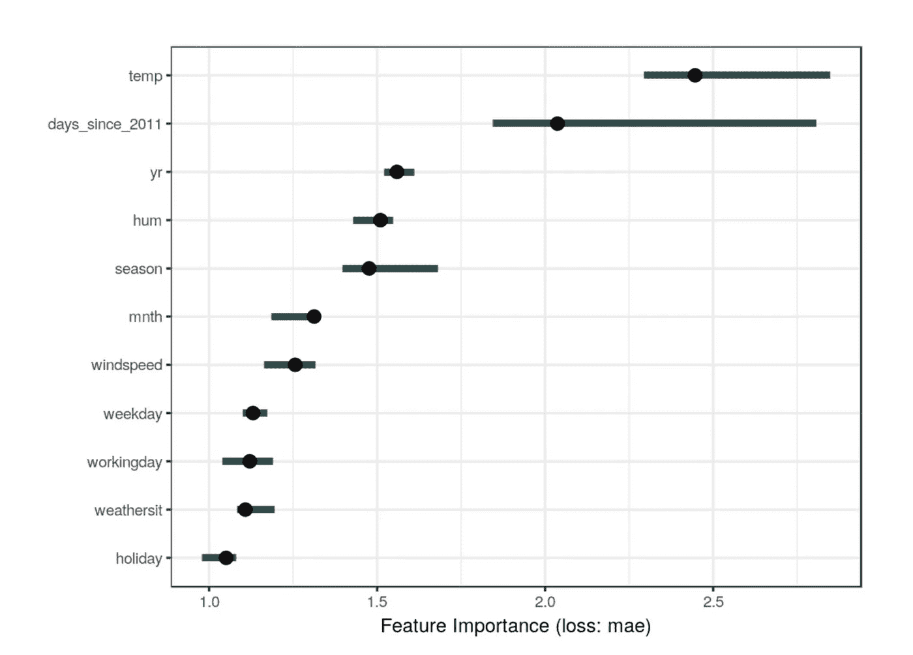
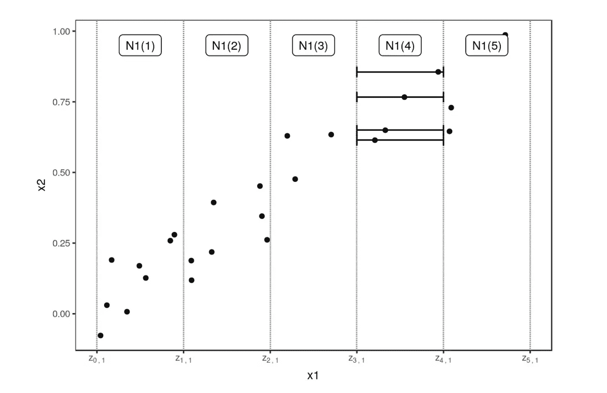
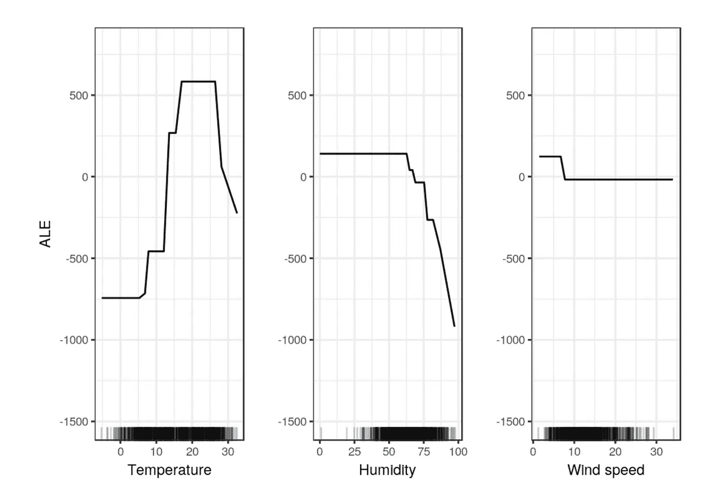

# 现代机器学习中模型可解释性综述

> 原文：<https://towardsdatascience.com/an-overview-of-model-explainability-in-modern-machine-learning-fc0f22c8c29a?source=collection_archive---------6----------------------->

## 更好地理解机器学习模型做出决策的原因，以及它的重要性


Photo by [Chris Ried](https://unsplash.com/@cdr6934?utm_source=medium&utm_medium=referral) on [Unsplash](https://unsplash.com?utm_source=medium&utm_medium=referral)

模型可解释性是当今机器学习中最重要的问题之一。通常情况下，某些“黑盒”模型(如深度神经网络)被部署到生产中，并运行着从工作场所安全摄像头到智能手机的所有关键系统。这是一个可怕的想法，甚至这些算法的开发者都不明白这些算法为什么会做出这样的决定——或者更糟糕的是，如何防止对手利用它们。

虽然“黑盒”算法的设计者面临许多挑战，但这并不是完全没有希望的。实际上，有许多不同的方式来阐明模型做出的决策。甚至有可能了解模型预测中最显著的特征。

在这篇文章中，我给出了机器学习中更深层次模型的模型可解释性的全面概述。我希望解释传统上被认为是“黑箱”的更深层次的模型实际上是如何令人惊讶地解释的。我们使用模型不可知的方法将可解释性应用于所有不同种类的黑盒模型。

# 部分相关图

部分相关图显示了特征对 ML 模型结果的影响。


Partial dependence equation for regression

部分依赖通过在我们不感兴趣的特征(由集合 C 中的特征表示)的分布上边缘化机器学习模型输出来工作。这使得部分相关函数显示了我们确实关心的特征(我们通过在集合 S 中购买来表示)和预测结果之间的关系。通过边缘化其他特征，我们得到一个仅依赖于 s 中的特征的函数。这使得理解改变特定特征如何影响模型预测变得容易。例如，这里有 3 个温度、湿度和风速的 PDP 图，它们与通过线性模型预测的自行车销售相关。



PDP’s for temperature, humidity and wind speed for a regression problem where the number of bikes is the outcome. From these plots, it’s clear to see that temperature is an important determiner of how many bikes arre rented, and the hotter it is, the more bikes are rented.

PDP 甚至可以用于分类特征。这里有一个关于季节对自行车租赁的影响。



Partial dependence plot for the effect of seasons on bike rentals

对于分类，部分相关图显示了给定不同特征值时某一类的概率。处理多类问题的一个好方法是每个类有一个 PDP。

部分相关图方法是有用的，因为它是全局的。它强调了某个特性和该特性所有值的目标结果之间的整体关系。

**优势**

部分相关图非常直观。如果我们让所有的数据点都假定某个特征值，则某个值处的某个特征的部分相关函数代表平均预测值。

**劣势**

实际上，使用部分相关函数最多只能模拟两个特征。

独立性假设:假设正在绘制的要素与任何其他要素都不相关。例如，如果你根据身高和体重预测血压，你必须假设身高和体重不相关。出现这种情况的原因是，如果你在绘制身高，你必须对体重的边缘分布进行平均(反之亦然)。这意味着，例如，对于一个相当高的人来说，你可以有非常小的权重，这在你的实际数据集中可能看不到。

**太好了！我想为我的模型实现一个 PDP。我从哪里开始？**

[这里有一个用 scikit-learn](https://scikit-learn.org/stable/modules/partial_dependence.html) 实现的例子。

# 置换特征重要性

置换特征重要性是一种通过计算置换特征后模型预测误差的变化来衡量特征重要性的方法。如果置换其值会增加模型误差，则特征是“重要的”，如果置换值不会改变模型误差，则特征是“不重要的”。

该算法的工作原理如下:

```
input: a model f, feature matrix X, target vector Y and error measure L(y, f)1\. Estimate the original model error e⁰ = L(Y, f(x))2\. For each feature j:- Generate feature matrix X' by permuting feature j in the original feature matrix X.- Estimate the new error e¹=L(Y, f(X')) based off the model's predictions for the new data X'- Calculate the permutation feature importance FI=e¹/e⁰. You can also use e¹-e⁰.3\. Sort the features by descending FI.
```

按 FI 降序对要素排序后，可以绘制结果。这是自行车租赁问题的排列要素重要性图。



Permutation feature importance plot for bike rentals. You can clearly see that the model sees temperature and days since 2011 as the most important features.

**优势**

可解释性:特征重要性就是当一个特征被扭曲时，误差增加了多少。这很容易解释和形象化。

置换特征重要性提供了对模型行为的全局洞察。

置换特征重要性不需要训练一个新的模型或者重新训练一个现有的模型，简单地改变特征。

**缺点**

不清楚您是否应该为您的情节使用训练或测试数据。

如果特征是相关的，在置换特征后，你可能得到不真实的样本，使结果有偏差。

将相关特征添加到模型中会降低另一个特征的重要性。

**太好了！我想为我的模型实现排列特征重要性。我从哪里开始？**

[这里有一个用 Python 实现的 eli5 模型。](https://eli5.readthedocs.io/en/latest/blackbox/permutation_importance.html)

# 累积局部效应图

ALE 图是部分相关图的一种更快且无偏差的替代方法。它们衡量特征如何影响模型的预测。因为它们是无偏见的，所以它们比 PDP 更好地处理相关特性。

如果机器学习模型的特征是相关的，那么部分依赖图是不可信的，因为你可以通过改变单个特征来生成实际上非常不可能的样本。ALE 图通过计算(也是基于要素的条件分布)预测中的差异而不是平均值来解决这个问题。解释这一点的一种方法是把麦芽酒想象成

> 让我向您展示模型预测如何在功能的一个小“窗口”中发生变化

这是一个关于麦芽酒情节的视觉解释。



ALE plot calculation. Divide x1 into “windows”. For all the points in each window, calculate the difference in prediction when we replace each point with the upper and lower bounds of the window.

这也可以通过两个特性来实现。


2D-ALE plot. Same general idea as the 1D plot, but instead of using the upper and lower “window” bounds, you calculate the difference in prediction over the four corners of the square in the grid.

一旦计算出每个窗口的预测差异，就可以生成 ALE 图。



ALE plot for bike rentals. Clearly, temperature has a strong effect on bike rental prediction, but you can also see that if humidity is above a certain point, it has a strong effect on bike rental prediction as well.

ALE 图也可以用于分类特征。


ALE plot for month and bike rentals. January and March seem to have little effect on the number of bikes rented, but December and November seem to have a large negative effect.

**优势**

ALE 图是无偏的，这意味着它们处理相关的要素。

ALE 图的计算速度很快。

对 ALE 情节的解读很清楚。

**劣势**

ALE 情节的实现很复杂，很难理解。

如果特征是强相关的，解释仍然是困难的。

二阶或 2D 啤酒图可能很难解释。

一般来说，最好使用 ALE 而不是 PDP，尤其是如果您希望相关的功能。

**太好了！我想为我的模型实现 ALE。我从哪里开始？**

这是一个提供 ALE 实现的库。

# 个体条件期望

单个条件期望(ICE)图每个数据点显示一行。它会生成一个图，显示模型对某个数据点的预测如何随着一个特征在一个集合中的所有数据点上的变化而变化。对于下面的图，您可以在训练集自行车租赁数据的所有实例中看到不同温度、湿度和风速的 ICE 图。


ICE plot for bike-sharing

看着这个情节，你可能会问自己:看一个 ICE 情节而不是 PDP 有什么意义？这似乎不太好解释。

PDP 只能向您展示特性和预测之间的平均关系。只有在计算 PDP 的特征和其他特征之间的相互作用不相关时，这种方法才能很好地工作，但是在强相关相互作用的情况下，ICE 图将更有洞察力。

**优点**

和 PDP 图一样，ICE 图非常直观易懂。

ICE 图可以比 PDP 图更好地揭示异构关系。

**缺点**

ICE 曲线一次只能显示一个特征。

这种方法生成的图可能很难阅读，而且过于拥挤。

**太好了！我想为我的模型实现 ICE。我从哪里开始？**

这里有一个关于 ICE 实现的可解释性的概述。

# 代理模型

代理模型是一种可解释的模型(如决策树或线性模型)，它被训练为近似黑盒的预测。通过解释代理模型的决策，我们可以更好地理解黑盒。

生成代理模型的算法很简单。

```
1\. Select a dataset X that you can run your black box model on.2\. For the selected dataset X, get the predictions of your black box model. 3\. Select an interpretable model type (e.g. linear model or decision tree)4\. Train the interpretable model on the dataset X and the black box's predictions. 5\. Measure how well the surrogate model replicates the predictions of the black box model. 6\. Interpret the surrogate model.
```

一种通过 R 平方度量来衡量代理复制黑盒的方法是:


R 平方度量是一种测量代理模型捕获的方差的方法。接近 1 的 R 平方值意味着代理模型很好地捕获了方差，接近 0 意味着它捕获了非常小的方差，并且不能很好地解释黑盒模型。

**优势**

这种方法是直观的:你通过近似它来学习黑盒模型认为什么是重要的。

易于度量:很明显，可解释模型在通过 R 平方度量来近似黑盒时表现得有多好。

**缺点**

线性模型可能不能很好地近似黑盒模型。

你是在对黑盒模型而不是实际数据下结论，因为你是把黑盒的模型预测作为标签，而没有看到事实真相。

即使你很好地近似了黑盒模型，“可解释的”模型的可解释性可能实际上并不代表黑盒模型已经学到了什么。

可能很难解释这个可解释的模型。

**太好了！我想实现一个代理模型。我从哪里开始？**

[这里概述了代理模型实现的可解释性。](http://savvastjortjoglou.com/intrepretable-machine-learning-nfl-combine.html)

# 可解释性的未来

随着机器学习在日常生活中变得更加突出，可解释性的未来比以往任何时候都更加重要。我相信一些趋势将对可解释性的未来进行分类，这将塑造我们未来与人工智能模型的交互方式。

**模型不可知的可解释性焦点**

深度学习研究的所有趋势都指向这样一个事实，即深度网络没有饱和我们当前的计算和数据限制。重要的是要认识到，随着我们的模型在从图像识别到文本生成的各个方面越来越深入，需要能够提供跨所有类型模型的可解释性的方法。随着机器学习在不同领域占据越来越多的位置，可推广性方面将变得越来越有用。我在这篇博文中讨论的方法是一个开始，但我们需要更认真地对待可解释性，以更好地理解为什么驱动我们日常生活的机器学习系统正在做出它们所做的决定。

**自我解释的模型**

一个我还没有看到的在大多数 ML 系统中扎根的趋势是自我解释模型的想法，我相信这个趋势在未来会存在。今天的大多数系统只是简单地做出一个对用户来说不透明的决定。在未来，我相信这种情况会改变。如果自动驾驶汽车决定停下来，我们就会知道为什么。如果 Alexa 不能理解我们的句子，它会告诉我们具体的细节哪里出错了，以及我们如何更清楚地表达我们的查询。有了自我解释的模型，我们可以更好地理解我们生活中的 ML 系统是如何工作的。

**增加模型审查**

最后，我相信我们作为一个社会已经把黑箱模型审查推到了地毯下面。我们不理解我们的模型正在做出的决定，这似乎没有特别困扰任何人。这种情况将来必须改变。随着模型开始出错，工程师和数据科学家将被追究责任，这将导致一种趋势，即我们用检验模型所做决策的同样严谨性来检验模型所依据的数据集。

我希望你喜欢这篇文章。我确实发现写这篇文章很有启发性，我希望它对你在机器学习领域的学习或研究有所帮助。

**作品引用:**

这里的大多数例子都是从优秀的[可解释机器学习](https://christophm.github.io/interpretable-ml-book/)书里得到的启发。

(莫尔纳尔，克里斯托弗。“可解释的机器学习。让黑盒模型变得可解释的指南”，2019。https://christophm.github.io/interpretable-ml-book/)

如果你想进一步了解这个话题，我强烈建议你购买它。