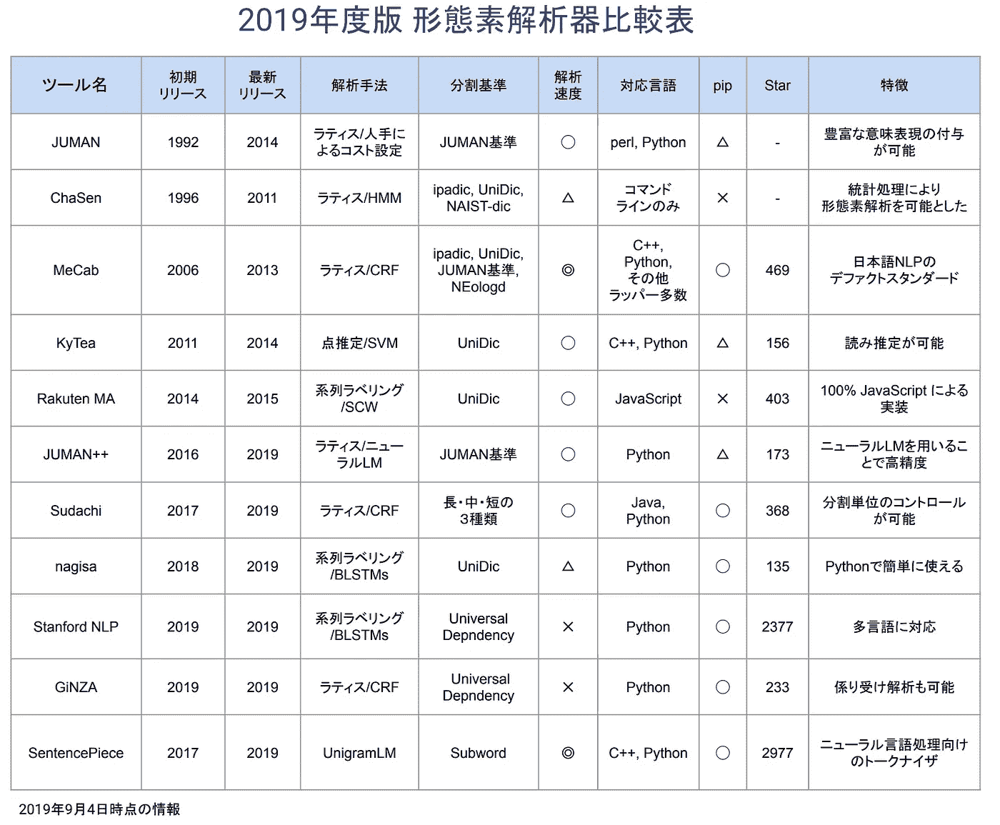
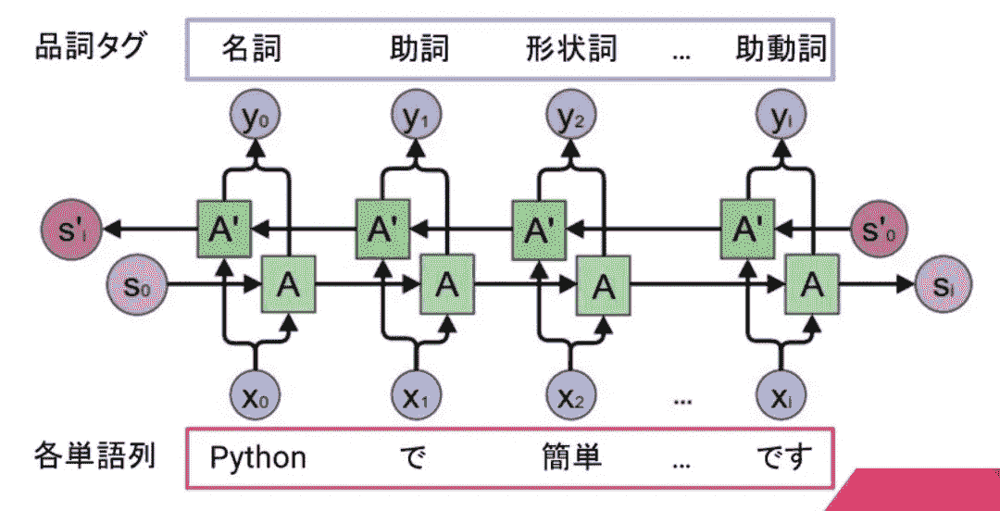
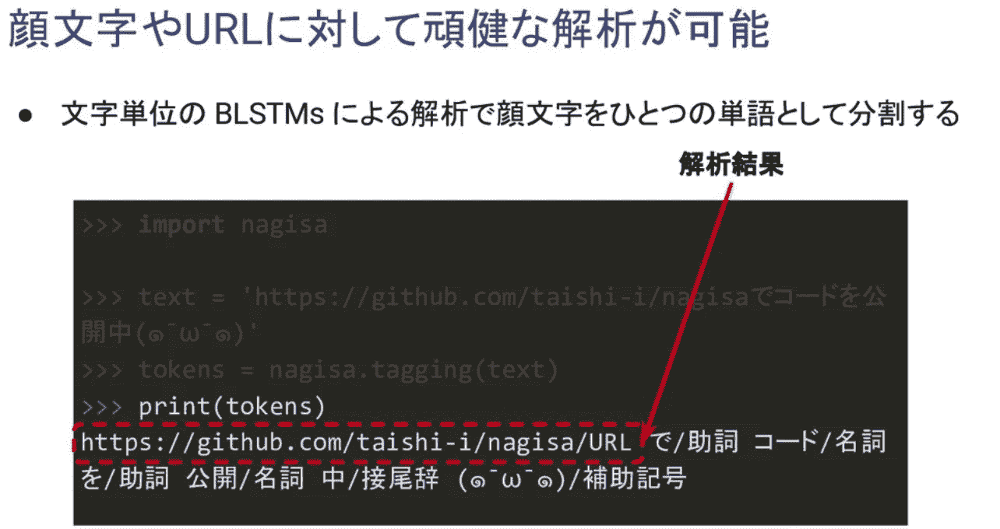

# 日本 NLP 图书馆概述

> 原文：<https://towardsdatascience.com/an-overview-of-nlp-libraries-for-japanese-be1805837143?source=collection_archive---------26----------------------->

## PyCon JP 2019 日本 NLP 库简介

nagisa-tutorial-pycon2019

[PyCon JP 2019](https://pycon.jp/2019/) 于 2019/9/16~ 2019/9/17 举办，为期两天。我会发布一些我感兴趣的讲座的帖子。

作为一名 NLP 工程师，我很高兴能找到一个与 NLP 相关的讲座。这篇文章是来自[池田太史](https://www.slideshare.net/100003383562829)的 nagisa 演讲的简短英文摘要。你可以在这里找到幻灯片[，在这里](https://speakerdeck.com/taishii/pycon-jp-2019)找到日语教程[。](https://github.com/taishi-i/nagisa-tutorial-pycon2019)

# 两个图书馆

日本有大量的 NLP 库，但是如何选择一个好的来使用需要一些研究。感谢池田太史为我们节省了时间。上图收集了许多日本 NLP 库，并对它们进行了详细的比较。如果你不懂日语，没必要担心。我只推荐两个工具， [Juman++](https://github.com/ku-nlp/jumanpp) 和 [nagisa](https://github.com/taishi-i/nagisa) 。

确定性能的一个简单标准是库是否提供了用于预测的基于神经的模型。换句话说，维护人员会随着技术的发展更新库吗？根据 Taishi Ikeda 的说法， [Juman++和](https://github.com/ku-nlp/jumanpp) [nagisa](https://github.com/taishi-i/nagisa) 是仅有的两个提供基于神经的模型的库。

# nagisa

因为池田太史的演讲主要是关于[渚](https://github.com/taishi-i/nagisa)我就简单介绍一下渚。nagisa 使用的模型是 Bi-LSTM-CRF。CRF 层被忽略，因为他不想混淆那些不熟悉 NLP 的人。

nagisa 训练的语料库是 [KWDLC](http://nlp.ist.i.kyoto-u.ac.jp/index.php?KWDLC) 。nagisa 尤其在表情符号上表现出色

池田太史很好心的提供了 Colab 笔记本快速玩。

1.  [basic _ usage . ipynb](https://github.com/taishi-i/nagisa-tutorial-pycon2019/blob/master/notebooks/basic_usage.ipynb)[[Colab 笔记本](https://colab.research.google.com/github/taishi-i/nagisa-tutorial-pycon2019/blob/master/notebooks/basic_usage.ipynb?hl=ja)
2.  [word _ cloud . ipynb](https://github.com/taishi-i/nagisa-tutorial-pycon2019/blob/master/notebooks/word_cloud.ipynb)[Colab 笔记本](https://colab.research.google.com/github/taishi-i/nagisa-tutorial-pycon2019/blob/master/notebooks/word_cloud.ipynb?hl=ja)

> ***查看我的其他帖子*** [***中等***](https://medium.com/@bramblexu) ***同*** [***一个分类查看***](https://bramblexu.com/posts/eb7bd472/) ***！
> GitHub:***[***bramble Xu***](https://github.com/BrambleXu) ***LinkedIn:***[***徐亮***](https://www.linkedin.com/in/xu-liang-99356891/) ***博客:***[*bramble Xu*](https://bramblexu.com)

# 参考

*   [https://github.com/taishi-i/nagisa-tutorial-pycon2019](https://github.com/taishi-i/nagisa-tutorial-pycon2019)
*   [https://github.com/taishi-i/nagisa](https://github.com/taishi-i/nagisa)
*   [https://github.com/ku-nlp/jumanpp](https://github.com/ku-nlp/jumanpp)
*   [http://nlp.ist.i.kyoto-u.ac.jp/index.php?KWDLC](http://nlp.ist.i.kyoto-u.ac.jp/index.php?KWDLC)