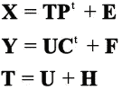
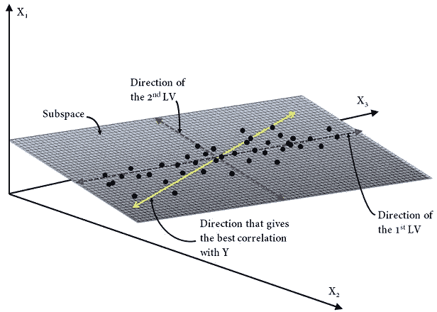
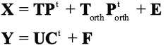
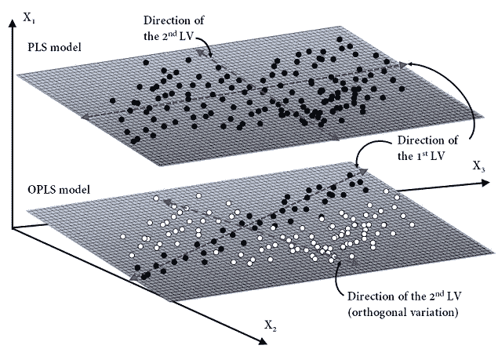
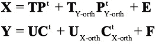
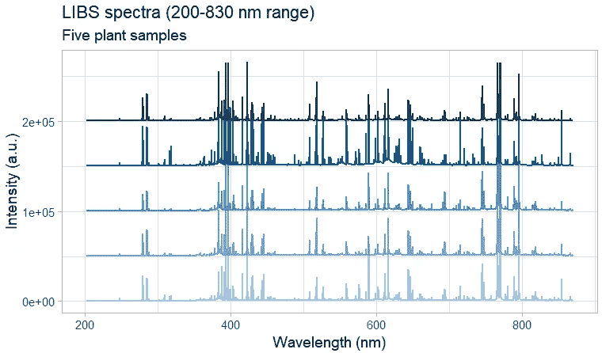
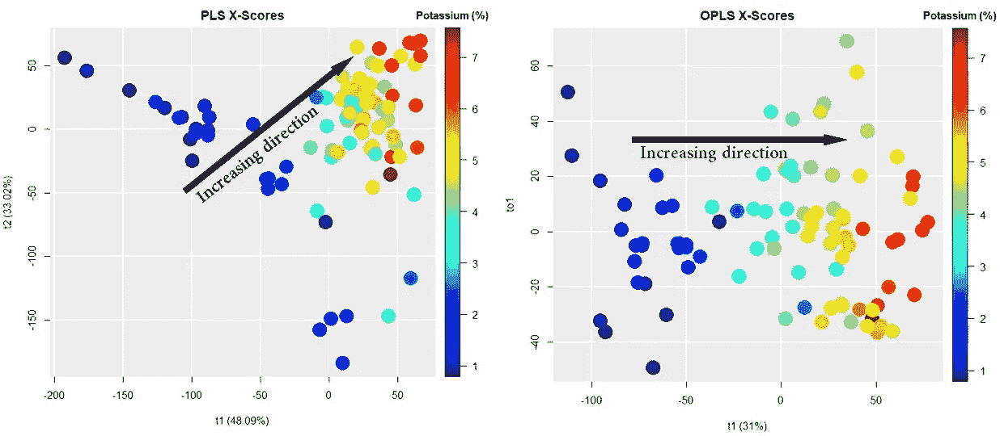

# 正交偏最小二乘综述

> 原文：<https://towardsdatascience.com/an-overview-of-orthogonal-partial-least-squares-dc35da55bd94?source=collection_archive---------4----------------------->

## 你听说过正交**偏最小二乘(OPLS)** 吗？这篇文章旨在给你一个清晰简明的概述 OPLS 及其在开发更有效的预测模型方面的优势。

# 什么是 OPLS？

首先，让我简单回顾一下，**偏最小二乘法(PLS)** 回归无疑是中最常用的，或者可能是最常用的[化学计量学](https://en.wikipedia.org/wiki/Chemometrics)多元回归方法之一。事实上，PLS 最初是由赫尔曼·沃尔德在 1975 年左右开发的，用于计量经济学领域，后来在 20 世纪 80 年代被著名的化学计量学家所接受，例如赫尔曼·沃尔德的儿子贾译尊·沃尔德，他在 1971 年创造了术语化学计量学来描述在分析化学应用中使用高级统计和机器学习方法的新兴领域，仅举几个例子在过去的几十年中，PLS(无论是作为回归还是分类方法)在化学计量学从业者中非常流行，用于处理多变量校准和过程分析技术等应用中的多重共线性，在这些应用中，观测值(样本)通常比变量(波长)少。

2002 年，约翰·特里格和贾译尊·沃尔德在一篇题为“ [*【正交投影到潜在结构(O‐PLS)*](https://onlinelibrary.wiley.com/doi/abs/10.1002/cem.695) ”的论文中引入了 PLS 的一种变体。新方法是一种受监督的多变量数据投影方法，用于将一组预测变量( **X** )与一个或多个响应( **Y** )相关联。基本上，像 PLS 一样，O-PLS 试图提取反映数据集中变化的最大信息，同时假设在**X**-数据中存在隐藏变量的一个小子集来预测响应变量。这些子集正式称为[潜在变量](https://methods.sagepub.com/reference/encyc-of-research-design/n213.xml)(或 LVs)，因为它们是不可测量的。从历史上看，数据集中隐藏结构的概念已经有一个世纪的历史了，它来自于**主成分分析(PCA)等方法。**由作者命名的 O-PLS 方法使用了 S. Wold *先前开发的正交信号校正—化学计量学智能。实验室。系统。，* 1998，44 *，*175-最大化第一个 LV 的解释协方差，而剩余 LV 捕捉预测因子的正交方差，即与响应变量统计不相关。简而言之，这意味着与 PLS 不同 PLS 可以很好地处理随机噪声——这种新方法也被称为**正交偏最小二乘法(OPLS)** ,它能够通过单独建模 **X** 预测值的变化来过滤掉数据集中的结构化噪声，这些预测值与 **Y** 响应相关或不相关。最终，除了允许识别、分析和调查正交变化的主要来源之外，这还通过降低 LV 的数量来降低模型的复杂性。

# 数学框架

让我们快速看一下 OPLS 背后的数学。这里我们将 **X** 视为大小为 *n* × *p、*和 **Y** 的矩阵，大小为 *n* × *m* ，其中 *p* 为预测变量的数量， *m* 为响应变量的数量， *n* 为观测值的数量。回想一下，PLS 被开发的目的是搜索一定数量的 LV 的方向——具有相互正交的约束——满足以下标准:(1)捕获 **X** 空间中的最大方差，(2)捕获 **Y** 空间中的最大方差，以及(3)最大化 **X** 和 **Y** 空间之间的相关性。

PLS 模型可以写成:

其中 **T** 是总结 **X** 预测值变化的得分矩阵，即样本之间的相似性/差异性， **P** 是加载矩阵，或通常称为 **X** 加载，以区别于 **Y** 加载， **U** 是总结 **Y** 响应变化的得分矩阵，**C**上标“t”表示矩阵转置。注意 **P** 表示 **X** 和 **U** 的相关性，而 **C** 表示 **Y** 和 **T** 的相关性。****

Geometrical illustration of a PLS model. Data (black dots) on the X-space are projected (orthogonal projection) onto the subspace defined by the first two latent variables (LVs).

OPLS 模型的操作类似于 PLS 模型，但是将 **X** 中的系统变化分成三部分:(1)与 **Y** 相关的预测部分，(2)与 **Y** 不相关的正交部分“orth”，(3)噪声部分——残差变化。

因此，OPLS 模型可以表述为:

Geometrical illustration of the difference between PLS and OPLS models. Orthogonal variation (white dots) are filtered out by the second latent variable.

应该提到的是，事实上已经开发了两种不同的 OPLS 算法。第一种算法，最常被称为 O1-PLS 或简称为 OPLS，如上所述，是单向的(**X****Y**)，这意味着只有在 **X** 空间中的正交变化被滤除。第二种算法称为 O2-PLS，是双向的( **X** ⇔ **Y** )，这意味着在 **X** -和**y**-空间中的正交变化都被滤除。

O2-PLS 模型可以写成:

O2-PLS 将 **X** 和 **Y** 分成三部分:(1)一个联合部分(关联部分 **X** 和 **Y** )，(2)一个正交部分——分别在 **X** 和 **Y** 中不相关的潜在变化，以及(3)一个噪声部分。

# 例如:LIBS 光谱

为了比较的目的，我使用植物材料的 LIBS 光谱，用偏最小二乘法和 OPLS 方法来预测钾的浓度。使用 R [包插入符号](https://cran.r-project.org/web/packages/caret/index.html)执行 PLS。由于 OPLS 在 caret 中不可用，我使用了[包 ropls](http://www.bioconductor.org/packages/release/bioc/html/ropls.html) 来代替。五种植物样品的典型 LIBS 光谱如下所示— *关于 LIBS 的更多细节请参考我之前的* [*文章*](/first-order-multivariate-calibration-in-laser-induced-breakdown-spectroscopy-ca5616dd5b38) 。

LIBS spectra of five plant samples. A baseline offset has been applied for easier viewing of the spectra.

下图显示了 PLS(左图)和 OPLS(右图)建模的**X**-得分散点图(**X**-空间的投影)。在这两幅图中，*x*-轴代表第一分量(或潜在变量)，而*y*-轴代表 PLS 的第二分量和 OPLS 的第一正交分量。彩虹色代表每个样品中钾(K)的浓度，从 1%(深蓝色)到 7%(深红色)。正如我们所见，OPLS 只需要一个成分就可以将样品中的变化与钾浓度联系起来(见黑色箭头)。

Comparison between the **X**-scores scatter plots for the PLS and OPLS models.

# 摘要

总之，要记住的最重要的事情是，OPLS(或 O2-PLS)提供了一个有价值的预处理工具，将有助于生成更有效的预测模型，特别是在结构噪声占主导地位的情况下。