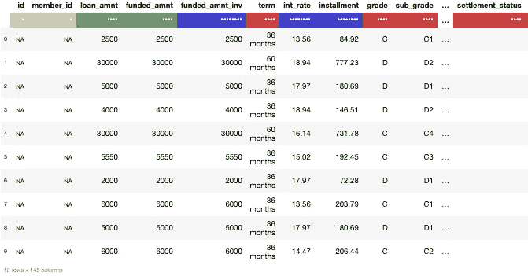
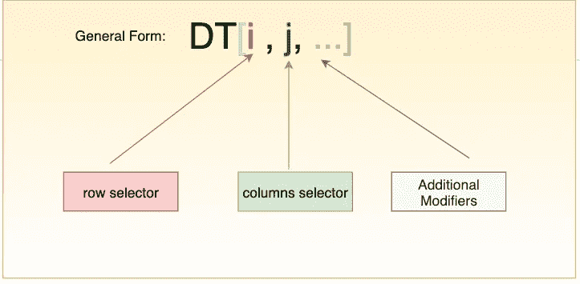
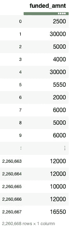
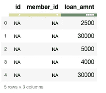

# Python 的数据表包概述

> 原文：<https://towardsdatascience.com/an-overview-of-pythons-datatable-package-5d3a97394ee9?source=collection_archive---------2----------------------->

## 用于高效多线程数据处理的 Python 库，支持内存不足的数据集。


Photo by [Johannes Groll](https://unsplash.com/@followhansi?utm_source=medium&utm_medium=referral) on [Unsplash](https://unsplash.com?utm_source=medium&utm_medium=referral)

**如果你是一个 R 用户，很可能你已经在使用`data.table`包了。`[Data.table](https://cran.r-project.org/web/packages/data.table/data.table.pdf)`是 R 中`[data.frame](https://www.rdocumentation.org/packages/base/versions/3.6.0/topics/data.frame)`包的扩展，也是 R 用户快速聚合大数据(包括 100GB 内存)的首选包。**

**R 的`data.table`包是一个非常通用和高性能的包，因为它易于使用，方便和编程速度。这是 R 社区中一个相当著名的软件包，每月下载量超过 40 万次，几乎有 650 个 CRAN 和 Bioconductor 软件包使用它( [source](https://github.com/Rdatatable/data.table/wiki) )。**

**那么，这对 Python 用户有什么好处呢？好消息是,`data.table`包也有一个 Python 对应物，叫做`datatable` ,它明确关注大数据支持、高性能、内存和内存外数据集以及多线程算法。在某种程度上，可以称之为[***data . table***](https://github.com/Rdatatable/data.table)***的*** 弟弟妹妹。**

# **数据表**

**[](https://datatable.readthedocs.io/en/latest/?badge=latest)**

**现代机器学习应用程序需要处理海量数据，并生成多种特征。为了更准确地构建模型，这是必要的。Python 的`datatable`模块就是为了解决这个问题而创建的。它是一个工具包，用于在单节点机器上以最大可能的速度执行大数据(高达 100GB)操作。datatable 的开发由 [H2O.ai](https://www.h2o.ai/) 赞助，`datatable`的第一个用户是 [Driverless.ai](https://www.h2o.ai/driverless-ai/) 。**

**该工具包与[熊猫](https://github.com/pandas-dev/pandas)非常相似，但更侧重于速度和大数据支持。Python 的`datatable`也努力实现良好的用户体验，有用的错误消息，强大的 API。在本文中，我们将了解如何使用 datatable，以及它在处理大型数据集时如何优于 pandas。**

# **装置**

**在 MacOS 上，可以使用 pip 轻松安装 datatable:**

```
pip install datatable
```

**在 Linux 上，安装通过二进制发行版实现，如下所示:**

```
# If you have Python 3.5
pip install [https://s3.amazonaws.com/h2o-release/datatable/stable/datatable-0.8.0/datatable-0.8.0-cp35-cp35m-linux_x86_64.whl](https://s3.amazonaws.com/h2o-release/datatable/stable/datatable-0.8.0/datatable-0.8.0-cp35-cp35m-linux_x86_64.whl)# If you have Python 3.6
pip install [https://s3.amazonaws.com/h2o-release/datatable/stable/datatable-0.8.0/datatable-0.8.0-cp36-cp36m-linux_x86_64.whl](https://s3.amazonaws.com/h2o-release/datatable/stable/datatable-0.8.0/datatable-0.8.0-cp36-cp36m-linux_x86_64.whl)
```

***目前，datatable 不能在 Windows 上运行，但也在努力增加对 Windows 的支持。***

**更多信息参见[构建说明](https://datatable.readthedocs.io/en/latest/install.html)。**

**这篇文章的代码可以从相关的 [Github 库](https://github.com/parulnith/An-Overview-of-Python-s-Datatable-package)中获得，或者可以通过点击下面的图片在我的文件夹中查看。**

**[](https://mybinder.org/v2/gh/parulnith/An-Overview-of-Python-s-Datatable-package/master?filepath=An%20Overview%20of%20Python's%20Datatable%20package.ipynb)**

# **读取数据**

**正在使用的数据集取自 Kaggle，属于 [*Lending Club 贷款数据集*](https://www.kaggle.com/wendykan/lending-club-loan-data#loan.csv) *。*该数据集由 2007 年至 2015 年发放的所有贷款的完整贷款数据组成，包括当前贷款状态(当前、逾期、完全支付等。)和最新付款信息。该文件由**226 万行**和 **145 列**组成。数据大小非常适合展示数据表库的功能。**

```
# Importing necessary Librariesimport numpy as np
import pandas as pd
import datatable as dt
```

**让我们将数据加载到`Frame`对象中。数据表中的基本分析单位是一个`Frame`。这与 pandas DataFrame 或 SQL 表的概念是一样的:数据排列在具有行和列的二维数组中。**

****带数据表****

```
%%time
datatable_df = dt.fread("data.csv")
____________________________________________________________________CPU times: user 30 s, sys: 3.39 s, total: 33.4 s                                
Wall time: 23.6 s
```

**上面的`fread()`功能既强大又极快。它可以自动检测和解析大多数文本文件的参数，从。压缩档案或网址，阅读 Excel 文件，等等。**

**此外，数据表解析器:**

*   **可以自动检测分隔符、标题、列类型、引用规则等。**
*   **可以从多个来源读取数据，包括文件、URL、shell、原始文本、归档和 glob。**
*   **提供多线程文件读取，实现最高速度**
*   **读取大文件时包括进度指示器**
*   **可以读取符合和不符合 [RFC4180](https://tools.ietf.org/html/rfc4180) 的文件。**

****与熊猫****

**现在，让我们计算一下熊猫读同一个文件所用的时间。**

```
%%time
pandas_df= pd.read_csv("data.csv")
___________________________________________________________CPU times: user 47.5 s, sys: 12.1 s, total: 59.6 s
Wall time: 1min 4s
```

**结果表明，在读取大型数据集时，datatable 明显优于 pandas。熊猫需要一分多钟，而数据表只需要几秒钟。**

# **帧转换**

**现有帧也可以转换为 numpy 或 pandas 数据帧，如下所示:**

```
numpy_df = datatable_df.to_numpy()
pandas_df = datatable_df.to_pandas()
```

**让我们将现有的帧转换成熊猫数据帧对象，并比较所用的时间。**

```
%%time
datatable_pandas = datatable_df.to_pandas()
___________________________________________________________________
CPU times: user 17.1 s, sys: 4 s, total: 21.1 s
Wall time: 21.4 s
```

**似乎将文件作为数据表帧读取，然后将其转换为 pandas 数据帧比读取 pandas 数据帧花费的时间要少。 ***因此，通过 datatable 导入一个大的数据文件，然后将其转换成 pandas dataframe 可能是一个好主意。*****

```
type(datatable_pandas)
___________________________________________________________________
pandas.core.frame.DataFrame
```

# **基本框架属性**

**让我们看看数据表框架的一些基本属性，它们与熊猫的属性相似:**

```
print(datatable_df.shape)       # (nrows, ncols)
print(datatable_df.names[:5])   # top 5 column names
print(datatable_df.stypes[:5])  # column types(top 5)
______________________________________________________________(2260668, 145)('id', 'member_id', 'loan_amnt', 'funded_amnt', 'funded_amnt_inv')(stype.bool8, stype.bool8, stype.int32, stype.int32, stype.float64)
```

**我们也可以使用`head`命令输出前‘n’行。**

```
datatable_df.head(10)
```

****

**A glimpse of the first 10 rows of the datatable frame**

**颜色表示数据类型，其中**红色**表示字符串，**绿色**表示整型，**蓝色**表示浮点型。**

# **汇总统计数据**

**在 pandas 中计算汇总统计数据是一个消耗内存的过程，但现在有了 datatable 就不会了。我们可以使用 datatable 计算以下每列汇总统计信息:**

```
datatable_df.sum()      datatable_df.nunique()
datatable_df.sd()       datatable_df.max()
datatable_df.mode()     datatable_df.min()
datatable_df.nmodal()   datatable_df.mean()
```

**让我们使用 datatable 和 pandas 来计算这些列的平均值。**

****带数据表****

```
%%time
datatable_df.mean()
_______________________________________________________________
CPU times: user 5.11 s, sys: 51.8 ms, total: 5.16 s
Wall time: 1.43 s
```

**与熊猫在一起**

```
pandas_df.mean()
__________________________________________________________________
Throws memory error.
```

**上述命令无法在 pandas 中完成，因为它开始抛出内存错误。**

# **数据操作**

**像 dataframes 这样的数据表是列数据结构。在 datatable 中，所有这些操作的主要载体是受传统矩阵索引启发的方括号符号**和更多功能。****

****

**datatable’s **square-bracket notation****

**同样的 DT[i，j]符号在数学中用于索引矩阵，在 C/C++，在 R，在 pandas，在 numpy 等等。让我们看看如何使用 datatable 执行常见的数据操作活动:**

## **#选择行/列的子集**

**下面的代码从数据集中选择所有行和`funded_amnt`列。**

```
datatable_df[:,'funded_amnt']
```

****

**下面是我们如何选择前 5 行和前 3 列**

```
datatable_df[:5,:3]
```

****

## **#对框架进行排序**

****带数据表****

**按特定列对帧进行排序可以通过`datatable`完成，如下所示:**

```
%%time
datatable_df.sort('funded_amnt_inv')
_________________________________________________________________
CPU times: user 534 ms, sys: 67.9 ms, total: 602 ms
Wall time: 179 ms
```

****与熊猫:****

```
%%time
pandas_df.sort_values(by = 'funded_amnt_inv')
___________________________________________________________________
CPU times: user 8.76 s, sys: 2.87 s, total: 11.6 s
Wall time: 12.4 s
```

**请注意“可约会”和“熊猫”之间的巨大时差。**

## **#删除行/列**

**下面是我们如何删除名为`member_id`的列:**

```
del datatable_df[:, 'member_id']
```

## **#分组依据**

**就像在 pandas 中一样，datatable 也有 groupby 功能。让我们看看如何获得按`grade`列分组的`funded_amount`列的平均值。**

****带数据表****

```
%%time
for i in range(100):
    datatable_df[:, dt.sum(dt.f.funded_amnt), dt.by(dt.f.grade)]
____________________________________________________________________
CPU times: user 6.41 s, sys: 1.34 s, total: 7.76 s
Wall time: 2.42 s
```

****与熊猫****

```
%%time
for i in range(100):
    pandas_df.groupby("grade")["funded_amnt"].sum()
____________________________________________________________________
CPU times: user 12.9 s, sys: 859 ms, total: 13.7 s
Wall time: 13.9 s
```

****有什么用。f 代表什么？****

**`f` 代表`frame proxy`，提供了一种简单的方法来引用我们当前操作的框架。在我们的例子中，`dt.f`仅仅代表`dt_df`。**

## **#筛选行**

**过滤行的语法与 GroupBy 非常相似。让我们过滤掉那些`loan_amnt`的值大于`funded_amnt`的`loan_amnt`行。**

```
datatable_df[dt.f.loan_amnt>dt.f.funded_amnt,"loan_amnt"]
```

# **保存帧**

**也可以将帧的内容写入一个`csv`文件，以便将来使用。**

```
datatable_df.to_csv('output.csv')
```

**更多数据操作功能，请参见 [**文档**](https://datatable.readthedocs.io/en/latest/using-datatable.html) 页。**

# **结论**

**与默认的 pandas 相比，datatable 模块无疑加快了执行速度，这在处理大型数据集时无疑是一个福音。然而，数据表在功能上落后于熊猫。但由于 datatable 仍在积极开发中，我们可能会在未来看到该库的一些主要新增内容。**

# **参考**

*   **r 的[数据表](https://github.com/Rdatatable/data.table/wiki)**
*   **[数据表文档](https://datatable.readthedocs.io/en/latest/index.html)**
*   **[Python 数据表入门](https://www.kaggle.com/sudalairajkumar/getting-started-with-python-datatable):关于数据表使用的精彩 Kaggle 内核**