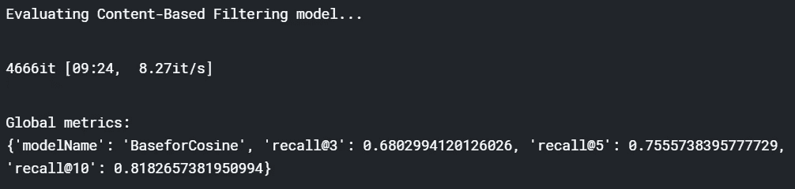

# 几种推荐系统综述

> 原文：<https://towardsdatascience.com/an-overview-of-several-recommendation-systems-f9f8afbf00ea?source=collection_archive---------21----------------------->

协同过滤，KNN，深度学习，迁移学习，tfi df…等等探索所有这些


Photo by [Alfons Morales](https://unsplash.com/@alfonsmc10?utm_source=unsplash&utm_medium=referral&utm_content=creditCopyText) on [Unsplash](https://unsplash.com/s/photos/book?utm_source=unsplash&utm_medium=referral&utm_content=creditCopyText)

在本文中，我们将回顾几种推荐算法，通过 KPI 进行评估，并实时比较它们。我们将依次看到:

*   一种基于流行度的推荐系统
*   基于内容的推荐器(通过 KNN、TFIDF、Transfert Learning)
*   基于用户的推荐器
*   混合推荐器
*   深度学习推荐器

***N.B*** *:我受到了****Gabriel more IRA****的伟大笔记本的极大启发，感谢他*[*https://www . ka ggle . com/gspmoreira/recommender-systems-in-python-101*](https://www.kaggle.com/gspmoreira/recommender-systems-in-python-101)*一些类似用户剖析器和评估功能的模型或功能都来自于他的笔记本。*

# 介绍

我将介绍数据库，并定义什么将允许我们评估我们的模型。我有动漫元数据，我稍微修改了一下，以便有更可靠的内容推荐。


然后是带有评级的用户项目数据库


加入这两者后，我们将分层将其分为训练集和测试集

```
interactions_train_df, interactions_test_df = train_test_split(interactions_full_df,
                                   stratify=interactions_full_df['user_id'], 
                                   test_size=0.20,
                                   random_state=42)#Indexing by personId to speed up the searches during evaluation
interactions_full_indexed_df = interactions_full_df.set_index('user_id')
interactions_train_indexed_df = interactions_train_df.set_index('user_id')
interactions_test_indexed_df = interactions_test_df.set_index('user_id')
```

现在，我们可以定义一个评估函数。

# 评价函数

我们使用**前 N 名准确性指标**，它评估向用户提供的前几名推荐的准确性，与用户在测试集中实际交互的项目进行比较。
该评估方法的工作原理如下:

*   对于每个用户
*   对于用户在测试集中交互的每个项目
*   抽样 100 个用户从未互动过的其他项目。
    Ps。这里，我们天真地假设那些未交互的项目与用户无关，这可能不是真的，因为用户可能只是不知道那些未交互的项目。但是让我们保持这个假设。
*   要求推荐器模型从由一个交互项目和 100 个非交互(非相关)项目组成的集合中产生推荐项目的排序列表
*   计算推荐排名列表中该用户和交互项目的前 N 名准确性指标
*   汇总全球前 N 名准确性指标

选择的前 N 名准确度度量是 **Recall@N** ，其评估交互项目是否在 101 个推荐给用户的排序列表中的前 N 个项目(命中)中。

# 基于流行度的模型

流行度模型是一种常见的(通常也是难以超越的)基线方法。这个模型实际上不是个性化的，它只是向用户推荐用户以前没有消费过的最流行的动画。

```
item_popularity_df = interactions_full_df.groupby('anime_id')['user_rating'].sum().sort_values(ascending=False).reset_index()
```

这里，我们根据上述方法执行流行度模型的评估。
实现了 0.59 的**召回@5** ，这意味着测试集中大约 60 **%** 的交互项目被流行度模型排在前 5 位(从 100 个随机项目的列表中)。而**召回@10** 甚至更高(77 **%** )，不出所料。

这个模型对于我们投入的努力来说是非常好的！

# 基于内容的模型

基于内容的过滤方法利用来自用户已经交互的项目的描述或属性来推荐相似的项目。它仅依赖于用户先前的选择，使得该方法稳健以避免*冷启动*问题。对于文本项目，如文章、新闻和书籍，很容易使用原始文本来构建项目简档和用户简档。

为了从基于内容的模型中获得个性化推荐，我们将实施以下步骤:

对于每个用户:

*   拿到他的监视名单

对于他的观察列表中的每个动画

*   恢复动画与所有其他动画的相似性(感谢距离/特征矩阵),如 tfidf one
*   恢复每个用户评级

最后，用来自评级的项目强度对我们从内容模型(我们的距离矩阵)获得的项目值进行加权平均。

## 术语频率逆文档频率(TFIDF)

我们将使用一种在信息检索(搜索引擎)中非常流行的技术，名为 [TF-IDF](https://en.wikipedia.org/wiki/Tf%E2%80%93idf) 。这种技术将非结构化文本转换为向量结构，其中每个单词由向量中的一个位置表示，值衡量给定单词与文章的相关程度。由于所有的项目都将在同一个[向量空间模型](https://en.wikipedia.org/wiki/Vector_space_model)中表示，所以是为了计算文章之间的相似度。

```
word_vectorizer = TfidfVectorizer(ngram_range =(1,4),
                             min_df=5, max_df=0.9,
                             strip_accents='unicode',
                             stop_words = 'english',
                             analyzer = 'word',
                             use_idf=1,
                             smooth_idf=1,
                             sublinear_tf=1)

tfidf_matrix = word_vectorizer.fit_transform(anime['soup'])
tfidf_feature_names = word_vectorizer.get_feature_names()

*""" compute users profiles """*
U2P = Users_Profiler(tfidf_matrix, anime_ids)
U2tfifd = U2P.build_users_profiles()
```

现在，由于我们的基本推荐器和用户分类器，我们可以向特定用户推荐动画:

```
ContentBasedmodel = BaseRecommender(U2tfifd, tfidf_matrix, anime)ContentBasedmodel.recommend_anime(8)
```


我们来评价一下

```
print('Evaluating Content-Based Filtering model...')cb_global_metrics, cb_detailed_results_df = evaluate_model(ContentBasedmodel)print('**\n**Global metrics:**\n%s**' % cb_global_metrics)cb_detailed_results_df = cb_detailed_results_df[['_user_id', 'watched_count', "hits@3_count", 'hits@5_count','hits@10_count', 
                                                'recall@3','recall@5','recall@10']]
cb_detailed_results_df.head(10)
```



实现了 **0.755** 的**召回@5** ，这意味着测试集中大约有 75 **%** 个交互项被流行度模型排在前 5 位(从 100 个随机项的列表中)。而**召回@10** 更高(81 **%** )。

这种内容模型似乎非常可靠。

## k-最近邻

这里我们使用 k-最近邻算法，这是一种试图通过查看数据点周围的数据点来确定数据点属于哪个组的算法。这个与分类方法有点不同，因为他不是预测每个数据点属于哪个组，而是根据余弦距离度量返回每个数据点的 6 个最近邻居。由此我们将提取距离矩阵，并从中获得用户偏好。

```
from sklearn.neighbors import NearestNeighbors
from scipy.sparse import csr_matrix
from sklearn.preprocessing import MaxAbsScaler
mabs = MaxAbsScaler()# build dummies matrix
anime_features = pd.concat([anime["genre"].str.get_dummies(sep=","),
                            pd.get_dummies(anime[["type"]]),
                            pd.get_dummies(anime[["episodes"]]),
                            pd.get_dummies(anime[["members"]]),anime_ids = anime["anime_id"].tolist()
anime_features_scale = mabs.fit_transform(anime_features)nbrs = NearestNeighbors(n_neighbors=6, algorithm='brute', metric = "cosine").fit(anime_features_scale)distances, indices = nbrs.kneighbors(anime_features_scale)
distances =  csr_matrix(distances)

U2KNN = Users_Profiler(distances, anime_ids)
KNN_model = U2KNN.build_users_profiles()KNN_RECO = BaseRecommender(KNN_model, distances, anime)
print('Evaluating Content-Based Filtering model...')
global_metrics, detailed_results_df = evaluate_model(KNN_RECO)
print('**\n**Global metrics:**\n%s**' % global_metrics)
```


KNN 模型似乎没有产生有用的建议。它实现了 0.16 的**召回@5** ，这意味着仅在测试集中就有大约 16 **%** 个交互项目被流行度模型排在前 5 个项目中(从具有 100 个随机项目的列表中)。

## 迁移学习(单词嵌入)

对于该方法，我们将依靠预训练的嵌入矩阵来创建嵌入向量。在神经网络的上下文中，**嵌入**是离散变量的低维、学习的连续向量表示。它们可以*减少分类变量的维度*并且*有意义地表示变换空间中的*类别。这里，目的是在嵌入空间中找到最近的邻居。这些可以用来根据用户兴趣进行推荐。

```
xtrain_embeddings = sc.fit_transform(xtrain_embeddings)
xtrain_embeddings = csr_matrix(xtrain_embeddings)
U2f = Users_Profiler(xtrain_embeddings, anime_ids)
U2fastt = U2f.build_users_profiles()
fastcontent = BaseRecommender(U2fastt, xtrain_embeddings, anime)
```

我们现在可以使用它进行推荐和评估。

```
print('Evaluating Content-Based Filtering model...')
fglobal_metrics, fdetailed_results_df = evaluate_model(fastcontent)
print('**\n**Global metrics:**\n%s**' % fglobal_metrics)
fdetailed_results_df = fdetailed_results_df[['_user_id', 'watched_count', "hits@3_count", 'hits@5_count','hits@10_count', 
                                                'recall@3','recall@5','recall@10']]
fdetailed_results_df.head(10)
```


Transfert Learning 比 KNN 好，但与 TFIDF 方法相比性能较差，其性能几乎是 tfi df 方法的一半，召回率为 37%。

# 协同过滤

**协同过滤**是一种通过收集众多用户的喜好或品味信息，对用户的兴趣进行自动预测(**过滤**)的方法。

## 奇异值分解

在这里，我们使用流行的潜在因素模型命名为[奇异值分解](https://en.wikipedia.org/wiki/Singular_value_decomposition)。潜在因素模型根据潜在因素将用户项目矩阵压缩成低维表示。使用这种方法的一个优点是，我们将在低维空间中处理一个更小的矩阵，而不是拥有一个包含大量缺失值的高维矩阵。因素越多，模型越具体，如果因素太多，可能会导致过度拟合。

```
U, sigma, Vt = svds(R, k= 300)
sigma = np.diag(sigma)
predicted_ratings = np.dot(np.dot(U, sigma), Vt) 
cf_preds_df = pd.DataFrame(predicted_ratings, 
                           columns = pivpiv.columns, 
                           index=iddd).transpose()
```

实现了 **0.755** 的**召回@5** ，这意味着测试集中大约有 75 **%** 的交互项被流行度模型排在前 5 位(从 100 个随机项的列表中)。而**召回@10** 更高(81 **%** )。

# 混合模型

我们将构建一个简单的混合方法，只需将 SVD 分数与基于内容的分数相乘，然后根据结果分数进行排序。

评估我们的混合 tfidf/svd 模型:


在这里，我们对每个召回都有几乎相同的@ n 82 %,这相当不错。

# 深度学习

最后，我们将使用深度学习来构建深度协同过滤模型，以结合我们之前看到的 2 个概念，潜在因素模型和嵌入。

由于这个模型，我们可以预测用户对未知商品的评价。


```
history = DeepCF.fit([train.user_id, train.anime_id], train.user_rating, batch_size=512, epochs=5, 
          validation_data=([valid.user_id, valid.anime_id], 
            valid.user_rating))
```

我没有评价是因为预测方法很慢但是不要犹豫去做。

我们将查看每个模型为单个用户提出的建议。

```
rated, compare = comparison(25, 5)
```


我没有显示这个用户的“著名”文集，因为有超过 100 篇文章，但从经验来看，除了 KNN，大多数这些建议似乎非常可靠。

# 最后

我们已经看到了几种类型的推荐系统，从非常简单的到更复杂的模型，你可以自由地改进或丰富它们。有趣的是，一些非常简单的模型，如流行度，可能是可靠的。我希望这些模型中的一个会对你的项目有用，如果你想看其他奇异的推荐模型，可以看看我的另一篇文章，比如:

*   [image-recommendation-engine-with-keras](/image-recommendation-engine-with-keras-d227b0996667):[https://towards data science . com/image-recommendation-engine-with-keras-d227b 0996667](/image-recommendation-engine-with-keras-d227b0996667)
*   图片推荐引擎—杠杆迁移学习:[https://towards data science . com/image-recommendation-engine-leverage-transfert-learning-EC 9 af 32 f 5239](/image-recommendation-engine-leverage-transfert-learning-ec9af32f5239)
*   Anime2vec:一个序列推荐系统:[https://towards data science . com/anime 2 vec-A-sequence-recommender-1e 0 a3 e 558 c 44](/anime2vec-a-sequence-recommender-1e0a3e558c44)

谢谢大家！

代码可在此处获得:[https://github . com/AlexWarembourg/Medium/blob/master/a-panel-of-recommender . ipynb](https://github.com/AlexWarembourg/Medium/blob/master/a-panel-of-recommender.ipynb)