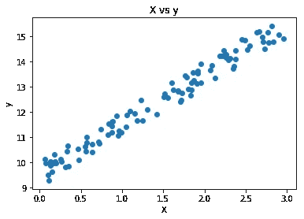
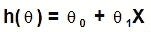
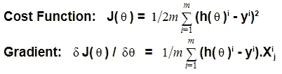
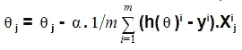
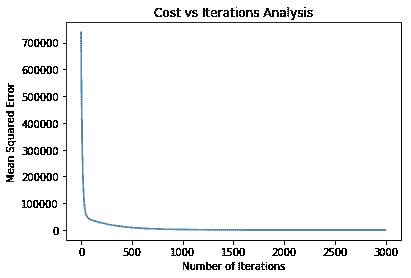

# 梯度下降算法概述

> 原文：<https://towardsdatascience.com/an-overview-of-the-gradient-descent-algorithm-8645c9e4de1e?source=collection_archive---------3----------------------->

## 优化参数的微妙而强大的算法

优化参数是每个机器学习算法的最终目标。在线性回归问题中，您希望获得斜率和截距的最佳值，以获得最佳拟合线。您还希望在逻辑回归问题中获得 s 形曲线参数的最佳值。如果我告诉你梯度下降就可以了呢？

在了解它是如何工作的之前，让我们先弄清楚梯度和下降以及其他一些关键术语的含义。

## 术语

**损失函数:**该函数返回与模型相关联的成本，并测量我们的模型在训练数据上做得如何。如果成本太高，这意味着我们的模型的预测与观察到的数据偏离太多。在任何机器学习算法中，我们的最终使命都是最小化损失函数。我们使用的各种损失函数是:

**回归损失:**

1.  L1 损耗/平均绝对误差
2.  L2 损耗/均方误差
3.  均方根误差

**分类损失:**

1.  对数损失(交叉熵损失)
2.  SVM 损耗(铰链损耗)

**学习率:**这是决定梯度下降算法步骤的超参数。梯度下降对学习速率太敏感。如果太大，算法可能会绕过局部最小值而超调。如果它太小，可能会在很大程度上增加总计算时间。我们将在本文的后面深入了解学习速度的影响。

**坡度:**基本上是衡量一个斜坡的陡度。从技术上来说，当我们对一个函数中所有变量的一阶导数求和时，就会得到梯度。例如，如果我们考虑线性回归，我们有两个参数，斜率和截距，以尽量减少。因此，我们计算 w.r.t .的导数，两者都使截距倾斜&,然后将它们相加，得到截距的梯度。

**下降:**为了优化参数，我们需要最小化误差。梯度下降算法的目标是达到局部最小值(尽管我们总是以达到函数的全局最小值为目标。但是如果梯度下降算法一旦达到局部最小值，就几乎不可能达到全局最小值。).该算法通过在每次迭代中计算步长的迭代过程来实现这一点。并且，这种迭代计算步长以达到局部最小值(或者换句话说，下降到最小值点)被称为下降(足够的下山例子)。

## 履行

现在，让我们进入算法的技术细节。我们将使用一阶导数来计算梯度。在演示中，我们将使用 NumPy 对线性回归问题应用梯度下降。

让我们首先使用 NumPy 的 random 函数生成一个随机化的数据集，并用散点图来显示我们的数据集分布。

```
**# Importing Libraries**
import numpy as np
import matplotlib.pyplot as plt**# Generating Randomized dataset**
X = 3*np.random.rand(100,1)
y = 9 + 2*X+np.random.rand(100,1)# Scatter plot
plt.scatter(X,y)
plt.xlabel('X')
plt.ylabel('y')
plt.title('X vs y')
plt.figure(figsize=(15,25))
```



Scatter Plot: X vs Y

在上面的代码中，我们为自变量和因变量分别取了两个 NumPy 数组，即 X 和 y。从图中可以清楚地看出，这种关系是线性的。我们知道，可以将线性关系放入如下函数中:



Hypothesis function for our linear problem

> **分析方法**

我们可以使用如下所示的分析方法计算θ_ 0 和θ_ 1 的值:

```
**# mean of x and y vector**
mean_x = X.mean()
mean_y = y.mean()**# calculating cross-deviation and deviation about x**
sum_yx = (X*y).sum()
x_sq = (X**2).sum()
ssxy = sum_yx - (len(X)*mean_x*mean_y)
ssxx = ((X - mean_x)**2).sum()**# calculating regression coefficients**
theta_1 = ssxy/ssxx
theta_0 = mean_y - (theta_1*mean_x)**# printing both the values**
print('Theta 0: {:0.3f}'.format(theta_0))
print('Theta 1: {:0.3f}'.format(theta_1))**Output:**
**Theta 0:** 9.482 **Theta 1:** 1.998
```

如果我们可以解析地计算最佳参数，为什么我们需要梯度下降？这是因为当我们拥有一个包含数百万个数据点的数据集时，分析方法在计算上变得非常昂贵。另一方面，梯度下降给我们类似的结果，同时大大减少了计算时间。让我们用梯度下降法求解 0 和 1，自己看看。

在数学上，成本函数和梯度可以表示如下:



Gradient & Cost Function for our problem

## **成本函数背后的直觉**

我们的目标是以尽可能接近零的方式最小化成本函数。对于成本函数来说，高负值与高正值一样糟糕。因此，为了保持成本函数值> =0，我们将其平方。我们可以使用 absolute 来做同样的事情，但是我们没有这样做有两个主要原因。

1.  将绝对值而不是平方值放在一起会对高残差和低残差的模型进行同等惩罚，而我们需要一个加权惩罚规则，其中具有较高残差的数据点受到更多惩罚，而较低残差受到较少惩罚。这可以简单地通过对残差/误差求平方来实现。
2.  还有，根据高斯噪声概念，有两种误差，**系统性**和**随机性**。简单地说，系统误差是沿着某个方向的东西。它在本质上是一致的，并且是可预测的。另一方面，随机误差是分布中的噪声。一旦我们考虑了系统噪声成分，当随机噪声最小化时，就获得了最佳预测值。换句话说，最佳预测值是预测值周围分布最紧密(方差最小)的预测值。最小化最小平方损失和最小化方差是一回事！这解释了为什么最小平方损失适用于广泛的问题。由于 CLT(中心极限定理)，潜在的噪声通常是高斯噪声，而最小化平方误差被证明是*正确的*事情！

我们这样做是为了在计算梯度时最小化成本函数的导数，从而抵消掉“2 ”,使梯度更简洁。无论如何，它是一个常数，在计算θ值时无关紧要(因为我们要对它求导)。

此外，我们对 m 上的函数进行平均，m 是训练数据集中数据点的总数。这是为了使计算出的梯度值不会改变比例，并且在出现新数据点的情况下总是平均到一个中心值。

## 梯度下降实现

在我们实施梯度下降之前，了解其背后的直觉是必须的。既然我们现在已经完成了这一部分，让我们深入到它的实际实现中。

我们想要计算 0 和 1 的值，但是我们可以有多个特征(> =2)。在这种情况下，计算连续步长的一般公式为



The general formula for getting consecutive theta value

其中，α是学习率。我们现在可以从公式中推断出，α对步长的影响很大，因为我们在每次迭代中将梯度与α相乘。

数学讲够了，让我们从实际的代码开始。首先，我们将为要优化的参数初始化一个随机值，0 和 1。我们将编写两个函数，通过迭代计算成本和梯度下降，并将它们存储在两个不同的 NumPy 数组中。上述公式已经用于使用梯度计算成本和θ的连续值。

```
**def cost(theta,X,y):**
    '''
    Calculates cost of the function.
    X & y have their usual meaning.
    theta - vector of coefficients.
    '''
    m = len(y)
    **# Calculating Cost**
    c = (1/2*m) * np.sum(np.square((X.dot(theta))-y))  
    return c**def gradient_descent(X,y,theta,alpha,iterations):**
    '''
    returns array of thetas, cost of every iteration
    X - X matrix with added bias.
    y - target variable matrix
    theta - matrix of regression coefficients
    alpha - learning rate
    iteration - number of iteration to be run
    '''
    **#Getting number of observations.**
    m = len(y)

    **# Initializing cost and theta's arrays with zeroes.**
    thetas = np.zeros((iterations,2))
    costs = np.zeros(iterations)

    **# Calculating theta for every iteration.**
    for i in range(iterations):
            theta = theta - (1/m)*alpha*(X.T.dot((X.dot(theta))-y))
            thetas[i,:] = theta.T
            costs[i] = cost(theta,X,y)

    return theta,thetas,costs**# Learning Rate**
alpha = 0.01**# Number of iterations**
iterations = 3000**# Initializing a random value to give algorithm a base value.**
theta = np.random.randn(2,1)**# Adding a biasing constant of value 1 to the features array.**
X_bias = np.c_[np.ones((len(X),1)),X]**# Running Gradient Descent**
theta,thetas,costs = gradient_descent(X_bias,y,theta,alpha,iterations)**# printing final values.**
print('Final Theta 0 value: {:0.3f}\nFinal Theta 1 value: {:0.3f}'.format(theta[0][0],theta[1][0]))
print('Final Cost/MSE(L2 Loss) Value: {:0.3f}'.format(costs[-1])) **Output:**
**Final Theta 0 value:** 9.448
**Final Theta 1 value:** 2.015
**Final Cost/MSE(L2 Loss) Value:** 411.001
```

在代码中，我们可以看到我们已经运行了 3000 次迭代。但是，这是明确传递给函数的东西。在现实生活中，我们不会这样做。梯度下降停止运行的实际停止点应该是步长接近零时。

## 分析

让我们通过绘制图表来检查 L2 损失如何随着迭代次数的增加而减少。

```
**# Plotting Line Plot for Number of Iterations vs MSE**
plt.plot(range(iterations),costs)
plt.xlabel('Number of Iterations')
plt.ylabel('Mean Squared Error')
plt.title('Cost vs Iterations Analysis')
```



Number of Iterations vs MSE (Mean Squared Error): The Elbow Method

在上图中，我们看到，最初，误差显著减小。但是随着迭代次数的增加，误差并没有减少多少。在某个值之后，它几乎稳定下来，或者我们可以说它的下降可以忽略不计。

这就是梯度下降的美妙之处。当它开始接近局部最小值时，它开始向它迈出非常非常小的步伐，以便不超过它。另一方面，当它很远时，为了减少计算时间，需要更大的步长来更快地达到局部最小值。

因此，为了使用该图选择迭代次数的最佳可能值，我们使用肘方法。简单地说，MSE 值开始下降到可以忽略不计的点就是我们迭代次数的值(图的肘部)。

还有各种类型的梯度下降。我们上面所做的就是所谓的批量梯度下降。其他类型包括:

1.  [随机梯度下降。](http://deeplearning.stanford.edu/tutorial/supervised/OptimizationStochasticGradientDescent/)
2.  [小批量梯度下降。](https://machinelearningmastery.com/gentle-introduction-mini-batch-gradient-descent-configure-batch-size/)

# 结论

梯度下降可用于优化每个算法的参数，该算法的损失函数可被公式化并具有至少一个最小值。此外，我们澄清了我们对臭名昭著的梯度下降损失函数方程的理解。

我们学习了如何使用可视化方法来估计所需的迭代次数。最后，我们了解了著名的梯度下降算法背后的实际工作原理。