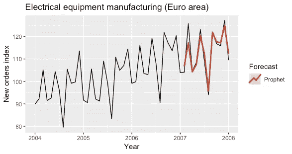

# 时间序列预测模型综述

> 原文：<https://towardsdatascience.com/an-overview-of-time-series-forecasting-models-a2fa7a358fcb?source=collection_archive---------0----------------------->

## 我们描述了 10 个预测模型，并应用它们来预测工业生产指数的演变


Photo by [Drew Beamer](https://unsplash.com/@drew_beamer?utm_source=unsplash&utm_medium=referral&utm_content=creditCopyText) on [Unsplash](https://unsplash.com/s/photos/future?utm_source=unsplash&utm_medium=referral&utm_content=creditCopyText)

这篇文章是关于什么的？

这篇文章提供了一个单变量时间序列建模和预测其演变可用的主要模型的概述。这些模型是用 **R** 和 **Python** 开发的。相关代码可在[这里](https://github.com/davide-burba/forecasting_models)获得。

时间序列预测是一个热门话题，有许多可能的应用，如股票价格预测，天气预报，商业规划，资源分配等。尽管预测可以被认为是监督回归问题的一个子集，但由于观察的时间性质，一些特定的工具是必要的。

*什么是时间序列？*

时间序列通常通过随机过程*Y(t)*建模，即随机变量序列。在预测设置中，我们发现自己在时间 *t* 并且我们对仅使用在时间*t*可用的信息来估计*Y(t+h)*感兴趣

*如何验证和测试时间序列模型？*

由于时间序列数据的时间依赖性，我们不能依靠通常的验证技术。为了避免有偏见的评估，我们必须确保训练集包含在验证集中的观察之前发生的观察。

克服这个问题的一个可能的方法是使用滑动窗口，正如这里所描述的[。这个过程称为**时间序列交叉验证**，总结如下图，其中蓝色点代表每个“折叠”中的训练集，红色点代表相应的验证集。](https://robjhyndman.com/hyndsight/tscv/)


Time series cross-validation. Credits to [Rob J Hyndman](https://robjhyndman.com/)

如果我们对预测下一个 *n* 时间步骤感兴趣，我们可以对前面的 *1，2，…，n* 步骤应用交叉验证程序。通过这种方式，我们还可以比较不同时间范围的预测的准确性。

一旦我们选择了最佳模型，我们就可以将其应用于整个训练集，并在随后的单独的**测试集中评估其性能**。可以通过使用用于交叉验证的相同滑动窗口技术来完成性能估计，但是不需要重新估计模型参数。

# 短数据探索

在下一节中，我们将应用不同的预测模型来预测工业生产指数的演变，该指数量化了在欧元区制造的**电气设备。**

数据可以通过 R 中的 [fpp2](https://cran.r-project.org/package=fpp2) 包轻松下载。要使数据在 R 之外可用，只需在 R 环境中运行以下代码。

```
library(fpp2)
write.csv(elecequip,file = “elecequip.csv”,row.names = FALSE)
```

该数据集对应于 1996 年 1 月至 2012 年 3 月期间欧元区(17 个国家)电气设备(计算机、电子和光学产品)的月度制造量。我们保留**最后两年用于测试**目的。


该时间序列在 2000 年底有一个峰值，在 2007 年有另一个峰值。我们在 2008 年底观察到的巨大下降可能是由于当年发生的全球金融危机。

似乎有一个每年的季节性模式。为了更好地显示这一点，我们用原始坐标和极坐标分别显示了每年的数据。


我们观察到强烈的季节性模式。特别是由于夏季假期，8 月份的产量大幅下降。

# 时间序列预测模型

我们将考虑以下模型:

1.  **天真，幼稚**
2.  **季节分解(+任何模型)**
3.  **指数平滑**
4.  **ARIMA、萨里玛**
5.  **GARCH**
6.  **动态线性模型**
7.  **TBATS**
8.  **先知**
9.  尼塔尔
10.  **LSTM**

我们对预测 12 个月的工业生产指数感兴趣。因此，给定到时间 *t* 的数据，我们希望预测指数在时间 *t+1，…，t+12 的值。*

我们将使用**平均绝对误差(MAE)** 来评估模型的性能。

## 1)天真，幼稚

在**天真**模型中，每个时段的预测都对应于**最后的观察值。**

> ŷ(t+h|t)= y(t)

这种预测假设产生时间序列的随机模型是随机行走的。

天真模型的扩展是由**天真**(季节性天真)模型给出的。假设时间序列具有季节性成分，并且季节性的周期为 *T* ，则由 s nave 模型给出的预测为:

> ŷ(t+h|t)= y(t+h-t)

因此，对随后的 *T* 时间步的预测等于先前的 *T* 时间步。在我们的应用程序中，对下一年的简单预测等于去年的观测值。

这些模型通常被用作**基准模型**。以下图表显示了 2007 年两种模型的预测结果。


利用[预测](https://cran.r-project.org/web/packages/forecast/forecast.pdf) R 软件包的`naive`和`snaive`功能对模型进行拟合。

## 2)季节分解(+任何模型)

如果数据显示出一定的季节性(如每日、每周、每季度、每年)，将原始时间序列分解为三个部分的总和可能是有用的:

> *Y(T)=*S(T)+*T(T)+R(T)*

其中 *S(t)* 是季节性成分， *T(t)* 是趋势周期成分， *R(t)* 是余数成分。

存在几种技术来估计这样的分解。最基本的一种称为**经典分解**，它包括:

1.  通过滚动平均值估计趋势 T(t)
2.  计算 *S(t)* 作为每个季节(例如每个月)的平均去趋势序列 *Y(t)-T(t)*
3.  计算剩余数列为 *R(t)=Y(t)-T(t)-S(t)*

经典分解**在几个方面得到了扩展**。它的扩展允许:

*   具有非恒定的季节性
*   计算分解的初始值和最后值
*   避免过度平滑

要获得时间序列分解方法的概述，您可以点击[此处](https://otexts.com/fpp2/decomposition.html)。我们将利用 **STL 分解**，它被认为是通用的和健壮的。


STL decomposition on industrial production index data

下面是**使用分解进行预测**的一种方法:

1.  用某种分解算法(如 STL)对训练时间序列进行分解: *Y(t)= S(t)+T(t)+R(t)。*
2.  计算**经季节调整的**时间序列 *Y(t)-S(t)* 。使用**任何你喜欢的模型**来预测季节性调整时间序列的演变。
3.  将时间序列中最后一个时间段的季节性添加到预测中(在我们的示例中，去年的拟合 *S(t)* )。

在下图中，我们展示了经季节性调整的工业生产指数时间序列。


下图显示了通过使用 STL 分解和 nave 模型来拟合季节性调整时间序列而获得的对 2007 年的预测。


分解是通过使用 [stats](https://www.rdocumentation.org/packages/stats/versions/3.6.1) R 包的`stl`函数来拟合的。

## 3)指数平滑

指数平滑法是最成功的经典预测方法之一。其基本形式被称为**简单指数平滑**，其预测由下式给出:

> ŷ(t+h|t)= ⍺y(t)+⍺(1-⍺)y(t-1)+⍺(1-⍺)y(t-2)+…

用 *0 < ⍺ < 1* 。

我们可以看到，预测等于过去观测值的加权平均值，随着时间的推移，相应的权重呈指数下降。

已经提出了简单指数平滑的几种扩展，以便**包括趋势或阻尼趋势和季节性**。指数平滑系列由 9 个模型组成，在此[处](https://otexts.com/fpp2/taxonomy.html)有详细描述。

下图显示了通过使用指数平滑模型(自动选择)来拟合原始时间序列和季节性调整时间序列而获得的 2007 年预测。


使用[预测](https://cran.r-project.org/web/packages/forecast/forecast.pdf) R 软件包的`ets`功能对模型进行拟合。

## 4) ARIMA，萨里玛

至于指数平滑，ARIMA 模型也是时间序列预测中最广泛使用的方法之一。这个名字是自回归综合移动平均的缩写。

在**自回归**模型中，预测对应于变量过去值的线性组合。在**移动平均**模型中，预测对应于过去预测误差的线性组合。

基本上，ARIMA 模型结合了这两种方法。由于它们要求时间序列是平稳的，差分(**积分**)时间序列可能是一个必要的步骤，即考虑差分的时间序列而不是原始的时间序列。

**SARIMA** 模型(季节性 ARIMA)通过添加季节性过去值和/或预测误差的线性组合来扩展 ARIMA。

关于 ARIMA 和萨里玛车型的完整介绍，请点击[此处](https://otexts.com/fpp2/arima.html)。

下面的图显示了通过使用季节调整时间序列的萨里玛模型和 ARIMA 模型获得的对 2007 年的预测。


使用[预测](https://cran.r-project.org/web/packages/forecast/forecast.pdf) R 软件包的`auto.arima`和`Arima`功能对模型进行拟合。

## 5) GARCH

以前的模型假设产生时间序列的随机过程中的误差项是**同伦的**，即具有恒定的方差。

相反， **GARCH** 模型假设误差项的方差遵循自回归移动平均(ARMA)过程，因此允许它随时间变化。它对于模拟波动性随时间变化的金融时间序列特别有用。这个名字是广义自回归条件异方差的首字母缩写。

通常，均值也采用 ARMA 过程。关于 GARCH 模型的完整介绍，你可以点击[这里](https://cran.r-project.org/web/packages/rugarch/vignettes/Introduction_to_the_rugarch_package.pdf)和[这里](https://en.wikipedia.org/wiki/Autoregressive_conditional_heteroskedasticity)。

下面的图显示了通过使用 GARCH 模型来拟合季节性调整的时间序列而获得的 2007 年的预测。


使用 [rugarch](https://cran.r-project.org/web/packages/rugarch/rugarch.pdf) R 软件包的`ugarchfit`功能对模型进行拟合。

## 6)动态线性模型

动态线性模型代表了时间序列预测的另一类模型。想法是在每个时间 *t* 这些模型对应一个线性模型，但是回归**系数随时间**变化。下面给出一个动态线性模型的例子。

> *y(t) = ⍺(t) + tβ(t) + w(t)*
> 
> ⍺(t) = ⍺(t-1) + m(t)
> 
> β(t) = β(t-1) + r(t)
> 
> w(t)~N(0，W)，m(t)~N(0，M)，r(t)~N(0，R)

在前一个模型中，系数 *⍺(t)* 和 *β(t)* 遵循随机游走过程。

动态线性模型可以**在贝叶斯框架中自然建模**；然而，最大似然估计技术仍然可用。有关动态线性模型的完整概述，请点击[此处](https://cran.r-project.org/web/packages/dlm/vignettes/dlm.pdf)。

下图显示了通过使用动态线性模型来拟合季节性调整时间序列而获得的对 2007 年的预测。由于巨大的计算成本，我不得不保持模型极其简单，这导致了糟糕的预测。


使用 [dlm](https://cran.r-project.org/web/packages/dlm/dlm.pdf) R 包的`dlmMLE`功能对模型进行拟合。

## 7) TBATS

TBATS 模型是一种基于指数平滑的预测模型。该名称是三角函数、Box-Cox 变换、ARMA 误差、趋势和季节分量的缩写。

TBATS 模型的主要特点是能够处理**多个季节性**，通过基于傅立叶级数的三角表示法模拟每个季节性。复杂季节性的一个典型例子是每天对销售量的观察，通常同时具有每周和每年的季节性。

关于 TBATS 型号的完整介绍，请点击[此处](https://robjhyndman.com/papers/ComplexSeasonality.pdf)。

下图显示了使用 TBATS 模型拟合时间序列获得的 2007 年预测值。


通过使用[预测](https://cran.r-project.org/web/packages/forecast/forecast.pdf) R 软件包的`tbats`功能对模型进行拟合。

## 8)先知

Prophet 是另一个预测模型，它可以处理多重季节性。它是脸书[核心数据科学团队](https://research.fb.com/category/data-science/)发布的一款[开源软件](https://code.facebook.com/projects/)。

prophet 模型假设时间序列可以分解如下:

> *y(t)= g(t)+s(t)+h(t)+ε(t)*

三个术语 *g(t)* 、 *s(t)* 和 *h(t)* 分别对应趋势、季节性和节假日。最后一项是误差项。

模型拟合被框定为**曲线拟合**练习，因此没有明确考虑数据中的时间依赖结构。这也允许进行不规则间隔的观察。

**趋势**时间序列有两种选择:饱和增长模型和分段线性模型。多期**季节性**模型依赖傅立叶级数。已知和定制**假日**的效果可以很容易地整合到模型中。

prophet 模型被插入到**贝叶斯框架**中，它允许进行充分的后验推断，以将模型参数不确定性包括在预测不确定性中。

如需对 Prophet model 的完整介绍，请点击此处的。

下图显示了通过使用 Prophet 模型拟合时间序列获得的 2007 年预测。



通过使用 [prophet](https://cran.r-project.org/web/packages/prophet/prophet.pdf) R 软件包的`prophet`功能对模型进行拟合。

## 9)内塔尔

NETAR 模型是一个完全连接的神经网络。首字母缩写代表神经网络自回归。

NNETAR 模型在时间 *t* 之前接受**输入序列**的最后元素，并在时间 *t+1* 输出预测值。为了进行多步预测，网络被反复应用。

在存在季节性的情况下，输入也可能包括季节性滞后的时间序列。有关 NNETAR 型号的完整介绍，请点击[此处](https://otexts.com/fpp2/nnetar.html)。

下面的图显示了 2007 年的预测结果，这些预测结果是通过使用带有季节性滞后输入的 NNETAR 模型和基于季节性调整时间序列的 NNETAR 模型获得的。


使用[预测](https://cran.r-project.org/web/packages/forecast/forecast.pdf) R 软件包的`nnetar`功能对模型进行拟合。

## 10) LSTM

LSTM 模型可用于预测时间序列(以及其他递归神经网络)。LSTM 是长短期记忆的首字母缩写。

LSTM 网络的状态通过状态空间向量来表示。这种技术允许**跟踪新观测值与过去观测值的相关性**(即使是非常远的观测值)。

一般来说，LSTMs 是复杂的模型，它们很少用于预测单个时间序列，因为它们需要大量的数据来估计。然而，当需要对大量时间序列进行预测时，通常使用它们(检查[此处](https://arxiv.org/abs/1704.04110))。

关于使用 LSTM 预测时间序列的完整介绍，点击[此处](https://machinelearningmastery.com/how-to-develop-lstm-models-for-time-series-forecasting/)。

下图显示了通过对季节性调整时间序列拟合 LSTM 模型而获得的测试集中第一年的预测。


使用 Python 中的 [Keras](https://keras.io) 框架对模型进行拟合。

# 估价

我们通过前述的**交叉验证**程序进行型号选择。我们没有计算动态线性模型和 LSTM 模型，因为它们的计算成本高，性能差。

在下图中，我们展示了每个模型和每个时间跨度的交叉验证 MAE。


我们可以看到，对于时间跨度大于 4 的情况，基于季节性调整数据的 NNETAR 模型比其他模型表现得更好。让我们检查通过在不同时间范围内求平均值计算出的总 MAE。


Cross-validated MAE

基于经季节性调整的数据的 **NNETAR 模型是该应用的**最佳模型**，因为它对应于最低的交叉验证 MAE。**

为了获得最佳模型性能的**无偏估计**，我们在测试集上计算 MAE，获得等于 **5，24** 的估计。在下面的图片中，我们可以看到在每个时间范围的测试集上估计的 MAE。


## 如何进一步提高性能

提高模型性能的其他技术可以是:

*   对不同的时间范围使用不同的模型
*   组合多个预测(例如，考虑平均预测)
*   **引导汇总**

最后一种技术可以总结如下:

1.  分解原始时间序列(例如使用 STL)
2.  通过随机打乱剩余部分的块来生成一组相似的时间序列
3.  对每个时间序列拟合模型
4.  每个模型的平均预测

有关引导聚合的完整介绍，请单击此处的。

# 结束语

该项目的目标不是拟合工业生产指数的最佳预测模型，而是给出预测模型的概述。在现实世界的应用中，大量的时间应该花费在**预处理**、**特征工程**和**特征选择**上。

大多数先前描述的模型允许容易地结合时变预测器。这些可以从相同的时间序列中提取，或者可以对应于外部预测值(例如，另一个指数的时间序列)。在后一种情况下，我们应该注意**不要使用来自未来的信息**，这可以通过预测预测器或使用它们的滞后版本来满足。

最后，请注意，在本文中，我们只考虑了只有一个时间序列需要预测的情况。**当我们有很多时间序列时，一个全局的方法可能是首选**，因为它允许我们估计一个更复杂和可能更准确的模型。有关全球方法的介绍，请点击[此处](https://arxiv.org/abs/1704.04110)。