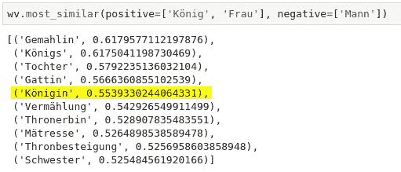
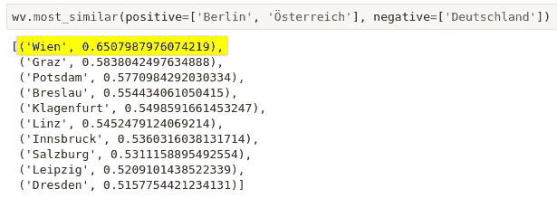
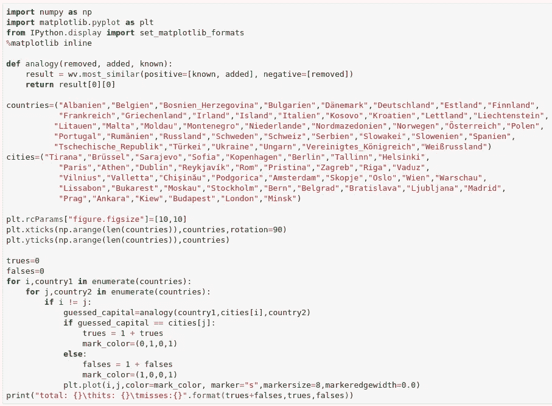
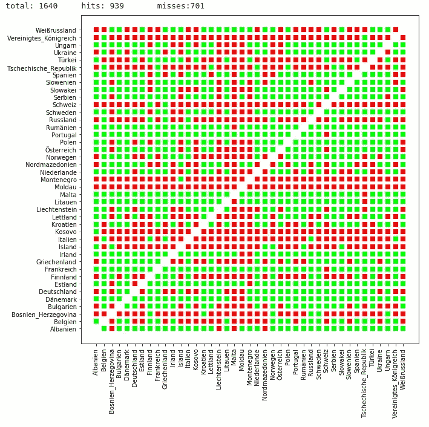

# 从词向量类推？

> 原文：<https://towardsdatascience.com/analogies-from-word-vectors-77fe12f2de52?source=collection_archive---------14----------------------->

## 这些类比有多相似？

A close inspector (Source: own image)

关于词向量的入门级文章往往包含计算类比的例子，比如*国王-男人+女人=王后*。像这样引人注目的例子显然有它们的位置。它们引导我们对*相似性*的兴趣，将其视为一个有待挖掘的隐藏宝藏。然而，在真实数据中，类比往往不那么清晰和易于使用。

前段时间对德国维基百科[的快照分析](/comparing-word-embeddings-c2efd2455fe3)，留下了太多的问题，其中之一就是类比。当然，首先要测试的事情之一是国王-王后(或者在德语中:knig-knig in)的例子是否也适用于这个语料库——并不令人惊讶的是，它没有:

Candidates for king-man+woman from German Wikipedia corpus

没有一个候选人与国王和王后完全无关；排名第一和第四的是国王配偶的词汇，排名第二的是国王的单词形式，排名第三的是女儿，最后排名第五的是女王——没有像预期的那样突出。接下来是婚礼、皇位继承人、妃子、登基和妹妹。但是候选集对于某样东西是女性(相对于国王)还是与王权有关并不十分明显。因此结果集的实际直接适用性似乎相当有限。

类比的另一个常见例子是大写的派生。让我们来看看奥地利首都的候选城市有哪些:

Candidates for Austria-Germany+Berlin from German Wikipedia corpus

这一次我们成功了，的确维也纳对于奥地利就像柏林对于德国一样。其他候选人的名单也很有意义，我们发现奥地利五个联邦州的首府(格拉茨、克拉根福、林茨、因斯布鲁克、萨尔茨堡)和波兰一个省的首府(弗罗茨瓦夫)……以及德国萨克森州的两个城市正在竞争谁是真正的首府(德累斯顿、莱比锡)。

万岁。这个结果延伸了吗？让我们编写几行 Python 代码来测试和可视化所有欧洲国家的类比练习——不包括城市国家和哈萨克斯坦，在这些国家，语料库中没有足够的数据供其首都在模型中显示:

Test all pairs of countries and capitals for correctly guessed analogy and visualize the result

经过一些计算，我们得到 57.25%的命中和 42.25%的未命中，比实际希望的要差得多:

Result matrix of the country-capital guessing exercise

一个国家拥有猜测资本好坏的背后似乎没有什么模式。让我们来看看原始频率，下面有一个完整的列表。

 [## 国家和首都频率(德语维基百科)](https://docs.google.com/spreadsheets/d/e/2PACX-1vSg_JCF1IBfzz4XCHkuFzOIrE4QAhk8o0hczg28rAgh4jU1-Mp65ADOfttlz68kiRGC7rTxeVTnbw5K/pubhtml) 

有许多猜测失败的国家:英国(2482)，捷克共和国(679)，意大利(91024)，冰岛(37591)，摩尔多瓦(2585)。相比之下，一些国家有许多正确的猜测:奥尔巴尼(7067)，丹麦(34079)，爱尔兰(23024)，葡萄牙(29124)，罗马尼亚(22700)。英国和捷克共和国的官方名称很少被使用，这也许可以解释为什么在提到他们的首都时不会出现这种情况。此外，摩尔多瓦可能会因为国名和河流名不清而遭受损失。但这并不能解释意大利或冰岛。

同样，让我们对那些有许多猜测失败的城市做同样的比较:伦敦(114，921)，布拉格(34，565)，罗马(70，952)，Rejkyavik (2，890)，Chișinău (851)和有许多正确猜测的城市:地拉那(2，240)，哥本哈根(18，092)，都柏林(9630)，里斯本(11，196)，布卡拉斯特(8，350)。同样，我们没有明确的案例，这次也没有额外知识的支持。有人能解释一下这个吗？

总的来说，给人的印象是，类比有时效果惊人地好，有时则不然。在利用这些数据时，我们应该记住这一点，并为意外失败做好准备。